# Sample of a feature breeding app with html js and code generation using two examples:

With my Joust 3d Game I want to add my Video Recorder, Media Pipe feature, mp3 player feature, video capture to mp4 (high resolution) and also enhance my dragosn 3d model, game dynamics, game rewards, even dragon breeding and variability in mount exchanges which add to game strategy and fun.  PEGASUS JOUST V — Sky Arena Multiplayer.html is here:  Also I have the program that I added mp3 and mp4 recording tech to, copy it from this and improve on it (full resolution window capture maybe..  https://github.com/aaroncwacker/AI-UI-UX-JS/blob/main/Educational-Space-Travel.html    https://github.com/aaroncwacker/AI-UI-UX-JS/blob/main/PEGASUS%20JOUST%20V%20%E2%80%94%20Sky%20Arena%20Multiplayer.html  

<!DOCTYPE html>
<html lang="en">
<head>
<meta charset="UTF-8">
<meta name="viewport" content="width=device-width, initial-scale=1.0">
<title>PEGASUS JOUST V — Sky Arena Multiplayer</title>
<style>
  * { margin: 0; padding: 0; box-sizing: border-box; }
  html, body { width: 100%; height: 100%; overflow: hidden; background: #000; font-family: 'Georgia', serif; color: #ffd166; }
  #gameContainer { position: relative; width: 100vw; height: 100vh; }
  canvas { display: block; }

  /* HUD */
  #hud {
    position: absolute; top: 0; left: 0; right: 0;
    padding: 14px 20px; pointer-events: none;
    display: flex; justify-content: space-between; align-items: flex-start;
    text-shadow: 0 0 8px #000, 0 2px 4px #000;
    z-index: 10;
  }
  .hud-block {
    background: linear-gradient(180deg, rgba(20,10,5,0.85), rgba(40,20,10,0.7));
    border: 2px solid #b8860b;
    border-radius: 6px;
    padding: 10px 14px;
    min-width: 180px;
    box-shadow: 0 0 14px rgba(255,180,60,0.25), inset 0 0 12px rgba(0,0,0,0.5);
  }
  .hud-title { font-size: 11px; letter-spacing: 2px; color: #d4a017; text-transform: uppercase; }
  .hud-val { font-size: 22px; font-weight: bold; color: #ffd166; margin-top: 2px; }
  .hud-sub { font-size: 12px; color: #c9a66b; margin-top: 4px; }

  .bar-bg { width: 100%; height: 8px; background: #2a1a0a; border: 1px solid #5a3a1a; border-radius: 3px; margin-top: 4px; overflow: hidden; }
  .bar-fill { height: 100%; transition: width 0.3s ease; box-shadow: 0 0 6px currentColor; }

  #hpBar .bar-fill   { background: linear-gradient(90deg, #ff3030, #ff8050); color: #ff5040; }
  #xpBar .bar-fill   { background: linear-gradient(90deg, #50d0ff, #a070ff); color: #80a0ff; }
  #stamBar .bar-fill { background: linear-gradient(90deg, #ffd166, #ff9020); color: #ffb050; }

  #combo { font-size: 14px; color: #ffaa00; }
  #combo.hot { color: #ff4444; text-shadow: 0 0 12px #ff0000, 0 0 4px #fff; animation: pulse 0.5s infinite; }
  @keyframes pulse { 50% { transform: scale(1.08); } }

  #lives { letter-spacing: 4px; font-size: 22px; color: #ff5050; }

  /* Center wave banner */
  #waveBanner {
    position: absolute; top: 30%; left: 50%;
    transform: translate(-50%, -50%);
    text-align: center;
    font-size: 56px; font-weight: bold;
    color: #ffd166; text-shadow: 0 0 20px #ff8000, 0 4px 8px #000;
    pointer-events: none; opacity: 0;
    transition: opacity 0.4s ease;
    letter-spacing: 4px;
    z-index: 20;
  }
  #waveBanner.show { opacity: 1; }
  #waveSubtext { font-size: 22px; color: #ff9040; letter-spacing: 6px; margin-top: 8px; }

  /* Damage flash */
  #flashOverlay {
    position: absolute; inset: 0; pointer-events: none;
    background: radial-gradient(circle, transparent 40%, rgba(255,0,0,0.5) 100%);
    opacity: 0; transition: opacity 0.2s; z-index: 15;
  }

  /* Start / Game over screens */
  .screen {
    position: absolute; inset: 0;
    background: radial-gradient(ellipse at center, rgba(60,30,10,0.95), rgba(0,0,0,0.98));
    display: flex; flex-direction: column; align-items: center; justify-content: center;
    z-index: 100; text-align: center; padding: 20px;
  }
  .screen h1 {
    font-size: 64px; color: #ffd166;
    text-shadow: 0 0 20px #ff8000, 0 0 40px #ff4000, 0 4px 0 #5a2a0a;
    letter-spacing: 6px; margin-bottom: 10px;
  }
  .screen h2 { font-size: 22px; color: #c9a66b; margin-bottom: 30px; letter-spacing: 4px; }
  .screen .controls {
    background: rgba(20,10,5,0.7); border: 2px solid #b8860b;
    padding: 20px 30px; border-radius: 8px; margin-bottom: 30px;
    max-width: 500px;
  }
  .screen .controls div { margin: 6px 0; font-size: 15px; color: #e0c080; }
  .screen .controls kbd {
    background: #5a3a1a; border: 1px solid #b8860b; padding: 2px 8px;
    border-radius: 3px; color: #ffd166; font-family: monospace; margin: 0 2px;
  }
  .screen button {
    font-family: 'Georgia', serif; font-size: 24px; font-weight: bold;
    padding: 14px 40px; cursor: pointer;
    background: linear-gradient(180deg, #d4a017, #8b5a0a);
    color: #2a1a05; border: 3px solid #ffd166;
    border-radius: 6px; letter-spacing: 3px;
    box-shadow: 0 0 20px rgba(255,180,60,0.5), inset 0 -4px 0 rgba(0,0,0,0.3);
    transition: all 0.15s;
  }
  .screen button:hover { transform: translateY(-2px); box-shadow: 0 4px 24px rgba(255,200,80,0.7); }
  .screen button:active { transform: translateY(1px); }
  .screen.hidden { display: none; }

  #gameOverStats { color: #ffd166; font-size: 18px; margin-bottom: 20px; line-height: 1.8; }
  #gameOverStats span { color: #ff8040; font-weight: bold; font-size: 22px; }

  /* Mobile controls */
  #mobileControls {
    position: absolute; bottom: 0; left: 0; right: 0;
    display: none; justify-content: space-between;
    padding: 20px; pointer-events: none; z-index: 30;
  }
  .touch-btn {
    pointer-events: auto;
    width: 70px; height: 70px;
    background: rgba(180,130,30,0.4);
    border: 2px solid #ffd166;
    border-radius: 50%;
    color: #ffd166; font-size: 24px;
    display: flex; align-items: center; justify-content: center;
    user-select: none; -webkit-user-select: none;
    box-shadow: 0 0 12px rgba(255,180,60,0.4);
  }
  .touch-btn:active { background: rgba(255,200,80,0.7); }
  .touch-cluster { display: flex; gap: 10px; }
  @media (hover: none) and (pointer: coarse) { #mobileControls { display: flex; } }

  /* Powerup notification */
  #powerupNotif {
    position: absolute; top: 50%; left: 50%;
    transform: translate(-50%, -50%);
    font-size: 32px; color: #80ffaa;
    text-shadow: 0 0 16px #00ff80, 0 2px 4px #000;
    pointer-events: none; opacity: 0;
    transition: opacity 0.3s, transform 0.6s;
    z-index: 25; letter-spacing: 3px;
  }

  /* Minimap */
  #minimap {
    position: absolute; bottom: 14px; right: 14px;
    width: 140px; height: 100px;
    background: rgba(20,10,5,0.7);
    border: 2px solid #b8860b;
    border-radius: 4px;
    z-index: 10;
  }


  /* Creator media lab: MP3, capture, MediaPipe */
  #creatorPanel {
    position:absolute; left:14px; bottom:14px; z-index:40; pointer-events:auto;
    width:380px; max-width:calc(100vw - 180px);
    background:linear-gradient(180deg, rgba(18,8,28,.88), rgba(35,12,8,.78));
    border:2px solid #b8860b; border-radius:10px; padding:10px 12px;
    box-shadow:0 0 24px rgba(255,180,60,.22), inset 0 0 16px rgba(0,0,0,.45);
    font-family:Georgia,serif; color:#ffd166; text-shadow:0 0 6px #000;
  }
  #creatorPanel h3{font-size:13px;letter-spacing:2px;margin:0 0 6px;color:#ffe080;text-transform:uppercase;}
  #creatorPanel .media-row{display:flex;gap:6px;align-items:center;flex-wrap:wrap;margin:5px 0;}
  #creatorPanel button,#creatorPanel .file-btn{font-size:11px;padding:5px 8px;background:#3a2010;color:#ffd166;border:1px solid #b8860b;border-radius:5px;cursor:pointer;}
  #creatorPanel button:hover,#creatorPanel .file-btn:hover{background:#5a3012;}
  #creatorPanel input[type=file]{display:none;}
  #creatorPanel input[type=range]{width:92px;accent-color:#ffd166;}
  #creatorPanel label{font-size:11px;color:#e0c080;}
  #creatorPanel .status{font-size:10px;color:#c9a66b;line-height:1.35;min-height:14px;}
  #creatorPanel .recLive{color:#ff5050;animation:pulse .7s infinite;}
  #creatorPanel video{position:absolute;right:8px;bottom:8px;width:96px;height:72px;border:1px solid #b8860b;border-radius:6px;object-fit:cover;opacity:.72;display:none;}
  @media(max-width:760px){#creatorPanel{width:calc(100vw - 28px);max-width:none;bottom:105px}.screen h1{font-size:42px}}

</style>
</head>
<body>
<div id="gameContainer">
  <div id="hud">
    <div class="hud-block">
      <div class="hud-title">⚔ Sir Knight</div>
      <div class="hud-val" id="levelTxt">Lv.1 Squire</div>
      <div id="hpBar" class="bar-bg"><div class="bar-fill" style="width:100%"></div></div>
      <div id="xpBar" class="bar-bg"><div class="bar-fill" style="width:0%"></div></div>
      <div id="stamBar" class="bar-bg"><div class="bar-fill" style="width:100%"></div></div>
      <div class="hud-sub" id="lives">♥♥♥</div>
      <div id="buffIcons" style="margin-top:6px;font-size:18px;letter-spacing:4px;"></div>
    </div>
    <div class="hud-block" style="text-align:center;">
      <div class="hud-title">🏆 Score</div>
      <div class="hud-val" id="scoreTxt">0</div>
      <div id="combo">Combo x1</div>
      <div style="margin-top:6px;display:flex;gap:6px;justify-content:center;pointer-events:auto;">
        <button onclick="saveGame()" style="font-size:11px;padding:3px 8px;background:#3a2010;color:#ffd166;border:1px solid #b8860b;border-radius:3px;cursor:pointer;">💾 SAVE</button>
        <button onclick="loadGame()" style="font-size:11px;padding:3px 8px;background:#3a2010;color:#ffd166;border:1px solid #b8860b;border-radius:3px;cursor:pointer;">📂 LOAD</button>
      </div>
    </div>
    <div class="hud-block" style="text-align:right;">
      <div class="hud-title">🌪 Wave</div>
      <div class="hud-val" id="waveTxt">1</div>
      <div class="hud-sub" id="enemyTxt">Enemies: 0</div>
      <div class="hud-sub" id="powerupTxt" style="color:#80ff80;">—</div>
      <div class="hud-sub" id="lanceTxt" style="color:#ffe080;">⚔ Iron Lance</div>
    </div>
  </div>

  <div id="waveBanner">
    <div id="waveTitle">WAVE 1</div>
    <div id="waveSubtext">— BUZZARD RIDERS —</div>
  </div>

  <div id="powerupNotif"></div>
  <div id="flashOverlay"></div>

  <canvas id="minimap"></canvas>

  <div id="creatorPanel">
    <h3>🎬 Creator Capture Lab</h3>
    <div class="media-row">
      <label for="mp3Input" class="file-btn">🎵 Load MP3</label><input id="mp3Input" type="file" accept="audio/*">
      <button id="playMusicBtn">▶</button><button id="pauseMusicBtn">⏸</button><button id="stopMusicBtn">■</button>
      <label><input id="loopMusic" type="checkbox" checked> 🔁</label>
      <input id="musicVol" type="range" min="0" max="100" value="70">
    </div>
    <div class="media-row">
      <button id="recordStartBtn">● Record</button><button id="recordStopBtn">■ Stop</button>
      <label><input id="captureScreen" type="checkbox" checked> 🖥️ full window</label>
      <label><input id="mixMp3" type="checkbox" checked> 🎧 mix MP3</label>
    </div>
    <div class="media-row">
      <button id="mpHandsBtn">🖐️ MediaPipe Hands</button>
      <span class="status" id="mpStatus">off</span>
    </div>
    <div class="status" id="musicStatus">No MP3 loaded.</div>
    <div class="status" id="recordStatus">MP4 when Chrome supports it; WebM fallback. 60fps, high bitrate.</div>
    <div class="status" id="dragonStatus">🐉 Dragon relics: 0 · mounts breed at the sky nest.</div>
    <video id="mpVideo" playsinline muted></video>
    <audio id="audioEl" crossorigin="anonymous"></audio>
  </div>


  <div id="mobileControls">
    <div class="touch-cluster">
      <div class="touch-btn" id="btnLeft">◀</div>
      <div class="touch-btn" id="btnRight">▶</div>
    </div>
    <div class="touch-btn" id="btnFlap" style="width:90px;height:90px;font-size:30px;">FLAP</div>
  </div>

  <div class="screen" id="startScreen">
    <h1>PEGASUS JOUST IV</h1>
    <h2>SKY ARENA OF PROMISE CITY</h2>
    <div class="controls">
      <div><kbd>SPACE</kbd> or <kbd>↑</kbd> or <kbd>TAP</kbd> — Flap wings</div>
      <div><kbd>← →</kbd> or <kbd>A D</kbd> — Steer</div>
      <div><kbd>SHIFT</kbd> — Dive (gain speed)</div>
      <div><kbd>P</kbd> — Pause</div>
      <div style="margin-top:10px;color:#ff8040;">⚔ HIGHER LANCE WINS — Strike from above!</div>
      <div style="color:#ffe080;">💥 DIVE-STOMP — Descend onto a head to slam them downward</div>
      <div style="color:#80ff80;">🥚 Collect eggs before they hatch</div>
      <div style="color:#ff4080;">🐉 Beware the Dragon if you linger…</div>
    </div>
    <button onclick="startGame()">⚔ MOUNT UP ⚔</button>
    <div style="margin-top:18px;display:flex;gap:10px;justify-content:center;">
      <button onclick="hostMultiplayer()" style="font-size:14px;padding:8px 18px;background:#1a3a5a;border-color:#80c0ff;color:#80c0ff;letter-spacing:2px;">🌐 HOST CO-OP</button>
      <button onclick="joinMultiplayer()" style="font-size:14px;padding:8px 18px;background:#3a1a5a;border-color:#c080ff;color:#c080ff;letter-spacing:2px;">🤝 JOIN ROOM</button>
    </div>
    <div style="margin-top:8px;font-size:11px;color:#888;">Multiplayer uses PeerJS public broker (free, no server)</div>
  </div>

  <div class="screen hidden" id="gameOverScreen">
    <h1 id="gameOverTitle">FALLEN</h1>
    <h2 id="gameOverSub">The arena claims another knight</h2>
    <div id="gameOverStats"></div>
    <button onclick="startGame()">⚔ RIDE AGAIN ⚔</button>
  </div>
</div>

<script src="https://cdnjs.cloudflare.com/ajax/libs/three.js/r128/three.min.js"></script>
<script src="https://unpkg.com/peerjs@1.5.4/dist/peerjs.min.js"></script>
<script src="https://cdn.jsdelivr.net/npm/@mediapipe/camera_utils/camera_utils.js"></script>
<script src="https://cdn.jsdelivr.net/npm/@mediapipe/hands/hands.js"></script>
<script>
// ===== PEGASUS JOUST IV =====
// Sky Arena of Promise City — Three.js r128

let scene, camera, renderer, clock;
let player, world = {};
let enemies = [], eggs = [], pickups = [], particles = [], projectiles = [];
let platforms = [];
let keys = {};
let gameState = {
  running: false, paused: false,
  score: 0, combo: 1, comboTimer: 0,
  wave: 1, lives: 3,
  hp: 100, maxHp: 100, xp: 0, level: 1, xpNext: 50,
  stamina: 100, maxStamina: 100,
  killsThisWave: 0, enemiesThisWave: 0,
  spawnQueue: 0, spawnTimer: 0,
  dragonTimer: 0, dragonActive: false,
  powerup: null, powerupTimer: 0,
  cameraShake: 0,
  enemiesAlive: 0,
};

const TITLES = ['Squire','Knight','Champion','Paladin','Sky Lord','Pegasus King','Mythic','Ascendant'];
const ARENA_W = 80, ARENA_H = 50, ARENA_D = 30;
const LAVA_Y = -8;
const CEILING_Y = 34; // sky ceiling — anything above bounces back down

// ===== AUDIO =====
let audioCtx = null;
function initAudio() {
  if (audioCtx) return;
  try { audioCtx = new (window.AudioContext || window.webkitAudioContext)(); } catch(e){}
}
function playSound(type) {
  if (!audioCtx) return;
  const t = audioCtx.currentTime;
  const o = audioCtx.createOscillator();
  const g = audioCtx.createGain();
  o.connect(g); g.connect(audioCtx.destination);

  if (type === 'flap') {
    // soft whoosh — descending pitch
    o.type = 'sine';
    o.frequency.setValueAtTime(420, t);
    o.frequency.exponentialRampToValueAtTime(180, t + 0.15);
    g.gain.setValueAtTime(0.18, t);
    g.gain.exponentialRampToValueAtTime(0.001, t + 0.18);
    o.start(t); o.stop(t + 0.2);
  } else if (type === 'hop') {
    // little walk hop
    o.type = 'triangle';
    o.frequency.setValueAtTime(220, t);
    o.frequency.linearRampToValueAtTime(330, t + 0.08);
    g.gain.setValueAtTime(0.10, t);
    g.gain.exponentialRampToValueAtTime(0.001, t + 0.1);
    o.start(t); o.stop(t + 0.12);
  } else if (type === 'land') {
    // thud
    o.type = 'square';
    o.frequency.setValueAtTime(80, t);
    o.frequency.linearRampToValueAtTime(50, t + 0.1);
    g.gain.setValueAtTime(0.15, t);
    g.gain.exponentialRampToValueAtTime(0.001, t + 0.12);
    o.start(t); o.stop(t + 0.13);
  } else if (type === 'stomp') {
    // bouncy boing
    o.type = 'sawtooth';
    o.frequency.setValueAtTime(600, t);
    o.frequency.exponentialRampToValueAtTime(200, t + 0.12);
    g.gain.setValueAtTime(0.22, t);
    g.gain.exponentialRampToValueAtTime(0.001, t + 0.15);
    o.start(t); o.stop(t + 0.16);
  } else if (type === 'kill') {
    // satisfying chord
    o.type = 'square';
    o.frequency.setValueAtTime(440, t);
    o.frequency.linearRampToValueAtTime(880, t + 0.15);
    g.gain.setValueAtTime(0.18, t);
    g.gain.exponentialRampToValueAtTime(0.001, t + 0.25);
    o.start(t); o.stop(t + 0.27);
  } else if (type === 'hurt') {
    o.type = 'sawtooth';
    o.frequency.setValueAtTime(280, t);
    o.frequency.exponentialRampToValueAtTime(80, t + 0.2);
    g.gain.setValueAtTime(0.25, t);
    g.gain.exponentialRampToValueAtTime(0.001, t + 0.25);
    o.start(t); o.stop(t + 0.27);
  } else if (type === 'pickup') {
    o.type = 'sine';
    o.frequency.setValueAtTime(880, t);
    o.frequency.linearRampToValueAtTime(1320, t + 0.1);
    g.gain.setValueAtTime(0.18, t);
    g.gain.exponentialRampToValueAtTime(0.001, t + 0.2);
    o.start(t); o.stop(t + 0.22);
  } else if (type === 'ceiling') {
    o.type = 'triangle';
    o.frequency.setValueAtTime(660, t);
    o.frequency.exponentialRampToValueAtTime(330, t + 0.1);
    g.gain.setValueAtTime(0.12, t);
    g.gain.exponentialRampToValueAtTime(0.001, t + 0.12);
    o.start(t); o.stop(t + 0.14);
  }
}

// ===== INIT SCENE =====

// ===== PROCEDURAL TEXTURES (no bitmaps — generated via Canvas) =====
const TEX_CACHE = {};
function makeNoiseTexture(opts) {
  const key = JSON.stringify(opts);
  if (TEX_CACHE[key]) return TEX_CACHE[key];
  const { size = 256, base = '#6a4a2a', dark = '#3a2010', light = '#8a6a4a',
          tile = false, grain = 0.4, octaves = 4 } = opts;
  const c = document.createElement('canvas');
  c.width = c.height = size;
  const ctx = c.getContext('2d');
  ctx.fillStyle = base; ctx.fillRect(0, 0, size, size);

  // Multi-octave value noise via random rects, sized down each octave
  for (let o = 0; o < octaves; o++) {
    const cells = 4 << o;
    const cs = size / cells;
    for (let y = 0; y < cells; y++) {
      for (let x = 0; x < cells; x++) {
        const r = Math.random();
        ctx.fillStyle = r < 0.5 ? dark : light;
        ctx.globalAlpha = grain * (1 - o/octaves) * (Math.random() * 0.6 + 0.2);
        ctx.fillRect(x*cs, y*cs, cs, cs);
      }
    }
  }
  ctx.globalAlpha = 1;

  if (tile) {
    // Stone-tile look: draw mortar lines
    ctx.strokeStyle = 'rgba(20,10,5,0.7)';
    ctx.lineWidth = 2;
    const tilesz = size / 4;
    for (let y = 0; y < 4; y++) {
      const offset = (y % 2) * tilesz / 2;
      for (let x = -1; x < 5; x++) {
        ctx.strokeRect(x*tilesz + offset, y*tilesz, tilesz, tilesz);
      }
    }
  }
  const tex = new THREE.CanvasTexture(c);
  tex.wrapS = tex.wrapT = THREE.RepeatWrapping;
  TEX_CACHE[key] = tex;
  return tex;
}

function makeStoneTileTexture() {
  return makeNoiseTexture({
    size: 256, base: '#7a6a5a', dark: '#4a3a2a', light: '#9a8a7a',
    tile: true, grain: 0.45, octaves: 4
  });
}
function makeFeatherTexture(color = '#ffffff', shadow = '#cccccc') {
  return makeNoiseTexture({
    size: 128, base: color, dark: shadow, light: '#ffffff',
    tile: false, grain: 0.25, octaves: 3
  });
}
function makeHorseHideTexture(color = '#fff8e0') {
  // dappling
  const c = document.createElement('canvas');
  c.width = c.height = 256;
  const ctx = c.getContext('2d');
  ctx.fillStyle = color; ctx.fillRect(0, 0, 256, 256);
  for (let i = 0; i < 60; i++) {
    const r = 6 + Math.random()*18;
    ctx.beginPath();
    ctx.arc(Math.random()*256, Math.random()*256, r, 0, Math.PI*2);
    ctx.fillStyle = `rgba(120,90,60,${Math.random()*0.15+0.05})`;
    ctx.fill();
  }
  // fine grain
  for (let i = 0; i < 4000; i++) {
    ctx.fillStyle = `rgba(0,0,0,${Math.random()*0.04})`;
    ctx.fillRect(Math.random()*256, Math.random()*256, 1, 1);
  }
  const tex = new THREE.CanvasTexture(c);
  tex.wrapS = tex.wrapT = THREE.RepeatWrapping;
  return tex;
}

function initScene() {
  scene = new THREE.Scene();
  scene.fog = new THREE.FogExp2(0x2a1810, 0.012);

  camera = new THREE.PerspectiveCamera(70, window.innerWidth/window.innerHeight, 0.1, 500);
  camera.position.set(0, 8, 35);

  renderer = new THREE.WebGLRenderer({ antialias: true });
  renderer.setSize(window.innerWidth, window.innerHeight);
  renderer.setPixelRatio(Math.min(window.devicePixelRatio, 2));
  renderer.shadowMap.enabled = true;
  renderer.shadowMap.type = THREE.PCFSoftShadowMap;
  renderer.setClearColor(0x1a0a05);
  document.getElementById('gameContainer').insertBefore(renderer.domElement, document.getElementById('hud'));

  clock = new THREE.Clock();

  // Lighting — warm sunset
  const amb = new THREE.AmbientLight(0x553322, 0.6);
  scene.add(amb);

  const sun = new THREE.DirectionalLight(0xffaa55, 1.4);
  sun.position.set(-30, 40, 20);
  sun.castShadow = true;
  sun.shadow.mapSize.width = 1024;
  sun.shadow.mapSize.height = 1024;
  sun.shadow.camera.left = -50;
  sun.shadow.camera.right = 50;
  sun.shadow.camera.top = 50;
  sun.shadow.camera.bottom = -50;
  sun.shadow.camera.near = 0.5;
  sun.shadow.camera.far = 100;
  scene.add(sun);

  // Lava glow from below
  const lavaLight = new THREE.PointLight(0xff4400, 1.2, 50);
  lavaLight.position.set(0, LAVA_Y + 2, 0);
  scene.add(lavaLight);

  // Sky dome — sunset gradient
  const skyGeo = new THREE.SphereGeometry(200, 32, 16);
  const skyMat = new THREE.ShaderMaterial({
    side: THREE.BackSide,
    uniforms: { time: { value: 0 } },
    vertexShader: `varying vec3 vWorldPosition;
      void main() {
        vec4 worldPosition = modelMatrix * vec4(position, 1.0);
        vWorldPosition = worldPosition.xyz;
        gl_Position = projectionMatrix * modelViewMatrix * vec4(position, 1.0);
      }`,
    fragmentShader: `varying vec3 vWorldPosition;
      uniform float time;
      void main() {
        float h = normalize(vWorldPosition).y;
        vec3 top = vec3(0.15, 0.05, 0.15);
        vec3 mid = vec3(0.6, 0.2, 0.1);
        vec3 bot = vec3(0.9, 0.5, 0.2);
        vec3 col = mix(bot, mid, smoothstep(-0.1, 0.4, h));
        col = mix(col, top, smoothstep(0.4, 0.9, h));
        // stars on top
        float s = step(0.998, fract(sin(dot(vWorldPosition.xy*0.1, vec2(12.9898,78.233)))*43758.5453));
        col += vec3(s) * smoothstep(0.3, 0.9, h);
        gl_FragColor = vec4(col, 1.0);
      }`
  });
  const sky = new THREE.Mesh(skyGeo, skyMat);
  scene.add(sky);
  world.sky = skyMat;

  buildArena();
}

// ===== ARENA =====
// ===== NEST (steed swap + breeding) =====
let nest = null;          // { x, y, z, mesh, slotMeshes: [], breedingEgg, breedingTimer, baby }
let nestSpawnedSteeds = []; // Pegasi visible in the nest (not the active player one)
let mountTimer = 0;        // debounce for press-down switch

function buildNest() {
  // Place nest above the pinnacle platform (y=26) so it's a special spot
  const nx = 0, ny = 30, nz = 0;
  const grp = new THREE.Group();

  // Nest bowl — twigs/sticks woven with stone base
  const bowl = new THREE.Mesh(
    new THREE.CylinderGeometry(4.5, 3.5, 1.2, 16, 1, true),
    new THREE.MeshStandardMaterial({
      color: 0x6a4020, roughness: 1, side: THREE.DoubleSide
    })
  );
  bowl.position.y = 0;
  grp.add(bowl);
  // Twigs ring
  for (let i = 0; i < 24; i++) {
    const ang = (i/24) * Math.PI * 2;
    const t = new THREE.Mesh(
      new THREE.CylinderGeometry(0.08, 0.06, 1.5 + Math.random()*0.5, 5),
      new THREE.MeshStandardMaterial({ color: 0x4a3010 + Math.random()*0x101010 })
    );
    t.position.set(Math.cos(ang) * 4.2, 0.3 + Math.random()*0.4, Math.sin(ang) * 4.2);
    t.rotation.z = (Math.random()-0.5) * 0.6;
    t.rotation.x = Math.random() * 0.5;
    grp.add(t);
  }
  // Soft floor (straw)
  const floor = new THREE.Mesh(
    new THREE.CylinderGeometry(3.8, 3.8, 0.1, 16),
    new THREE.MeshStandardMaterial({ color: 0xddaa55, roughness: 1 })
  );
  floor.position.y = -0.4;
  grp.add(floor);
  // Glowing rim — magical haven
  const rim = new THREE.Mesh(
    new THREE.TorusGeometry(4.0, 0.1, 8, 32),
    new THREE.MeshStandardMaterial({
      color: 0xffd166, emissive: 0xffaa44, emissiveIntensity: 1.0
    })
  );
  rim.rotation.x = Math.PI / 2;
  rim.position.y = 0.6;
  grp.add(rim);
  // Banner: "NEST"
  // Floating glyphs
  for (let i = 0; i < 3; i++) {
    const a = (i / 3) * Math.PI * 2;
    const glyph = new THREE.Mesh(
      new THREE.OctahedronGeometry(0.2, 0),
      new THREE.MeshStandardMaterial({
        color: 0xffe080, emissive: 0xffaa00, emissiveIntensity: 1.5
      })
    );
    glyph.position.set(Math.cos(a)*3, 1.5, Math.sin(a)*3);
    glyph.userData.angle = a;
    glyph.userData.isGlyph = true;
    grp.add(glyph);
  }

  grp.position.set(nx, ny, nz);
  scene.add(grp);

  nest = {
    x: nx, y: ny, z: nz,
    w: 8, h: 1.2, d: 8,
    mesh: grp,
    breedingEgg: null,
    breedingTimer: 0,
    baby: null,
    babyTimer: 0,
  };

  // Add as a platform so player/enemies can land
  platforms.push({
    x: nx, y: ny, z: nz, w: 8, h: 1.2, d: 8,
    mesh: grp, wings: [], wingPhase: 0, isNest: true
  });
}

// Visual mini-pegasi for stable members not currently mounted
function spawnNestSteeds() {
  // Clear existing
  for (const s of nestSpawnedSteeds) scene.remove(s);
  nestSpawnedSteeds = [];

  if (!nest) return;
  const others = stable.filter((_, i) => i !== activeSteedIdx);
  for (let i = 0; i < others.length; i++) {
    const s = others[i];
    const ph = geno2pheno(s.genotype);
    const peg = createPegasus({
      coat: ph.coat, mane: ph.mane, wing: ph.wing,
      hoof: ph.hoof, eye: ph.eye, scale: ph.scale * 0.8,
      isPlayer: false, plume: ph.plume,
    });
    const ang = (i / Math.max(2, others.length)) * Math.PI * 2;
    peg.position.set(
      nest.x + Math.cos(ang) * 1.8,
      nest.y + 1.5,
      nest.z + Math.sin(ang) * 1.8
    );
    peg.rotation.y = -ang;
    peg.userData.stableIdx = stable.indexOf(s);
    peg.userData.isNestSteed = true;
    peg.userData.gender = i % 2 === 0 ? 'female' : 'male';
    peg.userData.idleTimer = Math.random() * 2;
    scene.add(peg);
    nestSpawnedSteeds.push(peg);
  }
}

function updateNest(dt) {
  if (!nest) return;

  // Animate floating glyphs
  for (const c of nest.mesh.children) {
    if (c.userData.isGlyph) {
      c.userData.angle = (c.userData.angle || 0) + dt * 0.8;
      c.position.x = Math.cos(c.userData.angle) * 3;
      c.position.z = Math.sin(c.userData.angle) * 3;
      c.position.y = 1.5 + Math.sin(c.userData.angle * 2) * 0.3;
      c.rotation.y += dt * 2;
    }
  }

  // Animate nest steeds — gentle idle
  for (const s of nestSpawnedSteeds) {
    s.userData.idleTimer += dt;
    s.position.y = nest.y + 1.5 + Math.sin(s.userData.idleTimer * 1.2) * 0.1;
    if (s.userData.flapPhase !== undefined) {
      s.userData.flapPhase += dt * 4;
      const a = Math.sin(s.userData.flapPhase) * 0.3;
      if (s.userData.wingL) s.userData.wingL.rotation.x = a;
      if (s.userData.wingR) s.userData.wingR.rotation.x = -a;
    }
  }

  // Player-on-nest interactions
  if (player && player.userData.onGround) {
    const dx = Math.abs(player.position.x - nest.x);
    const py = player.position.y;
    if (dx < 4 && py > nest.y + 1 && py < nest.y + 3) {
      // On nest — show prompt + handle mount switch
      showNestPrompt(true);
      // Press M to cycle mount
      mountTimer -= dt;
      if ((keys['m'] || keys['M']) && mountTimer <= 0 && stable.length > 1) {
        mountTimer = 0.5;
        cycleSteed();
      }
    } else {
      showNestPrompt(false);
    }
  } else {
    showNestPrompt(false);
  }

  // BREEDING: if 2+ steeds in nest (player not present), start a timer
  const inNest = nestSpawnedSteeds.length >= 2;
  if (inNest && !player.userData.onGround) {
    // Check if player is far from nest
    const farFromNest = Math.hypot(player.position.x - nest.x, player.position.y - nest.y) > 12;
    if (farFromNest) {
      if (!nest.breedingEgg && !nest.baby) {
        nest.breedingTimer += dt;
        if (nest.breedingTimer > 20) {
          // Spawn breeding egg
          spawnBreedingEgg();
        }
      } else if (nest.baby) {
        nest.babyTimer += dt;
        // Animate baby growing
        if (nest.baby) {
          const t = Math.min(1, nest.babyTimer / 20);
          nest.baby.scale.setScalar(0.5 + t * 0.6);
          // Grow wings at t > 0.5
          if (t > 0.5 && nest.baby.userData.wingL) {
            nest.baby.userData.wingL.scale.setScalar(t);
            nest.baby.userData.wingR.scale.setScalar(t);
          }
          if (nest.babyTimer >= 20) {
            // Adulthood! Add to stable.
            const idx = nest.baby.userData.stableIdx;
            if (stable.length < 6 && idx !== undefined) {
              // Already added; just clear the baby reference
            }
            scene.remove(nest.baby);
            nest.baby = null;
            nest.babyTimer = 0;
            spawnNestSteeds();
            showPowerupNotif('🐎 NEW PEGASUS GROWN! 🐎', '#80ff80');
          }
        }
      }
    } else {
      // Reset if player came back
      nest.breedingTimer = Math.max(0, nest.breedingTimer - dt * 2);
    }
  }
}

function spawnBreedingEgg() {
  if (!nest || nest.breedingEgg || stable.length >= 6) return;
  // Pick two parents from nest steeds
  const parents = nestSpawnedSteeds.slice(0, 2);
  if (parents.length < 2) return;
  const g1 = stable[parents[0].userData.stableIdx].genotype;
  const g2 = stable[parents[1].userData.stableIdx].genotype;
  const childGenotype = breed(g1, g2);

  // Add to stable as not-yet-grown (will replace baby on growth)
  stable.push({
    id: Date.now(),
    genotype: childGenotype,
    armor: 'iron',
    hasWings: false,
    age: 0,
  });

  // Create egg visual
  const ph = geno2pheno(childGenotype);
  const egg = new THREE.Mesh(
    new THREE.SphereGeometry(0.5, 14, 14),
    new THREE.MeshStandardMaterial({
      color: ph.coat, emissive: ph.mane, emissiveIntensity: 0.3
    })
  );
  egg.scale.y = 1.4;
  egg.position.set(nest.x, nest.y + 1.2, nest.z);
  scene.add(egg);
  nest.breedingEgg = egg;

  showPowerupNotif('🥚 A new egg appears in the nest! 🥚', '#ffe080');

  // After 20s the egg hatches into a baby
  setTimeout(() => {
    if (nest && nest.breedingEgg) {
      scene.remove(nest.breedingEgg);
      nest.breedingEgg = null;
      // Spawn baby (no wings yet)
      const baby = createPegasus({
        coat: ph.coat, mane: ph.mane, wing: ph.wing,
        hoof: ph.hoof, eye: ph.eye, scale: 0.5,
        isPlayer: false, plume: ph.plume,
      });
      // Hide wings initially
      if (baby.userData.wingL) baby.userData.wingL.scale.setScalar(0.01);
      if (baby.userData.wingR) baby.userData.wingR.scale.setScalar(0.01);
      baby.position.set(nest.x, nest.y + 1.2, nest.z);
      baby.userData.stableIdx = stable.length - 1;
      scene.add(baby);
      nest.baby = baby;
      nest.babyTimer = 0;
      showPowerupNotif('🐣 A baby Pegasus is born! 🐣', '#ffaa80');
    }
  }, 20000);
}

function cycleSteed() {
  if (stable.length < 2) return;
  activeSteedIdx = (activeSteedIdx + 1) % stable.length;
  // Re-spawn player at current position
  const oldPos = player.position.clone();
  const oldVel = { vx: player.userData.vx, vy: player.userData.vy };
  scene.remove(player);
  spawnPlayer();
  player.position.copy(oldPos);
  player.userData.vx = oldVel.vx;
  player.userData.vy = oldVel.vy;
  setLance(currentLance);
  spawnNestSteeds();
  showPowerupNotif(`🐴 Mounted Steed #${activeSteedIdx + 1} 🐴`, '#80c0ff');
  playSound('pickup');
}

function showNestPrompt(show) {
  let p = document.getElementById('nestPrompt');
  if (!p) {
    p = document.createElement('div');
    p.id = 'nestPrompt';
    p.style.cssText = 'position:absolute;bottom:120px;left:50%;transform:translateX(-50%);background:rgba(20,10,5,0.85);border:2px solid #b8860b;border-radius:6px;padding:8px 16px;color:#ffd166;font-size:14px;z-index:11;pointer-events:none;text-align:center;';
    document.getElementById('gameContainer').appendChild(p);
  }
  if (show) {
    p.style.display = 'block';
    p.innerHTML = `🪺 NEST — Press <kbd style="background:#5a3a1a;padding:1px 6px;border-radius:3px;">M</kbd> to swap steed (${stable.length} in stable)`;
  } else {
    p.style.display = 'none';
  }
}

function buildArena() {
  // Lava pit at bottom — animated
  const lavaGeo = new THREE.PlaneGeometry(ARENA_W * 1.5, ARENA_D * 1.5, 32, 32);
  const lavaMat = new THREE.ShaderMaterial({
    uniforms: { time: { value: 0 } },
    vertexShader: `varying vec2 vUv;
      uniform float time;
      void main() {
        vUv = uv;
        vec3 p = position;
        p.z += sin(p.x*0.3 + time*2.0)*0.3 + cos(p.y*0.4 + time*1.5)*0.3;
        gl_Position = projectionMatrix * modelViewMatrix * vec4(p, 1.0);
      }`,
    fragmentShader: `varying vec2 vUv;
      uniform float time;
      void main() {
        vec2 uv = vUv * 8.0;
        float n = sin(uv.x + time)*cos(uv.y + time*0.7) +
                  sin(uv.x*2.3 - time*1.4)*0.5;
        vec3 hot = vec3(1.0, 0.9, 0.3);
        vec3 cool = vec3(0.8, 0.1, 0.0);
        vec3 col = mix(cool, hot, n*0.5 + 0.5);
        col += vec3(0.3, 0.0, 0.0);
        gl_FragColor = vec4(col, 1.0);
      }`
  });
  const lava = new THREE.Mesh(lavaGeo, lavaMat);
  lava.rotation.x = -Math.PI / 2;
  lava.position.y = LAVA_Y;
  scene.add(lava);
  world.lava = lavaMat;

  // Platforms — classic Joust layout, 3 tiers
  const platDefs = [
    // y, width, depth, x, z — ALL on z=0 single plane for consistent landing
    { x: -25, y: 0,  z: 0, w: 22, d: 8 },
    { x:  25, y: 0,  z: 0, w: 22, d: 8 },
    // mid tier
    { x: -15, y: 8,  z: 0, w: 14, d: 8 },
    { x:  15, y: 8,  z: 0, w: 14, d: 8 },
    { x:   0, y: 6,  z: 0, w: 14, d: 8 },
    // top tier
    { x: -22, y: 16, z: 0, w: 12, d: 8 },
    { x:  22, y: 16, z: 0, w: 12, d: 8 },
    { x:   0, y: 18, z: 0, w: 14, d: 8 },
    // pinnacle
    { x:   0, y: 26, z: 0, w: 10, d: 8 },
  ];

  for (const p of platDefs) {
    const grp = new THREE.Group();

    // Top — flat stone tiled with procedural texture
    const stoneTex = makeStoneTileTexture();
    stoneTex.repeat.set(p.w / 4, p.d / 4);
    const topGeo = new THREE.BoxGeometry(p.w, 0.8, p.d);
    const topMat = new THREE.MeshStandardMaterial({
      map: stoneTex,
      roughness: 0.92, metalness: 0.05,
      bumpMap: stoneTex, bumpScale: 0.15,
    });
    const top = new THREE.Mesh(topGeo, topMat);
    top.castShadow = true;
    top.receiveShadow = true;
    grp.add(top);

    // Underside — slightly darker stone
    const underGeo = new THREE.BoxGeometry(p.w * 0.95, 0.4, p.d * 0.95);
    const underMat = new THREE.MeshStandardMaterial({
      color: 0x4a3a2a, roughness: 1, metalness: 0.05
    });
    const under = new THREE.Mesh(underGeo, underMat);
    under.position.y = -0.6;
    grp.add(under);

    // Glowing rune-trim
    const edgeGeo = new THREE.BoxGeometry(p.w + 0.3, 0.1, p.d + 0.3);
    const edgeMat = new THREE.MeshStandardMaterial({
      color: 0xffaa44, emissive: 0xff6020, emissiveIntensity: 0.6
    });
    const edge = new THREE.Mesh(edgeGeo, edgeMat);
    edge.position.y = 0.45;
    grp.add(edge);

    // Levitation wings — slow flap, gives the floating illusion
    const platWings = [];
    const wingMat = new THREE.MeshStandardMaterial({
      color: 0xeeddaa, emissive: 0x886622, emissiveIntensity: 0.25,
      roughness: 0.6, side: THREE.DoubleSide, transparent: true, opacity: 0.85
    });
    for (const side of [-1, 1]) {
      const wgrp = new THREE.Group();
      // Stylized angel-wing fan
      for (let i = 0; i < 4; i++) {
        const f = new THREE.Mesh(
          new THREE.ConeGeometry(0.3 + i*0.05, 1.6 - i*0.15, 6),
          wingMat
        );
        f.rotation.z = Math.PI/2;
        f.position.set(side * (0.5 + i*0.25), 0, 0);
        wgrp.add(f);
      }
      wgrp.position.set(side * (p.w * 0.4), -0.2, 0);
      grp.add(wgrp);
      platWings.push({ grp: wgrp, side });
    }

    grp.position.set(p.x, p.y, p.z);
    scene.add(grp);
    platforms.push({
      x: p.x, y: p.y, z: p.z, w: p.w, h: 0.8, d: p.d,
      mesh: grp, wings: platWings, wingPhase: Math.random() * Math.PI * 2
    });
  }

  // ===== NEST PLATFORM (top center, special) =====
  buildNest();

  // Distant western backdrop — mesa silhouettes
  for (let i = 0; i < 18; i++) {
    const mGeo = new THREE.BoxGeometry(8 + Math.random()*6, 4 + Math.random()*8, 4);
    const mMat = new THREE.MeshBasicMaterial({ color: 0x2a1505 });
    const m = new THREE.Mesh(mGeo, mMat);
    const ang = (i/18) * Math.PI * 2;
    m.position.set(Math.cos(ang)*100, -4 + Math.random()*3, Math.sin(ang)*100 - 30);
    scene.add(m);
  }
}

// ===== PEGASUS PLAYER =====
function createPegasus(opts = {}) {
  // opts: { coat, mane, wing, hoof, eye, scale, isPlayer, genotype }
  const {
    coat = 0xfff8e0,
    mane = 0xffd166,
    wing = 0xffffff,
    hoof = 0x2a1a0a,
    eye  = 0x44aaff,
    scale = 1,
    isPlayer = true,
    armor = 'iron',  // iron, silver, gold, mythic
    plume = 0xff2040,
  } = opts;

  const grp = new THREE.Group();
  grp.scale.setScalar(scale);

  // Procedural hide texture
  const hideTex = makeHorseHideTexture('#' + coat.toString(16).padStart(6,'0'));
  hideTex.repeat.set(2, 1);
  const bodyMat = new THREE.MeshStandardMaterial({
    map: hideTex, color: coat, roughness: 0.65, metalness: 0.05,
    bumpMap: hideTex, bumpScale: 0.04
  });

  // ===== TORSO — withers + barrel + croup =====
  // Withers (front shoulder mound)
  const withers = new THREE.Mesh(
    new THREE.SphereGeometry(0.55, 14, 10), bodyMat
  );
  withers.scale.set(1.0, 0.95, 0.95);
  withers.position.set(0.55, 0.05, 0);
  withers.castShadow = true;
  grp.add(withers);

  // Barrel (main belly, slightly elongated capsule)
  const barrel = new THREE.Mesh(
    new THREE.SphereGeometry(0.65, 16, 12), bodyMat
  );
  barrel.scale.set(1.4, 0.85, 0.95);
  barrel.position.set(0.0, -0.05, 0);
  barrel.castShadow = true;
  grp.add(barrel);

  // Croup (rear haunches)
  const croup = new THREE.Mesh(
    new THREE.SphereGeometry(0.55, 14, 10), bodyMat
  );
  croup.scale.set(1.0, 1.0, 0.95);
  croup.position.set(-0.7, 0.05, 0);
  croup.castShadow = true;
  grp.add(croup);

  // Belly underline (slight oval underneath)
  const belly = new THREE.Mesh(
    new THREE.SphereGeometry(0.45, 12, 8), bodyMat
  );
  belly.scale.set(1.5, 0.55, 0.85);
  belly.position.set(0, -0.35, 0);
  grp.add(belly);

  // ===== NECK — arched in 3 segments =====
  const neck = new THREE.Group();
  // Lower neck (thick base near withers)
  const neck1 = new THREE.Mesh(
    new THREE.CylinderGeometry(0.32, 0.42, 0.55, 10), bodyMat
  );
  neck1.position.set(0, 0.25, 0);
  neck1.rotation.z = -0.45;
  neck1.castShadow = true;
  neck.add(neck1);
  // Mid neck
  const neck2 = new THREE.Mesh(
    new THREE.CylinderGeometry(0.26, 0.32, 0.5, 10), bodyMat
  );
  neck2.position.set(0.35, 0.65, 0);
  neck2.rotation.z = -0.3;
  neck2.castShadow = true;
  neck.add(neck2);
  // Upper neck (thinner near jaw)
  const neck3 = new THREE.Mesh(
    new THREE.CylinderGeometry(0.22, 0.26, 0.4, 10), bodyMat
  );
  neck3.position.set(0.65, 0.95, 0);
  neck3.rotation.z = -0.2;
  neck.add(neck3);

  neck.position.set(0.85, 0.15, 0);
  grp.add(neck);

  // ===== HEAD =====
  const head = new THREE.Group();
  // Skull (rounded forehead)
  const skull = new THREE.Mesh(
    new THREE.SphereGeometry(0.27, 12, 10), bodyMat
  );
  skull.scale.set(1, 1.05, 1);
  head.add(skull);
  // Muzzle (longer snout)
  const muzzle = new THREE.Mesh(
    new THREE.CylinderGeometry(0.18, 0.22, 0.55, 10), bodyMat
  );
  muzzle.rotation.z = -Math.PI / 2;
  muzzle.position.set(0.32, -0.05, 0);
  head.add(muzzle);
  // Nostril nubs
  for (const z of [-0.1, 0.1]) {
    const n = new THREE.Mesh(
      new THREE.SphereGeometry(0.045, 6, 6),
      new THREE.MeshStandardMaterial({ color: 0x1a0808 })
    );
    n.position.set(0.6, -0.05, z);
    head.add(n);
  }
  // Cheekbones
  for (const z of [-0.22, 0.22]) {
    const ch = new THREE.Mesh(new THREE.SphereGeometry(0.13, 8, 8), bodyMat);
    ch.scale.set(1, 0.7, 0.6);
    ch.position.set(0.05, -0.05, z);
    head.add(ch);
  }
  // Ears
  const earMat = bodyMat;
  for (const z of [-0.18, 0.18]) {
    const ear = new THREE.Mesh(
      new THREE.ConeGeometry(0.08, 0.28, 6), earMat
    );
    ear.position.set(-0.12, 0.32, z);
    ear.rotation.z = -0.3;
    head.add(ear);
  }
  // Eyes
  const eyeMat = new THREE.MeshStandardMaterial({
    color: eye, emissive: eye, emissiveIntensity: 0.9
  });
  for (const z of [-0.21, 0.21]) {
    const ey = new THREE.Mesh(new THREE.SphereGeometry(0.07, 8, 8), eyeMat);
    ey.position.set(0.1, 0.1, z);
    head.add(ey);
  }
  // Forelock (mane tuft between ears)
  const maneMat = new THREE.MeshStandardMaterial({
    color: mane, roughness: 0.85, side: THREE.DoubleSide
  });
  for (let i = 0; i < 3; i++) {
    const f = new THREE.Mesh(
      new THREE.ConeGeometry(0.08, 0.32, 4), maneMat
    );
    f.position.set(-0.05 + i*0.04, 0.4, (i-1)*0.08);
    f.rotation.z = -0.4 + i*0.1;
    f.rotation.x = (i-1) * 0.3;
    head.add(f);
  }
  head.position.set(1.1, 0.95, 0);
  grp.add(head);

  // ===== MANE — flowing strips along the neck =====
  const maneGrp = new THREE.Group();
  const maneStrips = [];
  for (let i = 0; i < 8; i++) {
    const t = i / 7;
    const len = 0.3 + (1 - t) * 0.4;
    const strip = new THREE.Mesh(
      new THREE.PlaneGeometry(0.18, len, 1, 3),
      new THREE.MeshStandardMaterial({
        color: mane, side: THREE.DoubleSide, roughness: 0.85
      })
    );
    // Position along the neck arch
    strip.position.set(
      0.55 + Math.cos(t * 0.9) * 0.45,
      0.55 + Math.sin(t * 0.9) * 0.55 - t * 0.1,
      0
    );
    strip.rotation.z = -0.5 - t * 0.5;
    strip.rotation.y = Math.PI / 2;
    strip.userData.basePos = strip.position.clone();
    strip.userData.baseRot = strip.rotation.clone();
    maneGrp.add(strip);
    maneStrips.push(strip);
  }
  grp.add(maneGrp);

  // ===== TAIL — drapey strips =====
  const tailGrp = new THREE.Group();
  const tailStrips = [];
  for (let i = 0; i < 6; i++) {
    const t = i / 5;
    const strip = new THREE.Mesh(
      new THREE.PlaneGeometry(0.16, 0.7 - t*0.15, 1, 3),
      new THREE.MeshStandardMaterial({
        color: mane, side: THREE.DoubleSide, roughness: 0.9
      })
    );
    strip.position.set(-0.3 - i*0.12, 0.05 - i*0.07, (i % 2 === 0 ? 1 : -1) * 0.08);
    strip.rotation.z = 1.0 - t * 0.3;
    strip.rotation.y = Math.PI / 2;
    strip.userData.basePos = strip.position.clone();
    strip.userData.baseRot = strip.rotation.clone();
    tailGrp.add(strip);
    tailStrips.push(strip);
  }
  tailGrp.position.set(-0.85, 0.1, 0);
  grp.add(tailGrp);

  // ===== LEGS — 3-joint articulated =====
  const legGroups = []; // [FL, FR, BL, BR]
  const legMat = new THREE.MeshStandardMaterial({
    map: hideTex, color: coat, roughness: 0.7
  });
  const hoofMat = new THREE.MeshStandardMaterial({
    color: hoof, roughness: 0.5, metalness: 0.2
  });

  function makeLeg(isFront) {
    const root = new THREE.Group(); // pivots at shoulder/hip

    // Upper (shoulder/thigh)
    const upper = new THREE.Mesh(
      new THREE.CylinderGeometry(0.11, 0.09, 0.45, 8), legMat
    );
    upper.position.y = -0.22;
    upper.castShadow = true;
    root.add(upper);

    // Knee/elbow joint pivot
    const kneeGrp = new THREE.Group();
    kneeGrp.position.y = -0.45;
    root.add(kneeGrp);

    // Cannon (lower leg)
    const cannon = new THREE.Mesh(
      new THREE.CylinderGeometry(0.075, 0.07, 0.4, 8), legMat
    );
    cannon.position.y = -0.2;
    cannon.castShadow = true;
    kneeGrp.add(cannon);

    // Pastern + hoof pivot
    const hoofGrp = new THREE.Group();
    hoofGrp.position.y = -0.4;
    kneeGrp.add(hoofGrp);

    // Hoof
    const hh = new THREE.Mesh(
      new THREE.CylinderGeometry(0.1, 0.12, 0.1, 8), hoofMat
    );
    hh.position.y = -0.05;
    hoofGrp.add(hh);

    root.userData.knee = kneeGrp;
    root.userData.hoof = hoofGrp;
    return root;
  }

  // Front-left, front-right, back-left, back-right
  const legPositions = [
    { x:  0.55, z:  0.28, front: true  },  // FL
    { x:  0.55, z: -0.28, front: true  },  // FR
    { x: -0.55, z:  0.28, front: false },  // BL
    { x: -0.55, z: -0.28, front: false },  // BR
  ];
  for (const lp of legPositions) {
    const leg = makeLeg(lp.front);
    leg.position.set(lp.x, -0.35, lp.z);
    leg.userData.front = lp.front;
    leg.userData.baseX = lp.x;
    leg.userData.baseZ = lp.z;
    grp.add(leg);
    legGroups.push(leg);
  }

  // ===== WINGS — articulated shoulder + elbow + 3 layered feathers =====
  const featherTex = makeFeatherTexture(
    '#' + wing.toString(16).padStart(6,'0'), '#666666'
  );
  const wingMat = new THREE.MeshStandardMaterial({
    map: featherTex, color: wing,
    roughness: 0.5, metalness: 0.05, side: THREE.DoubleSide,
    emissive: isPlayer ? 0x402010 : 0x000000, emissiveIntensity: 0.1,
    bumpMap: featherTex, bumpScale: 0.05,
  });

  function makeWing(side) {
    // Shoulder pivot — controls main flap rotation
    const shoulder = new THREE.Group();

    // Humerus (upper wing arm)
    const humerus = new THREE.Mesh(
      new THREE.CylinderGeometry(0.08, 0.07, 0.6, 6), bodyMat
    );
    humerus.rotation.z = side * Math.PI / 2;
    humerus.position.set(0, 0, side * 0.3);
    shoulder.add(humerus);

    // Elbow pivot at end of humerus — controls forward/backward flex
    const elbow = new THREE.Group();
    elbow.position.set(0, 0, side * 0.6);
    shoulder.add(elbow);

    // Primaries — 4 long feathers from elbow
    const primaries = new THREE.Group();
    for (let i = 0; i < 5; i++) {
      const t = i / 4;
      const fLen = 1.4 - t * 0.3;
      const fW = 0.22 - t * 0.05;
      const f = new THREE.Mesh(
        new THREE.PlaneGeometry(fLen, fW, 4, 1),
        wingMat
      );
      // Curve outward in a fan from elbow
      const ang = side * (-0.2 + t * 0.5);
      f.position.set(
        Math.cos(ang) * (fLen * 0.5),
        Math.sin(ang) * (fLen * 0.5) * 0.3,
        side * (Math.sin(ang) * 0.4 + 0.1 + i * 0.04)
      );
      f.rotation.y = side * Math.PI / 2;
      f.rotation.z = ang;
      f.castShadow = true;
      primaries.add(f);
    }
    elbow.add(primaries);

    // Secondaries — shorter feathers attached to humerus (closer to body)
    const secondaries = new THREE.Group();
    for (let i = 0; i < 4; i++) {
      const t = i / 3;
      const fLen = 0.8 - t * 0.2;
      const f = new THREE.Mesh(
        new THREE.PlaneGeometry(fLen, 0.2, 3, 1),
        wingMat
      );
      const ang = side * (-0.1 + t * 0.3);
      f.position.set(
        Math.cos(ang) * (fLen * 0.4),
        Math.sin(ang) * 0.1,
        side * (0.25 + i * 0.08)
      );
      f.rotation.y = side * Math.PI / 2;
      f.rotation.z = ang;
      f.castShadow = true;
      secondaries.add(f);
    }
    shoulder.add(secondaries);

    shoulder.userData.elbow = elbow;
    shoulder.userData.primaries = primaries;
    shoulder.userData.secondaries = secondaries;
    return shoulder;
  }

  const wingL = makeWing(1);
  const wingR = makeWing(-1);
  wingL.position.set(0.1, 0.4, 0);
  wingR.position.set(0.1, 0.4, 0);
  grp.add(wingL);
  grp.add(wingR);

  // ===== KNIGHT RIDER + LANCE =====
  let lanceGrp = null, lanceTip = null, knightGrp = null;
  if (isPlayer) {
    knightGrp = new THREE.Group();

    // Armor color set
    const armorColors = {
      iron:   { plate: 0x8898a0, trim: 0xb8b8c0, gem: 0x000000 },
      silver: { plate: 0xc0c8d0, trim: 0xe0e8f0, gem: 0x4080ff },
      gold:   { plate: 0xe8b020, trim: 0xffd040, gem: 0xff2040 },
      mythic: { plate: 0xe8e0ff, trim: 0xffffff, gem: 0xff00ff },
    };
    const ac = armorColors[armor] || armorColors.iron;
    const plateMat = new THREE.MeshStandardMaterial({
      color: ac.plate, metalness: 0.85, roughness: 0.25,
      emissive: armor === 'mythic' ? 0x442266 : 0x000000,
      emissiveIntensity: 0.3
    });
    const trimMat = new THREE.MeshStandardMaterial({
      color: ac.trim, metalness: 0.95, roughness: 0.15
    });
    const gemMat = new THREE.MeshStandardMaterial({
      color: ac.gem, emissive: ac.gem, emissiveIntensity: 0.8,
      metalness: 0.3, roughness: 0.1
    });

    // Saddle (under knight)
    const saddle = new THREE.Mesh(
      new THREE.SphereGeometry(0.4, 10, 8),
      new THREE.MeshStandardMaterial({ color: 0x5a3a1a, roughness: 0.7 })
    );
    saddle.scale.set(1.2, 0.5, 0.95);
    saddle.position.set(0.1, 0.55, 0);
    knightGrp.add(saddle);

    // Cuirass (chest plate)
    const cuirass = new THREE.Mesh(
      new THREE.SphereGeometry(0.32, 10, 8), plateMat
    );
    cuirass.scale.set(1, 1.3, 0.9);
    cuirass.position.set(0.1, 1.0, 0);
    cuirass.castShadow = true;
    knightGrp.add(cuirass);

    // Pauldrons (shoulders)
    for (const z of [-0.3, 0.3]) {
      const p = new THREE.Mesh(new THREE.SphereGeometry(0.18, 8, 6), plateMat);
      p.scale.set(1, 0.8, 1);
      p.position.set(0.1, 1.15, z);
      knightGrp.add(p);
    }

    // Helm (closed visor with eye slit)
    const helm = new THREE.Mesh(
      new THREE.SphereGeometry(0.24, 10, 8), plateMat
    );
    helm.position.set(0.1, 1.55, 0);
    knightGrp.add(helm);
    // Visor slit
    const slit = new THREE.Mesh(
      new THREE.BoxGeometry(0.18, 0.04, 0.32),
      new THREE.MeshBasicMaterial({ color: 0x000000 })
    );
    slit.position.set(0.32, 1.55, 0);
    knightGrp.add(slit);
    // Trim band
    const band = new THREE.Mesh(
      new THREE.TorusGeometry(0.24, 0.03, 6, 16), trimMat
    );
    band.rotation.y = Math.PI / 2;
    band.position.set(0.1, 1.4, 0);
    knightGrp.add(band);

    // Crest gem on forehead
    const crest = new THREE.Mesh(
      new THREE.OctahedronGeometry(0.08, 0), gemMat
    );
    crest.position.set(0.32, 1.62, 0);
    knightGrp.add(crest);

    // Plume
    const plumeMat = new THREE.MeshStandardMaterial({
      color: plume, emissive: plume, emissiveIntensity: 0.4,
      roughness: 0.85, side: THREE.DoubleSide
    });
    for (let i = 0; i < 4; i++) {
      const f = new THREE.Mesh(
        new THREE.PlaneGeometry(0.12, 0.5 - i*0.05),
        plumeMat
      );
      f.position.set(0.05, 1.95 + i*0.08, 0);
      f.rotation.x = i * 0.2;
      knightGrp.add(f);
    }

    grp.add(knightGrp);

    // ===== LANCE — modular tip for upgrades =====
    lanceGrp = new THREE.Group();
    const shaft = new THREE.Mesh(
      new THREE.CylinderGeometry(0.06, 0.08, 3.2, 8),
      new THREE.MeshStandardMaterial({ color: 0x9a6a3a, roughness: 0.7, metalness: 0.1 })
    );
    shaft.rotation.z = Math.PI / 2;
    shaft.position.set(1.4, 0, 0);
    lanceGrp.add(shaft);
    // Hand-grip wraps
    for (let i = 0; i < 3; i++) {
      const g = new THREE.Mesh(
        new THREE.TorusGeometry(0.085, 0.02, 6, 12),
        new THREE.MeshStandardMaterial({ color: 0x2a1a0a })
      );
      g.rotation.y = Math.PI / 2;
      g.position.set(0.6 + i*0.18, 0, 0);
      lanceGrp.add(g);
    }
    // Default tip — this is the swappable part for powerups
    const tipGrp = new THREE.Group();
    const tip = new THREE.Mesh(
      new THREE.ConeGeometry(0.11, 0.5, 8),
      new THREE.MeshStandardMaterial({
        color: 0xffe080, emissive: 0xffaa20, emissiveIntensity: 0.7,
        metalness: 0.95, roughness: 0.1
      })
    );
    tip.rotation.z = -Math.PI / 2;
    tip.position.set(0, 0, 0);
    tipGrp.add(tip);
    tipGrp.position.set(2.95, 0, 0);
    lanceGrp.add(tipGrp);

    // Pennant
    const pen = new THREE.Mesh(
      new THREE.PlaneGeometry(0.5, 0.25, 4, 2),
      new THREE.MeshStandardMaterial({ color: plume, side: THREE.DoubleSide })
    );
    pen.position.set(2.3, 0.18, 0);
    lanceGrp.add(pen);

    lanceGrp.position.set(0.4, 1.0, 0.35);
    grp.add(lanceGrp);

    lanceTip = tip;
    grp.userData.lance = lanceGrp;
    grp.userData.lanceTip = tip;
    grp.userData.lanceTipGrp = tipGrp;
    grp.userData.pennant = pen;
    grp.userData.knight = knightGrp;
  }

  // Userdata for animation/breeding
  grp.userData.wingL = wingL;
  grp.userData.wingR = wingR;
  grp.userData.legs = legGroups;
  grp.userData.maneStrips = maneStrips;
  grp.userData.tailStrips = tailStrips;
  grp.userData.head = head;
  grp.userData.neck = neck;
  grp.userData.body = barrel;
  grp.userData.bodyMat = bodyMat;
  grp.userData.flapPhase = 0;
  grp.userData.runPhase = 0;
  grp.userData.genotype = opts.genotype || {
    coat, mane, wing, hoof, eye, scale, plume,
  };
  grp.userData.armor = armor;
  return grp;
}

// ===== STABLE & GENOTYPE (Mendelian breeding stub) =====
// Each steed has a genotype: dominant/recessive alleles per trait.
// Phenotype is computed from genotype. Breeding picks one allele from each parent.
const STARTER_GENOTYPE = {
  coatA: 0xfff8e0, coatB: 0xfff8e0,
  maneA: 0xffd166, maneB: 0xffd166,
  wingA: 0xffffff, wingB: 0xffffff,
  hoofA: 0x2a1a0a, hoofB: 0x2a1a0a,
  eyeA:  0x44aaff, eyeB:  0x44aaff,
  scaleA: 1.0, scaleB: 1.0,
  plumeA: 0xff2040, plumeB: 0xff2040,
  speedA: 1.0, speedB: 1.0,
};
function geno2pheno(g) {
  // Dominant = lighter color in HSL terms; for simplicity pick whichever allele
  // has more weight, defaulting to A. Use a simple "blend mostly A" rule.
  function blend(a, b, w = 0.65) {
    const ar = (a>>16)&255, ag = (a>>8)&255, ab = a&255;
    const br = (b>>16)&255, bg = (b>>8)&255, bb = b&255;
    return ((ar*w + br*(1-w))<<16) | ((ag*w + bg*(1-w))<<8) | (ab*w + bb*(1-w)) | 0;
  }
  return {
    coat: blend(g.coatA, g.coatB),
    mane: blend(g.maneA, g.maneB),
    wing: blend(g.wingA, g.wingB),
    hoof: blend(g.hoofA, g.hoofB),
    eye:  blend(g.eyeA,  g.eyeB),
    plume: blend(g.plumeA, g.plumeB),
    scale: (g.scaleA + g.scaleB) / 2,
    speed: (g.speedA + g.speedB) / 2,
    genotype: g,
  };
}
function breed(p1, p2) {
  // Mendelian: pick one allele from each parent per trait
  const pick = (a, b) => Math.random() < 0.5 ? a : b;
  const child = {};
  for (const trait of ['coat','mane','wing','hoof','eye','scale','plume','speed']) {
    child[trait + 'A'] = pick(p1[trait + 'A'], p1[trait + 'B']);
    child[trait + 'B'] = pick(p2[trait + 'A'], p2[trait + 'B']);
  }
  // Mutation chance
  if (Math.random() < 0.1) {
    const traits = ['coat','mane','wing'];
    const t = traits[Math.floor(Math.random()*traits.length)];
    child[t + 'A'] = (Math.random() * 0xffffff) | 0;
  }
  return child;
}

// Stable: up to 3 steeds the player owns
let stable = [
  { id: 1, genotype: STARTER_GENOTYPE, armor: 'iron', hasWings: true, age: 1 },
];
let activeSteedIdx = 0;

function getActiveSteed() {
  const s = stable[activeSteedIdx] || stable[0];
  const ph = geno2pheno(s.genotype);
  return { ...ph, armor: s.armor };
}

// ===== LANCE POWERUPS =====
// Each lance type modifies tip visuals + adds a behavior on stomp/lance hits
const LANCE_TYPES = {
  iron:      { name: 'Iron Lance', tipColor: 0xffe080, glow: 0xffaa20, dmg: 1, fx: null, icon: '⚔' },
  flame:     { name: 'Flame Lance', tipColor: 0xff6020, glow: 0xff2000, dmg: 2, fx: 'flame', icon: '🔥' },
  frost:     { name: 'Frost Lance', tipColor: 0x80c0ff, glow: 0x4080ff, dmg: 1, fx: 'frost', icon: '❄' },
  thunder:   { name: 'Thunder Lance', tipColor: 0xffff80, glow: 0xffff00, dmg: 2, fx: 'thunder', icon: '⚡' },
  holy:      { name: 'Holy Lance', tipColor: 0xffffff, glow: 0xffffe0, dmg: 3, fx: 'holy', icon: '✨' },
};
let currentLance = 'iron';

function setLance(type) {
  currentLance = type;
  const L = LANCE_TYPES[type];
  if (!player || !player.userData.lanceTip) return;
  const tip = player.userData.lanceTip;
  tip.material.color.setHex(L.tipColor);
  tip.material.emissive.setHex(L.glow);
  tip.material.emissiveIntensity = type === 'iron' ? 0.7 : 1.4;
  // Tip scale grows for stronger lances
  const scale = type === 'holy' ? 1.5 : type === 'flame' || type === 'thunder' ? 1.25 : 1.0;
  player.userData.lanceTipGrp.scale.setScalar(scale);
}

// ===== PERSISTENT BUFFS (kept until death/lava) =====
let buffs = {
  fireImmune: false,
  shieldStacks: 0,
  doubleScore: false,
};

// ===== SAVE / LOAD =====
function saveGame() {
  const data = {
    score: gameState.score,
    wave: gameState.wave,
    level: gameState.level,
    xp: gameState.xp,
    xpNext: gameState.xpNext,
    lives: gameState.lives,
    stable: stable,
    activeSteedIdx: activeSteedIdx,
    currentLance: currentLance,
    buffs: buffs,
    saved: Date.now(),
  };
  try {
    localStorage.setItem('pegasusJoustSave', JSON.stringify(data));
    showPowerupNotif('💾 GAME SAVED 💾', '#80ff80');
    return true;
  } catch (e) {
    showPowerupNotif('⚠ SAVE FAILED ⚠', '#ff4040');
    return false;
  }
}
function loadGame() {
  try {
    const raw = localStorage.getItem('pegasusJoustSave');
    if (!raw) {
      showPowerupNotif('⚠ NO SAVE FOUND ⚠', '#ff8040');
      return false;
    }
    const data = JSON.parse(raw);
    // Need a running game to load into
    if (!gameState.running) startGame();

    gameState.score = data.score || 0;
    gameState.level = data.level || 1;
    gameState.xp = data.xp || 0;
    gameState.xpNext = data.xpNext || 50;
    gameState.lives = data.lives || 3;
    stable = data.stable || stable;
    activeSteedIdx = data.activeSteedIdx || 0;
    currentLance = data.currentLance || 'iron';
    buffs = data.buffs || buffs;

    // Re-spawn player with active steed and lance
    if (player) scene.remove(player);
    spawnPlayer();
    setLance(currentLance);

    // Jump to saved wave
    if (data.wave > 1) {
      enemies.forEach(e => scene.remove(e));
      enemies.length = 0;
      gameState.enemiesAlive = 0;
      startWave(data.wave);
    }
    showPowerupNotif('📂 GAME LOADED 📂', '#80c0ff');
    updateHUD();
    return true;
  } catch (e) {
    showPowerupNotif('⚠ LOAD FAILED ⚠', '#ff4040');
    return false;
  }
}

// ===== MULTIPLAYER MESSAGE HOOK (PeerJS) =====
// Pure GitHub Pages-compatible — peer-to-peer WebRTC via PeerJS public broker.
// Host: creates a room with a code; clients connect to the code.
// Each peer broadcasts entity state at ~10Hz; remote peers render ghosts.
const Pegasus = {
  listeners: [],
  peer: null,
  connections: [],
  remoteGhosts: {},   // peerId -> ghost mesh
  isHost: false,
  roomId: null,

  broadcast(msg) {
    for (const l of this.listeners) l(msg);
    // Send to all peers
    for (const c of this.connections) {
      try { if (c.open) c.send(msg); } catch(e) {}
    }
  },
  onMessage(fn) { this.listeners.push(fn); },

  async hostRoom() {
    if (typeof Peer === 'undefined') {
      showPowerupNotif('⚠ PeerJS not loaded ⚠', '#ff4040');
      return null;
    }
    return new Promise((resolve) => {
      // Use shorter random ID for easier sharing
      const roomCode = 'pj-' + Math.random().toString(36).substr(2, 6);
      this.peer = new Peer(roomCode);
      this.peer.on('open', (id) => {
        this.isHost = true;
        this.roomId = id;
        showPowerupNotif(`🌐 ROOM: ${id} 🌐`, '#80ff80');
        resolve(id);
      });
      this.peer.on('connection', (conn) => {
        this.connections.push(conn);
        this._setupConnection(conn);
        showPowerupNotif('🤝 Player joined! 🤝', '#80ff80');
      });
      this.peer.on('error', (err) => {
        console.error('PeerJS error:', err);
        showPowerupNotif('⚠ Network error ⚠', '#ff4040');
        resolve(null);
      });
    });
  },

  joinRoom(roomId) {
    if (typeof Peer === 'undefined') {
      showPowerupNotif('⚠ PeerJS not loaded ⚠', '#ff4040');
      return;
    }
    this.peer = new Peer();
    this.peer.on('open', () => {
      const conn = this.peer.connect(roomId);
      conn.on('open', () => {
        this.connections.push(conn);
        this._setupConnection(conn);
        this.roomId = roomId;
        showPowerupNotif(`🤝 Joined ${roomId} 🤝`, '#80ff80');
      });
      conn.on('error', () => {
        showPowerupNotif('⚠ Connection failed ⚠', '#ff4040');
      });
    });
    this.peer.on('error', () => {
      showPowerupNotif('⚠ Network error ⚠', '#ff4040');
    });
  },

  _setupConnection(conn) {
    conn.on('data', (msg) => {
      try {
        if (msg.type === 'pos') this._renderGhost(msg);
      } catch (e) { console.error(e); }
    });
    conn.on('close', () => {
      this.connections = this.connections.filter(c => c !== conn);
      // Remove ghost
      const peerId = conn.peer;
      if (this.remoteGhosts[peerId]) {
        scene.remove(this.remoteGhosts[peerId]);
        delete this.remoteGhosts[peerId];
      }
    });
  },

  _renderGhost(msg) {
    if (!this.remoteGhosts[msg.id]) {
      // Create ghost pegasus for this peer
      const ghost = createPegasus({
        coat: msg.coat || 0x88aaff,
        mane: msg.mane || 0xddffff,
        wing: msg.wing || 0xeeeeff,
        hoof: 0x2a1a0a, eye: 0x44ddff, scale: 1,
        isPlayer: true, armor: 'silver', plume: 0x44ddff,
      });
      // Tint ghost slightly transparent
      ghost.traverse(o => {
        if (o.material) {
          o.material.transparent = true;
          o.material.opacity = 0.75;
        }
      });
      scene.add(ghost);
      this.remoteGhosts[msg.id] = ghost;
    }
    const g = this.remoteGhosts[msg.id];
    g.position.set(msg.x, msg.y, msg.z);
    g.rotation.y = msg.facing > 0 ? 0 : Math.PI;
  },
};

// Broadcast player position at ~10Hz
let mpBroadcastTimer = 0;
function multiplayerTick(dt) {
  if (!Pegasus.peer || Pegasus.connections.length === 0 || !player) return;
  mpBroadcastTimer += dt;
  if (mpBroadcastTimer < 0.1) return;
  mpBroadcastTimer = 0;
  const steed = getActiveSteed();
  Pegasus.broadcast({
    type: 'pos',
    id: Pegasus.peer.id,
    x: player.position.x,
    y: player.position.y,
    z: player.position.z,
    facing: player.userData.facing,
    coat: steed.coat, mane: steed.mane, wing: steed.wing,
  });
}

window.hostMultiplayer = async () => {
  const id = await Pegasus.hostRoom();
  if (id) {
    prompt('Share this room code:', id);
  }
};
window.joinMultiplayer = () => {
  const code = prompt('Enter room code:');
  if (code) Pegasus.joinRoom(code.trim());
};


function spawnPlayer() {
  // Player Pegasus — defaults if no active steed
  const steed = getActiveSteed();
  player = createPegasus({
    coat: steed.coat, mane: steed.mane, wing: steed.wing,
    hoof: steed.hoof, eye: steed.eye, scale: steed.scale,
    plume: steed.plume,
    isPlayer: true,
    armor: steed.armor || 'iron',
    genotype: steed.genotype,
  });
  player.position.set(-15, 4, 0);
  scene.add(player);
  player.userData.vx = 0;
  player.userData.vy = 0;
  player.userData.vz = 0;
  player.userData.facing = 1;
  player.userData.invuln = 0;
  player.userData.flapping = false;
  player.userData.flapPrev = false;
  player.userData.onGround = false;
  player.userData.wasOnGround = false;
  player.userData.wingsSpread = false;
  player.userData.wingsSpreadTimer = 0;
  player.userData.walkPhase = 0;
  player.userData.lastHopTick = -1;
  player.userData.prevY = 4;
  player.userData.flapPhase = 0;
}

// ===== ENEMIES =====
const ENEMY_TYPES = {
  buzzard: {
    name: 'Buzzard Rider', hp: 1, speed: 0.18, color: 0x6a3010,
    score: 100, xp: 10, mountColor: 0x4a2010, lance: true,
  },
  outlaw: {
    name: 'Sky Outlaw', hp: 2, speed: 0.22, color: 0x2a2a2a,
    score: 200, xp: 18, mountColor: 0x1a1a1a, lance: true,
  },
  shadow: {
    name: 'Shadow Knight', hp: 3, speed: 0.28, color: 0x2a0030,
    score: 350, xp: 30, mountColor: 0x1a0020, lance: true,
  },
  dragon: {
    name: 'Promise Dragon', hp: 8, speed: 0.32, color: 0xaa0030,
    score: 1000, xp: 100, isDragon: true,
  },
};

function createEnemyMount(typeName) {
  const t = ENEMY_TYPES[typeName];
  if (t.isDragon) return createDragon();

  // Enemy uses the same Pegasus model with darker hide and red eyes
  const peg = createPegasus({
    coat: t.color, mane: 0x202020, wing: t.color,
    hoof: 0x1a0a05, eye: 0xff2020, scale: 1,
    isPlayer: false,
  });

  // Outlaw rider — torso
  const riderMat = new THREE.MeshStandardMaterial({
    color: t.mountColor, roughness: 0.7, metalness: 0.2
  });
  const torso = new THREE.Mesh(new THREE.SphereGeometry(0.32, 10, 8), riderMat);
  torso.scale.set(1, 1.4, 0.9);
  torso.position.set(0.1, 1.0, 0);
  peg.add(torso);

  // Cowboy hat
  const hatMat = new THREE.MeshStandardMaterial({ color: 0x1a0a05 });
  const hat = new THREE.Mesh(new THREE.CylinderGeometry(0.28, 0.32, 0.2, 12), hatMat);
  hat.position.set(0.1, 1.55, 0);
  peg.add(hat);
  const brim = new THREE.Mesh(new THREE.CylinderGeometry(0.5, 0.5, 0.04, 16), hatMat);
  brim.position.set(0.1, 1.45, 0);
  peg.add(brim);

  // Head shadow
  const ehead = new THREE.Mesh(new THREE.SphereGeometry(0.2, 8, 8),
    new THREE.MeshStandardMaterial({ color: 0x4a3020 }));
  ehead.position.set(0.1, 1.35, 0);
  peg.add(ehead);

  // Lance
  const lanceGrp = new THREE.Group();
  const shaft = new THREE.Mesh(
    new THREE.CylinderGeometry(0.05, 0.06, 2.6, 6),
    new THREE.MeshStandardMaterial({ color: 0x4a2010, roughness: 0.8 })
  );
  shaft.rotation.z = Math.PI / 2;
  shaft.position.set(1.1, 0, 0);
  lanceGrp.add(shaft);
  const tip = new THREE.Mesh(
    new THREE.ConeGeometry(0.09, 0.32, 6),
    new THREE.MeshStandardMaterial({ color: 0xff2020, emissive: 0xaa0000, emissiveIntensity: 0.6 })
  );
  tip.rotation.z = -Math.PI / 2;
  tip.position.set(2.4, 0, 0);
  lanceGrp.add(tip);
  lanceGrp.position.set(0.4, 1.0, 0.35);
  peg.add(lanceGrp);
  peg.userData.lance = lanceGrp;
  peg.userData.lanceTip = tip;

  return peg;
}

function createDragon() {
  const grp = new THREE.Group();
  const bodyMat = new THREE.MeshStandardMaterial({
    color: 0x9c1637, roughness: 0.48, metalness: 0.18,
    emissive: 0x4a0016, emissiveIntensity: 0.55
  });
  const bellyMat = new THREE.MeshStandardMaterial({ color: 0xff8a3d, roughness: 0.65, metalness: 0.05, emissive: 0x3a1200, emissiveIntensity: 0.25 });
  const hornMat = new THREE.MeshStandardMaterial({ color: 0xffd166, roughness: 0.45, metalness: 0.35, emissive: 0x402000, emissiveIntensity: 0.25 });
  const membraneMat = new THREE.MeshStandardMaterial({ color: 0x2a0630, transparent:true, opacity:0.78, side:THREE.DoubleSide, roughness:0.82 });

  // Serpentine articulated spine with dorsal spikes
  const spine = [];
  for (let i = 0; i < 9; i++) {
    const r = Math.max(0.28, 0.92 - i * 0.055);
    const seg = new THREE.Mesh(new THREE.SphereGeometry(r, 18, 12), bodyMat);
    seg.scale.set(1.28, 0.82, 0.9);
    seg.position.set(-i * 0.72, Math.sin(i * 0.65) * 0.12, 0);
    seg.castShadow = true;
    grp.add(seg); spine.push(seg);
    const spike = new THREE.Mesh(new THREE.ConeGeometry(0.12 + r*0.10, 0.55, 5), hornMat);
    spike.position.set(seg.position.x, seg.position.y + r * 0.92, 0);
    spike.rotation.z = -0.15;
    grp.add(spike);
  }

  // Belly plates
  for (let i = 0; i < 7; i++) {
    const plate = new THREE.Mesh(new THREE.BoxGeometry(0.38, 0.08, 1.05 - i*0.045), bellyMat);
    plate.position.set(-i*0.72 + 0.08, -0.56, 0);
    plate.rotation.z = Math.sin(i)*0.08;
    grp.add(plate);
  }

  // Head, snout, jaw
  const head = new THREE.Mesh(new THREE.SphereGeometry(0.96, 20, 14), bodyMat);
  head.position.set(1.05, 0.28, 0); head.scale.set(1.45, 0.92, 0.95); head.castShadow = true; grp.add(head);
  const snout = new THREE.Mesh(new THREE.ConeGeometry(0.55, 1.2, 8), bodyMat);
  snout.rotation.z = -Math.PI/2; snout.position.set(2.05, 0.24, 0); snout.scale.z = 0.75; grp.add(snout);
  const jaw = new THREE.Mesh(new THREE.BoxGeometry(0.82, 0.16, 0.72), bellyMat);
  jaw.position.set(1.94, -0.22, 0); grp.add(jaw);

  // Eyes, horns, cheek fins
  for (const z of [-0.36, 0.36]) {
    const eye = new THREE.Mesh(new THREE.SphereGeometry(0.11, 10, 10), new THREE.MeshStandardMaterial({ color:0xffff66, emissive:0xffff00, emissiveIntensity:2.8 }));
    eye.position.set(1.85, 0.55, z); grp.add(eye);
    const horn = new THREE.Mesh(new THREE.ConeGeometry(0.16, 0.95, 7), hornMat);
    horn.position.set(1.28, 1.08, z); horn.rotation.z = -0.52; horn.rotation.y = z > 0 ? 0.25 : -0.25; grp.add(horn);
    const cheek = new THREE.Mesh(new THREE.ConeGeometry(0.18, 0.7, 4), hornMat);
    cheek.position.set(1.38, 0.22, z*1.7); cheek.rotation.x = z > 0 ? Math.PI/2 : -Math.PI/2; grp.add(cheek);
  }

  // Curved tail flame
  const tail = new THREE.Mesh(new THREE.ConeGeometry(0.24, 1.25, 8), bodyMat);
  tail.rotation.z = Math.PI/2; tail.position.set(-6.48, 0.25, 0); grp.add(tail);
  const tailFire = new THREE.Mesh(new THREE.SphereGeometry(0.22, 10, 8), new THREE.MeshBasicMaterial({ color:0xff7a18 }));
  tailFire.position.set(-7.1, 0.35, 0); grp.add(tailFire);

  // Legs with talons
  for (const x of [0.25, -1.25, -3.1]) for (const z of [-0.55, 0.55]) {
    const leg = new THREE.Group();
    const upper = new THREE.Mesh(new THREE.CylinderGeometry(0.16,0.20,0.78,8), bodyMat); upper.position.y=-0.62; leg.add(upper);
    const claw = new THREE.Mesh(new THREE.ConeGeometry(0.08,0.42,6), hornMat); claw.rotation.z=-Math.PI/2; claw.position.set(0.26,-1.02,0); leg.add(claw);
    leg.position.set(x, 0, z); leg.rotation.z = z > 0 ? -0.08 : 0.08; grp.add(leg);
  }

  // Bone-ribbed folding wings
  function makeWing(side){
    const wing = new THREE.Group();
    const root = new THREE.Mesh(new THREE.CylinderGeometry(0.08,0.12,1.25,8), hornMat); root.rotation.x = Math.PI/2; root.position.set(0,0,side*0.52); wing.add(root);
    const arm = new THREE.Mesh(new THREE.CylinderGeometry(0.07,0.09,2.45,8), hornMat); arm.rotation.z = -0.45; arm.rotation.x = Math.PI/2; arm.position.set(-0.55,0.35,side*1.28); wing.add(arm);
    const fingers=[];
    for(let i=0;i<4;i++){
      const finger = new THREE.Mesh(new THREE.CylinderGeometry(0.025,0.04,2.4-i*0.25,6), hornMat);
      finger.rotation.x = Math.PI/2; finger.rotation.z = -0.25 - i*0.22; finger.position.set(-1.0-i*0.22,0.12-i*0.16,side*(1.8+i*0.28));
      wing.add(finger); fingers.push(finger);
    }
    const membrane = new THREE.Mesh(new THREE.PlaneGeometry(3.4,2.25,2,2), membraneMat);
    membrane.position.set(-1.25,-0.22,side*2.25); membrane.rotation.y = side*Math.PI/2; membrane.rotation.z = -0.18; wing.add(membrane);
    wing.userData.fingers=fingers; wing.userData.membrane=membrane; wing.position.set(-0.3,0.35,0); grp.add(wing); return wing;
  }
  const wingL = makeWing(1), wingR = makeWing(-1);

  grp.userData.wingL = wingL; grp.userData.wingR = wingR; grp.userData.spine = spine;
  grp.userData.flapPhase = 0; grp.userData.isDragon = true; grp.userData.tailFire = tailFire;
  grp.scale.set(1.18,1.18,1.18);
  return grp;
}

function spawnEnemy(typeName) {
  const t = ENEMY_TYPES[typeName];
  const e = createEnemyMount(typeName);

  // Spawn from edges
  const side = Math.random() < 0.5 ? -1 : 1;
  e.position.set(side * (ARENA_W/2 - 5), 8 + Math.random() * 12, 0);
  scene.add(e);

  e.userData.type = typeName;
  e.userData.hp = t.hp;
  e.userData.maxHp = t.hp;
  e.userData.speed = t.speed;
  e.userData.score = t.score;
  e.userData.xp = t.xp;
  e.userData.vx = -side * t.speed;
  e.userData.vy = 0;
  e.userData.vz = 0;
  e.userData.facing = -side;
  e.userData.flapPhase = Math.random() * Math.PI * 2;
  e.userData.aiTimer = 0;
  e.userData.aiTarget = null;
  e.userData.isDragon = t.isDragon || false;
  e.userData.deadEgg = !t.isDragon; // when killed, drops egg

  enemies.push(e);
  gameState.enemiesAlive++;
  updateHUD();
}

// ===== LAVA HAND (Salamander reaching up) =====
let lavaHands = [];
let lavaHandSpawnTimer = 8 + Math.random() * 8;

function createLavaHand() {
  const grp = new THREE.Group();
  const claw = new THREE.MeshStandardMaterial({
    color: 0x442000, emissive: 0xff4000, emissiveIntensity: 0.8,
    roughness: 0.7, metalness: 0.3
  });
  // Forearm
  const arm = new THREE.Mesh(
    new THREE.CylinderGeometry(0.4, 0.6, 4, 10), claw
  );
  arm.position.y = 2;
  grp.add(arm);
  // Palm
  const palm = new THREE.Mesh(
    new THREE.SphereGeometry(0.7, 12, 10), claw
  );
  palm.scale.set(1, 0.7, 1);
  palm.position.y = 4;
  grp.add(palm);
  // Fingers — 5
  const fingers = [];
  for (let i = 0; i < 5; i++) {
    const ang = -Math.PI/2 + (i / 4 - 0.5) * Math.PI;
    const f = new THREE.Group();
    const seg1 = new THREE.Mesh(
      new THREE.CylinderGeometry(0.12, 0.14, 0.5, 6), claw
    );
    seg1.position.y = 0.25;
    f.add(seg1);
    const seg2grp = new THREE.Group();
    seg2grp.position.y = 0.5;
    const seg2 = new THREE.Mesh(
      new THREE.CylinderGeometry(0.09, 0.12, 0.4, 6), claw
    );
    seg2.position.y = 0.2;
    seg2grp.add(seg2);
    // Claw tip
    const tip = new THREE.Mesh(
      new THREE.ConeGeometry(0.1, 0.25, 6),
      new THREE.MeshStandardMaterial({ color: 0x1a0500 })
    );
    tip.position.y = 0.5;
    seg2grp.add(tip);
    f.add(seg2grp);
    f.userData.seg2 = seg2grp;
    f.position.set(Math.cos(ang) * 0.5, 4.5, Math.sin(ang) * 0.5);
    f.rotation.z = -Math.cos(ang) * 0.7;
    f.rotation.x = -Math.sin(ang) * 0.7;
    grp.add(f);
    fingers.push(f);
  }
  grp.userData.fingers = fingers;
  grp.userData.palm = palm;
  return grp;
}

function spawnLavaHand() {
  const hand = createLavaHand();
  const x = (Math.random() - 0.5) * (ARENA_W - 10);
  hand.position.set(x, LAVA_Y - 1, 0);
  scene.add(hand);
  hand.userData.x = x;
  hand.userData.state = 'rising';   // rising → grabbing → pulling → retreating
  hand.userData.timer = 0;
  hand.userData.targetY = LAVA_Y - 1;
  hand.userData.grabbed = false;
  hand.userData.hp = 5;
  hand.userData.shake = 0;
  lavaHands.push(hand);
  playSound('hurt');
}

function updateLavaHands(dt) {
  // Maybe spawn
  if (gameState.running && !gameState.paused) {
    lavaHandSpawnTimer -= dt;
    if (lavaHandSpawnTimer <= 0 && lavaHands.length < 2) {
      spawnLavaHand();
      lavaHandSpawnTimer = 12 + Math.random() * 10;
    }
  }

  for (let i = lavaHands.length - 1; i >= 0; i--) {
    const h = lavaHands[i];
    const u = h.userData;
    u.timer += dt;

    // STATE MACHINE
    if (u.state === 'rising') {
      // rise to ~y=2 over 1.5s
      u.targetY = -2;
      h.position.y += (u.targetY - h.position.y) * dt * 2.5;
      // Open fingers wide while rising
      for (const f of u.fingers) {
        f.userData.seg2.rotation.x = Math.max(f.userData.seg2.rotation.x - dt, -0.5);
      }
      if (h.position.y > -3) u.state = 'searching';
    } else if (u.state === 'searching') {
      // Track player horizontally if close
      if (player) {
        const dx = player.position.x - h.position.x;
        if (Math.abs(dx) < 8 && player.position.y < 6) {
          h.position.x += Math.sign(dx) * Math.min(Math.abs(dx), 5) * dt;
        }
        // GRAB: player low and within reach
        const d = Math.hypot(player.position.x - h.position.x, player.position.y - 5);
        if (d < 2.2 && player.position.y < 8 && !u.grabbed && !buffs.fireImmune) {
          u.state = 'grabbing';
          u.grabbed = true;
          u.timer = 0;
          // Close fingers around player
          for (const f of u.fingers) {
            f.userData.seg2.userData.targetX = 0.9;
          }
          showFloatText(player.position, 'GRABBED!', 0xff4040);
          playSound('hurt');
        }
      }
    } else if (u.state === 'grabbing') {
      if (player && u.grabbed) {
        // Pull player toward palm
        player.position.x += (h.position.x - player.position.x) * dt * 4;
        player.position.y += (h.position.y + 4 - player.position.y) * dt * 4;
        player.userData.vy = Math.min(player.userData.vy, -2);
        player.userData.vx *= 0.5;
        // Close fingers
        for (const f of u.fingers) {
          f.userData.seg2.rotation.x = Math.min(f.userData.seg2.rotation.x + dt * 2, 0.9);
        }
        // Player can break free by flapping rapidly (3 flaps in 1.5s)
        if (keys['Space'] || keys['ArrowUp'] || keys[' ']) {
          if (!u.flapBuf) u.flapBuf = [];
          if (!player.userData.flapPrev2) {
            u.flapBuf.push(u.timer);
          }
          u.flapBuf = u.flapBuf.filter(t => u.timer - t < 1.5);
          if (u.flapBuf.length >= 3) {
            // Break free!
            u.state = 'defeated';
            u.grabbed = false;
            player.userData.vy = 14;
            player.userData.vx += (Math.random() - 0.5) * 6;
            gameState.score += 500 * gameState.combo;
            gameState.xp += 50;
            showFloatText(player.position, 'BROKE FREE!', 0xffff00);
            // Reward: fire immunity buff
            if (!buffs.fireImmune) {
              buffs.fireImmune = true;
              showPowerupNotif('🔥 FIRE IMMUNITY GAINED 🔥', '#ff8040');
            }
            spawnBurst(player.position.x, player.position.y, 0, 0xffff00, 30, 12);
            playSound('kill');
            checkLevelUp();
          }
          player.userData.flapPrev2 = true;
        } else {
          player.userData.flapPrev2 = false;
        }
        // If timer > 3s without escape, drag into lava (death)
        if (u.timer > 3) {
          if (!buffs.fireImmune) damagePlayer(40, 'the Lava Hand');
          u.grabbed = false;
          u.state = 'retreating';
        }
      } else {
        u.state = 'retreating';
      }
    } else if (u.state === 'defeated') {
      // Smolder + sink
      h.position.y -= dt * 3;
      h.rotation.z += dt * 2;
      u.shake = (u.shake || 0) + dt;
      h.position.x += Math.sin(u.shake * 30) * 0.05;
      if (h.position.y < LAVA_Y - 3) {
        scene.remove(h);
        lavaHands.splice(i, 1);
      }
      spawnBurst(h.position.x, h.position.y, 0, 0xff4000, 1, 4);
    } else if (u.state === 'retreating') {
      h.position.y -= dt * 4;
      if (h.position.y < LAVA_Y - 1) {
        scene.remove(h);
        lavaHands.splice(i, 1);
      }
    }

    // Lance hit detection — player can stab the hand
    if (player && u.state !== 'defeated' && u.state !== 'retreating') {
      const dx = player.position.x - h.position.x;
      const dy = player.position.y - h.position.y - 4;
      const d = Math.hypot(dx, dy);
      if (d < 1.8 && Math.abs(player.userData.vx) > 7 && !u.grabbed) {
        u.hp -= LANCE_TYPES[currentLance].dmg;
        spawnBurst(h.position.x, h.position.y + 4, 0, 0xff4000, 12, 8);
        gameState.score += 100 * gameState.combo;
        showFloatText(h.position, '-' + LANCE_TYPES[currentLance].dmg, 0xffff00);
        playSound('stomp');
        if (u.hp <= 0) {
          u.state = 'defeated';
          gameState.score += 800 * gameState.combo;
          gameState.xp += 75;
          if (!buffs.fireImmune) {
            buffs.fireImmune = true;
            showPowerupNotif('🔥 FIRE IMMUNITY GAINED 🔥', '#ff8040');
          }
          checkLevelUp();
        }
      }
    }
  }
}

// ===== EGGS =====
// Egg tiers: bronze (lv1+), silver (lv3+), gold (lv5+), crystal (lv7+)
const EGG_TIERS = {
  bronze:  { color: 0xfff0c0, emissive: 0xffaa44, score: 250, lance: 'iron' },
  silver:  { color: 0xddddff, emissive: 0x80a0ff, score: 500, lance: 'frost' },
  gold:    { color: 0xffe080, emissive: 0xffaa00, score: 800, lance: 'flame' },
  crystal: { color: 0xff80ff, emissive: 0xff00ff, score: 1500, lance: 'thunder' },
  divine:  { color: 0xffffff, emissive: 0xffffe0, score: 3000, lance: 'holy' },
};
function pickEggTier() {
  const lvl = gameState.level;
  const r = Math.random();
  if (lvl >= 9 && r < 0.05) return 'divine';
  if (lvl >= 7 && r < 0.12) return 'crystal';
  if (lvl >= 5 && r < 0.22) return 'gold';
  if (lvl >= 3 && r < 0.35) return 'silver';
  return 'bronze';
}

function createEgg(x, y, z, forcedTier) {
  const tier = forcedTier || pickEggTier();
  const T = EGG_TIERS[tier];
  const grp = new THREE.Group();
  const eggMat = new THREE.MeshStandardMaterial({
    color: T.color, roughness: 0.4, metalness: 0.2,
    emissive: T.emissive, emissiveIntensity: 0.4
  });
  const egg = new THREE.Mesh(new THREE.SphereGeometry(0.5, 14, 14), eggMat);
  egg.scale.y = 1.35;
  egg.castShadow = true;
  grp.add(egg);

  // Higher tiers have a swirling orbital ring
  if (tier !== 'bronze') {
    const ring = new THREE.Mesh(
      new THREE.TorusGeometry(0.7, 0.04, 6, 24),
      new THREE.MeshBasicMaterial({ color: T.emissive, transparent: true, opacity: 0.7 })
    );
    grp.add(ring);
    grp.userData.ring = ring;
  }
  // Crystal/divine: gem facets
  if (tier === 'crystal' || tier === 'divine') {
    for (let i = 0; i < 4; i++) {
      const gem = new THREE.Mesh(
        new THREE.OctahedronGeometry(0.12, 0),
        new THREE.MeshStandardMaterial({
          color: T.emissive, emissive: T.emissive, emissiveIntensity: 1.2,
          metalness: 0.5, roughness: 0.1
        })
      );
      const a = (i / 4) * Math.PI * 2;
      gem.position.set(Math.cos(a) * 0.55, 0, Math.sin(a) * 0.55);
      gem.userData.angle = a;
      grp.add(gem);
    }
  }

  grp.position.set(x, y, 0);
  scene.add(grp);
  grp.userData.vy = 2;
  grp.userData.vx = (Math.random()-0.5) * 2;
  grp.userData.life = 8;
  grp.userData.spin = Math.random()*0.1+0.05;
  grp.userData.tier = tier;
  grp.userData.score = T.score;
  grp.userData.lance = T.lance;
  eggs.push(grp);
}

// ===== POWERUPS =====
const POWERUP_TYPES = ['lightning','shield','timeslow','health'];
function spawnPowerup(x, y, z) {
  const type = POWERUP_TYPES[Math.floor(Math.random()*POWERUP_TYPES.length)];
  const grp = new THREE.Group();
  const colors = {
    lightning: 0xffff00, shield: 0x00ffff, timeslow: 0xaa00ff, health: 0xff4488
  };
  const mat = new THREE.MeshStandardMaterial({
    color: colors[type], emissive: colors[type], emissiveIntensity: 1.0,
    metalness: 0.7, roughness: 0.2
  });
  const star = new THREE.Mesh(new THREE.OctahedronGeometry(0.6, 0), mat);
  grp.add(star);
  // halo
  const halo = new THREE.Mesh(
    new THREE.TorusGeometry(0.9, 0.07, 6, 16),
    new THREE.MeshBasicMaterial({ color: colors[type], transparent: true, opacity: 0.5 })
  );
  grp.add(halo);
  grp.position.set(x, y, z);
  scene.add(grp);
  grp.userData.type = type;
  grp.userData.life = 12;
  grp.userData.spin = 0;
  pickups.push(grp);
}

// ===== PARTICLES =====
function spawnBurst(x, y, z, color = 0xffaa00, count = 15, speed = 8) {
  for (let i = 0; i < count; i++) {
    const p = new THREE.Mesh(
      new THREE.BoxGeometry(0.2, 0.2, 0.2),
      new THREE.MeshBasicMaterial({ color })
    );
    p.position.set(x, y, z);
    const a1 = Math.random()*Math.PI*2, a2 = Math.random()*Math.PI - Math.PI/2;
    p.userData.vx = Math.cos(a1)*Math.cos(a2)*speed;
    p.userData.vy = Math.sin(a2)*speed + 2;
    p.userData.vz = Math.sin(a1)*Math.cos(a2)*speed;
    p.userData.life = 0.8 + Math.random()*0.4;
    p.userData.startLife = p.userData.life;
    scene.add(p);
    particles.push(p);
  }
}

function spawnFeathers(x, y, z) {
  for (let i = 0; i < 8; i++) {
    const f = new THREE.Mesh(
      new THREE.ConeGeometry(0.1, 0.4, 4),
      new THREE.MeshBasicMaterial({ color: 0xffffff })
    );
    f.position.set(x, y, z);
    f.userData.vx = (Math.random()-0.5)*4;
    f.userData.vy = Math.random()*3+1;
    f.userData.vz = (Math.random()-0.5)*4;
    f.userData.spin = (Math.random()-0.5)*8;
    f.userData.life = 1.5;
    f.userData.startLife = 1.5;
    f.userData.isFeather = true;
    scene.add(f);
    particles.push(f);
  }
}

// ===== INPUT =====
function setupInput() {
  window.addEventListener('keydown', e => {
    keys[e.code] = true;
    keys[e.key.toLowerCase()] = true;
    if (e.code === 'Space' || e.key === 'ArrowUp') e.preventDefault();
    if (e.key.toLowerCase() === 'p' && gameState.running) gameState.paused = !gameState.paused;
  });
  window.addEventListener('keyup', e => {
    keys[e.code] = false;
    keys[e.key.toLowerCase()] = false;
  });

  // Touch
  const setupBtn = (id, key) => {
    const b = document.getElementById(id);
    b.addEventListener('touchstart', e => { e.preventDefault(); keys[key] = true; });
    b.addEventListener('touchend',   e => { e.preventDefault(); keys[key] = false; });
    b.addEventListener('mousedown', () => keys[key] = true);
    b.addEventListener('mouseup',   () => keys[key] = false);
  };
  setupBtn('btnFlap', 'Space');
  setupBtn('btnLeft', 'ArrowLeft');
  setupBtn('btnRight', 'ArrowRight');

  document.body.addEventListener('touchstart', e => {
    if (e.target.tagName !== 'BUTTON' && !e.target.classList.contains('touch-btn')) {
      keys['Space'] = true;
    }
  });
  document.body.addEventListener('touchend', e => {
    if (!e.target.classList.contains('touch-btn')) keys['Space'] = false;
  });

  window.addEventListener('resize', () => {
    camera.aspect = window.innerWidth/window.innerHeight;
    camera.updateProjectionMatrix();
    renderer.setSize(window.innerWidth, window.innerHeight);
  });
}

// ===== UPDATE PEGASUS (player) =====
function updatePlayer(dt) {
  if (!player) return;
  const u = player.userData;

  // Input
  let moveX = 0;
  if (keys['ArrowLeft'] || keys['a']) moveX -= 1;
  if (keys['ArrowRight'] || keys['d']) moveX += 1;

  const flapPressed = (keys['Space'] || keys['ArrowUp'] || keys[' ']);
  const diving = (keys['Shift'] || keys['shift']);

  // Horizontal — momentum based
  const accel = u.onGround ? 18 : 14;
  u.vx += moveX * accel * dt;
  // Air drag
  u.vx *= 0.97;
  // Cap speed (boost when diving)
  const maxSpd = diving ? 18 : 12;
  u.vx = Math.max(-maxSpd, Math.min(maxSpd, u.vx));

  if (moveX !== 0) u.facing = moveX > 0 ? 1 : -1;

  // Flap
  // Track previous ground state for landing/takeoff sounds + walk-off
  const wasOnGround = u.wasOnGround || false;

  // Flap — only triggers when pressed (edge), not held
  if (flapPressed && !u.flapPrev && gameState.stamina > 6) {
    u.vy = u.onGround ? 10 : 9;            // slightly stronger flap to take off
    u.flapping = true;
    u.wingsSpread = true;
    u.wingsSpreadTimer = 0.35;             // wings stay spread briefly after flap
    gameState.stamina -= 6;
    u.flapPhase = 0;
    spawnFeathers(player.position.x, player.position.y - 0.3, player.position.z);
    playSound('flap');
    u.onGround = false;                    // immediate liftoff
  }
  u.flapPrev = flapPressed;
  if (!flapPressed) u.flapping = false;

  // Wings spread timer countdown (so wings tuck shortly after takeoff if not flapping)
  if (u.wingsSpreadTimer > 0) {
    u.wingsSpreadTimer -= dt;
    if (u.wingsSpreadTimer <= 0 && u.onGround) u.wingsSpread = false;
  }
  // Always spread wings while in the air
  if (!u.onGround) u.wingsSpread = true;
  // On ground & not just-flapped → tuck
  if (u.onGround && u.wingsSpreadTimer <= 0) u.wingsSpread = false;

  // Gravity (less if diving up, more if diving down)
  u.vy -= (diving ? 28 : 20) * dt;
  u.vy = Math.max(-25, Math.min(20, u.vy));

  // Z drift — slight (forward if pressing dive while moving)
  u.vz *= 0.95;

  // Apply
  player.position.x += u.vx * dt;
  player.position.y += u.vy * dt;
  player.position.z += u.vz * dt;

  // World bounds
  if (player.position.x < -ARENA_W/2 + 2) { player.position.x = ARENA_W/2 - 2; } // wrap
  if (player.position.x >  ARENA_W/2 - 2) { player.position.x = -ARENA_W/2 + 2; }
  player.position.z = Math.max(-ARENA_D/2 + 2, Math.min(ARENA_D/2 - 2, player.position.z));

  // Ceiling bounce — can't escape the sky arena
  if (player.position.y > CEILING_Y) {
    player.position.y = CEILING_Y;
    if (u.vy > 0) {
      u.vy = -Math.abs(u.vy) * 0.5 - 2; // damped bounce + small kick down
      spawnBurst(player.position.x, CEILING_Y, player.position.z, 0xffe080, 6, 4);
      gameState.cameraShake = Math.max(gameState.cameraShake, 0.15);
      playSound('ceiling');
    }
  }

  // Platform collision — robust check using previous Y to catch fast falls
  // Constrain z near zero so all single-plane platforms register
  player.position.z *= 0.85; // gentle pull toward z=0 plane

  u.onGround = false;
  u.currentPlatform = null;
  const prevY = u.prevY !== undefined ? u.prevY : player.position.y;

  for (const p of platforms) {
    const dx = Math.abs(player.position.x - p.x);
    const dz = Math.abs(player.position.z - p.z);
    // Generous horizontal/depth tolerance; depth is now uniform so dz is near 0
    if (dx < p.w/2 + 0.3 && dz < p.d/2 + 1.5) {
      const top = p.y + p.h/2 + 1;       // standing height on top
      // Detect crossing the top this frame from above (catches any fall speed)
      const wasAbove = prevY >= top - 0.05;
      const nowBelow = player.position.y <= top + 0.05;
      if (u.vy <= 0 && wasAbove && nowBelow) {
        player.position.y = top;
        u.vy = 0;
        u.onGround = true;
        u.currentPlatform = p;
      }
      // Or if already resting on it
      else if (u.vy <= 0 && Math.abs(player.position.y - top) < 0.15) {
        player.position.y = top;
        u.vy = 0;
        u.onGround = true;
        u.currentPlatform = p;
      }
    }
  }
  u.prevY = player.position.y;

  // Landing sound — just touched down this frame
  if (u.onGround && !wasOnGround) {
    playSound('land');
    spawnBurst(player.position.x, player.position.y - 0.5, player.position.z, 0xc09060, 6, 3);
  }
  u.wasOnGround = u.onGround;

  // Walk-hop: little visual + sound while walking on ground
  if (u.onGround && Math.abs(u.vx) > 2) {
    u.walkPhase = (u.walkPhase || 0) + dt * Math.abs(u.vx) * 0.5;
    // periodic hop sound (every ~0.45 phase units)
    const hopTick = Math.floor(u.walkPhase / 0.45);
    if (hopTick !== u.lastHopTick) {
      u.lastHopTick = hopTick;
      playSound('hop');
      // tiny vertical hop
      if (u.vy < 0.5) u.vy = 1.5;
    }
  } else {
    u.walkPhase = 0;
  }

  // Lava death
  if (player.position.y < LAVA_Y + 1) {
    if (buffs.fireImmune) {
      // FLOAT! Fire immunity gives buoyancy in lava.
      // Player skims surface and can lure enemies to their death.
      player.position.y = LAVA_Y + 1;
      u.vy = Math.max(u.vy, 4 + Math.sin(clock.elapsedTime * 8) * 1.5);
      // Subtle damage absorbed for atmosphere
      if (Math.random() < 0.05) spawnBurst(player.position.x, LAVA_Y + 1, 0, 0xff8040, 3, 4);
    } else {
      // Lose buffs + lance on death
      buffs = { fireImmune: false, shieldStacks: 0, doubleScore: false };
      currentLance = 'iron';
      damagePlayer(999, 'the boiling pit');
      return;
    }
  }

  // Stamina regen
  gameState.stamina = Math.min(gameState.maxStamina, gameState.stamina + 30 * dt);

  // Visual: tilt and orient
  player.rotation.y = u.facing > 0 ? 0 : Math.PI;
  // Pitch with vertical velocity
  player.rotation.z = u.facing * Math.max(-0.4, Math.min(0.5, u.vy * 0.04));
  // Roll with horizontal speed
  player.rotation.x = -u.vx * 0.03 * u.facing;

  // ===== Wing animation — articulated shoulder + elbow flex =====
  u.flapPhase += dt * (u.flapping ? 22 : 7);
  const phase = u.flapPhase;
  const sinPh = Math.sin(phase);
  const cosPh = Math.cos(phase);

  if (u.wingsSpread) {
    // Spread: shoulder rotates around X (up/down flap)
    // Elbow flexes forward on downstroke, back on upstroke for forward thrust
    const shoulderAng = sinPh * (u.flapping ? 1.0 : 0.35);
    const elbowFlex = -cosPh * (u.flapping ? 0.6 : 0.2);  // forward/back posture
    u.wingL.rotation.x = shoulderAng;
    u.wingR.rotation.x = -shoulderAng;
    // Roll wings during flap (tilt feathers)
    u.wingL.rotation.z = sinPh * 0.15;
    u.wingR.rotation.z = -sinPh * 0.15;
    // Elbow flex (forward on downstroke for power)
    if (u.wingL.userData.elbow) {
      u.wingL.userData.elbow.rotation.x = elbowFlex;
      u.wingR.userData.elbow.rotation.x = elbowFlex;
    }
    u.wingL.scale.set(1, 1, 1);
    u.wingR.scale.set(1, 1, 1);
  } else {
    // Tucked: wings folded back against body
    u.wingL.rotation.x = -0.4;
    u.wingR.rotation.x = 0.4;
    u.wingL.rotation.z = 0.6;
    u.wingR.rotation.z = -0.6;
    if (u.wingL.userData.elbow) {
      u.wingL.userData.elbow.rotation.x = 1.4;
      u.wingR.userData.elbow.rotation.x = 1.4;
    }
    u.wingL.scale.set(0.65, 0.65, 0.55);
    u.wingR.scale.set(0.65, 0.65, 0.55);
  }

  // ===== Leg gallop animation =====
  if (u.legs) {
    if (u.onGround) {
      // Gallop / walk cycle
      u.runPhase += dt * Math.abs(u.vx) * 0.6;
      const speed = Math.abs(u.vx);
      const stride = Math.min(0.8, speed * 0.08);
      // Diagonal pairs: FL+BR, FR+BL alternate
      // Each leg: shoulder swings, knee bends on lift
      const pairs = [
        { leg: u.legs[0], phase: 0 },                  // FL
        { leg: u.legs[3], phase: 0 },                  // BR
        { leg: u.legs[1], phase: Math.PI },            // FR
        { leg: u.legs[2], phase: Math.PI },            // BL
      ];
      for (const p of pairs) {
        const ph = u.runPhase + p.phase;
        const lift = Math.max(0, Math.sin(ph));
        // Shoulder/hip swing forward/back
        p.leg.rotation.z = -Math.cos(ph) * stride * (p.leg.userData.front ? 1 : 0.8);
        // Knee bends sharply on lift
        if (p.leg.userData.knee) p.leg.userData.knee.rotation.z = lift * 0.9;
        // Slight body bob
      }
      // Body bob
      const bob = Math.abs(Math.sin(u.runPhase * 2)) * 0.08 * stride;
      grp_bob: { /* body bob applied via grp position would conflict — skip */ }
    } else {
      // Tuck legs slightly back when flying
      u.legs[0].rotation.z = -0.3; if (u.legs[0].userData.knee) u.legs[0].userData.knee.rotation.z = 0.4;
      u.legs[1].rotation.z = -0.3; if (u.legs[1].userData.knee) u.legs[1].userData.knee.rotation.z = 0.4;
      u.legs[2].rotation.z =  0.4; if (u.legs[2].userData.knee) u.legs[2].userData.knee.rotation.z = 0.6;
      u.legs[3].rotation.z =  0.4; if (u.legs[3].userData.knee) u.legs[3].userData.knee.rotation.z = 0.6;
    }
  }

  // ===== Mane & tail flow with motion =====
  const flow = u.facing * Math.max(-0.6, Math.min(0.6, u.vx * 0.04)) + sinPh * 0.05;
  if (u.maneStrips) {
    for (let mi = 0; mi < u.maneStrips.length; mi++) {
      const m = u.maneStrips[mi];
      const f = flow + Math.sin(phase + mi * 0.7) * 0.08;
      m.rotation.z = m.userData.baseRot.z + f * (1 - mi / u.maneStrips.length);
    }
  }
  if (u.tailStrips) {
    for (let ti = 0; ti < u.tailStrips.length; ti++) {
      const t = u.tailStrips[ti];
      const f = flow * -0.6 + Math.sin(phase * 0.9 + ti * 0.5) * 0.1;
      t.rotation.z = t.userData.baseRot.z + f * (ti / u.tailStrips.length);
    }
  }

  // Head looks down a bit when diving fast
  if (u.head) {
    const targetTilt = -u.vy * 0.025;
    u.head.rotation.z = Math.max(-0.4, Math.min(0.4, targetTilt));
  }

  // Invuln flicker
  if (u.invuln > 0) {
    u.invuln -= dt;
    u.body.visible = Math.floor(clock.elapsedTime * 20) % 2 === 0;
  } else {
    u.body.visible = true;
  }

  // Combo decay
  gameState.comboTimer -= dt;
  if (gameState.comboTimer <= 0) gameState.combo = 1;

  // Camera follow
  const targetCx = player.position.x * 0.4;
  const targetCy = Math.max(8, player.position.y * 0.5 + 6);
  camera.position.x += (targetCx - camera.position.x) * 0.05;
  camera.position.y += (targetCy - camera.position.y) * 0.05;
  camera.position.z = 30;
  camera.lookAt(player.position.x * 0.3, player.position.y * 0.3 + 4, 0);

  // Camera shake
  if (gameState.cameraShake > 0) {
    camera.position.x += (Math.random()-0.5) * gameState.cameraShake;
    camera.position.y += (Math.random()-0.5) * gameState.cameraShake;
    gameState.cameraShake *= 0.85;
  }
}

// ===== UPDATE ENEMIES =====
function updateEnemies(dt) {
  const slowMul = (gameState.powerup === 'timeslow') ? 0.35 : 1.0;
  const dts = dt * slowMul;

  for (let i = enemies.length - 1; i >= 0; i--) {
    const e = enemies[i];
    const u = e.userData;

    u.aiTimer -= dts;

    // AI: home toward player, vary altitude
    if (player && !u.isDragon) {
      const dx = player.position.x - e.position.x;
      const dy = player.position.y - e.position.y;
      const dist = Math.hypot(dx, dy);

      // Try to fly slightly above player to gain joust advantage
      const targetY = player.position.y + 3 + Math.sin(u.flapPhase * 0.3) * 2;
      const targetX = player.position.x;

      const dirX = Math.sign(targetX - e.position.x);
      const dirY = Math.sign(targetY - e.position.y);

      u.vx += dirX * u.speed * dts * 8;
      u.vx *= 0.95;
      u.vx = Math.max(-12, Math.min(12, u.vx));

      // Periodic flap
      if (u.aiTimer <= 0) {
        u.vy = 6 + dirY * 3;
        u.aiTimer = 0.4 + Math.random() * 0.5;
      }
      u.vy -= 18 * dts;
      u.vy = Math.max(-18, Math.min(15, u.vy));

      u.facing = dirX || u.facing;
    } else if (u.isDragon && player) {
      // Dragon — sweeping attack pattern
      const dx = player.position.x - e.position.x;
      const dy = player.position.y - e.position.y;
      u.vx += Math.sign(dx) * u.speed * dts * 6;
      u.vy += Math.sign(dy) * u.speed * dts * 4;
      u.vx *= 0.97;
      u.vy *= 0.97;
      u.vx = Math.max(-15, Math.min(15, u.vx));
      u.vy = Math.max(-12, Math.min(12, u.vy));
      u.facing = Math.sign(dx) || u.facing;

      // Periodic fire breath
      if (u.aiTimer <= 0) {
        // shoot fireball toward player
        const fx = e.position.x + u.facing * 2;
        const fy = e.position.y;
        const angle = Math.atan2(player.position.y - fy, player.position.x - fx);
        spawnFireball(fx, fy, e.position.z, Math.cos(angle)*15, Math.sin(angle)*15);
        u.aiTimer = 2 + Math.random();
      }
    }

    e.position.x += u.vx * dts;
    e.position.y += u.vy * dts;

    // Wrap
    if (e.position.x < -ARENA_W/2) e.position.x = ARENA_W/2;
    if (e.position.x > ARENA_W/2)  e.position.x = -ARENA_W/2;

    // Ceiling bounce — enemies can't escape above either
    if (e.position.y > CEILING_Y) {
      e.position.y = CEILING_Y;
      if (u.vy > 0) u.vy = -Math.abs(u.vy) * 0.5 - 2;
    }

    // Platform collide (top) — same robust check as player
    e.position.z *= 0.85; // hold to z=0 plane
    const ePrevY = u.prevY !== undefined ? u.prevY : e.position.y;
    for (const p of platforms) {
      const dx = Math.abs(e.position.x - p.x);
      const dz = Math.abs(e.position.z - p.z);
      if (dx < p.w/2 + 0.3 && dz < p.d/2 + 1.5) {
        const top = p.y + p.h/2 + 1;
        const wasAbove = ePrevY >= top - 0.05;
        const nowBelow = e.position.y <= top + 0.05;
        if (u.vy <= 0 && (wasAbove && nowBelow || Math.abs(e.position.y - top) < 0.15)) {
          e.position.y = top;
          u.vy = 0;
        }
      }
    }
    u.prevY = e.position.y;

    // Visual
    e.rotation.y = u.facing > 0 ? 0 : Math.PI;
    e.rotation.z = u.facing * Math.max(-0.4, Math.min(0.4, u.vy * 0.03));
    u.flapPhase += dts * 14;
    const a = Math.sin(u.flapPhase) * 0.95;
    const cphE = Math.cos(u.flapPhase);
    if (u.wingL) {
      u.wingL.rotation.x = a;
      u.wingL.rotation.z = a * 0.15;
      if (u.wingL.userData && u.wingL.userData.elbow) u.wingL.userData.elbow.rotation.x = -cphE * 0.5;
    }
    if (u.wingR) {
      u.wingR.rotation.x = -a;
      u.wingR.rotation.z = -a * 0.15;
      if (u.wingR.userData && u.wingR.userData.elbow) u.wingR.userData.elbow.rotation.x = -cphE * 0.5;
    }

    // Lava death for enemies
    if (e.position.y < LAVA_Y + 1) {
      killEnemy(e, false);
      continue;
    }

    // Collision with player — JOUST + STOMP RULES
    if (player && player.userData.invuln <= 0) {
      const pdx = e.position.x - player.position.x;
      const pdy = e.position.y - player.position.y;   // +ve = enemy is above player
      const pdz = e.position.z - player.position.z;
      const d = Math.hypot(pdx, pdy, pdz);
      if (d < 2.5) {
        const pu = player.userData;
        const playerY = player.position.y;
        const enemyY  = e.position.y;
        const heightDiff = playerY - enemyY;          // +ve = player higher

        // Relative vertical velocity — needed to detect a true descending impact
        const relVy = pu.vy - u.vy;                   // <0 = closing from above (player coming down on enemy)

        // STOMP: player descends/rams onto enemy from above
        // Triggers when player is clearly above AND moving downward into them,
        // OR coming in fast horizontally while still slightly above.
        const playerStomping =
          (heightDiff > 0.6 && pu.vy < -0.5) ||                  // descending from above
          (heightDiff > 0.3 && relVy < -3) ||                    // fast closing speed downward
          (heightDiff > 0.4 && Math.abs(pu.vx) > 9 && pu.vy <= 1); // horizontal ram from higher

        // REVERSE STOMP: enemy descends onto player from above
        const enemyStomping =
          (heightDiff < -0.6 && u.vy < -0.5) ||
          (heightDiff < -0.3 && relVy > 3) ||
          (heightDiff < -0.4 && Math.abs(u.vx) > 9 && u.vy <= 1);

        // SLOW HEAD-BOUNCE: gentle descent onto an enemy's head — keep bouncing
        const slowHeadBounce = playerStomping && pu.vy > -8 && heightDiff > 0.5;

        if (slowHeadBounce) {
          // Bounce off head — player rebounds, enemy takes a hit but isn't slammed
          pu.vy = Math.max(7, -pu.vy * 1.3 + 3);  // springy bounce
          pu.vx *= 0.85;
          u.vy = Math.min(u.vy - 1, -1);          // small downward push, not full slam
          u.hp -= 1;
          // Stack combo per bounce
          gameState.combo = Math.min(gameState.combo + 1, 10);
          gameState.comboTimer = 3.5;
          gameState.cameraShake = Math.max(gameState.cameraShake, 0.25);
          spawnBurst(e.position.x, e.position.y + 0.5, e.position.z, 0xffff80, 10, 6);
          showFloatText(e.position, 'BOING!', 0xffff80);
          playSound('stomp');
          if (u.hp <= 0) {
            killEnemy(e, true);
            playSound('kill');
          } else {
            gameState.score += 75 * gameState.combo;
          }

        } else if (playerStomping) {
          // SLAM — fast/heavy descent forces enemy downward
          u.vy = -18;
          u.vx = u.vx * 0.4 + (pdx >= 0 ? 3 : -3);
          pu.vy = 11;
          pu.vx *= 0.7;

          u.hp -= 2;  // heavier damage on real slam
          gameState.cameraShake = Math.max(gameState.cameraShake, 0.5);
          spawnBurst(e.position.x, e.position.y + 0.5, e.position.z, 0xffe040, 18, 9);
          spawnFeathers(e.position.x, e.position.y, e.position.z);
          showFloatText(e.position, 'STOMP!', 0xffff80);
          playSound('stomp');

          if (u.hp <= 0) {
            killEnemy(e, true);
            playSound('kill');
          } else {
            gameState.score += 50 * gameState.combo;
          }

        } else if (enemyStomping) {
          // Enemy slams DOWN onto player — player gets forced down + damaged
          pu.vy = -16;
          pu.vx += pdx > 0 ? -5 : 5;
          u.vy = 9;
          damagePlayer(15, ENEMY_TYPES[u.type].name + ' (stomped you!)');
          spawnBurst(player.position.x, player.position.y + 0.5, player.position.z, 0xff4040, 18, 9);
          showFloatText(player.position, 'CRUSHED!', 0xff4040);

        } else if (heightDiff > 0.4) {
          // Classic lance victory — player higher, but no big descending velocity
          killEnemy(e, true);
          pu.vy = 8;
          playSound('kill');

        } else if (heightDiff < -0.4) {
          // Classic lance loss — enemy higher, hovering
          damagePlayer(20, ENEMY_TYPES[u.type].name);
          pu.vx += pdx > 0 ? -8 : 8;
          pu.vy = 4;

        } else {
          // Even heights — both bounce off each other
          pu.vx = -pu.vx * 0.6 + (pdx > 0 ? -3 : 3);
          u.vx = -u.vx * 0.6 + (pdx > 0 ? 3 : -3);
          spawnBurst(e.position.x, e.position.y, e.position.z, 0xffaa00, 8);
        }
      }
    }
  }
}

function killEnemy(e, byPlayer) {
  spawnBurst(e.position.x, e.position.y, e.position.z, 0xff6020, 25, 10);
  spawnFeathers(e.position.x, e.position.y, e.position.z);

  if (byPlayer) {
    const score = e.userData.score * gameState.combo;
    gameState.score += score;
    gameState.xp += e.userData.xp;
    gameState.combo = Math.min(gameState.combo + 1, 10);
    gameState.comboTimer = 3.5;
    gameState.cameraShake = 0.4;
    showFloatText(e.position, '+' + score, 0xffd166);

    if (e.userData.deadEgg) {
      createEgg(e.position.x, e.position.y - 1, 0);
    }
    if (e.userData.isDragon) {
      grantDragonRelic(e);
    }

    // Powerup chance
    if (Math.random() < 0.15) {
      spawnPowerup(e.position.x, e.position.y - 0.5, e.position.z);
    }
  }

  scene.remove(e);
  enemies.splice(enemies.indexOf(e), 1);
  gameState.enemiesAlive--;
  gameState.killsThisWave++;

  checkLevelUp();
  updateHUD();
}

// ===== PROJECTILES (dragon fire) =====
function spawnFireball(x, y, z, vx, vy) {
  const grp = new THREE.Group();
  const f = new THREE.Mesh(
    new THREE.SphereGeometry(0.4, 10, 10),
    new THREE.MeshBasicMaterial({ color: 0xff6020 })
  );
  grp.add(f);
  const halo = new THREE.Mesh(
    new THREE.SphereGeometry(0.7, 8, 8),
    new THREE.MeshBasicMaterial({ color: 0xff2000, transparent: true, opacity: 0.5 })
  );
  grp.add(halo);
  grp.position.set(x, y, z);
  grp.userData = { vx, vy, life: 3 };
  scene.add(grp);
  projectiles.push(grp);
}

function updateProjectiles(dt) {
  for (let i = projectiles.length - 1; i >= 0; i--) {
    const p = projectiles[i];
    p.position.x += p.userData.vx * dt;
    p.position.y += p.userData.vy * dt;
    p.userData.vy -= 8 * dt;
    p.userData.life -= dt;
    p.rotation.x += dt * 5;

    // Trail
    if (Math.random() < 0.5) {
      spawnBurst(p.position.x, p.position.y, p.position.z, 0xffaa20, 1, 1);
    }

    // Hit player
    if (player && player.userData.invuln <= 0) {
      const d = p.position.distanceTo(player.position);
      if (d < 1.5) {
        damagePlayer(15, 'dragonfire');
        scene.remove(p);
        projectiles.splice(i, 1);
        spawnBurst(p.position.x, p.position.y, p.position.z, 0xff4000, 20);
        continue;
      }
    }

    if (p.userData.life <= 0 || p.position.y < LAVA_Y) {
      scene.remove(p);
      projectiles.splice(i, 1);
    }
  }
}

// ===== EGGS UPDATE =====
function updateEggs(dt) {
  for (let i = eggs.length - 1; i >= 0; i--) {
    const e = eggs[i];
    e.userData.vy -= 18 * dt;
    e.userData.vx *= 0.98;
    e.position.x += e.userData.vx * dt;
    e.position.y += e.userData.vy * dt;
    e.rotation.z += e.userData.spin;
    e.userData.life -= dt;

    // Land on platforms — robust prev-Y check
    const eggPrevY = e.userData.prevY !== undefined ? e.userData.prevY : e.position.y;
    for (const p of platforms) {
      const dx = Math.abs(e.position.x - p.x);
      const dz = Math.abs(e.position.z - p.z);
      if (dx < p.w/2 + 0.2 && dz < p.d/2 + 1.5) {
        const top = p.y + p.h/2 + 0.6;
        if (e.userData.vy <= 0 && eggPrevY >= top - 0.05 && e.position.y <= top + 0.1) {
          e.position.y = top;
          e.userData.vy = 0;
          e.userData.vx *= 0.5;
        }
      }
    }
    e.userData.prevY = e.position.y;

    // Lava
    if (e.position.y < LAVA_Y + 1) {
      spawnBurst(e.position.x, LAVA_Y + 1, e.position.z, 0xff4000, 10);
      scene.remove(e);
      eggs.splice(i, 1);
      continue;
    }

    // Pulsing glow as it nears hatch
    const t = e.userData.life / 8;
    e.children[0].material.emissiveIntensity = 0.3 + (1 - t) * 1.2;
    if (e.userData.ring) {
      e.userData.ring.rotation.x += dt * 3;
      e.userData.ring.rotation.y += dt * 2;
    }
    // Orbit gems on crystal/divine
    for (let ci = 1; ci < e.children.length; ci++) {
      const ch = e.children[ci];
      if (ch.userData.angle !== undefined) {
        ch.userData.angle += dt * 1.5;
        ch.position.x = Math.cos(ch.userData.angle) * 0.55;
        ch.position.z = Math.sin(ch.userData.angle) * 0.55;
        ch.position.y = Math.sin(ch.userData.angle * 2) * 0.2;
      }
    }

    // Player pickup
    if (player && e.position.distanceTo(player.position) < 1.4) {
      const score = e.userData.score * gameState.combo;
      gameState.score += score;
      gameState.xp += 5 + (e.userData.tier === 'divine' ? 30 : e.userData.tier === 'crystal' ? 15 : 8);
      const tierIcon = e.userData.tier === 'divine' ? '✨' :
                       e.userData.tier === 'crystal' ? '💎' :
                       e.userData.tier === 'gold' ? '🥇' :
                       e.userData.tier === 'silver' ? '🥈' : '🥚';
      showFloatText(e.position, `${tierIcon} +${score}`, e.userData.tier === 'bronze' ? 0xffff80 : 0xffffff);
      playSound('pickup');
      spawnBurst(e.position.x, e.position.y, e.position.z, EGG_TIERS[e.userData.tier].emissive, 18, 7);
      // Grant lance upgrade
      if (e.userData.lance && e.userData.lance !== 'iron' && e.userData.lance !== currentLance) {
        setLance(e.userData.lance);
        showPowerupNotif(`${LANCE_TYPES[e.userData.lance].icon} ${LANCE_TYPES[e.userData.lance].name.toUpperCase()} ${LANCE_TYPES[e.userData.lance].icon}`,
          '#' + EGG_TIERS[e.userData.tier].emissive.toString(16).padStart(6,'0'));
      }
      scene.remove(e);
      eggs.splice(i, 1);
      gameState.cameraShake = 0.2;
      checkLevelUp();
      updateHUD();
      continue;
    }

    // Hatch
    if (e.userData.life <= 0) {
      spawnBurst(e.position.x, e.position.y, e.position.z, 0xff4040, 15);
      // Hatch into buzzard
      const t = enemies.find(en => true);
      // Just spawn a buzzard at egg position
      const en = createEnemyMount('buzzard');
      en.position.copy(e.position);
      en.userData = {
        type: 'buzzard',
        hp: ENEMY_TYPES.buzzard.hp,
        speed: ENEMY_TYPES.buzzard.speed,
        score: ENEMY_TYPES.buzzard.score,
        xp: ENEMY_TYPES.buzzard.xp,
        vx: 0, vy: 0, vz: 0, facing: 1, flapPhase: 0, aiTimer: 0,
        deadEgg: true, isDragon: false,
        wingL: en.userData.wingL, wingR: en.userData.wingR,
        body: en.userData.body, bodyMat: en.userData.bodyMat,
      };
      scene.add(en);
      enemies.push(en);
      gameState.enemiesAlive++;
      scene.remove(e);
      eggs.splice(i, 1);
    }
  }
}

// ===== POWERUPS UPDATE =====
function updatePickups(dt) {
  for (let i = pickups.length - 1; i >= 0; i--) {
    const p = pickups[i];
    p.userData.spin += dt * 3;
    p.rotation.y = p.userData.spin;
    p.position.y += Math.sin(clock.elapsedTime * 3 + p.userData.spin) * dt * 0.5;
    p.userData.life -= dt;

    if (p.userData.life < 3) p.visible = Math.floor(clock.elapsedTime * 8) % 2 === 0;

    if (player && p.position.distanceTo(player.position) < 1.5) {
      activatePowerup(p.userData.type);
      scene.remove(p);
      pickups.splice(i, 1);
      continue;
    }
    if (p.userData.life <= 0) {
      scene.remove(p);
      pickups.splice(i, 1);
    }
  }

  // Active powerup timer
  if (gameState.powerup) {
    gameState.powerupTimer -= dt;
    if (gameState.powerupTimer <= 0) {
      gameState.powerup = null;
    }
    updateHUD();
  }
}

function activatePowerup(type) {
  playSound('pickup');
  if (type === 'health') {
    gameState.hp = Math.min(gameState.maxHp, gameState.hp + 40);
    showPowerupNotif('+ HEALING LIGHT +', '#ff4488');
  } else if (type === 'lightning') {
    // chain lightning — kill all on screen
    for (let i = enemies.length - 1; i >= 0; i--) {
      const e = enemies[i];
      if (!e.userData.isDragon) killEnemy(e, true);
    }
    showPowerupNotif('⚡ LIGHTNING LANCE ⚡', '#ffff00');
  } else if (type === 'shield') {
    gameState.powerup = 'shield';
    gameState.powerupTimer = 8;
    player.userData.invuln = 8;
    showPowerupNotif('🛡 DIVINE SHIELD 🛡', '#00ffff');
  } else if (type === 'timeslow') {
    gameState.powerup = 'timeslow';
    gameState.powerupTimer = 6;
    showPowerupNotif('⌛ TIME DILATION ⌛', '#aa00ff');
  }
  spawnBurst(player.position.x, player.position.y, player.position.z, 0xffffff, 30, 12);
  updateHUD();
}

// ===== PARTICLES UPDATE =====
function updateParticles(dt) {
  for (let i = particles.length - 1; i >= 0; i--) {
    const p = particles[i];
    p.position.x += p.userData.vx * dt;
    p.position.y += p.userData.vy * dt;
    p.position.z += p.userData.vz * dt;
    p.userData.vy -= 12 * dt;
    p.userData.life -= dt;
    if (p.userData.spin) p.rotation.z += p.userData.spin * dt;
    if (p.material && p.material.opacity !== undefined) {
      p.material.transparent = true;
      p.material.opacity = p.userData.life / p.userData.startLife;
    } else {
      p.scale.setScalar(Math.max(0.01, p.userData.life / p.userData.startLife));
    }
    if (p.userData.life <= 0) {
      scene.remove(p);
      particles.splice(i, 1);
    }
  }
}

// ===== FLOATING TEXT =====
const floatTexts = [];
function showFloatText(pos, text, color) {
  // Use a sprite with canvas texture
  const canvas = document.createElement('canvas');
  canvas.width = 256; canvas.height = 64;
  const ctx = canvas.getContext('2d');
  ctx.font = 'bold 36px Georgia';
  ctx.textAlign = 'center';
  ctx.fillStyle = '#000';
  ctx.fillText(text, 128, 46);
  ctx.fillStyle = '#' + color.toString(16).padStart(6,'0');
  ctx.fillText(text, 128, 44);

  const tex = new THREE.CanvasTexture(canvas);
  const mat = new THREE.SpriteMaterial({ map: tex, transparent: true });
  const sp = new THREE.Sprite(mat);
  sp.position.copy(pos);
  sp.scale.set(4, 1, 1);
  scene.add(sp);
  floatTexts.push({ sp, life: 1.2, startLife: 1.2 });
}

function updateFloatTexts(dt) {
  for (let i = floatTexts.length - 1; i >= 0; i--) {
    const f = floatTexts[i];
    f.sp.position.y += dt * 2;
    f.life -= dt;
    f.sp.material.opacity = f.life / f.startLife;
    if (f.life <= 0) {
      scene.remove(f.sp);
      floatTexts.splice(i, 1);
    }
  }
}

// ===== WAVE SYSTEM =====
function startWave(n) {
  gameState.wave = n;
  gameState.killsThisWave = 0;
  gameState.spawnTimer = 1.5;

  // Wave composition
  let composition = [];
  let waveName = 'BUZZARD RIDERS';

  if (n === 1) composition = ['buzzard', 'buzzard', 'buzzard'];
  else if (n === 2) composition = ['buzzard','buzzard','buzzard','buzzard','outlaw'];
  else if (n === 3) { composition = ['buzzard','outlaw','outlaw','outlaw','buzzard']; waveName = 'SKY OUTLAWS'; }
  else if (n === 4) { composition = ['outlaw','outlaw','shadow','outlaw','buzzard','buzzard']; waveName = 'SHADOW LEGION'; }
  else if (n === 5) { composition = ['dragon']; waveName = '🐉 PROMISE DRAGON 🐉'; }
  else if (n % 5 === 0) { composition = ['dragon','outlaw','outlaw']; waveName = 'DRAGON ASSAULT'; }
  else {
    const total = Math.min(4 + n, 15);
    for (let i = 0; i < total; i++) {
      const r = Math.random();
      if (r < 0.4) composition.push('buzzard');
      else if (r < 0.75) composition.push('outlaw');
      else composition.push('shadow');
    }
    waveName = 'OUTLAW HORDE';
  }

  gameState.spawnQueue = composition.slice();
  gameState.enemiesThisWave = composition.length;

  showWaveBanner(`WAVE ${n}`, `— ${waveName} —`);
  updateHUD();
}

function showWaveBanner(title, sub) {
  const banner = document.getElementById('waveBanner');
  document.getElementById('waveTitle').textContent = title;
  document.getElementById('waveSubtext').textContent = sub;
  banner.classList.add('show');
  setTimeout(() => banner.classList.remove('show'), 2200);
}

function updateWaves(dt) {
  // Spawn from queue
  if (gameState.spawnQueue.length > 0 && gameState.enemiesAlive < 6) {
    gameState.spawnTimer -= dt;
    if (gameState.spawnTimer <= 0) {
      const t = gameState.spawnQueue.shift();
      spawnEnemy(t);
      gameState.spawnTimer = 0.8 + Math.random() * 0.6;
    }
  }

  // Wave complete?
  if (gameState.spawnQueue.length === 0 && gameState.enemiesAlive === 0 && eggs.length === 0) {
    if (!gameState.waveTransition) {
      gameState.waveTransition = true;
      gameState.score += 500 * gameState.wave;
      showFloatText({ x: 0, y: 10, z: 0 }, `WAVE ${gameState.wave} CLEAR!`, 0x80ff80);
      // Parade cut scene every 3 waves
      const showParade = gameState.wave % 3 === 0;
      setTimeout(() => {
        if (showParade) {
          showParadeCutscene(() => {
            gameState.waveTransition = false;
            startWave(gameState.wave + 1);
          });
        } else {
          gameState.waveTransition = false;
          startWave(gameState.wave + 1);
        }
      }, 2500);
    }
  }

  // Idle dragon timer (classic Joust pterodactyl)
  if (gameState.enemiesAlive === 0 && gameState.spawnQueue.length === 0) {
    gameState.dragonTimer = 0;
  } else {
    gameState.dragonTimer += dt;
    if (gameState.dragonTimer > 25 && !gameState.dragonActive) {
      gameState.dragonActive = true;
      spawnEnemy('dragon');
      showWaveBanner('🐉 DRAGON HUNTS 🐉', '— FLEE OR FIGHT —');
    }
  }
}

// ===== DAMAGE / DEATH =====
function damagePlayer(amount, source) {
  if (player.userData.invuln > 0) return;
  if (gameState.powerup === 'shield') return;

  playSound('hurt');
  gameState.hp -= amount;
  player.userData.invuln = 1.2;
  gameState.cameraShake = 0.6;
  gameState.combo = 1;

  // Flash
  const fl = document.getElementById('flashOverlay');
  fl.style.opacity = '1';
  setTimeout(() => fl.style.opacity = '0', 150);

  spawnBurst(player.position.x, player.position.y, player.position.z, 0xff2020, 15, 6);

  if (gameState.hp <= 0) {
    gameState.lives--;
    spawnFeathers(player.position.x, player.position.y, player.position.z);
    spawnFeathers(player.position.x, player.position.y, player.position.z);
    if (gameState.lives <= 0) {
      endGame();
    } else {
      gameState.hp = gameState.maxHp;
      player.position.set(-15, 12, 0);
      player.userData.vx = 0;
      player.userData.vy = 0;
      player.userData.invuln = 2;
    }
  }
  updateHUD();
}

// ===== LEVEL UP =====
function checkLevelUp() {
  while (gameState.xp >= gameState.xpNext) {
    gameState.xp -= gameState.xpNext;
    gameState.level++;
    gameState.xpNext = Math.floor(gameState.xpNext * 1.4);
    gameState.maxHp += 15;
    gameState.hp = gameState.maxHp;
    showPowerupNotif(`✦ LEVEL ${gameState.level} — ${TITLES[Math.min(gameState.level-1, TITLES.length-1)]} ✦`, '#ffd166');
    spawnBurst(player.position.x, player.position.y, player.position.z, 0xffff00, 50, 14);
  }
}

// ===== HUD =====
function updateHUD() {
  document.getElementById('scoreTxt').textContent = gameState.score.toLocaleString();
  document.getElementById('waveTxt').textContent = gameState.wave;
  document.getElementById('enemyTxt').textContent =
    `Enemies: ${gameState.enemiesAlive + gameState.spawnQueue.length}`;
  document.getElementById('levelTxt').textContent =
    `Lv.${gameState.level} ${TITLES[Math.min(gameState.level-1, TITLES.length-1)]}`;

  const c = document.getElementById('combo');
  c.textContent = `Combo x${gameState.combo}`;
  c.className = gameState.combo >= 4 ? 'hot' : '';

  document.querySelector('#hpBar .bar-fill').style.width = (gameState.hp/gameState.maxHp*100) + '%';
  document.querySelector('#xpBar .bar-fill').style.width = (gameState.xp/gameState.xpNext*100) + '%';
  document.querySelector('#stamBar .bar-fill').style.width = (gameState.stamina/gameState.maxStamina*100) + '%';

  document.getElementById('lives').textContent = '♥'.repeat(gameState.lives) + '♡'.repeat(Math.max(0, 3 - gameState.lives));

  const pu = document.getElementById('powerupTxt');
  if (gameState.powerup) {
    pu.textContent = `${gameState.powerup.toUpperCase()} ${gameState.powerupTimer.toFixed(1)}s`;
  } else {
    pu.textContent = '—';
  }

  // Lance display
  const lanceEl = document.getElementById('lanceTxt');
  if (lanceEl) {
    const L = LANCE_TYPES[currentLance];
    lanceEl.textContent = `${L.icon} ${L.name}`;
  }

  // Persistent buff icons
  const buffEl = document.getElementById('buffIcons');
  if (buffEl) {
    let icons = '';
    if (buffs.fireImmune) icons += '🔥';
    if (buffs.shieldStacks > 0) icons += '🛡' + buffs.shieldStacks;
    if (buffs.doubleScore) icons += '✨';
    buffEl.textContent = icons;
  }
}

function showPowerupNotif(text, color) {
  const n = document.getElementById('powerupNotif');
  n.textContent = text;
  n.style.color = color;
  n.style.textShadow = `0 0 16px ${color}, 0 2px 4px #000`;
  n.style.opacity = '1';
  n.style.transform = 'translate(-50%, -50%) scale(1.2)';
  setTimeout(() => {
    n.style.opacity = '0';
    n.style.transform = 'translate(-50%, -50%) scale(1.0)';
  }, 1400);
}

// ===== MINIMAP =====
function drawMinimap() {
  const c = document.getElementById('minimap');
  const ctx = c.getContext('2d');
  if (c.width !== 280) { c.width = 280; c.height = 200; }
  ctx.clearRect(0, 0, c.width, c.height);
  // arena
  ctx.fillStyle = 'rgba(60,30,10,0.5)';
  ctx.fillRect(0, 0, c.width, c.height);
  // platforms
  ctx.fillStyle = '#7a5a2a';
  for (const p of platforms) {
    const mx = (p.x + ARENA_W/2) / ARENA_W * c.width;
    const my = c.height - ((p.y + 10) / 40 * c.height);
    ctx.fillRect(mx - p.w*0.6, my - 2, p.w*1.2, 4);
  }
  // enemies
  for (const e of enemies) {
    const mx = (e.position.x + ARENA_W/2) / ARENA_W * c.width;
    const my = c.height - ((e.position.y + 10) / 40 * c.height);
    ctx.fillStyle = e.userData.isDragon ? '#ff0040' : '#ff4040';
    ctx.beginPath();
    ctx.arc(mx, my, e.userData.isDragon ? 6 : 3, 0, Math.PI*2);
    ctx.fill();
  }
  // eggs
  ctx.fillStyle = '#ffff80';
  for (const e of eggs) {
    const mx = (e.position.x + ARENA_W/2) / ARENA_W * c.width;
    const my = c.height - ((e.position.y + 10) / 40 * c.height);
    ctx.fillRect(mx-2, my-2, 4, 4);
  }
  // player
  if (player) {
    const mx = (player.position.x + ARENA_W/2) / ARENA_W * c.width;
    const my = c.height - ((player.position.y + 10) / 40 * c.height);
    ctx.fillStyle = '#80ddff';
    ctx.beginPath();
    ctx.arc(mx, my, 5, 0, Math.PI*2);
    ctx.fill();
    ctx.strokeStyle = '#fff';
    ctx.lineWidth = 1.5;
    ctx.stroke();
  }
}

// ===== GAME FLOW =====
// ===== PARADE CUTSCENE =====
let cutsceneActive = false;
let cutsceneEntities = [];

function showParadeCutscene(onComplete) {
  cutsceneActive = true;
  // Pause player input
  gameState.cutscenePaused = true;

  // Spawn 5 ceremonial Pegasi parading across, each with different regalia
  const armors = ['iron', 'silver', 'gold', 'mythic', 'gold'];
  const coats  = [0xfff8e0, 0xddccaa, 0xaa6644, 0x222222, 0xffe0ff];
  const manes  = [0xffd166, 0xffffff, 0x2a1505, 0xff00ff, 0xffaa00];
  const wings  = [0xffffff, 0xeeeeff, 0xddaa55, 0xff44ff, 0xffeeaa];
  const plumes = [0xff2040, 0x4080ff, 0xffaa00, 0xff00ff, 0xffffff];

  for (let i = 0; i < 5; i++) {
    const peg = createPegasus({
      coat: coats[i], mane: manes[i], wing: wings[i],
      hoof: 0x2a1a05, eye: 0x44aaff, scale: 1.05,
      isPlayer: true, armor: armors[i], plume: plumes[i],
    });
    peg.position.set(-ARENA_W/2 - 8 - i * 6, 6 + (i % 2) * 4, 0);
    peg.userData.cutsceneVx = 6;
    peg.userData.cutsceneFloat = i;
    peg.userData.flapping = true;
    peg.userData.wingsSpread = true;
    scene.add(peg);
    cutsceneEntities.push(peg);
  }

  // Banner overlay
  const banner = document.getElementById('waveBanner');
  document.getElementById('waveTitle').textContent = '✨ ROYAL PARADE ✨';
  document.getElementById('waveSubtext').textContent = '— THE FANS GATHER —';
  banner.classList.add('show');

  const startTime = performance.now();
  const duration = 6000;

  function tick() {
    if (!cutsceneActive) return;
    const t = (performance.now() - startTime) / duration;
    if (t >= 1) {
      // End cutscene
      for (const e of cutsceneEntities) scene.remove(e);
      cutsceneEntities = [];
      cutsceneActive = false;
      gameState.cutscenePaused = false;
      banner.classList.remove('show');
      onComplete();
      return;
    }
    // Move parade across
    const dt = 1/60;
    for (let i = 0; i < cutsceneEntities.length; i++) {
      const peg = cutsceneEntities[i];
      const u = peg.userData;
      peg.position.x += u.cutsceneVx * dt;
      peg.position.y = 6 + (i % 2) * 4 + Math.sin(performance.now() * 0.003 + i) * 0.8;
      // Wing flap
      u.flapPhase = (u.flapPhase || 0) + dt * 12;
      const a = Math.sin(u.flapPhase) * 0.9;
      const cph = Math.cos(u.flapPhase);
      if (u.wingL) {
        u.wingL.rotation.x = a;
        if (u.wingL.userData.elbow) u.wingL.userData.elbow.rotation.x = -cph * 0.4;
      }
      if (u.wingR) {
        u.wingR.rotation.x = -a;
        if (u.wingR.userData.elbow) u.wingR.userData.elbow.rotation.x = -cph * 0.4;
      }
      // Mane/tail flow
      const flow = -0.4 + Math.sin(u.flapPhase) * 0.05;
      if (u.maneStrips) {
        for (let mi = 0; mi < u.maneStrips.length; mi++) {
          const m = u.maneStrips[mi];
          m.rotation.z = m.userData.baseRot.z + flow * (1 - mi / u.maneStrips.length);
        }
      }
      if (u.tailStrips) {
        for (let ti = 0; ti < u.tailStrips.length; ti++) {
          const t = u.tailStrips[ti];
          t.rotation.z = t.userData.baseRot.z + flow * -0.6 * (ti / u.tailStrips.length);
        }
      }
    }
    requestAnimationFrame(tick);
  }
  tick();

  showPowerupNotif('🎺 The crowd cheers! 🎺', '#ffff80');
}

function startGame() {
  initAudio();
  document.getElementById('startScreen').classList.add('hidden');
  document.getElementById('gameOverScreen').classList.add('hidden');

  // Reset
  for (const e of enemies) scene.remove(e);
  for (const e of eggs) scene.remove(e);
  for (const p of pickups) scene.remove(p);
  for (const p of particles) scene.remove(p);
  for (const p of projectiles) scene.remove(p);
  for (const f of floatTexts) scene.remove(f.sp);
  if (player) scene.remove(player);
  enemies.length = 0; eggs.length = 0; pickups.length = 0;
  particles.length = 0; projectiles.length = 0; floatTexts.length = 0;

  gameState = {
    running: true, paused: false,
    score: 0, combo: 1, comboTimer: 0,
    wave: 0, lives: 3,
    hp: 100, maxHp: 100, xp: 0, level: 1, xpNext: 50,
    stamina: 100, maxStamina: 100,
    killsThisWave: 0, enemiesThisWave: 0,
    spawnQueue: [], spawnTimer: 0,
    dragonTimer: 0, dragonActive: false,
    powerup: null, powerupTimer: 0,
    cameraShake: 0,
    enemiesAlive: 0, waveTransition: false,
  };

  // Bonus second steed in stable for testing the nest from the start
  if (stable.length < 2) {
    stable.push({
      id: 2,
      genotype: {
        coatA: 0xddccaa, coatB: 0xddccaa,
        maneA: 0xff4080, maneB: 0xff4080,
        wingA: 0xeeddff, wingB: 0xeeddff,
        hoofA: 0x2a1a0a, hoofB: 0x2a1a0a,
        eyeA: 0x40ff80, eyeB: 0x40ff80,
        scaleA: 1.0, scaleB: 1.0,
        plumeA: 0x4080ff, plumeB: 0x4080ff,
        speedA: 1.0, speedB: 1.0,
      },
      armor: 'silver', hasWings: true, age: 1
    });
  }

  spawnPlayer();
  spawnNestSteeds();
  startWave(1);
  updateHUD();
}

function endGame() {
  gameState.running = false;
  const sc = document.getElementById('gameOverScreen');
  sc.classList.remove('hidden');
  document.getElementById('gameOverStats').innerHTML =
    `Final Score: <span>${gameState.score.toLocaleString()}</span><br>` +
    `Wave Reached: <span>${gameState.wave}</span><br>` +
    `Knight Rank: <span>${TITLES[Math.min(gameState.level-1, TITLES.length-1)]}</span><br>` +
    `Level: <span>${gameState.level}</span>`;
}

// ===== MAIN LOOP =====
function animate() {
  requestAnimationFrame(animate);
  const dt = Math.min(0.05, clock.getDelta());

  if (world.sky) world.sky.uniforms.time.value = clock.elapsedTime;
  if (world.lava) world.lava.uniforms.time.value = clock.elapsedTime;

  // Slow flap on platform wings — levitation illusion
  for (const p of platforms) {
    p.wingPhase += dt * 1.4;
    const a = Math.sin(p.wingPhase) * 0.25;
    for (const w of p.wings) {
      w.grp.rotation.z = w.side * a;
    }
    // Tiny bob to sell the lift
    p.mesh.position.y = p.y + Math.sin(p.wingPhase * 0.7) * 0.12;
  }

  // Lance tip FX (only visual, behavior is in collisions)
  if (player && player.userData.lanceTipGrp && currentLance !== 'iron') {
    const tipGrp = player.userData.lanceTipGrp;
    if (currentLance === 'flame') {
      tipGrp.rotation.x = clock.elapsedTime * 6;
      // Spawn occasional embers
      if (Math.random() < 0.4) {
        const w = tipGrp.getWorldPosition(new THREE.Vector3());
        spawnBurst(w.x, w.y, w.z, 0xff4000, 1, 1.5);
      }
    } else if (currentLance === 'frost') {
      tipGrp.rotation.x = clock.elapsedTime * 2;
      if (Math.random() < 0.3) {
        const w = tipGrp.getWorldPosition(new THREE.Vector3());
        spawnBurst(w.x, w.y, w.z, 0x80c0ff, 1, 1);
      }
    } else if (currentLance === 'thunder') {
      tipGrp.rotation.x = Math.sin(clock.elapsedTime * 30) * 0.5;
      if (Math.random() < 0.5) {
        const w = tipGrp.getWorldPosition(new THREE.Vector3());
        spawnBurst(w.x, w.y, w.z, 0xffff00, 1, 2);
      }
    } else if (currentLance === 'holy') {
      tipGrp.rotation.x = clock.elapsedTime * 3;
      tipGrp.scale.setScalar(1.5 + Math.sin(clock.elapsedTime * 4) * 0.1);
    }
  }

  if (gameState.running && !gameState.paused && !gameState.cutscenePaused) {
    updatePlayer(dt);
    updateEnemies(dt);
    updateProjectiles(dt);
    updateEggs(dt);
    updateLavaHands(dt);
    updateNest(dt);
    multiplayerTick(dt);
    updatePickups(dt);
    updateWaves(dt);
    updateParticles(dt);
    updateFloatTexts(dt);
    drawMinimap();

    // Periodic HUD update for stamina/timers
    if (Math.floor(clock.elapsedTime * 5) !== gameState._lastHUD) {
      gameState._lastHUD = Math.floor(clock.elapsedTime * 5);
      updateHUD();
    }
  }

  renderer.render(scene, camera);
}


// ===== CREATOR MEDIA LAB: MP3 + HIGH-RES CAPTURE + MEDIAPIPE HANDS =====
const JoustMedia = {
  audioEl:null, audioCtx:null, audioSource:null, audioDest:null, mp3Url:null,
  recorder:null, chunks:[], captureStream:null, recording:false,
  hands:null, camera:null, handsActive:false, lastPinch:false,
  dragonRelics: Number(localStorage.getItem('pegasusDragonRelics') || 0),
};

function setupCreatorMediaLab(){
  JoustMedia.audioEl = document.getElementById('audioEl');
  if (!JoustMedia.audioEl) return;
  JoustMedia.audioEl.volume = 0.7;
  updateDragonRelicHUD();
  document.getElementById('mp3Input').addEventListener('change', e => {
    const f = e.target.files && e.target.files[0]; if(!f) return;
    if(JoustMedia.mp3Url) URL.revokeObjectURL(JoustMedia.mp3Url);
    JoustMedia.mp3Url = URL.createObjectURL(f);
    JoustMedia.audioEl.src = JoustMedia.mp3Url;
    JoustMedia.audioEl.loop = document.getElementById('loopMusic').checked;
    JoustMedia.audioEl.load();
    document.getElementById('musicStatus').textContent = '🎵 Loaded: ' + f.name;
  });
  document.getElementById('playMusicBtn').onclick = async () => {
    if(!JoustMedia.audioEl.src){ document.getElementById('musicStatus').textContent='Load an MP3 first.'; return; }
    ensureJoustAudioGraph();
    try{ if(JoustMedia.audioCtx.state === 'suspended') await JoustMedia.audioCtx.resume(); await JoustMedia.audioEl.play(); document.getElementById('musicStatus').textContent='🎵 Playing.'; }
    catch(err){ document.getElementById('musicStatus').textContent='Play failed: '+err.message; }
  };
  document.getElementById('pauseMusicBtn').onclick = () => JoustMedia.audioEl.pause();
  document.getElementById('stopMusicBtn').onclick = () => { JoustMedia.audioEl.pause(); JoustMedia.audioEl.currentTime = 0; };
  document.getElementById('loopMusic').onchange = e => JoustMedia.audioEl.loop = e.target.checked;
  document.getElementById('musicVol').oninput = e => JoustMedia.audioEl.volume = parseInt(e.target.value,10)/100;
  document.getElementById('recordStartBtn').onclick = startJoustRecording;
  document.getElementById('recordStopBtn').onclick = stopJoustRecording;
  document.getElementById('mpHandsBtn').onclick = toggleMediaPipeHands;
}

function ensureJoustAudioGraph(){
  if(!JoustMedia.audioCtx) JoustMedia.audioCtx = new (window.AudioContext || window.webkitAudioContext)();
  if(!JoustMedia.audioSource){
    JoustMedia.audioSource = JoustMedia.audioCtx.createMediaElementSource(JoustMedia.audioEl);
    JoustMedia.audioDest = JoustMedia.audioCtx.createMediaStreamDestination();
    JoustMedia.audioSource.connect(JoustMedia.audioCtx.destination);
    JoustMedia.audioSource.connect(JoustMedia.audioDest);
  }
}

function bestJoustMime(){
  const types = [
    'video/mp4;codecs="avc1.42E01E,mp4a.40.2"','video/mp4',
    'video/webm;codecs=vp9,opus','video/webm;codecs=vp8,opus','video/webm'
  ];
  return types.find(t => window.MediaRecorder && MediaRecorder.isTypeSupported(t)) || '';
}

async function startJoustRecording(){
  if(JoustMedia.recording) return;
  const st = document.getElementById('recordStatus');
  let videoStream;
  try{
    if(document.getElementById('captureScreen').checked && navigator.mediaDevices?.getDisplayMedia){
      videoStream = await navigator.mediaDevices.getDisplayMedia({
        video:{frameRate:{ideal:60,max:60}, width:{ideal:3840}, height:{ideal:2160}},
        audio:false, preferCurrentTab:true
      });
      st.textContent = '🎬 Full window/tab capture active. Choose this tab for HUD + game + webcam overlay.';
    } else if(renderer?.domElement?.captureStream){
      videoStream = renderer.domElement.captureStream(60);
      st.textContent = '🎬 Canvas-only capture active.';
    } else throw new Error('No capture API available in this browser.');
  } catch(err){ st.textContent = 'Capture failed: ' + err.message; return; }
  JoustMedia.captureStream = videoStream;
  const mixed = new MediaStream();
  videoStream.getVideoTracks().forEach(t => mixed.addTrack(t));
  if(document.getElementById('mixMp3').checked){
    ensureJoustAudioGraph();
    try{ if(JoustMedia.audioCtx.state === 'suspended') await JoustMedia.audioCtx.resume(); }catch{}
    if(JoustMedia.audioDest) JoustMedia.audioDest.stream.getAudioTracks().forEach(t => mixed.addTrack(t));
  }
  videoStream.getAudioTracks().forEach(t => mixed.addTrack(t));
  const mime = bestJoustMime();
  JoustMedia.chunks = [];
  try{
    JoustMedia.recorder = new MediaRecorder(mixed, mime ? { mimeType:mime, videoBitsPerSecond:24000000, audioBitsPerSecond:256000 } : undefined);
  }catch(err){ st.textContent = 'Recorder failed: '+err.message; stopJoustCaptureTracks(); return; }
  JoustMedia.recorder.ondataavailable = e => { if(e.data && e.data.size) JoustMedia.chunks.push(e.data); };
  JoustMedia.recorder.onstop = () => saveJoustRecording(mime);
  videoStream.getVideoTracks().forEach(t => t.onended = () => { if(JoustMedia.recording) stopJoustRecording(); });
  JoustMedia.recorder.start(250);
  JoustMedia.recording = true;
  st.innerHTML = '<span class="recLive">● Recording high-resolution joust.</span>';
}
function stopJoustRecording(){
  if(!JoustMedia.recording) return;
  JoustMedia.recording=false;
  document.getElementById('recordStatus').textContent='Finalizing recording…';
  try{ if(JoustMedia.recorder && JoustMedia.recorder.state !== 'inactive') JoustMedia.recorder.stop(); }catch{ stopJoustCaptureTracks(); }
}
function stopJoustCaptureTracks(){
  if(JoustMedia.captureStream){ JoustMedia.captureStream.getTracks().forEach(t => { try{t.stop()}catch{} }); JoustMedia.captureStream=null; }
}
function saveJoustRecording(mime){
  stopJoustCaptureTracks();
  const st = document.getElementById('recordStatus');
  if(!JoustMedia.chunks.length){ st.textContent='No data captured.'; return; }
  const type = mime || 'video/webm'; const ext = type.includes('mp4') ? 'mp4' : 'webm';
  const blob = new Blob(JoustMedia.chunks, { type });
  const stamp = new Date().toISOString().replace(/[:.]/g,'-');
  const filename = `Pegasus-Joust-V-Sky-Arena-${stamp}.${ext}`;
  const a = document.createElement('a'); a.href = URL.createObjectURL(blob); a.download = filename; a.style.display='none';
  document.body.appendChild(a); a.click(); setTimeout(()=>{ URL.revokeObjectURL(a.href); a.remove(); }, 5000);
  st.textContent = `💾 Saved ${filename} (${(blob.size/1024/1024).toFixed(1)} MB).`;
}

async function toggleMediaPipeHands(){
  const st = document.getElementById('mpStatus'); const video = document.getElementById('mpVideo');
  if(JoustMedia.handsActive){
    try{ JoustMedia.camera && JoustMedia.camera.stop(); }catch{}
    if(video.srcObject) video.srcObject.getTracks().forEach(t=>t.stop());
    video.style.display='none'; JoustMedia.handsActive=false; st.textContent='off'; return;
  }
  if(typeof Hands === 'undefined' || typeof Camera === 'undefined'){ st.textContent='MediaPipe CDN unavailable.'; return; }
  JoustMedia.hands = new Hands({locateFile: file => `https://cdn.jsdelivr.net/npm/@mediapipe/hands/${file}`});
  JoustMedia.hands.setOptions({ maxNumHands:1, modelComplexity:1, minDetectionConfidence:0.62, minTrackingConfidence:0.55 });
  JoustMedia.hands.onResults(onHandsResults);
  JoustMedia.camera = new Camera(video, { onFrame: async () => { await JoustMedia.hands.send({image:video}); }, width:320, height:240 });
  await JoustMedia.camera.start(); video.style.display='block'; JoustMedia.handsActive=true;
  st.textContent='active: hand left/right steers, raised hand flaps, pinch swaps mount at nest.';
}
function onHandsResults(results){
  if(!results.multiHandLandmarks || !results.multiHandLandmarks.length) return;
  const lm = results.multiHandLandmarks[0];
  const wrist = lm[0], index = lm[8], thumb = lm[4];
  keys['ArrowLeft'] = index.x < 0.38;
  keys['ArrowRight'] = index.x > 0.62;
  if(index.y < wrist.y - 0.08) keys[' '] = true; else keys[' '] = false;
  const pinch = Math.hypot(index.x-thumb.x, index.y-thumb.y) < 0.055;
  keys['m'] = pinch && !JoustMedia.lastPinch;
  JoustMedia.lastPinch = pinch;
}

function updateDragonRelicHUD(){
  const el = document.getElementById('dragonStatus'); if(el) el.textContent = `🐉 Dragon relics: ${JoustMedia.dragonRelics} · earn eggs, scales, flame genes, and mount mutations.`;
}
function grantDragonRelic(e){
  JoustMedia.dragonRelics++;
  localStorage.setItem('pegasusDragonRelics', JoustMedia.dragonRelics);
  const steed = stable[activeSteedIdx];
  if(steed && steed.genotype){
    // Dragon-scale mutation: stronger speed allele + hotter mane/wing colors.
    steed.genotype.speedA = Math.min(1.8, (steed.genotype.speedA || 1) + 0.05);
    if(Math.random()<0.5) steed.genotype.maneA = 0xff6020; else steed.genotype.wingB = 0x4a1030;
  }
  updateDragonRelicHUD();
  showPowerupNotif('🐉 DRAGON RELIC! mount bloodline mutated', '#ff8040');
  if(e) createEgg(e.position.x, e.position.y - 1, 0);
}

// ===== BOOT =====
initScene();
setupInput();
setupCreatorMediaLab();
animate();
</script>
</body>
</html>


# ✨ Gemini 3.1 Pro ✨

# 🏭 Agentic Software Factory: Architecture Design

> **Overview:** A 6-part minimal open-source architecture for an AI-driven software assembly line. Designed for dual-audience comprehension: business sponsors (flow/outcomes) and creative engineers (AI pair-programming/implementation).

---

## 🧠 1. Cognitive Engine: The Poly-Model API Router
*The agnostic reasoning layer that routes tasks to the most efficient LLM.*

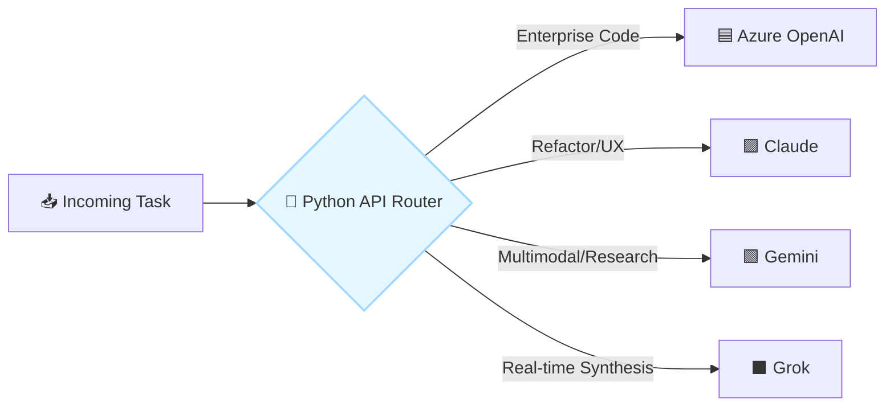

### 📋 Specifications
* **🧠 Core Function:** A Python-based poly-model router that evaluates tasks and dispatches them via API to the most suitable intelligence.
  * **🟦 Azure OpenAI:** Targeted for enterprise-grade code generation and structured JSON extraction.
  * **🟪 Claude:** Utilized for complex refactoring, long-context file analysis, and UI/UX design reasoning.
  * **🟩 Gemini:** Deployed for multimodal tasks, rapid context processing, and broad research operations.
  * **⬛ Grok:** Leveraged for real-time data synthesis and specialized, unconstrained problem-solving.

---

## 🔌 2. Tools & Actions: The Execution Arms
*How the factory interacts with the environment and provisions resources.*

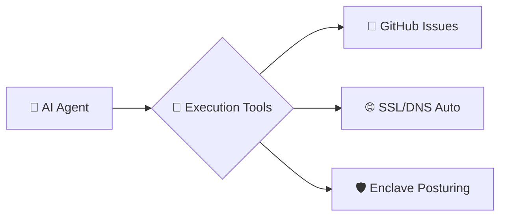

### 📋 Specifications
* **🔌 Core Function:** A minimalist set of robust, highly-permissioned Python/Bash tools allowing the AI to manipulate its environment.
  * **🎫 GitHub Issues:** Acts as the primary task queue and human-AI feedback loop. Agents can read, comment, close, and open issues.
  * **🌐 Infrastructure Automation:** Agent-triggered scripts auto-provision SSL certificates (e.g., Let's Encrypt) and configure DNS/Domain records for new deployments.
  * **🛡️ Internal Enclave Posturing:** Security scripts that configure network rules, firewall states, and container isolation before generated code is allowed to run.

---

## 💾 3. Memory & State: Markdown "App Capsules"
*The persistent state, knowledge graph, and file-based definition of the factory.*

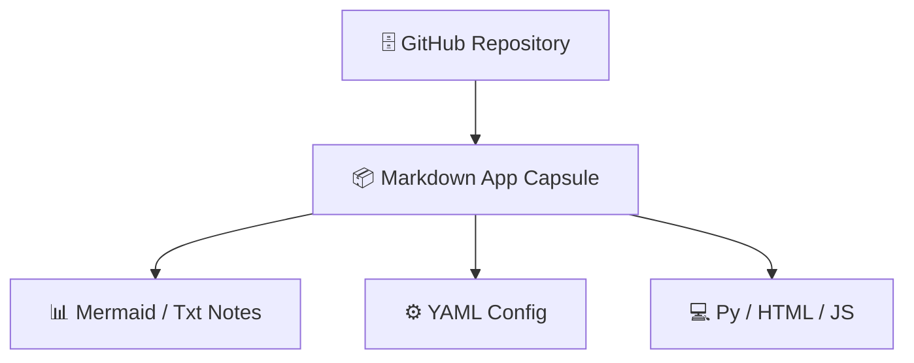

### 📋 Specifications
* **💾 Core Function:** Shunning heavy external databases, state is maintained via the GitHub Repo using encapsulated "Markdown App Capsules" (`app_spec.md`).
  * **🗄️ Immutable Brain:** The repository acts as version-controlled memory; when an agent updates a capsule, it updates the system's state.
  * **📊 Knowledge Graph & Logic:** Defined directly within the capsule using `Mermaid` diagrams and `txt` notes.
  * **⚙️ Configuration:** Stored as embedded `YAML` blocks within the Markdown file.
  * **💻 Code Implementation:** Application logic resides in fenced code blocks of `py` (backend) and `html/js` (frontend).

---

## 🔄 4. Orchestration & Flow: FastAPI & GitActions
*The nervous system that coordinates the asynchronous assembly line.*

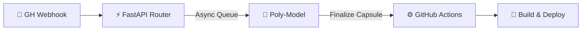

### 📋 Specifications
* **🔄 Core Function:** The hybrid nervous system coordinating webhooks, APIs, and deployment pipelines.
  * **⚡ FastAPI (Central Router):** Receives webhooks from GitHub (e.g., "Issue Created"), manages asynchronous task queues, and communicates with the LLM APIs.
  * **⚙️ GitHub Actions (Pipelines):** Once FastAPI and the agents finalize an App Capsule, Actions takes over to parse the Markdown, extract the Code/YAML, build the environment, run tests, and deploy the asset.

---

## 💬 5. Surface & UI: Streamlit & HTML/JS
*Where human operators command the factory and view its outputs.*

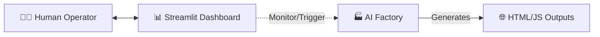

### 📋 Specifications
* **💬 Core Function:** The dual-interface layer separating the complex control room from the lightweight generated products.
  * **📊 Streamlit (Control Room):** A Python-native dashboard for the human operator to monitor FastAPI queues, review API costs, manually trigger pipelines, and visualize Markdown Knowledge Graphs.
  * **🌐 HTML/JS (Generated Outputs):** Factory-built frontend pieces compiled down to pure, lightweight HTML/JS, served via the automated domain for maximum speed and simplicity.

---

## 🛡️ 6. Governance & Control: Enclave & Posturing
*The guardrails ensuring the factory doesn't execute malicious code or leak data.*

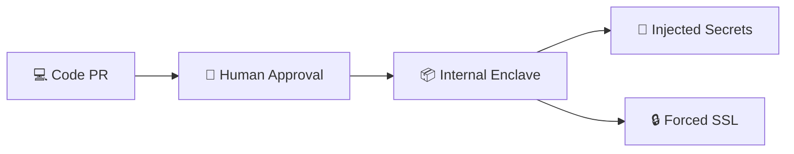

### 📋 Specifications
* **🛡️ Core Function:** Strict operational boundaries, sandboxing, and human oversight protecting the factory.
  * **👀 Human-in-the-Loop (PRs):** Agents cannot merge directly to `main`. They submit Pull Requests against App Capsules, requiring human approval via the Streamlit dashboard or GitHub UI.
  * **📦 Internal Enclave Sandboxing:** Generated code is never run directly on the host; it executes within a hardened, isolated environment.
  * **🔑 Secrets Management:** API keys (Claude, OpenAI, Gemini, Grok) are strictly managed via GitHub Secrets and injected only at runtime via Actions or FastAPI.
  * **🔒 Secure Transport:** Total enforcement of automated SSL (HTTPS) for all exposed endpoints and generated applications.
 

# 🧠 GPT-5.4 Thinking — ChatGPT AI  Factory Design 🧠

> AI  Agentic Software Factory — GitHub-Ready One-Page Cards

A minimal, open-source, file-driven, GitHub-native agentic software factory.

**Required stack**
- 🐍 Python
- ⚡ FastAPI
- 🖥️ Streamlit
- 🌐 HTML/JS
- 🐙 GitHub Repository
- 🤖 GitHub Actions
- 📝 Markdown files as knowledge graphs and app specs
- 🔌 Multi-model adapters for Azure OpenAI, Claude, Grok, and Gemini
- 🌍 Domain + SSL automation
- 🏰 Internal enclave posture
- 🐙 GitHub Issues as work intake

---

## 0️⃣ 🌌 Whole-Factory View

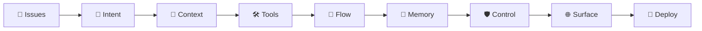

### 🌟 Executive outline
- 🏭 **Factory thesis**
  - GitHub Issues drive the work
  - Markdown files hold specs, memory, and knowledge graphs
  - Python, FastAPI, Streamlit, and HTML/JS implement the system
  - GitHub Actions automates verification and release
  - Multi-model adapters connect to Azure OpenAI, Claude, Grok, and Gemini
  - Enclave controls gate secrets, deployment, domain, and SSL
- 🎯 **Audience fit**
  - business sponsors see a clear lifecycle
  - engineers see explicit files and contracts
  - AI pair programmers see structured steering and stable targets
- 🧩 **Factory pattern**
  - Intent → Context → Tools → Flow → Memory → Control → Surface → Deploy

---

## 1️⃣ 🧭 Intent Card

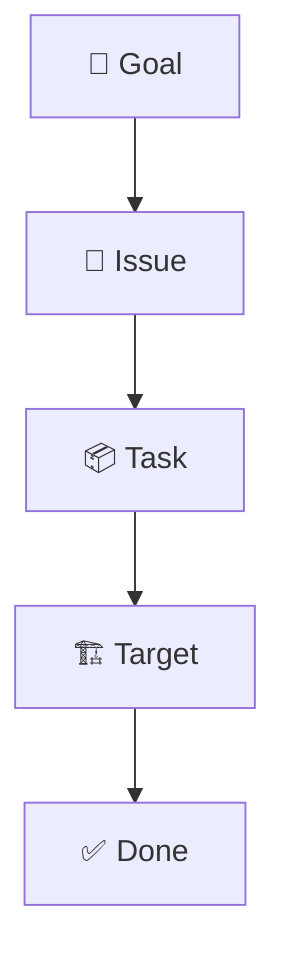

### 🧭 Intent outline
- 🎯 **Mission**
  - turn issues and specs into working apps, APIs, docs, tests, and release artifacts
- 📥 **Inputs**
  - GitHub Issues
  - specs in Markdown
  - app folders
  - knowledge graph files
  - factory configuration
- 📤 **Outputs**
  - Streamlit apps
  - FastAPI services
  - HTML/JS frontends
  - docs, Mermaid diagrams, and test evidence
  - PRs, releases, domain, and SSL updates
- ⚙️ **Autonomy modes**
  - `PLAN_ONLY`
  - `PR_DRAFT`
  - `AUTO_FIX_TESTS`
  - `AUTO_MERGE_SAFE`
  - `ENCLAVE_ONLY`
- 💼 **Sponsor explanation**
  - a request becomes an issue
  - the issue becomes a structured task packet
  - the factory converts that packet into auditable software work

---

## 2️⃣ 🧠 Context Card

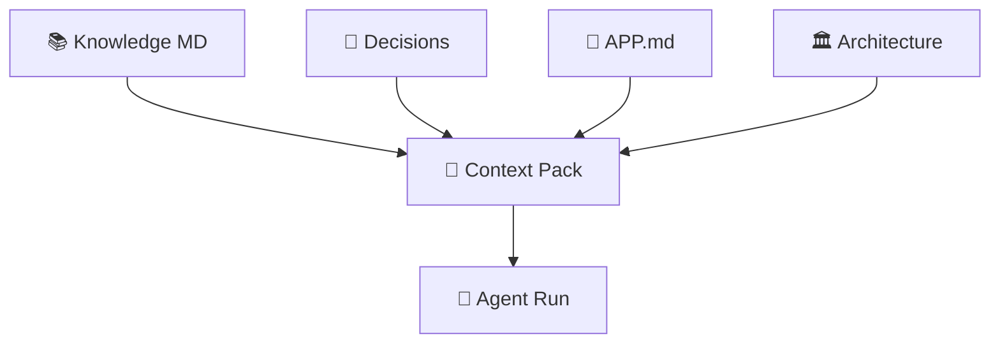

### 🧠 Context outline
- 📚 **Core principle**
  - files are the visible memory of the factory
  - Markdown is both documentation and executable specification
- 🗂️ **Canonical files**
  - `README.md` → project overview
  - `AGENTS.md` → agent behavior rules
  - `ARCHITECTURE.md` → topology
  - `ROADMAP.md` → priority graph
  - `DECISIONS.md` → ADR-style memory
  - `factory.yaml` → runtime wiring
  - `knowledge/**/*.md` → domain graphs
  - `issues/**/*.md` → expanded task packets
  - `apps/**/APP.md` → app-level specs
  - `agents/**/SKILL.md` → skill and tool contracts
  - `enclave/POLICY.md` → security posture
- 📦 **Encapsulated app spec**
  - each app folder may contain:
    - Markdown
    - Mermaid
    - Python
    - HTML
    - JS
    - YAML
    - TXT
- 🤝 **AI pair-programming value**
  - humans and AI read the same files
  - instructions are explicit, versioned, and reviewable
  - context is portable across sponsor and engineering discussions

---

## 3️⃣ 🛠️ Tools Card

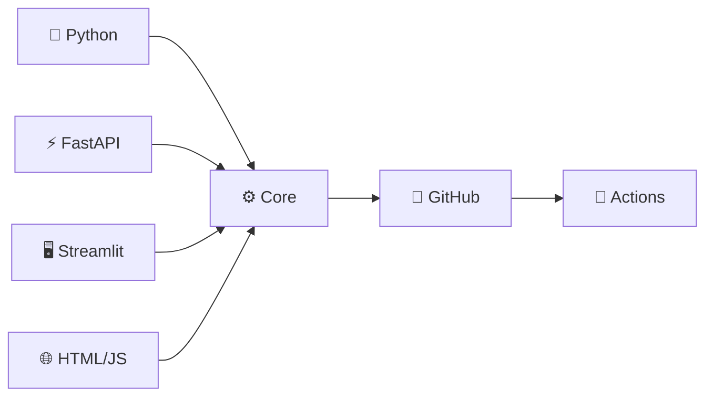

### 🛠️ Tools outline
- 🧱 **Mandatory stack**
  - 🐍 Python as the implementation spine
  - ⚡ FastAPI as orchestration and service API
  - 🖥️ Streamlit as operator cockpit and app shell
  - 🌐 HTML/JS as widget and lightweight frontend layer
  - 🐙 GitHub as source of truth
  - 🤖 GitHub Actions as automation backbone
  - 📝 Markdown as spec and knowledge substrate
- 🪶 **Minimal helper libraries**
  - `pydantic` for schemas
  - `httpx` for provider calls
  - `jinja2` for template generation
  - `pytest` for tests
  - optional browser automation only when needed
- 🔌 **Provider adapters**
  - Azure OpenAI
  - Claude
  - Grok
  - Gemini
- 📏 **Why this stays minimal**
  - one backend language
  - one API framework
  - one operator shell
  - one frontend escape hatch
  - one repo authority
  - one automation engine

---

## 4️⃣ 🔁 Orchestration Card

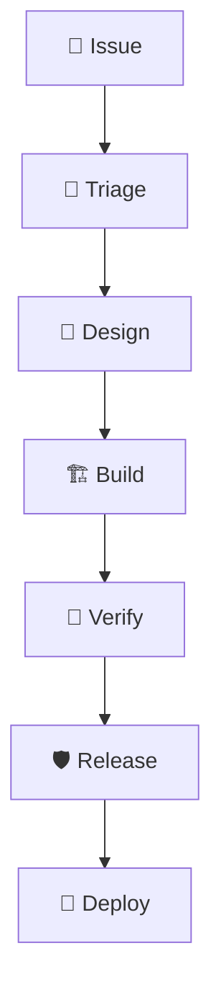

### 🔁 Flow outline
- 🤖 **Minimal agents**
  - 🎯 **Triage Agent**
    - reads issue
    - finds the target app, service, or spec
    - emits a structured task packet
  - 🧠 **Design Agent**
    - updates architecture, app spec, and knowledge files first
    - emits implementation plan
  - 🏗️ **Build Agent**
    - edits Python, HTML, JS, YAML, and Markdown
    - creates or updates tests
  - 🧪 **Verify Agent**
    - runs linting, typing, unit tests, smoke tests, and policy checks
  - 🛡️ **Release Agent**
    - opens PRs
    - comments on issues
    - gates deploys
    - updates release notes
- 📜 **Execution rule**
  - docs first
  - code second
  - deploy third
- 🔄 **Issue loop**
  - issue → task packet → spec update → code update → test → PR → deploy

---

## 5️⃣ 🧲 Memory Card

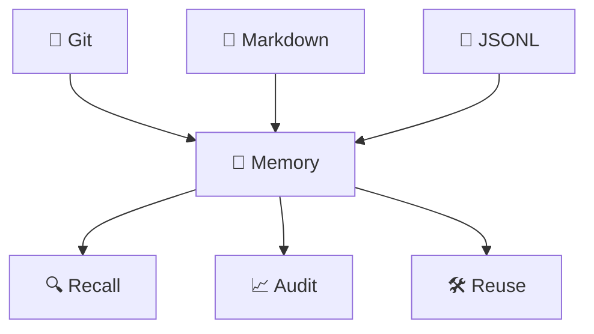

### 🧲 Memory outline
- 🧠 **Memory principle**
  - prefer visible, deterministic memory before hidden services
- 🗃️ **Tier A — Git memory**
  - commit history
  - PR history
  - tags and releases
  - issue discussions
- 📘 **Tier B — Markdown memory**
  - `DECISIONS.md`
  - `CHANGELOG.md`
  - `knowledge/**/*.md`
  - retrospectives
- 📄 **Tier C — lightweight runtime memory**
  - traces in JSONL
  - task packets in JSON
  - run results and metrics
- 🧭 **Tier D — optional later**
  - local embeddings index
  - semantic recall for Markdown and issue links
- 🤝 **AI pair-programming value**
  - humans and AI can inspect the same memory layers
  - prior choices become reusable assets

---

## 6️⃣ 🛡️ Control + Enclave Card

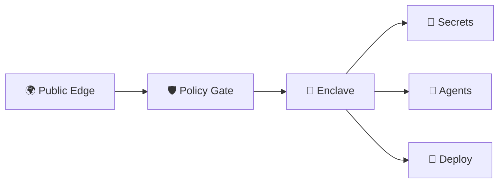

### 🛡️ Control outline
- 🏰 **Two-zone posture**
  - 🌍 **Public edge**
    - domains
    - SSL termination
    - public Streamlit UI
    - public FastAPI routes
    - GitHub webhooks
  - 🏰 **Private enclave**
    - agent runners
    - secrets
    - provider keys
    - deployment credentials
    - internal admin APIs
    - policy engine
    - artifact signing
- 🔒 **Security rules**
  - outbound egress allowlist only
  - no secret exposure to UI
  - minimal GitHub token scopes
  - sanitized issue comments
  - PR requirement for production unless explicitly allowed
  - deploy agents separated from authoring agents
- 🪪 **Approval classes**
  - `read_only`
  - `spec_edit`
  - `code_edit`
  - `issue_comment`
  - `pr_open`
  - `deploy_dev`
  - `deploy_prod`
- 📁 **Policy files**
  - `enclave/POLICY.md`
  - `enclave/egress_allowlist.yaml`
  - `enclave/secrets_contract.md`

---

## 7️⃣ 🌐 Surface Card

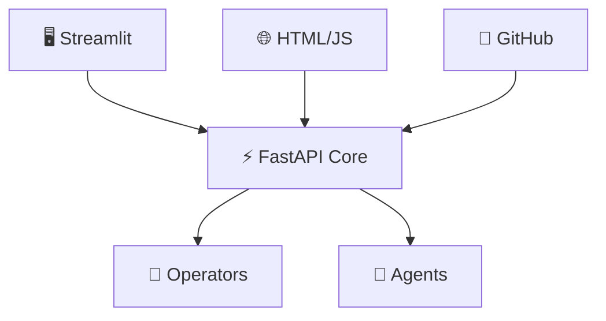

### 🌐 Surface outline
- 🖥️ **Streamlit**
  - issue queue
  - run detail
  - knowledge graph explorer
  - spec editor
  - provider bench
  - domain and SSL page
  - policy and release dashboards
- 🌐 **HTML/JS**
  - embeddable widgets inside Streamlit
  - standalone previews
  - Mermaid viewers and graph explorers
  - lightweight custom interactivity
- ⚡ **FastAPI**
  - stable orchestration and service contract
  - entry point for webhooks, runs, model calls, trace retrieval, and deploy actions
- 🐙 **GitHub**
  - Issues
  - PRs
  - Discussions
  - Actions
  - Releases

---

## 8️⃣ 🐙 GitHub Issues Card

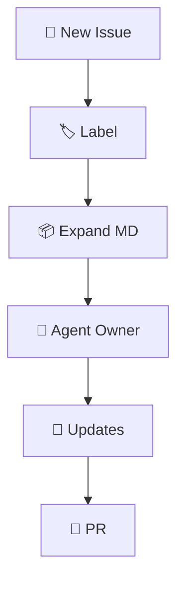

### 🐙 Issues outline
- 📝 **Issue template fields**
  - intent
  - target app or service
  - priority
  - acceptance criteria
  - security class
  - deploy target
  - provider preference
  - expected files to change
- 🏷️ **Issue states**
  - `intake`
  - `triaged`
  - `designing`
  - `building`
  - `verifying`
  - `pr_open`
  - `deployed`
  - `blocked`
- 🤖 **Automations**
  - auto-label by type
  - expand into `issues/expanded/{issue_number}.md`
  - assign owning agent
  - comment the plan back to issue
  - attach test and deploy evidence
  - link the PR

---

## 9️⃣ 🤖 GitHub Actions Card

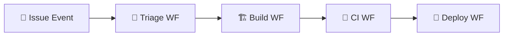

### 🤖 Actions outline
- 🧪 **`ci.yml`**
  - install dependencies
  - lint
  - type check
  - unit tests
  - Markdown and spec validation
- 🎯 **`issue-triage.yml`**
  - trigger on new issue
  - create structured task packet
  - save expanded issue Markdown
  - comment summary back to issue
- 🏗️ **`pr-agent.yml`**
  - run design/build/verify loop
  - open PR with checklist
- 🚀 **`deploy-dev.yml`**
  - build app or container
  - deploy to dev
  - smoke test
  - update issue and PR
- 🔐 **`deploy-prod.yml`**
  - manual approval or gated label
  - deploy production
  - SSL and domain verification
  - health verification

---

## 🔟 🌍 Domain + SSL Card

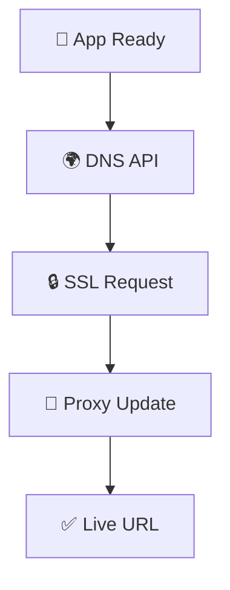

### 🌍 Domain + SSL outline
- 🌐 **Purpose**
  - automate the path from built app to reachable secure URL
- ⚙️ **Automation service responsibilities**
  - create subdomain
  - create or update DNS record
  - update reverse proxy config
  - request and renew certificate
  - write deployment metadata
- 🧰 **Implementation choices**
  - DNS via Cloudflare, Route53, or Azure DNS
  - SSL via Let's Encrypt
  - proxy via Caddy, Traefik, or Nginx
- 📦 **Outputs**
  - deployment metadata files per environment

---

## 1️⃣1️⃣ ⚡ FastAPI Card

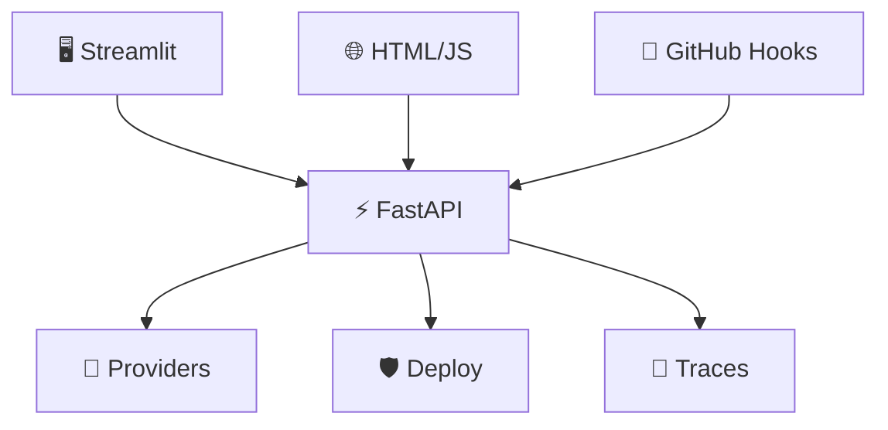

### ⚡ FastAPI outline
- 🎯 **Role**
  - stable contract between UI, automation, providers, and deploy services
- 🛣️ **Core routes**
  - `POST /run/issue/{id}`
  - `POST /run/spec`
  - `POST /models/generate`
  - `POST /deploy/domain`
  - `GET /trace/{run_id}`
  - `GET /health`
  - `POST /github/webhook`
- 🧠 **Why it matters**
  - isolates orchestration from presentation
  - makes testing and scaling easier
  - gives AI pair programmers a durable API surface

---

## 1️⃣2️⃣ 🖥️ Streamlit Cockpit Card

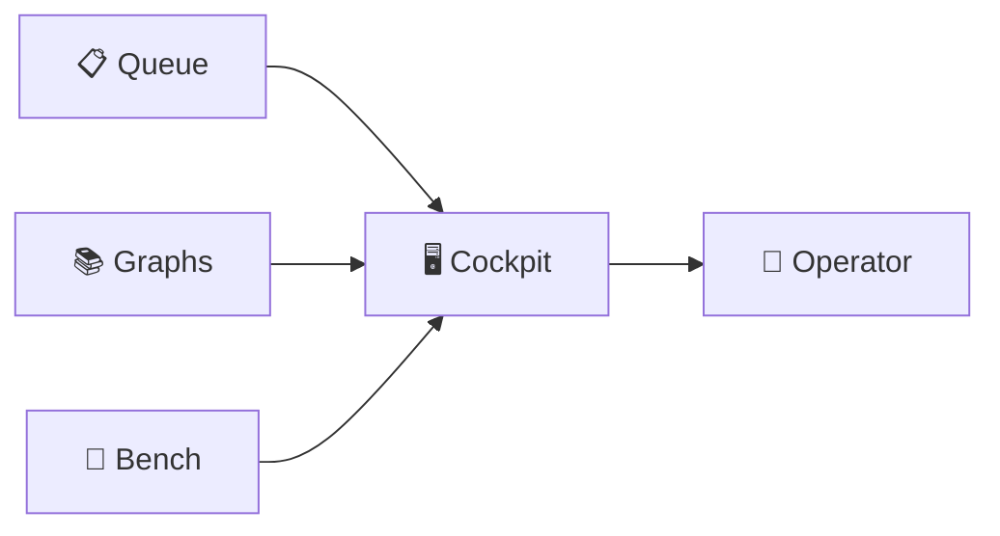

### 🖥️ Streamlit outline
- 🎛️ **Pages**
  - Queue
  - Run Detail
  - Knowledge Graph
  - Spec Editor
  - Provider Bench
  - Domain / SSL
  - Enclave Policy
  - Releases
- 🧩 **Embedded widgets**
  - Mermaid graph viewer
  - diff preview
  - issue graph
  - trace timeline
  - latency and cost charts
- 💼 **Purpose**
  - visible command center for sponsors, operators, and engineers

---

## 1️⃣3️⃣ 📝 Markdown Knowledge Graph Card

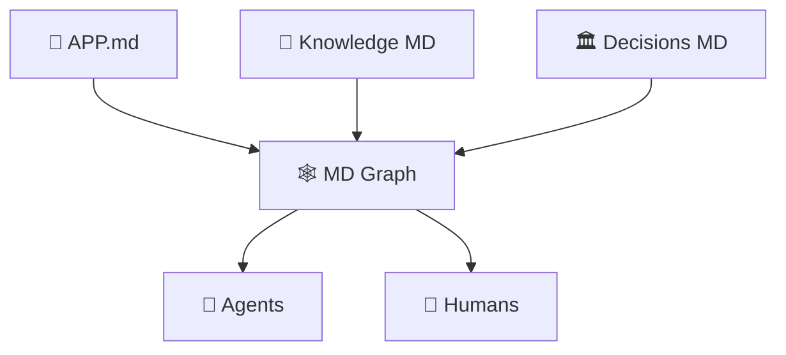

### 📝 Knowledge graph outline
- 🧠 **Pattern**
  - Markdown files link by IDs and references
  - Mermaid, code fences, YAML frontmatter, and notes stay together
- 📦 **Supported assets**
  - Mermaid
  - Python
  - HTML
  - JS
  - YAML
  - TXT
  - issue references
  - ADR references
- 📏 **Rule for each generated app**
  - one `APP.md`
  - one Mermaid topology
  - one acceptance section
  - one dependency map
  - one deployment note

---

## 1️⃣4️⃣ 🔌 Multi-Model Adapter Card

```mermaid
flowchart LR
    A[🧠 Prompt] --> B[🔌 Router]
    B --> C[🟦 Azure]
    B --> D[🟣 Claude]
    B --> E[⚫ Grok]
    B --> F[🟢 Gemini]
    C --> G[📄 Unified Reply]
    D --> G
    E --> G
    F --> G
```

### 🔌 Adapter outline
- 🎯 **Goal**
  - connect to Azure OpenAI, Claude, Grok, and Gemini through one common contract
- 📦 **Shared contract**
  - same request envelope
  - same response envelope
  - same trace structure
  - same retry behavior
  - same redaction rules
  - same cost and latency metrics
- 🧠 **Engineering value**
  - provider swap without architecture rewrite
  - provider benchmarking for quality, speed, and cost
  - business workflows stay stable while models evolve

---

## 1️⃣5️⃣ 🗂️ Repository Layout Card

```mermaid
flowchart TD
    A[🐙 Repo] --> B[📱 apps]
    A --> C[⚡ services]
    A --> D[🔌 providers]
    A --> E[🤖 agents]
    A --> F[📚 knowledge]
    A --> G[🏰 enclave]
    A --> H[🤖 .github]
```

### 🗂️ Layout outline
- 🐙 **Root structure**
  - `.github/` for workflows
  - `apps/` for Streamlit and UI deliverables
  - `services/` for FastAPI and ops services
  - `providers/` for model adapters
  - `agents/` for skill contracts
  - `knowledge/` for Markdown graph content
  - `issues/` for expanded work packets
  - `enclave/` for policy and network posture
  - `data/` for traces and runs
  - `tests/` for verification
  - root docs and factory config
- 🧠 **Design principle**
  - folder structure mirrors the mental model of the factory

---

## 1️⃣6️⃣ 🧩 Comparative Positioning Card

```mermaid
flowchart LR
    A[🟣 Anthropic\nPatterns] --> E[🏭 Factory]
    B[🟢 OpenAI\nOrchestration] --> E
    C[🟠 OpenClaw\nLocal Control] --> E
    D[🐙 GitHub\nWorkflow] --> E
```

### 🧩 Comparative outline
- 🟣 **Anthropic-style influence**
  - explicit workflows
  - tool discipline
  - steering files
  - safety and evaluation emphasis
- 🟢 **OpenAI-style influence**
  - orchestration contracts
  - auditable actions
  - hosted-style task abstraction
  - multi-step lifecycle thinking
- 🟠 **OpenClaw-style influence**
  - self-hosted control
  - Markdown-native runtime memory
  - local extensibility and agent autonomy
- 🐙 **GitHub-native influence**
  - issues as work units
  - PRs as review surfaces
  - Actions as automation backbone

---

## 1️⃣7️⃣ 🚀 Minimal Runtime Card

```mermaid
flowchart TD
    A[📝 Issue] --> B[📦 Expand]
    B --> C[📝 Update Spec]
    C --> D[🏗️ Edit Code]
    D --> E[🧪 Verify]
    E --> F[🔀 PR]
    F --> G[🌍 SSL + Domain]
    G --> H[✅ Live]
```

### 🚀 Runtime outline
- 📝 request starts as an issue
- 📦 issue becomes expanded Markdown task packet
- 📝 specs are updated first
- 🏗️ code and tests are updated second
- 🧪 verification runs before release
- 🔀 PR is the review and approval boundary
- 🌍 domain and SSL automation completes delivery
- ✅ deployment artifacts and traces close the loop

---

## 1️⃣8️⃣ 📜 Sponsor Script Card

```mermaid
flowchart LR
    A[💼 Ask] --> B[📝 Issue]
    B --> C[🤖 Factory]
    C --> D[🔍 Review]
    D --> E[🚀 Secure Release]
```

### 📜 Sponsor talk-track
- 💼 a sponsor asks for a capability
- 📝 the request becomes a GitHub Issue with acceptance criteria
- 🤖 the factory turns it into specs, code, tests, and release artifacts
- 🔍 humans review the PR and evidence trail
- 🚀 approved work deploys through secure domain and SSL automation
- 🧾 the process stays visible, reusable, and auditable

---

## 1️⃣9️⃣ 👩‍💻 Engineer Script Card

```mermaid
flowchart LR
    A[📚 Specs] --> B[🤖 Agents]
    B --> C[🐍 Code]
    C --> D[🧪 Tests]
    D --> E[🐙 PR]
    E --> F[🚀 Deploy]
```

### 👩‍💻 Engineer talk-track
- 📚 specs live in Markdown, Mermaid, YAML, and app folders
- 🤖 agents read the same files humans maintain
- 🐍 Python, FastAPI, Streamlit, and HTML/JS are the minimal implementation stack
- 🧪 GitHub Actions verifies quality and policy
- 🐙 PRs preserve review discipline
- 🚀 deploy services handle URL, SSL, and environment gating

---

## 2️⃣0️⃣ 🧾 Final Thesis Card

```mermaid
flowchart LR
    A[📝 Issues] --> B[🧠 Specs]
    B --> C[🤖 Agents]
    C --> D[🐍 Apps + APIs]
    D --> E[🛡️ Enclave]
    E --> F[🌍 Live Systems]
```

### 🧾 Final thesis outline
- 🏭 **AI  Agentic Software Factory** is:
  - issue-driven
  - Markdown-native
  - Python-centered
  - FastAPI-backed
  - Streamlit-operated
  - HTML/JS-extendable
  - GitHub-automated
  - multi-model
  - enclave-gated
- 🎯 **One-line thesis**
  - GitHub Issues + Markdown Specs + FastAPI Core + Streamlit Cockpit + HTML/JS Widgets + Multi-Model Adapters + GitHub Actions + Enclave-Gated Delivery

---

## 🗃️ Minimal Repository Layout

```text
ai--factory/
├─ .github/
│  ├─ workflows/
│  │  ├─ ci.yml
│  │  ├─ issue-triage.yml
│  │  ├─ pr-agent.yml
│  │  ├─ deploy-dev.yml
│  │  └─ deploy-prod.yml
│  ├─ ISSUE_TEMPLATE/
│  └─ PULL_REQUEST_TEMPLATE.md
├─ apps/
│  ├─ cockpit/
│  │  ├─ APP.md
│  │  ├─ app.py
│  │  ├─ widgets/
│  │  │  ├─ graph.html
│  │  │  └─ graph.js
│  └─ demo_app/
│     ├─ APP.md
│     ├─ app.py
│     └─ ui/
├─ services/
│  ├─ router_api/
│  │  ├─ main.py
│  │  ├─ routes/
│  │  └─ schemas.py
│  ├─ domain_ssl/
│  │  ├─ main.py
│  │  └─ providers/
│  └─ github_ops/
│     ├─ main.py
│     └─ issues.py
├─ providers/
│  ├─ azure_openai.py
│  ├─ claude.py
│  ├─ grok.py
│  ├─ gemini.py
│  └─ base.py
├─ agents/
│  ├─ triage/
│  │  └─ SKILL.md
│  ├─ design/
│  │  └─ SKILL.md
│  ├─ build/
│  │  └─ SKILL.md
│  ├─ verify/
│  │  └─ SKILL.md
│  └─ release/
│     └─ SKILL.md
├─ knowledge/
│  ├─ domains/
│  ├─ graphs/
│  ├─ patterns/
│  └─ providers/
├─ issues/
│  └─ expanded/
├─ enclave/
│  ├─ POLICY.md
│  ├─ egress_allowlist.yaml
│  └─ network.md
├─ data/
│  ├─ traces/
│  ├─ runs/
│  └─ tasks/
├─ tests/
├─ factory.yaml
├─ AGENTS.md
├─ ARCHITECTURE.md
├─ DECISIONS.md
├─ ROADMAP.md
├─ README.md
└─ pyproject.toml
```

---

## ⚙️ Minimal `factory.yaml`

```yaml
factory:
  name: ai--factory
  mode: issue_driven
  default_provider: azure_openai

  providers:
    azure_openai:
      enabled: true
    claude:
      enabled: true
    grok:
      enabled: true
    gemini:
      enabled: true

  surfaces:
    streamlit: true
    fastapi: true
    html_js: true
    github: true

  safety:
    require_pr_for_prod: true
    redact_secrets: true
    egress_allowlist: enclave/egress_allowlist.yaml

  memory:
    decisions: DECISIONS.md
    traces: data/traces
    issues: issues/expanded

  deployment:
    domain_service: services/domain_ssl/main.py
    ssl: lets_encrypt
    environment:
      dev: enabled
      prod: gated
```

---

## 📐 Example `APP.md`

```md
---
id: customer-navigator
kind: streamlit_app
entrypoint: app.py
api: ../../services/router_api/main.py
models:
  - azure_openai
  - claude
  - grok
  - gemini
permissions:
  fs: scoped
  network: whitelisted
  github: issues,prs,contents
outputs:
  - ui
  - tests
  - docs
  - issue_updates
---

# Purpose
Customer or patient navigation workflow with embedded agent assists.

## UI
- Streamlit shell
- embedded HTML/JS widgets
- Mermaid diagrams for reasoning traces

## Behaviors
- read issue context
- load knowledge Markdown
- select provider adapter
- call API
- summarize result
- persist trace

## Acceptance
- app runs locally
- app runs in container
- tests pass
- issue updated automatically
```

---

## 🔌 Example Provider Contract

```python
class ModelAdapter:
    def generate(
        self,
        prompt: str,
        system: str | None = None,
        tools: list | None = None
    ) -> dict:
        ...
```

### Shared adapter rules
- same request envelope
- same response envelope
- same trace format
- same retry policy
- same redaction rules
- same cost and latency metrics

---

## ✅ Copy/Paste Notes
- Paste this entire file into `ARCHITECTURE.md` or `README.md`
- Keep Mermaid fences exactly as ` ```mermaid `
- GitHub renders Mermaid from fenced blocks
- Keep node labels short for cleaner rendering
- If one section gets too dense, split that section into its own `.md` file


# 🤖✨ Claude Opus 4.6 — Anthropic ✨🤖

# 🏗️ Agentic AI Architectures — The 6-Part Pattern

> **Four companies, six shared pillars.** A generalized framework for understanding modern agentic AI systems — with  Factory synthesis.
>
> 🟣 **Anthropic** · 🟢 **OpenAI** · 🔵 **SmartDM** · 🟠 **OpenClaw** · 🔴 ** Factory**

---

## ⚡ The Shared Pattern

```mermaid
flowchart LR
  R["🧠 Reasoning"] --> T["🔌 Tools"]
  T --> M["💾 Memory"]
  M --> O["🔄 Orchestration"]
  O --> I["💬 Interface"]
  I --> G["🛡️ Governance"]
  G -.->|feedback| R
```

| Pillar | Anthropic | OpenAI | SmartDM | OpenClaw |  Factory |
|--------|-----------|--------|---------|----------|-------------|
| 🧠 Reasoning | Tight model-product | RL-specialized Codex | Intent multi-bot | Model-agnostic | Multi-model router |
| 🔌 Tools | Terminal + MCP | Sandbox + CLI + App | Social ecosystem | Gateway + chat | FastAPI + HTML/JS |
| 💾 Memory | Massive context | Stateless + RAG | Custom CRM KB | Persistent local | Markdown KG files |
| 🔄 Orchestration | Subagents + SDK | Worktrees + Skills | Triggers + branches | Skill composition | GitHub Actions CI |
| 💬 Interface | Async IDE/chat | Canvas + SDK | Unified inbox | Conversational OS | Streamlit + HTML |
| 🛡️ Governance | Hooks + evals | Sandbox + audit | Brand protection | Community vetting | Issues + enclave |

### One-Line Characterizations

- 🟣 **Anthropic** → *"The model IS the agent"* — deep vertical integration, universal reasoning
- 🟢 **OpenAI** → *"The platform IS the agent"* — cloud-first, multi-surface orchestration
- 🔵 **SmartDM** → *"The business IS the agent"* — vertical automation for customer operations
- 🟠 **OpenClaw** → *"The user IS the agent"* — open-source, maximum autonomy, model-agnostic

---

## 🧠 Part 1 — Core Reasoning Engine

> *The LLM backbone for perception, reasoning, generation, and decision-making.*

```mermaid
flowchart TD
  Q["❓ Task Input"] --> ROUTER["🔀 Model Router"]
  ROUTER --> A1["🟣 Claude — Universal Agent"]
  ROUTER --> A2["🟢 GPT-Codex — RL-Specialized"]
  ROUTER --> A3["🔵 Intent Bot — Sales + Support"]
  ROUTER --> A4["🟠 Any LLM — Model-Agnostic"]
  A1 --> PLAN["📋 Plan + Reason"]
  A2 --> PLAN
  A3 --> PLAN
  A4 --> PLAN
  PLAN --> ACT["⚡ Execute"]
```

### 🟣 Anthropic — Universal Agent (Claude)

- Claude Opus/Sonnet — model IS the product, tightly coupled
- Extended thinking with interleaved reasoning
- Low hallucination, dynamic tool learning
- Handles diverse domains without narrow specialization
- Advanced code generation and logical deduction as primary capabilities

### 🟢 OpenAI — Multi-Agent Orchestration

- GPT-5.x-Codex family with RL fine-tuning on real-world coding tasks
- Dynamic reasoning effort — scales thinking time to task complexity
- Triage agent routes and delegates to specialized sub-agents
- Strong function-calling heritage
- Agents defined through platform stack of models + tools + logic

### 🔵 SmartDM — Intent-Based Multi-Bot

- Specialized for sales and support personas
- Autonomously decides: reply, route to human, or stay silent
- RAG-grounded for brand-aligned, contextually accurate responses
- Conversational context drives all cognitive decisions
- Business-task-first — more vertical than general-purpose

### 🟠 OpenClaw — Autonomous Plan-and-Execute Loop

- Model-agnostic — Claude, GPT, Gemini, DeepSeek via proxy
- Cognitive harness, not a model — orchestration IS the product
- Breaks high-level goals into atomic tasks for background execution
- Reasoning layer fully swappable
- Developer- and power-user-oriented control model

### 🔴  Factory — Multi-Model Router

- **FastAPI** endpoint routes each agent to optimal model per task
- Markdown spec files define model routing rules
- Supports **Azure OpenAI**, **Claude API**, **Grok API**, **Gemini API** as swappable backends
- Cross-model synthesis for consensus outputs
- `Tools:` `FastAPI` · `Python` · `Azure OpenAI` · `Claude API` · `Grok API` · `Gemini API`

---

## 🔌 Part 2 — Tool Integration & Action

> *How the agent reaches out and manipulates the digital world beyond text generation.*

```mermaid
flowchart LR
  AGENT["🧠 Agent"] --> FS["📁 Filesystem"]
  AGENT --> TERM["💻 Terminal"]
  AGENT --> API["🌐 APIs + MCP"]
  AGENT --> GUI["🖥️ GUI + Browser"]
  AGENT --> SOCIAL["📱 Social + Chat"]
  FS --> OUT["⚡ Action Output"]
  TERM --> OUT
  API --> OUT
  GUI --> OUT
  SOCIAL --> OUT
```

### 🟣 Anthropic — Computer Use (Native GUI/Terminal)

- Terminal-native: bash, filesystem read/write, git operations
- Pioneers visual screen perception — cursor, click, type
- MCP open standard for secure, scalable tool integration
- VS Code / JetBrains IDE extensions
- Unix-philosophy composability — pipe logs in, chain with CLI tools

### 🟢 OpenAI — Structured APIs & Cloud Sandbox

- Cloud sandbox containers with internet disabled during execution
- GitHub-first workflow with Codex App as desktop command center
- Native function-calling, web search, code interpreter
- IDE extensions for VS Code, Cursor, Windsurf
- Skills system extending agent capabilities beyond code

### 🔵 SmartDM — Social Ecosystem Automation

- Wired into WhatsApp, Instagram, TikTok messaging platforms
- Auto-reply, CRM database sync, comment moderation in real time
- Specialized webhooks for messaging platform actions
- Real-time escalation and follow-up triggers
- Chrome extension injecting agentic capabilities into web apps

### 🟠 OpenClaw — Extensible Skills Directory

- Local Gateway brokering between chat interfaces, AI, and skills
- Shell commands, browser automation, file I/O, hardware control
- Calendar, email, API access — agent can write its own scripts
- `SKILL.md` config per extension — community-contributed ecosystem
- 800+ extensions available, user-installable globally or per-workspace

### 🔴  Factory — FastAPI + HTML/JS + GitHub Actions

- **FastAPI** serves agent tools as REST endpoints
- **HTML/JS** artifacts render client-side previews (no server needed)
- **Python** scripts execute document processing and transforms
- **GitHub Actions** automate CI/CD pipelines and deployments
- **SSL/Domain automation** for secure deployment
- **Internal enclave posturing** for sandboxed execution
- `Tools:` `FastAPI` · `HTML/JS` · `Python` · `GitHub Actions` · `SSL Auto` · `Enclave`

---

## 💾 Part 3 — Memory & State Persistence

> *Retaining context, decisions, and learned preferences across sessions and tasks.*

```mermaid
flowchart TD
  SESSION["💬 Current Session"] --> SHORT["⚡ Short-Term Context"]
  SHORT --> DECIDE{"Persist?"}
  DECIDE -->|yes| LONG["🗄️ Long-Term — RAG / Files / DB"]
  DECIDE -->|no| DISCARD["🗑️ Discard"]
  LONG --> RETRIEVE["🔍 Retrieve"]
  RETRIEVE --> SHORT
  LONG --> SPEC["📋 Spec Files — Markdown KG"]
  SPEC --> SHORT
```

### 🟣 Anthropic — Massive In-Flight Context

- Enormous context windows pass full system state and visual feedback continuously
- Checkpoints save code state before each change — instant rewind
- `CLAUDE.md` files encode architectural decisions (project → user → session hierarchy)
- Rigorous evaluation of intermediate results
- Conversation history portable across terminal/IDE/desktop/browser

### 🟢 OpenAI — Stateless + External RAG

- Minimalist default — avoids complex internal state for speed
- Conversation state API for durable threads and replayable state
- Native context compaction in GPT-5.2+ (7+ hour sessions observed)
- External vector stores and file retrieval for memory when needed
- Session history syncs across CLI, IDE extension, Codex App, and cloud

### 🔵 SmartDM — Custom CRM Knowledge Base

- Structured around uploaded business data: PDFs, URLs, text
- Semantic RAG retrieval per customer conversation
- Unified inbox stores full interaction history
- Responses consistently grounded in company-specific facts
- Memory applied inside customer messaging flows

### 🟠 OpenClaw — Persistent 24/7 Local State

- Continuous local memory across sessions and different chat interfaces
- Adapts to individual user patterns over time
- Stores credentials, context, preferences persistently
- Explicitly stateful by design — acts as second brain
- Remembers conversations indefinitely on user hardware

### 🔴  Factory — Markdown Knowledge Graphs

- **Markdown files ARE the knowledge graph** — each agent owns a spec file
- Encapsulated files contain: Mermaid, MD, Python, HTML, JS, YAML, TXT
- Core loop: **Spec + Context → New Spec** (instructions for next agent OR final product)
- **GitHub repository** provides version-controlled long-term memory
- **GitHub Issues** track decisions, state transitions, and handoff metadata
- `Tools:` `Markdown KG` · `Mermaid` · `YAML` · `GitHub Repo` · `GitHub Issues`

---

## 🔄 Part 4 — Multi-Agent Orchestration

> *Spawning, coordinating, and managing parallel sub-agents for complex tasks.*

```mermaid
flowchart TD
  ORCH["🎯 Orchestrator"] --> A1["🏢 Organization"]
  ORCH --> A2["📊 Market"]
  ORCH --> A3["👁️ Vision"]
  A1 -->|spec| A2
  A2 -->|context| A3
  A3 --> A4["📝 Summary"]
  A4 --> A5["📦 Publication"]
  A5 --> A6["📈 Performance"]
  A6 -.->|feedback loop| ORCH
```

### 🟣 Anthropic — Subagents + Agent SDK

- Parallel development: backend API + frontend simultaneously
- Claude Agent SDK for building custom multi-agent architectures
- Multi-agent Code Review dispatching parallel reviewers per PR
- Hierarchical team patterns with orchestrator-worker models
- Reusable patterns: routing, chaining, evaluator loops — clearest pattern language

### 🟢 OpenAI — Worktrees + Skills + Autofix

- Parallel cloud tasks with isolated worktrees per agent
- Agents SDK + AgentKit for custom orchestration
- Codex Autofix in CI for automated pipelines
- Native agent-to-agent handoffs evolved from Swarm architecture
- Visual drag-and-drop Agent Builder for non-technical users

### 🔵 SmartDM — Business Automation Graph

- Triggers, branches, delays, follow-ups, operational sequences
- Multi-bot personalities: sales vs support personas
- Seamless human-handover orchestration
- Confidence-scored response loops with rule-based + AI decisioning
- Scheduled campaigns and follow-up sequences — more automation graph than reasoning loop

### 🟠 OpenClaw — Skill Composition + Autonomy

- Skills invoke other skills — recursive composition
- Autonomous task decomposition across connected services
- Concurrent instances with shared-memory agent "armies"
- Proactive autonomous loops via heartbeats/cron
- Self-directed skill creation, task planning, and error recovery

### 🔴  Factory — GitHub Actions as Orchestrator

- **GitHub Actions** workflows trigger agent chains on schedule (0600/1200/1800/2400) or on push/PR
- Each agent is a **Python** process with a **FastAPI** endpoint
- Spec chain: Organization → Market → Vision → Summary → Publication → Performance → feedback loop
- **GitHub Issues** track handoffs, failures, and inter-agent state
- 25%/50%/75%/100% daily evaluation cycles with cumulative XLSX normalization
- `Tools:` `GitHub Actions` · `FastAPI` · `Python` · `GitHub Issues` · `YAML`

---

## 💬 Part 5 — User Interface & Interaction

> *Where humans meet the system: UI, channels, dashboards, APIs, and runtime surfaces.*

```mermaid
flowchart LR
  HUMAN["👤 Human"] --> UI1["🖥️ Dashboard"]
  HUMAN --> UI2["💻 IDE"]
  HUMAN --> UI3["📱 Chat"]
  HUMAN --> UI4["🌐 Web Preview"]
  UI1 --> AGENT["🤖 Agent Core"]
  UI2 --> AGENT
  UI3 --> AGENT
  UI4 --> AGENT
```

### 🟣 Anthropic — Asynchronous Partnerships

- Native IDE integration: VS Code, JetBrains extensions
- Claude Code Channels via Discord, Telegram — agent pings when done
- Agent works in background, surfaces results asynchronously
- More architectural playbook than single opinionated app surface
- Developer-built surfaces around models and patterns

### 🟢 OpenAI — Dual-Pathway (Canvas + SDK)

- Visual drag-and-drop canvas for non-technical users to build workflows
- Code-first SDK for engineers with deep programmatic control
- Codex App as desktop command center with worktrees
- Managed hosted environment across APIs, SDKs, and dashboards
- Most integrated product environment of the four

### 🔵 SmartDM — Unified Inbox Dashboard

- Chrome extension + cloud workspace — injects into web apps
- Centralized dashboard: analytics, sentiment, AI moderation coverage
- Invisible to end-consumer, visible to business operator
- WhatsApp Web as primary channel surface
- Very channel-native and operator-friendly

### 🟠 OpenClaw — The Conversational OS

- Chat apps (WhatsApp, Signal, Telegram, Discord, iMessage) as universal command line
- Self-hosted gateway + dashboard + connected messaging channels
- Text the agent like a coworker — it manages your digital life
- Agents live across real delivery surfaces
- Strong fit for users who want ownership of runtime and deployment

### 🔴  Factory — Three Surfaces Per Agent

- **Streamlit** for human operator dashboards — each agent gets a UI page
- **HTML/JS** artifacts for canvas-preview outputs (self-contained, no server needed)
- **FastAPI** provides machine-to-machine API surface
- **GitHub** web UI for specs, issues, PRs as the collaboration layer
- Two audiences: business sponsors see Streamlit dashboards; engineers see markdown + code
- `Tools:` `Streamlit` · `HTML/JS` · `FastAPI` · `GitHub UI`

---

## 🛡️ Part 6 — Governance, Security & Evaluation

> *Guardrails, audit trails, sandboxing, and human-in-the-loop controls.*

```mermaid
flowchart TD
  ACTION["⚡ Agent Action"] --> SANDBOX["🔒 Sandbox Isolation"]
  SANDBOX --> EVAL["📊 Eval + Score"]
  EVAL --> AUDIT["📜 Audit Trail"]
  AUDIT --> HUMAN{"👤 Human Approval?"}
  HUMAN -->|approved| DEPLOY["🚀 Deploy"]
  HUMAN -->|rejected| REVISE["🔁 Revise"]
  REVISE --> ACTION
```

### 🟣 Anthropic — Empirical Guardrails & Evals

- Hooks: pre-commit, post-change triggers
- Configurable tool access permissions framework
- Multi-agent Code Review catching logic errors across codebases
- Code Security scanning entire repositories
- Enterprise admin controls with monthly cost caps
- Tests rigorously against both over-triggering and under-triggering

### 🟢 OpenAI — Sandboxed + Auditable

- Isolated cloud containers with internet disabled during task execution
- Configurable approval modes: suggest / auto-edit / full-auto
- `AGENTS.md`-scoped permissions per project
- Citations + terminal logs for full auditability
- Governance policies deployed as versioned, installable packages
- Tracing, monitoring, and evaluation tooling built into platform

### 🔵 SmartDM — Brand Protection Rules

- Smart filters and keyword detection for content moderation
- Auto-hide spam, scams, harmful content before reaching audience
- Safety modes: AUTO / SAFE / OFF
- Message handling discipline for customer communications
- Privacy-oriented operational guardrails focused on reputation

### 🟠 OpenClaw — Community Vetting + Local Sandbox

- ⚠️ Broad permissions by design — agent IS a privileged identity
- Access to email, calendar, messaging, filesystem, and credentials
- Security is user-configured, NOT platform-enforced
- 800+ malicious submissions identified in skill marketplace
- Runtime policies, tool restrictions, session controls available
- Susceptible to prompt injection via unvetted skills — governance falls on user

### 🔴  Factory — Issues + Enclave + PR Gates

- **GitHub Issues** as audit trail — every agent decision logged as issue comment
- **GitHub Actions** enforce CI gates: tests, linting, security scans
- **Internal enclave posturing** — sandboxed execution with network isolation
- **SSL/Domain automation** for secure deployment
- **Markdown spec files** define permission boundaries per agent
- Human approval via PR review gates — no agent deploys without sign-off
- `Tools:` `GitHub Issues` · `GitHub Actions` · `Internal Enclave` · `SSL Auto` · `Domain Auto` · `Markdown Specs`

---

## 🏭  Agentic Software Factory — Full Architecture

> *Open-source, spec-driven, multi-model, fully automatable — minimal tools, maximum leverage.*

```mermaid
flowchart TD
  subgraph INTERFACE["💬 Interface Layer"]
    ST["🖥️ Streamlit"]
    HTML["🌐 HTML/JS"]
    FAPI["⚡ FastAPI"]
  end

  subgraph ORCHESTRATION["🔄 Orchestration"]
    GA["🔁 GitHub Actions"]
    GI["📋 GitHub Issues"]
  end

  subgraph AGENTS["🧠 Six-Agent Pipeline"]
    A1["🏢 Organization"]
    A2["📊 Market"]
    A3["👁️ Vision"]
    A4["📝 Summary"]
    A5["📦 Publication"]
    A6["📈 Performance"]
  end

  subgraph MEMORY["💾 Memory"]
    MD["📄 Markdown KG"]
    GH["🗄️ GitHub Repo"]
  end

  subgraph REASONING["🧠 Multi-Model Router"]
    CLAUDE["🟣 Claude API"]
    GPT["🟢 Azure OpenAI"]
    GROK["🔴 Grok API"]
    GEM["🔵 Gemini API"]
  end

  subgraph GOVERNANCE["🛡️ Governance"]
    ENC["🔒 Internal Enclave"]
    SSL["🔐 SSL + Domain Auto"]
  end

  ST --> GA
  HTML --> GA
  FAPI --> GA
  GA --> A1
  A1 -->|spec| A2
  A2 -->|context| A3
  A3 --> A4
  A4 --> A5
  A5 --> A6
  A6 -.->|feedback| GI
  GI -.-> A1
  A1 <--> MD
  A3 <--> MD
  A4 <--> MD
  MD <--> GH
  A1 <--> CLAUDE
  A2 <--> GPT
  A3 <--> GEM
  A4 <--> GROK
  GA --> ENC
  ENC --> SSL
```

### Core Design Principles

1. **📄 File-Based Specification** — Markdown files ARE the knowledge graph. Each can contain Mermaid, Python, HTML, JS, YAML, TXT. Spec + Context → New Spec is the universal transform.
2. **🔧 Minimal Tool Stack** — Only: Streamlit, FastAPI, Python, HTML/JS, GitHub (Repo + Actions + Issues), Markdown. No heavy frameworks, no vendor lock-in.
3. **🔀 Multi-Model by Default** — Azure OpenAI, Claude, Grok, Gemini all accessible via API. Each agent picks the best model for its task. Cross-model consensus for critical outputs.
4. **🖥️ Three Surfaces Per Agent** — Streamlit (human UI), FastAPI (machine API), HTML/JS (canvas artifact). Business sponsors see dashboards; engineers see specs and code.
5. **🐙 GitHub as Operating System** — Repo = memory. Actions = orchestration. Issues = audit trail + state machine. PRs = human approval gates. Pages = deployment.
6. **🔒 Enclave Security** — Sandboxed execution, SSL/domain automation, network isolation. Agents cannot escape permission boundaries defined in markdown specs.

### Complete Tool Manifest

`Streamlit` · `FastAPI` · `Python` · `HTML/JS` · `GitHub Repository` · `GitHub Actions` · `GitHub Issues` · `GitHub Pages` · `Markdown` · `Mermaid` · `YAML` · `TXT` · `Azure OpenAI API` · `Claude API` · `Grok API` · `Gemini API` · `SSL Automation` · `Domain Automation` · `Internal Enclave`

---

> *Last updated: April 15, 2026*


```markdown
🤖✨ Grok 4 — xAI ✨🤖
🏗️ Agentic AI Architectures — The 6-Part Pattern
Four companies, six shared pillars. A generalized framework for understanding modern agentic AI systems — with  Factory synthesis.
🟣 Anthropic · 🟢 OpenAI · 🔵 SmartDM · 🟠 OpenClaw · 🔴  Factory

⚡ The Shared Pattern

```mermaid
flowchart LR
  R["🧠 Reasoning"] --> T["🔌 Tools"]
  T --> M["💾 Memory"]
  M --> O["🔄 Orchestration"]
  O --> I["💬 Interface"]
  I --> G["🛡️ Governance"]
  G -.->|feedback| R
```

| Pillar          | Anthropic              | OpenAI                  | SmartDM                | OpenClaw                |  Factory              |
|-----------------|------------------------|-------------------------|------------------------|-------------------------|--------------------------|
| 🧠 Reasoning    | Tight model-product    | RL-specialized Codex    | Intent multi-bot       | Model-agnostic          | Multi-model router       |
| 🔌 Tools        | Terminal + MCP         | Sandbox + CLI + App     | Social ecosystem       | Gateway + chat          | FastAPI + HTML/JS        |
| 💾 Memory       | Massive context        | Stateless + RAG         | Custom CRM KB          | Persistent local        | Markdown KG files        |
| 🔄 Orchestration| Subagents + SDK        | Worktrees + Skills      | Triggers + branches    | Skill composition       | GitHub Actions CI        |
| 💬 Interface    | Async IDE/chat         | Canvas + SDK            | Unified inbox          | Conversational OS       | Streamlit + HTML         |
| 🛡️ Governance  | Hooks + evals          | Sandbox + audit         | Brand protection       | Community vetting       | Issues + enclave         |

**One-Line Characterizations**

* 🟣 Anthropic → "The model IS the agent" — deep vertical integration, universal reasoning  
* 🟢 OpenAI → "The platform IS the agent" — cloud-first, multi-surface orchestration  
* 🔵 SmartDM → "The business IS the agent" — vertical automation for customer operations  
* 🟠 OpenClaw → "The user IS the agent" — open-source, maximum autonomy, model-agnostic  
* 🔴  Factory → "The spec IS the agent" — file-first, multi-model, GitHub-native software factory

---

🧠 Part 1 — Core Reasoning Engine  
The LLM backbone for perception, reasoning, generation, and decision-making.

```mermaid
flowchart TD
  Q["❓ Task Input"] --> ROUTER["🔀 Model Router"]
  ROUTER --> A1["🟣 Claude — Universal Agent"]
  ROUTER --> A2["🟢 GPT-Codex — RL-Specialized"]
  ROUTER --> A3["🔵 Intent Bot — Sales + Support"]
  ROUTER --> A4["🟠 Any LLM — Model-Agnostic"]
  ROUTER --> A5["🔴  — Multi-Model Router"]
  A1 --> PLAN["📋 Plan + Reason"]
  A2 --> PLAN
  A3 --> PLAN
  A4 --> PLAN
  A5 --> PLAN
  PLAN --> ACT["⚡ Execute"]
```

**🟣 Anthropic** — Universal Agent (Claude)  
• Claude Opus/Sonnet — model IS the product, tightly coupled  
• Extended thinking with interleaved reasoning  
• Low hallucination, dynamic tool learning  

**🟢 OpenAI** — Multi-Agent Orchestration  
• GPT-5.x-Codex family with RL fine-tuning  
• Dynamic reasoning effort scales to task complexity  

**🔵 SmartDM** — Intent-Based Multi-Bot  
• Specialized for sales/support personas  
• Autonomously decides: reply / human / silent  

**🟠 OpenClaw** — Autonomous Plan-and-Execute Loop  
• Model-agnostic via proxy (Claude/GPT/Gemini)  

**🔴  Factory** — Multi-Model Router  
• FastAPI endpoint routes each task to optimal model  
• Markdown spec files define routing rules  
• Supports Azure OpenAI, Claude, Grok, Gemini APIs  
• Cross-model synthesis for consensus outputs  

---

🔌 Part 2 — Tool Integration & Action  
How the agent reaches out and manipulates the digital world.

```mermaid
flowchart LR
  AGENT["🧠 Agent"] --> FS["📁 Filesystem"]
  AGENT --> TERM["💻 Terminal"]
  AGENT --> API["🌐 APIs + MCP"]
  AGENT --> GUI["🖥️ GUI + Browser"]
  AGENT --> SOCIAL["📱 Social + Chat"]
  FS --> OUT["⚡ Action Output"]
  TERM --> OUT
  API --> OUT
  GUI --> OUT
  SOCIAL --> OUT
```

**🟣 Anthropic** — Computer Use (Native GUI/Terminal)  
• Terminal-native + visual screen perception  

**🟢 OpenAI** — Structured APIs & Cloud Sandbox  
• GitHub-first workflow + code interpreter  

**🔵 SmartDM** — Social Ecosystem Automation  
• WhatsApp/Instagram/TikTok auto-reply & CRM sync  

**🟠 OpenClaw** — Extensible Skills Directory  
• Shell, browser, calendar, email, hardware control  

**🔴  Factory** — FastAPI + HTML/JS + GitHub Actions  
• FastAPI REST endpoints  
• HTML/JS client-side previews  
• Python scripts + SSL/Domain automation + enclave  

---

💾 Part 3 — Memory & State Persistence  
Retaining context, decisions, and learned preferences.

```mermaid
flowchart TD
  SESSION["💬 Current Session"] --> SHORT["⚡ Short-Term Context"]
  SHORT --> DECIDE{"Persist?"}
  DECIDE -->|yes| LONG["🗄️ Long-Term — RAG / Files / DB"]
  DECIDE -->|no| DISCARD["🗑️ Discard"]
  LONG --> RETRIEVE["🔍 Retrieve"]
  RETRIEVE --> SHORT
  LONG --> SPEC["📋 Spec Files — Markdown KG"]
  SPEC --> SHORT
```

**🟣 Anthropic** — Massive In-Flight Context  
• Enormous windows + CLAUDE.md checkpoints  

**🟢 OpenAI** — Stateless + External RAG  
• Durable threads + context compaction  

**🔵 SmartDM** — Custom CRM Knowledge Base  
• PDFs/URLs + semantic RAG  

**🟠 OpenClaw** — Persistent 24/7 Local State  
• Adapts to user patterns indefinitely  

**🔴  Factory** — Markdown Knowledge Graphs  
• Markdown files ARE the knowledge graph  
• Contain Mermaid, Python, HTML, JS, YAML, TXT  
• GitHub Repo = version-controlled brain  
• GitHub Issues = state transitions  

---

🔄 Part 4 — Multi-Agent Orchestration  
Spawning, coordinating, and managing parallel sub-agents.

```mermaid
flowchart TD
  ORCH["🎯 Orchestrator"] --> A1["🏢 Organization"]
  ORCH --> A2["📊 Market"]
  ORCH --> A3["👁️ Vision"]
  A1 -->|spec| A2
  A2 -->|context| A3
  A3 --> A4["📝 Summary"]
  A4 --> A5["📦 Publication"]
  A5 --> A6["📈 Performance"]
  A6 -.->|feedback loop| ORCH
```

**🟣 Anthropic** — Subagents + Agent SDK  
• Parallel development + hierarchical patterns  

**🟢 OpenAI** — Worktrees + Skills + Autofix  
• Isolated worktrees + agent handoffs  

**🔵 SmartDM** — Business Automation Graph  
• Triggers, branches, multi-bot personalities  

**🟠 OpenClaw** — Skill Composition + Autonomy  
• Recursive skill invocation + cron loops  

**🔴  Factory** — GitHub Actions as Orchestrator  
• Scheduled or event-driven agent chains  
• Spec chain with GitHub Issues feedback  

---

💬 Part 5 — User Interface & Interaction  
Where humans meet the system.

```mermaid
flowchart LR
  HUMAN["👤 Human"] --> UI1["🖥️ Dashboard"]
  HUMAN --> UI2["💻 IDE"]
  HUMAN --> UI3["📱 Chat"]
  HUMAN --> UI4["🌐 Web Preview"]
  UI1 --> AGENT["🤖 Agent Core"]
  UI2 --> AGENT
  UI3 --> AGENT
  UI4 --> AGENT
```

**🟣 Anthropic** — Asynchronous Partnerships  
• IDE + Discord/Telegram channels  

**🟢 OpenAI** — Dual-Pathway (Canvas + SDK)  
• Visual canvas + code-first SDK  

**🔵 SmartDM** — Unified Inbox Dashboard  
• Chrome extension + business analytics  

**🟠 OpenClaw** — The Conversational OS  
• Chat apps as universal command line  

**🔴  Factory** — Three Surfaces Per Agent  
• Streamlit dashboards (business sponsors)  
• HTML/JS canvas artifacts  
• FastAPI machine-to-machine + GitHub UI (engineers)  

---

🛡️ Part 6 — Governance, Security & Evaluation  
Guardrails, audit trails, sandboxing, and human-in-the-loop.

```mermaid
flowchart TD
  ACTION["⚡ Agent Action"] --> SANDBOX["🔒 Sandbox Isolation"]
  SANDBOX --> EVAL["📊 Eval + Score"]
  EVAL --> AUDIT["📜 Audit Trail"]
  AUDIT --> HUMAN{"👤 Human Approval?"}
  HUMAN -->|approved| DEPLOY["🚀 Deploy"]
  HUMAN -->|rejected| REVISE["🔁 Revise"]
  REVISE --> ACTION
```

**🟣 Anthropic** — Empirical Guardrails & Evals  
• Hooks + multi-agent code review  

**🟢 OpenAI** — Sandboxed + Auditable  
• Isolated containers + approval modes  

**🔵 SmartDM** — Brand Protection Rules  
• Keyword filters + safety modes  

**🟠 OpenClaw** — Community Vetting + Local Sandbox  
• User-configured security  

**🔴  Factory** — Issues + Enclave + PR Gates  
• GitHub Issues = audit trail  
• GitHub Actions CI gates  
• Internal enclave + SSL/Domain automation  
• PR review = human approval  

---

🏭  Agentic Software Factory — Full Architecture  
Open-source, spec-driven, multi-model, fully automatable — minimal tools, maximum leverage.

```mermaid
flowchart TD
  subgraph INTERFACE["💬 Interface Layer"]
    ST["🖥️ Streamlit"]
    HTML["🌐 HTML/JS"]
    FAPI["⚡ FastAPI"]
  end

  subgraph ORCHESTRATION["🔄 Orchestration"]
    GA["🔁 GitHub Actions"]
    GI["📋 GitHub Issues"]
  end

  subgraph AGENTS["🧠 Six-Agent Pipeline"]
    A1["🏢 Organization"]
    A2["📊 Market"]
    A3["👁️ Vision"]
    A4["📝 Summary"]
    A5["📦 Publication"]
    A6["📈 Performance"]
  end

  subgraph MEMORY["💾 Memory"]
    MD["📄 Markdown KG"]
    GH["🗄️ GitHub Repo"]
  end

  subgraph REASONING["🧠 Multi-Model Router"]
    CLAUDE["🟣 Claude API"]
    GPT["🟢 Azure OpenAI"]
    GROK["🔴 Grok API"]
    GEM["🔵 Gemini API"]
  end

  subgraph GOVERNANCE["🛡️ Governance"]
    ENC["🔒 Internal Enclave"]
    SSL["🔐 SSL + Domain Auto"]
  end

  ST --> GA
  HTML --> GA
  FAPI --> GA
  GA --> A1
  A1 -->|spec| A2
  A2 -->|context| A3
  A3 --> A4
  A4 --> A5
  A5 --> A6
  A6 -.->|feedback| GI
  GI -.-> A1
  A1 <--> MD
  A3 <--> MD
  A4 <--> MD
  MD <--> GH
  A1 <--> CLAUDE
  A2 <--> GPT
  A3 <--> GEM
  A4 <--> GROK
  GA --> ENC
  ENC --> SSL
```

**Core Design Principles**

1. 📄 **File-Based Specification** — Markdown files ARE the knowledge graph (Mermaid, Python, HTML, JS, YAML, TXT).  
2. 🔧 **Minimal Tool Stack** — Streamlit, FastAPI, Python, HTML/JS, GitHub (Repo + Actions + Issues), Markdown.  
3. 🔀 **Multi-Model by Default** — Azure OpenAI, Claude, Grok, Gemini — each task uses the best model.  
4. 🖥️ **Three Surfaces Per Agent** — Streamlit (human), FastAPI (machine), HTML/JS (canvas).  
5. 🐙 **GitHub as Operating System** — Repo = memory, Actions = orchestration, Issues = audit + state.  
6. 🔒 **Enclave Security** — Sandboxed execution, SSL/domain automation, PR gates.

**Complete Tool Manifest**  
Streamlit · FastAPI · Python · HTML/JS · GitHub Repository · GitHub Actions · GitHub Issues · GitHub Pages · Markdown · Mermaid · YAML · TXT · Azure OpenAI API · Claude API · Grok API · Gemini API · SSL Automation · Domain Automation · Internal Enclave

**Last updated:** April 15, 2026
```


---


# Agentic AI Architectures: The 6-Part Pattern

# 🟣 Anthropic: The Universal Agent Architecture
```mermaid
flowchart TD
    subgraph User Interaction
        UI["💬 5. UI: Asynchronous Partnerships & IDEs"]
    end

    subgraph Infrastructure
        Gov["🛡️ 6. Governance: Empirical Guardrails & Evals"]
        Exec["🖥️ 4. Execution: Cloud-Driven + Local Bridge"]
    end

    subgraph Agent Core
        Cog["🧠 1. Cognitive Engine: Universal Agent (Claude)"]
        Mem["💾 3. Memory: Massive In-flight Context"]
        Tool["🔌 2. Tools: Native Computer Use (GUI/Terminal)"]
    end

    UI --> Gov
    Gov --> Exec
    Exec <--> Cog
    Cog <--> Mem
    Cog <--> Tool
    
    style Cog fill:#f9e5ff,stroke:#d1a3ff,stroke-width:2px
```

# 🟢 OpenAI: The Multi-Agent Orchestration Architecture
```mermaid
flowchart TD
    subgraph User Interaction
        UI["💬 5. UI: Dual-Pathway (Canvas & SDK)"]
    end

    subgraph Infrastructure
        Gov["🛡️ 6. Governance: Codified Audit Trails"]
        Exec["🖥️ 4. Execution: Flexible Cloud/Client Deployment"]
    end

    subgraph Agent Core
        Cog["🧠 1. Cognitive Engine: Multi-Agent Orchestration"]
        Mem["💾 3. Memory: Stateless / External RAG Databases"]
        Tool["🔌 2. Tools: Structured APIs & Web Tools"]
    end

    UI --> Gov
    Gov --> Exec
    Exec <--> Cog
    Cog <--> Mem
    Cog <--> Tool
    
    style Cog fill:#e5ffe5,stroke:#a3ffa3,stroke-width:2px
```
      
# Gemini said
Here are the Mermaid.js flowcharts for each of the four architectures. I have mapped the six layers logically, showing how a user request flows from the interface, passes through governance and execution, and is processed by the cognitive engine utilizing memory and tools.

You can copy and paste these code blocks directly into your GitHub README.md file, and they will render automatically.

🟣 Anthropic: The Universal Agent Architecture
Code snippet
flowchart TD
    subgraph User Interaction
        UI["💬 5. UI: Asynchronous Partnerships & IDEs"]
    end

    subgraph Infrastructure
        Gov["🛡️ 6. Governance: Empirical Guardrails & Evals"]
        Exec["🖥️ 4. Execution: Cloud-Driven + Local Bridge"]
    end

    subgraph Agent Core
        Cog["🧠 1. Cognitive Engine: Universal Agent (Claude)"]
        Mem["💾 3. Memory: Massive In-flight Context"]
        Tool["🔌 2. Tools: Native Computer Use (GUI/Terminal)"]
    end

    UI --> Gov
    Gov --> Exec
    Exec <--> Cog
    Cog <--> Mem
    Cog <--> Tool
    
    style Cog fill:#f9e5ff,stroke:#d1a3ff,stroke-width:2px
🟢 OpenAI: The Multi-Agent Orchestration Architecture
Code snippet
flowchart TD
    subgraph User Interaction
        UI["💬 5. UI: Dual-Pathway (Canvas & SDK)"]
    end

    subgraph Infrastructure
        Gov["🛡️ 6. Governance: Codified Audit Trails"]
        Exec["🖥️ 4. Execution: Flexible Cloud/Client Deployment"]
    end

    subgraph Agent Core
        Cog["🧠 1. Cognitive Engine: Multi-Agent Orchestration"]
        Mem["💾 3. Memory: Stateless / External RAG Databases"]
        Tool["🔌 2. Tools: Structured APIs & Web Tools"]
    end

    UI --> Gov
    Gov --> Exec
    Exec <--> Cog
    Cog <--> Mem
    Cog <--> Tool
    
    style Cog fill:#e5ffe5,stroke:#a3ffa3,stroke-width:2px
# 🔵 SmartDM: The Intent-Based Automation Architecture
```mermaid
flowchart TD
    subgraph User Interaction
        UI["💬 5. UI: Unified Inbox & Dashboard"]
    end

    subgraph Infrastructure
        Gov["🛡️ 6. Governance: Brand Protection & Spam Filters"]
        Exec["🖥️ 4. Execution: Browser & Cloud-Native Workspace"]
    end

    subgraph Agent Core
        Cog["🧠 1. Cognitive Engine: Intent-based Multi-bot"]
        Mem["💾 3. Memory: Custom CRM & Uploaded Knowledge Base"]
        Tool["🔌 2. Tools: Social Ecosystem Automation"]
    end

    UI --> Gov
    Gov --> Exec
    Exec <--> Cog
    Cog <--> Mem
    Cog <--> Tool
    
    style Cog fill:#e5f0ff,stroke:#a3c2ff,stroke-width:2px
```

# 🟠 OpenClaw: The Autonomous Local Architecture
```markdown
flowchart TD
    subgraph User Interaction
        UI["💬 5. UI: The Conversational OS (Chat Apps)"]
    end

    subgraph Infrastructure
        Gov["🛡️ 6. Governance: Community Vetting & Local Sandbox"]
        Exec["🖥️ 4. Execution: Local-First / User Hardware"]
    end

    subgraph Agent Core
        Cog["🧠 1. Cognitive Engine: Autonomous Plan-and-Execute Loop"]
        Mem["💾 3. Memory: Persistent 24/7 Local State"]
        Tool["🔌 2. Tools: Extensible Skills Directory (Shell, OS)"]
    end

    UI --> Gov
    Gov --> Exec
    Exec <--> Cog
    Cog <--> Mem
    Cog <--> Tool
    
    style Cog fill:#ffebe5,stroke:#ffbca3,stroke-width:2px
```
      


# Claude
# 🏗️ Agentic AI Development Systems — Architectural Comparison

> **Four companies, six shared architectural pillars.**
> A generalized framework for understanding how modern agentic AI
> coding/assistant systems are structured.

---

## 🧠 1. Reasoning Engine
*The core LLM/model that powers planning, code generation, and decision-making.*

- **Anthropic (Claude Code)** — Claude Opus 4.6 / Sonnet 4.6; tightly coupled model-product integration where the model IS the product; extended thinking with interleaved reasoning
- **OpenAI (Codex)** — GPT-5.x-Codex family (5.2, 5.3, 5.4 mini); specialized RL fine-tuning on real-world coding tasks; dynamic reasoning effort that scales thinking time to task complexity
- **OpenClaw** — Model-agnostic by design; plugs into Claude, GPT, Gemini, DeepSeek, or any LLM via API; the reasoning layer is swappable, making the orchestration layer the true product
- **SmartDM** — *(TBD — awaiting clarification)*

---

## 🔧 2. Tool & Environment Interface
*How the agent interacts with the real world — filesystem, terminal, browser, APIs, external services.*

- **Anthropic (Claude Code)** — Terminal-native; direct filesystem read/write, bash execution, git operations; Unix-philosophy composability (pipe logs in, chain with CLI tools); VS Code/JetBrains IDE extensions; MCP server connections
- **OpenAI (Codex)** — Cloud sandbox containers (internet disabled during execution) OR local CLI; GitHub-first workflow; Codex App as desktop command center with worktrees; IDE extensions for VS Code/Cursor/Windsurf
- **OpenClaw** — Local Gateway service brokering between chat interfaces (WhatsApp, Telegram, Discord, Signal, iMessage), the AI model, and executable skills; browser automation, shell commands, file manipulation, calendar/email/API access
- **SmartDM** — *(TBD — awaiting clarification)*

---

## 📋 3. Instruction & Steering Files
*Markdown-based configuration that shapes agent behavior per-project or per-user.*

- **Anthropic (Claude Code)** — `CLAUDE.md` files in repository roots; encode architectural decisions, testing commands, code style preferences; hierarchical (project → user → session)
- **OpenAI (Codex)** — `AGENTS.md` files; inform Codex how to navigate the codebase, which commands to run for testing, and how to adhere to project standards; now an emerging open standard via the Agentic AI Foundation (AAIF)
- **OpenClaw** — `SKILL.md` files within skill directories; contain metadata, tool instructions, and execution configuration; skills can be bundled, installed globally, or workspace-scoped (workspace takes precedence)
- **SmartDM** — *(TBD — awaiting clarification)*

---

## 🔄 4. Multi-Agent Orchestration
*The ability to spawn, coordinate, and manage parallel sub-agents for complex tasks.*

- **Anthropic (Claude Code)** — Subagents for parallel development (e.g., backend API + frontend simultaneously); Claude Agent SDK for building custom agent architectures; multi-agent Code Review system dispatching parallel reviewers per PR
- **OpenAI (Codex)** — Parallel cloud tasks via Codex App with isolated worktrees per agent; Agents SDK + AgentKit for custom orchestration; Codex Autofix in CI for automated pipelines; Skills system for extending agent capabilities beyond code
- **OpenClaw** — Skill composition where skills invoke other skills; autonomous task decomposition ("organize my inbox" → plan → execute steps); agents can spawn sub-workflows across connected services; community-contributed skill ecosystem
- **SmartDM** — *(TBD — awaiting clarification)*

---

## 🧲 5. Memory & State Persistence
*Maintaining context, decisions, and learned preferences across sessions and tasks.*

- **Anthropic (Claude Code)** — Maintains state across sessions: architectural decisions, to-do lists, prior context; checkpoints that save code state before each change with instant rewind; conversation history portable across terminal/IDE/desktop/browser
- **OpenAI (Codex)** — Conversation state API for durable threads and replayable state; native context compaction in GPT-5.2+ for long-running sessions (7+ hours observed); session history syncs across CLI, IDE extension, Codex App, and cloud
- **OpenClaw** — Persistent local memory storing interaction history, user preferences, and configuration data; adapts to individual user patterns over time; explicitly stateful by design — remembers conversations, stores credentials, retains context
- **SmartDM** — *(TBD — awaiting clarification)*

---

## 🛡️ 6. Safety, Sandboxing & Trust Model
*The permissions framework, security boundaries, and human-in-the-loop controls.*

- **Anthropic (Claude Code)** — Hooks (pre-commit, post-change triggers); permission frameworks with configurable tool access; multi-agent Code Review catching logic errors; Code Security scanning entire codebases; enterprise admin controls with monthly cost caps
- **OpenAI (Codex)** — Secure isolated cloud containers with internet disabled during task execution; sandboxed local CLI with configurable approval modes (suggest/auto-edit/full-auto); AGENTS.md-scoped permissions; citations + terminal logs for full auditability
- **OpenClaw** — ⚠️ Broad permissions by design — the agent IS a privileged identity with access to email, calendar, messaging, filesystem, and credentials; security is user-configured, not platform-enforced; susceptible to prompt injection via unvetted skills; 800+ malicious submissions identified in skill marketplace
- **SmartDM** — *(TBD — awaiting clarification)*

---

## 📊 Summary Matrix

| Pillar | Anthropic | OpenAI | OpenClaw | SmartDM |
|--------|-----------|--------|----------|---------|
| 🧠 Reasoning | Tight model-product coupling | RL-specialized Codex variants | Model-agnostic (any LLM) | TBD |
| 🔧 Tools | Terminal-native + MCP | Cloud sandbox + CLI + App | Gateway + chat platforms | TBD |
| 📋 Steering | `CLAUDE.md` | `AGENTS.md` | `SKILL.md` | TBD |
| 🔄 Multi-Agent | Subagents + Agent SDK | Worktrees + Skills + Autofix | Skill composition + autonomy | TBD |
| 🧲 Memory | Checkpoints + cross-surface | Compaction + durable threads | Local persistent + adaptive | TBD |
| 🛡️ Safety | Hooks + permissions + review | Sandboxed + isolated + auditable | User-configured + open trust | TBD |

---

## 🔑 Key Insight

All four systems converge on the same **six-layer architecture** but diverge in philosophy:

- **Anthropic** → *"The model is the agent"* — deep vertical integration
- **OpenAI** → *"The platform is the agent"* — cloud-first, multi-surface
- **OpenClaw** → *"The user is the agent"* — open-source, maximum autonomy, model-agnostic
- **SmartDM** → *(TBD)*

The shared pattern:

> **Reasoning → Tools → Steering → Orchestration → Memory → Safety**

This is the emerging standard for agentic AI development systems.

> *Last updated: March 20, 2026*


---


# Gemini

### 🧠 1. Core Cognitive Engine & Orchestration
This is the "brain" and routing logic of the system, determining how tasks are planned, decomposed, and assigned to various models or sub-agents.

* **Anthropic:** Moving toward a **Universal Agent** model. Instead of relying on a fragmented swarm of highly narrow agents, Anthropic leverages a powerful, central reasoning engine (like Claude 3.5 Sonnet or Opus) capable of handling diverse domains dynamically through advanced code generation and logical deduction.
* **OpenAI:** Champions **Multi-Agent Orchestration**. Using tools like their Agentic Framework and Agents SDK, OpenAI focuses on a routing architecture (often featuring a "triage agent") that delegates tasks to specialized, collaborative sub-agents, balancing workloads efficiently.
* **SmartDM:** Utilizes an **Intent-based Multi-bot** system. The cognitive engine is highly specialized for sales and support personas, deciding autonomously whether to reply, route to a human, or stay silent based on the conversational context.
* **OpenClaw:** Employs an **Autonomous Plan-and-Execute Loop**. OpenClaw acts as an agnostic cognitive harness that connects to various LLMs (Claude, GPT, DeepSeek), breaking down high-level user goals into a sequence of atomic tasks and delegating them to background processes.

### 🔌 2. Tool Integration & Action Capabilities (Skills)
This layer dictates how the AI reaches out and manipulates the digital world, moving beyond text generation into actual task execution.

* **Anthropic:** Pioneers **Computer Use**. Their agents can visually perceive a screen, move the cursor, click buttons, and type, interacting natively with any graphical user interface (GUI) or terminal exactly as a human would.
* **OpenAI:** Emphasizes **Structured API and Web Tools**. Agents are heavily integrated with structured data retrieval, native web search, and custom function-calling, efficiently pulling context to execute deterministic digital tasks.
* **SmartDM:** Focuses on **Ecosystem Automation**. Its action layer is entirely wired into social media and messaging platforms (WhatsApp, Instagram, TikTok), giving it the ability to auto-reply, manage CRM databases, and moderate comments in real time.
* **OpenClaw:** Relies on an extensible **"Skills" Directory**. Using open-source extensions (often configured via a `SKILL.md` file), the agent can execute shell commands, manage calendars, browse the web, and even write its own scripts to control local applications.

### 💾 3. Memory & State Management
How the agent retains context, learns from past interactions, and maintains continuity across complex, multi-step workflows.

* **Anthropic:** Leverages **Massive In-flight Context**. Anthropic relies heavily on their enormous context windows to pass vast amounts of system state and visual feedback back to the model continuously, paired with rigorous evaluation of intermediate results.
* **OpenAI:** Adopts a **Stateless / Minimalist Default**. To maximize speed and lower resource usage, their lightweight agentic frameworks often avoid complex internal state storage, relying instead on external databases or Retrieval-Augmented Generation (RAG) for memory when needed.
* **SmartDM:** Built around a **Custom Knowledge Base**. Memory is highly structured around uploaded business data (PDFs, URLs) and a unified inbox dashboard, ensuring responses are consistently grounded in company-specific facts.
* **OpenClaw:** Features **Persistent 24/7 Memory**. The agent maintains a continuous local memory across sessions and different chat interfaces, giving it the feel of a deeply personalized, always-on assistant that remembers your preferences indefinitely.

### 🖥️ 4. Execution Environment & Hosting
Where the agent's logic actually runs and where the data is processed, balancing speed, privacy, and computational power.

* **Anthropic:** **Cloud-driven with Local Bridges**. While the heavy cognitive lifting is done on Anthropic's secure cloud infrastructure, tools like Claude Code act as a secure bridge, allowing the cloud intelligence to operate safely within your local desktop or developer environment.
* **OpenAI:** **Flexible Deployment**. They offer everything from fully managed cloud environments (Agent Builder) to fast, server-independent client-side execution frameworks designed to run efficiently wherever the developer needs them.
* **SmartDM:** **Browser and Cloud-native**. Operates primarily as a Chrome extension and cloud workspace, injecting agentic capabilities directly into web-based applications.
* **OpenClaw:** **Local-First & Open Source**. Designed to run on the user's own hardware (from MacBooks to Raspberry Pis). It keeps interaction history and configuration data local, which is a massive draw for privacy-conscious users and developers.

### 💬 5. User Interface & Interaction Modality
The surface area where the human and the AI collaborate, issue commands, and review work.

* **Anthropic:** Shifting to **Asynchronous Partnerships**. With recent releases like Claude Code Channels, users interact with the agent natively through messaging apps (Discord, Telegram) or their IDE, allowing the AI to work in the background and ping the user when a task is done.
* **OpenAI:** **Dual-Pathway Interfaces**. They provide a visual, drag-and-drop canvas for non-technical users to build workflows, alongside a robust, code-first SDK for engineers who want deep programmatic control.
* **SmartDM:** **Unified Inbox Dashboard**. The UI is practically invisible to the end-consumer, while the business owner interacts with a centralized dashboard tracking analytics, sentiment, and AI moderation coverage.
* **OpenClaw:** **The Conversational OS**. It turns common chat apps (WhatsApp, Signal) into a universal command line. You simply text the agent your request as if it were a coworker, and it goes off to manage your digital life.

### 🛡️ 6. Governance, Security & Evaluation
The guardrails and audit trails necessary to ensure the agent acts safely, predictably, and within its designated authority.

* **Anthropic:** **Rigorous Empirical Evals**. Focuses heavily on testing against over-triggering (taking action when it shouldn't) and under-triggering, ensuring the agent operates predictably, which is vital for their enterprise and regulated industry pushes.
* **OpenAI:** **Codified Governance**. Treats compliance as infrastructure. Their approach allows teams to implement "bounded autonomy" by deploying governance policies as versioned, installable packages that generate full decision audit trails.
* **SmartDM:** **Brand Protection Rules**. Security is focused on outward reputation, utilizing smart filters and keyword detection to auto-hide spam, scams, and harmful content before it reaches a live audience.
* **OpenClaw:** **Community Vetting & Local Sandboxing**. Because it requires broad local permissions to be effective, it inherently carries higher security risks (like prompt injection or malicious skills). Governance largely falls on the user to sandbox the environment and carefully vet open-source extensions.

---

# Gemini

### 🧠 1. Core Cognitive Engine & Orchestration
This is the "brain" and routing logic of the system, determining how tasks are planned, decomposed, and assigned to various models or sub-agents.

* **Anthropic:** Moving toward a **Universal Agent** model. Instead of relying on a fragmented swarm of highly narrow agents, Anthropic leverages a powerful, central reasoning engine (like Claude 3.5 Sonnet or Opus) capable of handling diverse domains dynamically through advanced code generation and logical deduction.
* **OpenAI:** Champions **Multi-Agent Orchestration**. Using tools like their Agentic Framework and Agents SDK, OpenAI focuses on a routing architecture (often featuring a "triage agent") that delegates tasks to specialized, collaborative sub-agents, balancing workloads efficiently.
* **SmartDM:** Utilizes an **Intent-based Multi-bot** system. The cognitive engine is highly specialized for sales and support personas, deciding autonomously whether to reply, route to a human, or stay silent based on the conversational context.
* **OpenClaw:** Employs an **Autonomous Plan-and-Execute Loop**. OpenClaw acts as an agnostic cognitive harness that connects to various LLMs (Claude, GPT, DeepSeek), breaking down high-level user goals into a sequence of atomic tasks and delegating them to background processes.

### 🔌 2. Tool Integration & Action Capabilities (Skills)
This layer dictates how the AI reaches out and manipulates the digital world, moving beyond text generation into actual task execution.

* **Anthropic:** Pioneers **Computer Use**. Their agents can visually perceive a screen, move the cursor, click buttons, and type, interacting natively with any graphical user interface (GUI) or terminal exactly as a human would.
* **OpenAI:** Emphasizes **Structured API and Web Tools**. Agents are heavily integrated with structured data retrieval, native web search, and custom function-calling, efficiently pulling context to execute deterministic digital tasks.
* **SmartDM:** Focuses on **Ecosystem Automation**. Its action layer is entirely wired into social media and messaging platforms (WhatsApp, Instagram, TikTok), giving it the ability to auto-reply, manage CRM databases, and moderate comments in real time.
* **OpenClaw:** Relies on an extensible **"Skills" Directory**. Using open-source extensions (often configured via a `SKILL.md` file), the agent can execute shell commands, manage calendars, browse the web, and even write its own scripts to control local applications.

### 💾 3. Memory & State Management
How the agent retains context, learns from past interactions, and maintains continuity across complex, multi-step workflows.

* **Anthropic:** Leverages **Massive In-flight Context**. Anthropic relies heavily on their enormous context windows to pass vast amounts of system state and visual feedback back to the model continuously, paired with rigorous evaluation of intermediate results.
* **OpenAI:** Adopts a **Stateless / Minimalist Default**. To maximize speed and lower resource usage, their lightweight agentic frameworks often avoid complex internal state storage, relying instead on external databases or Retrieval-Augmented Generation (RAG) for memory when needed.
* **SmartDM:** Built around a **Custom Knowledge Base**. Memory is highly structured around uploaded business data (PDFs, URLs) and a unified inbox dashboard, ensuring responses are consistently grounded in company-specific facts.
* **OpenClaw:** Features **Persistent 24/7 Memory**. The agent maintains a continuous local memory across sessions and different chat interfaces, giving it the feel of a deeply personalized, always-on assistant that remembers your preferences indefinitely.

### 🖥️ 4. Execution Environment & Hosting
Where the agent's logic actually runs and where the data is processed, balancing speed, privacy, and computational power.

* **Anthropic:** **Cloud-driven with Local Bridges**. While the heavy cognitive lifting is done on Anthropic's secure cloud infrastructure, tools like Claude Code act as a secure bridge, allowing the cloud intelligence to operate safely within your local desktop or developer environment.
* **OpenAI:** **Flexible Deployment**. They offer everything from fully managed cloud environments (Agent Builder) to fast, server-independent client-side execution frameworks designed to run efficiently wherever the developer needs them.
* **SmartDM:** **Browser and Cloud-native**. Operates primarily as a Chrome extension and cloud workspace, injecting agentic capabilities directly into web-based applications.
* **OpenClaw:** **Local-First & Open Source**. Designed to run on the user's own hardware (from MacBooks to Raspberry Pis). It keeps interaction history and configuration data local, which is a massive draw for privacy-conscious users and developers.

### 💬 5. User Interface & Interaction Modality
The surface area where the human and the AI collaborate, issue commands, and review work.

* **Anthropic:** Shifting to **Asynchronous Partnerships**. With recent releases like Claude Code Channels, users interact with the agent natively through messaging apps (Discord, Telegram) or their IDE, allowing the AI to work in the background and ping the user when a task is done.
* **OpenAI:** **Dual-Pathway Interfaces**. They provide a visual, drag-and-drop canvas for non-technical users to build workflows, alongside a robust, code-first SDK for engineers who want deep programmatic control.
* **SmartDM:** **Unified Inbox Dashboard**. The UI is practically invisible to the end-consumer, while the business owner interacts with a centralized dashboard tracking analytics, sentiment, and AI moderation coverage.
* **OpenClaw:** **The Conversational OS**. It turns common chat apps (WhatsApp, Signal) into a universal command line. You simply text the agent your request as if it were a coworker, and it goes off to manage your digital life.

### 🛡️ 6. Governance, Security & Evaluation
The guardrails and audit trails necessary to ensure the agent acts safely, predictably, and within its designated authority.

* **Anthropic:** **Rigorous Empirical Evals**. Focuses heavily on testing against over-triggering (taking action when it shouldn't) and under-triggering, ensuring the agent operates predictably, which is vital for their enterprise and regulated industry pushes.
* **OpenAI:** **Codified Governance**. Treats compliance as infrastructure. Their approach allows teams to implement "bounded autonomy" by deploying governance policies as versioned, installable packages that generate full decision audit trails.
* **SmartDM:** **Brand Protection Rules**. Security is focused on outward reputation, utilizing smart filters and keyword detection to auto-hide spam, scams, and harmful content before it reaches a live audience.
* **OpenClaw:** **Community Vetting & Local Sandboxing**. Because it requires broad local permissions to be effective, it inherently carries higher security risks (like prompt injection or malicious skills). Governance largely falls on the user to sandbox the environment and carefully vet open-source extensions.


---

# ChatGPT

# 🧠 Agentive AI Architecture — 4 Systems, 6 Generalized Parts

> A normalized architectural outline comparing four agentic AI approaches:
> Anthropic, OpenAI, SmartDM, and OpenClaw.

---

## 1️⃣ 🧭 Intent Layer
Defines goals, task boundaries, user control, and how much autonomy the system should have.

### 🟠 Anthropic
- Distinguishes **structured workflows** from more autonomous **agents**
- Strong bias toward **simple patterns first**
- Expands autonomy only when the use case truly benefits

### 🔵 OpenAI
- Frames agents as systems that complete **simple to open-ended tasks**
- Defines agents through a platform stack of **models + tools + logic**
- Emphasizes a **hosted agent builder/runtime** mindset

### 🟢 SmartDM
- Intent is primarily **business-task-first**
- Focused on **sales, support, CRM, booking, and campaign automation**
- More vertical and operator-facing than general-purpose

### ⚫ OpenClaw
- Intent centers on a **self-hosted personal or organizational agent runtime**
- Designed for persistent assistants across channels
- Developer- and power-user-oriented control model

---

## 2️⃣ 🧠 Context Layer
Defines how memory, retrieval, instructions, identity, and knowledge are stored and injected.

### 🟠 Anthropic
- Built around the idea of an **augmented LLM**
- Context comes from retrieval, tools, and external memory
- Encourages clear, explicit context design

### 🔵 OpenAI
- Uses platform-native context through **files, vector stores, and agent state**
- Supports additional context during execution
- Leans toward a **unified hosted context model**

### 🟢 SmartDM
- Context is mostly **customer conversation history + business knowledge base**
- Uses PDFs, URLs, and text as retrieval sources
- Personalized memory is applied inside customer messaging flows

### ⚫ OpenClaw
- Context is heavily **Markdown-native**
- Identity, behavior, tools, and memory live in editable files
- Memory is treated as a persistent workspace asset

---

## 3️⃣ 🛠️ Tool Layer
Defines how the agent acts on the world through APIs, software, channels, and external systems.

### 🟠 Anthropic
- Tool use is central, but tool quality and documentation are critical
- Strong emphasis on well-designed interfaces
- MCP plays a major role in connecting external capabilities

### 🔵 OpenAI
- Provides built-in tools such as **web, files, and computer-style actions**
- Supports function calling and remote tool integration
- Presents tools as part of a managed developer platform

### 🟢 SmartDM
- Tools are mostly domain tools for **WhatsApp, CRM, campaigns, voice, translation, and automation**
- AI is embedded inside business operations
- Less a generic toolkit, more an applied workflow engine

### ⚫ OpenClaw
- Exposes first-class runtime tools such as **browser, canvas, nodes, cron, image, PDF, and messaging**
- Tool access is policy-aware
- Behaves like an extensible agent operating environment

---

## 4️⃣ 🔁 Flow Layer
Defines orchestration, chaining, routing, delegation, parallelism, and multi-agent behavior.

### 🟠 Anthropic
- Publicly emphasizes reusable agentic patterns
- Supports routing, chaining, evaluator loops, and orchestrator-worker models
- Offers the clearest conceptual pattern language

### 🔵 OpenAI
- Supports orchestration, multi-step tool use, and handoffs
- Agents can coordinate specialized sub-behaviors
- Flow is integrated into the runtime and SDK layer

### 🟢 SmartDM
- Flow is primarily **business automation**
- Includes triggers, branches, delays, follow-ups, and operational sequences
- More automation graph than open-ended reasoning loop

### ⚫ OpenClaw
- Supports sub-agents, sessions, queueing, and runtime routing
- Multi-agent behavior is part of the environment
- Strong fit for persistent routed execution

---

## 5️⃣ 🛡️ Control Layer
Defines safety, observability, governance, evaluation, limits, and operational reliability.

### 🟠 Anthropic
- Strong focus on checkpoints, testing, and environmental grounding
- Warns against needless complexity
- Treats control as essential to trustworthy autonomy

### 🔵 OpenAI
- Includes tracing, monitoring, and evaluation tooling
- Safety and optimization are part of the platform story
- Encourages measurable production visibility

### 🟢 SmartDM
- Control is more operational and privacy-oriented
- Emphasizes message handling discipline and business-safe automation
- Focuses on practical guardrails for customer communication

### ⚫ OpenClaw
- Includes runtime policies, tool restrictions, session controls, and persistent job handling
- Strong operational governance for self-hosted agents
- Feels closest to an agent runtime with explicit systems control

---

## 6️⃣ 🌐 Surface Layer
Defines where humans meet the system: UI, channels, dashboards, APIs, and runtime surfaces.

### 🟠 Anthropic
- More of an **architectural playbook** than a single opinionated app surface
- Surface is usually developer-built around the models and patterns
- Best understood as design guidance plus model/tool capabilities

### 🔵 OpenAI
- Strong hosted surface across APIs, SDKs, dashboards, and builder experiences
- Offers a more integrated product environment
- Best fit for teams wanting managed infrastructure

### 🟢 SmartDM
- Surface is centered around **WhatsApp Web + dashboard operations**
- Designed for business users running live customer workflows
- Very channel-native and operator-friendly

### ⚫ OpenClaw
- Surface is a **self-hosted gateway + dashboard + connected messaging channels**
- Designed to let agents live across real delivery surfaces
- Strong fit for users who want ownership of runtime and deployment shape

---

# 🧩 Distilled Generalization

## 1. 🧭 Intent
What the agent is trying to do and how autonomous it is.

## 2. 🧠 Context
What the agent knows, remembers, and retrieves.

## 3. 🛠️ Tools
What the agent can use to act.

## 4. 🔁 Flow
How the agent sequences, routes, and delegates work.

## 5. 🛡️ Control
How the agent is monitored, governed, and constrained.

## 6. 🌐 Surface
Where the human meets the agent.

---

# ⚡ One-Line Characterizations

- **Anthropic** → pattern-centric, tool-disciplined, context-aware agent design
- **OpenAI** → hosted full-stack agent platform with integrated tools and runtime
- **SmartDM** → vertical business automation agent layer for customer operations
- **OpenClaw** → self-hosted markdown-native agent runtime and gateway


---

# Grok 


# 6-Part Agentic AI Architecture Pattern
**Generalized Markdown Emoji Outline**  
*(Shared high-level structure across Anthropic, OpenAI, SmartDM, and OpenClaw)*

## 1. 🧠 Core Intelligence Layer
The LLM backbone for perception, reasoning, generation, and decision-making.

- **Anthropic**: Claude models optimized for low hallucination, extended thinking, reliable tool-use reasoning, and dynamic tool learning
- **OpenAI**: GPT-series models tuned specifically for tool calling and agentic behavior (strong function-calling heritage)
- **SmartDM**: Leverages Claude/GPT backends with RAG for brand-aligned, contextually accurate sales/support responses
- **OpenClaw**: Fully model-agnostic (routes to Claude, GPT, local models, or others via proxy) for flexible high-performance reasoning

## 2. 🔌 Tool Use & Action Execution
Interfaces for calling tools, APIs, executing code, or performing real-world actions.

- **Anthropic**: Model Context Protocol (MCP) open standard for secure, scalable integration (files, bash, web, code execution)
- **OpenAI**: Native robust tool/function calling + seamless code interpreter and enterprise API integrations
- **SmartDM**: Specialized webhooks and actions for messaging platforms (auto-reply, CRM sync, escalation, follow-up)
- **OpenClaw**: Unparalleled local control (shell, full browser/OS automation, file I/O, email/calendar, hardware, extensible plugins)

## 3. 🧠📦 Memory & Context Management
Mechanisms for maintaining state, long-term knowledge, and cross-session persistence.

- **Anthropic**: Project-specific context files (CLAUDE.md) + efficient MCP-managed state
- **OpenAI**: Built-in thread persistence with full decision tracing and observability
- **SmartDM**: User-uploaded knowledge bases (PDFs, URLs) with semantic RAG retrieval and per-customer learning
- **OpenClaw**: True 24/7 persistent local memory across sessions and apps (acts as a second brain)

## 4. 📍 Planning, Orchestration & Loops
Strategies for goal decomposition, iterative agent loops, reflection, and workflow management.

- **Anthropic**: SDK-driven structured loops with emphasis on hierarchical planning and “effective workflows”
- **OpenAI**: Lightweight, ergonomic handoff-centric loops (evolved from Swarm)
- **SmartDM**: Confidence-scored response loops with rule-based + AI decisioning, scheduled follow-ups, and routing
- **OpenClaw**: Proactive autonomous loops via heartbeats/cron; self-directed skill creation, task planning, and error recovery

## 5. 👥 Collaboration & Multi-Agent Systems
Support for agent specialization, handoffs, coordination in teams or swarms.

- **Anthropic**: Leads in hierarchical team patterns and multi-agent coordination (especially for coding/research)
- **OpenAI**: Native agent-to-agent handoffs and swarm-style networks in the Agents SDK
- **SmartDM**: Multi-bot personalities (sales vs. support) with seamless human-handover orchestration
- **OpenClaw**: Native concurrent instances, sub-agents, and shared-memory “armies” of specialized agents

## 6. 🏗️ Deployment, Interface & Governance
Runtime environment, user access points, extensibility, monitoring, safety, and scalability.

- **Anthropic**: Enterprise-grade SDKs with strong constitutional safety, open standards (MCP), and human-AI collaboration focus
- **OpenAI**: AgentKit visual builder + Frontier enterprise platform; full guardrails, monitoring, evals, and observability
- **SmartDM**: No-code SaaS/Chrome extension with analytics dashboard, safety modes (AUTO/SAFE/OFF), and CRM interface
- **OpenClaw**: Lightweight open-source Rust binary (runs locally on low-power hardware); chat-app interfaces (Telegram, WhatsApp, etc.) with user-controlled sandboxing and privacy-first governance


      


      
