# ✨ Gemini 3.1 Pro ✨

# 🏭 Agentic Software Factory: Architecture Design

> **Overview:** A 6-part minimal open-source architecture for an AI-driven software assembly line. Designed for dual-audience comprehension: business sponsors (flow/outcomes) and creative engineers (AI pair-programming/implementation).

---

## 🧠 1. Cognitive Engine: The Poly-Model API Router
*The agnostic reasoning layer that routes tasks to the most efficient LLM.*

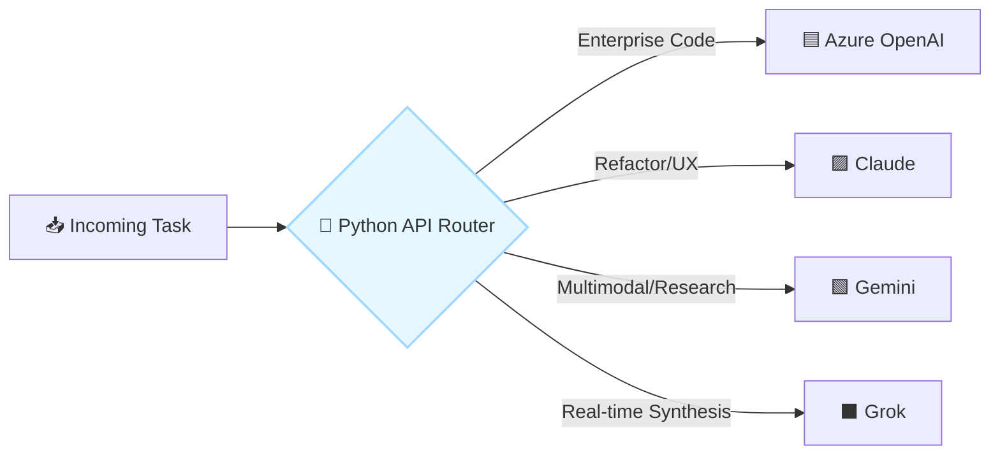

### 📋 Specifications
* **🧠 Core Function:** A Python-based poly-model router that evaluates tasks and dispatches them via API to the most suitable intelligence.
  * **🟦 Azure OpenAI:** Targeted for enterprise-grade code generation and structured JSON extraction.
  * **🟪 Claude:** Utilized for complex refactoring, long-context file analysis, and UI/UX design reasoning.
  * **🟩 Gemini:** Deployed for multimodal tasks, rapid context processing, and broad research operations.
  * **⬛ Grok:** Leveraged for real-time data synthesis and specialized, unconstrained problem-solving.

---

## 🔌 2. Tools & Actions: The Execution Arms
*How the factory interacts with the environment and provisions resources.*

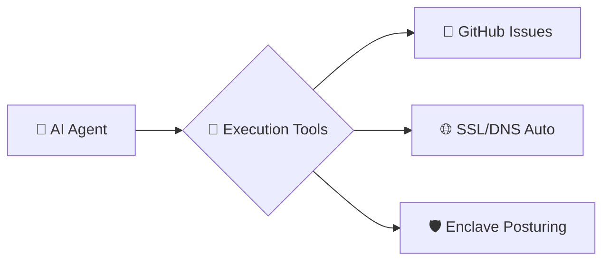

### 📋 Specifications
* **🔌 Core Function:** A minimalist set of robust, highly-permissioned Python/Bash tools allowing the AI to manipulate its environment.
  * **🎫 GitHub Issues:** Acts as the primary task queue and human-AI feedback loop. Agents can read, comment, close, and open issues.
  * **🌐 Infrastructure Automation:** Agent-triggered scripts auto-provision SSL certificates (e.g., Let's Encrypt) and configure DNS/Domain records for new deployments.
  * **🛡️ Internal Enclave Posturing:** Security scripts that configure network rules, firewall states, and container isolation before generated code is allowed to run.

---

## 💾 3. Memory & State: Markdown "App Capsules"
*The persistent state, knowledge graph, and file-based definition of the factory.*

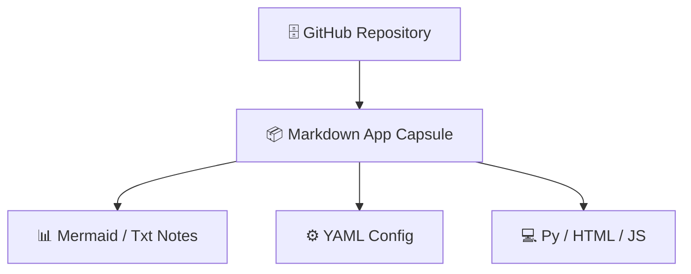

### 📋 Specifications
* **💾 Core Function:** Shunning heavy external databases, state is maintained via the GitHub Repo using encapsulated "Markdown App Capsules" (`app_spec.md`).
  * **🗄️ Immutable Brain:** The repository acts as version-controlled memory; when an agent updates a capsule, it updates the system's state.
  * **📊 Knowledge Graph & Logic:** Defined directly within the capsule using `Mermaid` diagrams and `txt` notes.
  * **⚙️ Configuration:** Stored as embedded `YAML` blocks within the Markdown file.
  * **💻 Code Implementation:** Application logic resides in fenced code blocks of `py` (backend) and `html/js` (frontend).

---

## 🔄 4. Orchestration & Flow: FastAPI & GitActions
*The nervous system that coordinates the asynchronous assembly line.*

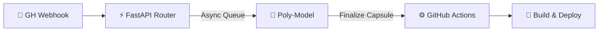

### 📋 Specifications
* **🔄 Core Function:** The hybrid nervous system coordinating webhooks, APIs, and deployment pipelines.
  * **⚡ FastAPI (Central Router):** Receives webhooks from GitHub (e.g., "Issue Created"), manages asynchronous task queues, and communicates with the LLM APIs.
  * **⚙️ GitHub Actions (Pipelines):** Once FastAPI and the agents finalize an App Capsule, Actions takes over to parse the Markdown, extract the Code/YAML, build the environment, run tests, and deploy the asset.

---

## 💬 5. Surface & UI: Streamlit & HTML/JS
*Where human operators command the factory and view its outputs.*

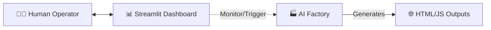

### 📋 Specifications
* **💬 Core Function:** The dual-interface layer separating the complex control room from the lightweight generated products.
  * **📊 Streamlit (Control Room):** A Python-native dashboard for the human operator to monitor FastAPI queues, review API costs, manually trigger pipelines, and visualize Markdown Knowledge Graphs.
  * **🌐 HTML/JS (Generated Outputs):** Factory-built frontend pieces compiled down to pure, lightweight HTML/JS, served via the automated domain for maximum speed and simplicity.

---

## 🛡️ 6. Governance & Control: Enclave & Posturing
*The guardrails ensuring the factory doesn't execute malicious code or leak data.*

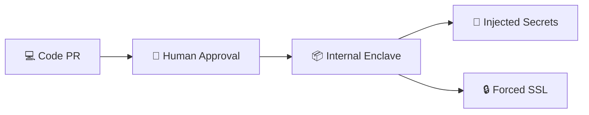

### 📋 Specifications
* **🛡️ Core Function:** Strict operational boundaries, sandboxing, and human oversight protecting the factory.
  * **👀 Human-in-the-Loop (PRs):** Agents cannot merge directly to `main`. They submit Pull Requests against App Capsules, requiring human approval via the Streamlit dashboard or GitHub UI.
  * **📦 Internal Enclave Sandboxing:** Generated code is never run directly on the host; it executes within a hardened, isolated environment.
  * **🔑 Secrets Management:** API keys (Claude, OpenAI, Gemini, Grok) are strictly managed via GitHub Secrets and injected only at runtime via Actions or FastAPI.
  * **🔒 Secure Transport:** Total enforcement of automated SSL (HTTPS) for all exposed endpoints and generated applications.
 

# 🧠 GPT-5.4 Thinking — ChatGPT AI DLC Factory Design 🧠

> AI DLC Agentic Software Factory — GitHub-Ready One-Page Cards

A minimal, open-source, file-driven, GitHub-native agentic software factory.

**Required stack**
- 🐍 Python
- ⚡ FastAPI
- 🖥️ Streamlit
- 🌐 HTML/JS
- 🐙 GitHub Repository
- 🤖 GitHub Actions
- 📝 Markdown files as knowledge graphs and app specs
- 🔌 Multi-model adapters for Azure OpenAI, Claude, Grok, and Gemini
- 🌍 Domain + SSL automation
- 🏰 Internal enclave posture
- 🐙 GitHub Issues as work intake

---

## 0️⃣ 🌌 Whole-Factory View

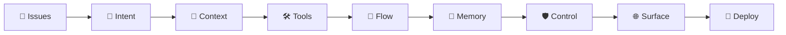

### 🌟 Executive outline
- 🏭 **Factory thesis**
  - GitHub Issues drive the work
  - Markdown files hold specs, memory, and knowledge graphs
  - Python, FastAPI, Streamlit, and HTML/JS implement the system
  - GitHub Actions automates verification and release
  - Multi-model adapters connect to Azure OpenAI, Claude, Grok, and Gemini
  - Enclave controls gate secrets, deployment, domain, and SSL
- 🎯 **Audience fit**
  - business sponsors see a clear lifecycle
  - engineers see explicit files and contracts
  - AI pair programmers see structured steering and stable targets
- 🧩 **Factory pattern**
  - Intent → Context → Tools → Flow → Memory → Control → Surface → Deploy

---

## 1️⃣ 🧭 Intent Card

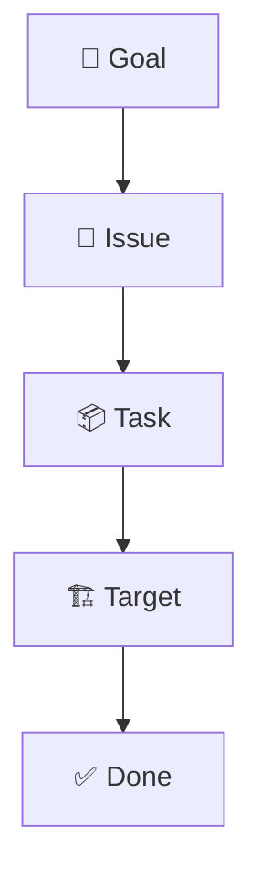

### 🧭 Intent outline
- 🎯 **Mission**
  - turn issues and specs into working apps, APIs, docs, tests, and release artifacts
- 📥 **Inputs**
  - GitHub Issues
  - specs in Markdown
  - app folders
  - knowledge graph files
  - factory configuration
- 📤 **Outputs**
  - Streamlit apps
  - FastAPI services
  - HTML/JS frontends
  - docs, Mermaid diagrams, and test evidence
  - PRs, releases, domain, and SSL updates
- ⚙️ **Autonomy modes**
  - `PLAN_ONLY`
  - `PR_DRAFT`
  - `AUTO_FIX_TESTS`
  - `AUTO_MERGE_SAFE`
  - `ENCLAVE_ONLY`
- 💼 **Sponsor explanation**
  - a request becomes an issue
  - the issue becomes a structured task packet
  - the factory converts that packet into auditable software work

---

## 2️⃣ 🧠 Context Card

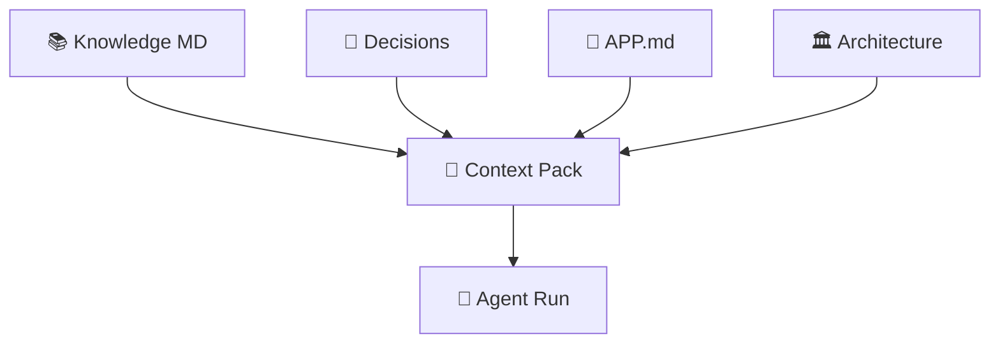

### 🧠 Context outline
- 📚 **Core principle**
  - files are the visible memory of the factory
  - Markdown is both documentation and executable specification
- 🗂️ **Canonical files**
  - `README.md` → project overview
  - `AGENTS.md` → agent behavior rules
  - `ARCHITECTURE.md` → topology
  - `ROADMAP.md` → priority graph
  - `DECISIONS.md` → ADR-style memory
  - `factory.yaml` → runtime wiring
  - `knowledge/**/*.md` → domain graphs
  - `issues/**/*.md` → expanded task packets
  - `apps/**/APP.md` → app-level specs
  - `agents/**/SKILL.md` → skill and tool contracts
  - `enclave/POLICY.md` → security posture
- 📦 **Encapsulated app spec**
  - each app folder may contain:
    - Markdown
    - Mermaid
    - Python
    - HTML
    - JS
    - YAML
    - TXT
- 🤝 **AI pair-programming value**
  - humans and AI read the same files
  - instructions are explicit, versioned, and reviewable
  - context is portable across sponsor and engineering discussions

---

## 3️⃣ 🛠️ Tools Card

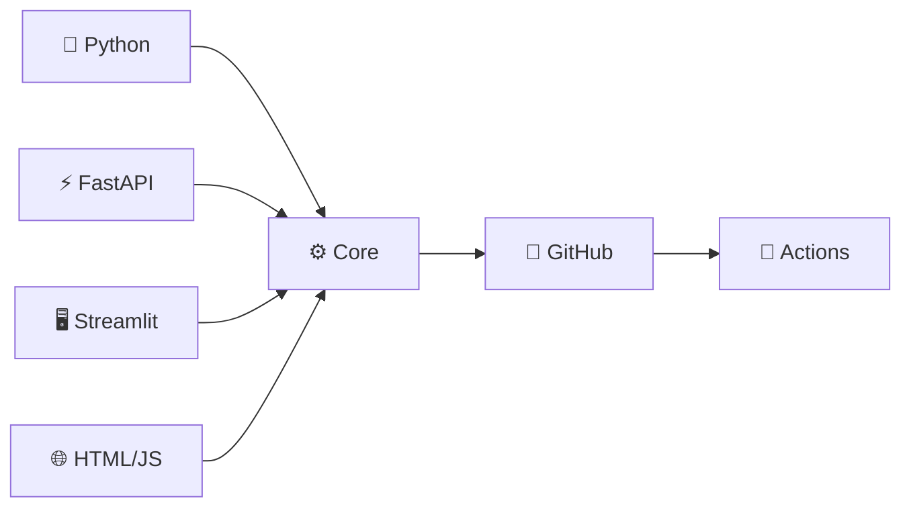

### 🛠️ Tools outline
- 🧱 **Mandatory stack**
  - 🐍 Python as the implementation spine
  - ⚡ FastAPI as orchestration and service API
  - 🖥️ Streamlit as operator cockpit and app shell
  - 🌐 HTML/JS as widget and lightweight frontend layer
  - 🐙 GitHub as source of truth
  - 🤖 GitHub Actions as automation backbone
  - 📝 Markdown as spec and knowledge substrate
- 🪶 **Minimal helper libraries**
  - `pydantic` for schemas
  - `httpx` for provider calls
  - `jinja2` for template generation
  - `pytest` for tests
  - optional browser automation only when needed
- 🔌 **Provider adapters**
  - Azure OpenAI
  - Claude
  - Grok
  - Gemini
- 📏 **Why this stays minimal**
  - one backend language
  - one API framework
  - one operator shell
  - one frontend escape hatch
  - one repo authority
  - one automation engine

---

## 4️⃣ 🔁 Orchestration Card

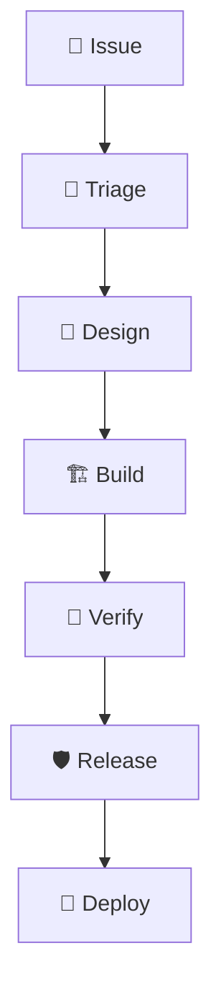

### 🔁 Flow outline
- 🤖 **Minimal agents**
  - 🎯 **Triage Agent**
    - reads issue
    - finds the target app, service, or spec
    - emits a structured task packet
  - 🧠 **Design Agent**
    - updates architecture, app spec, and knowledge files first
    - emits implementation plan
  - 🏗️ **Build Agent**
    - edits Python, HTML, JS, YAML, and Markdown
    - creates or updates tests
  - 🧪 **Verify Agent**
    - runs linting, typing, unit tests, smoke tests, and policy checks
  - 🛡️ **Release Agent**
    - opens PRs
    - comments on issues
    - gates deploys
    - updates release notes
- 📜 **Execution rule**
  - docs first
  - code second
  - deploy third
- 🔄 **Issue loop**
  - issue → task packet → spec update → code update → test → PR → deploy

---

## 5️⃣ 🧲 Memory Card

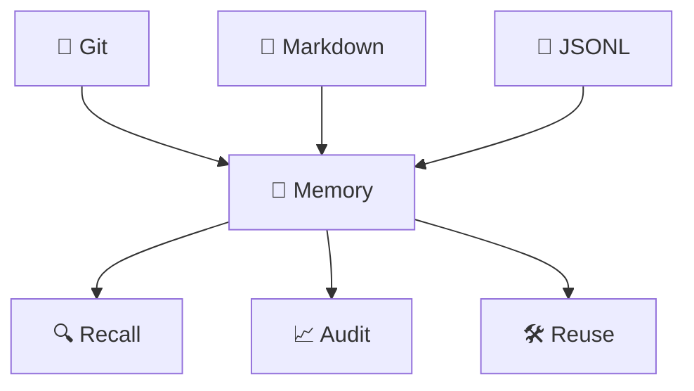

### 🧲 Memory outline
- 🧠 **Memory principle**
  - prefer visible, deterministic memory before hidden services
- 🗃️ **Tier A — Git memory**
  - commit history
  - PR history
  - tags and releases
  - issue discussions
- 📘 **Tier B — Markdown memory**
  - `DECISIONS.md`
  - `CHANGELOG.md`
  - `knowledge/**/*.md`
  - retrospectives
- 📄 **Tier C — lightweight runtime memory**
  - traces in JSONL
  - task packets in JSON
  - run results and metrics
- 🧭 **Tier D — optional later**
  - local embeddings index
  - semantic recall for Markdown and issue links
- 🤝 **AI pair-programming value**
  - humans and AI can inspect the same memory layers
  - prior choices become reusable assets

---

## 6️⃣ 🛡️ Control + Enclave Card

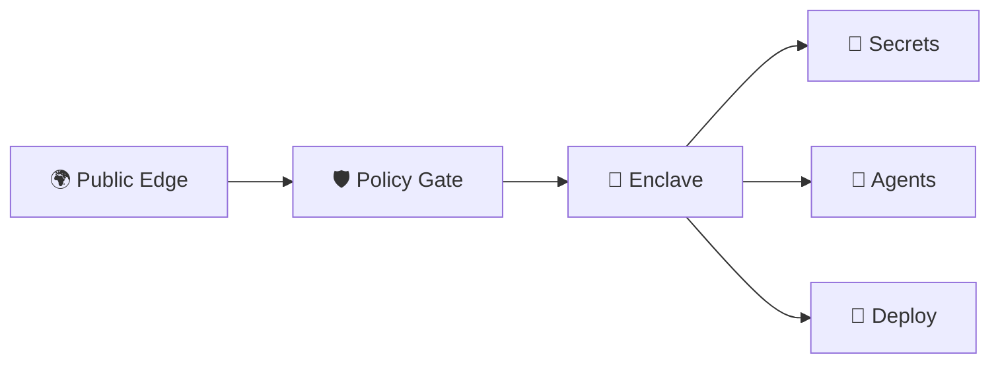

### 🛡️ Control outline
- 🏰 **Two-zone posture**
  - 🌍 **Public edge**
    - domains
    - SSL termination
    - public Streamlit UI
    - public FastAPI routes
    - GitHub webhooks
  - 🏰 **Private enclave**
    - agent runners
    - secrets
    - provider keys
    - deployment credentials
    - internal admin APIs
    - policy engine
    - artifact signing
- 🔒 **Security rules**
  - outbound egress allowlist only
  - no secret exposure to UI
  - minimal GitHub token scopes
  - sanitized issue comments
  - PR requirement for production unless explicitly allowed
  - deploy agents separated from authoring agents
- 🪪 **Approval classes**
  - `read_only`
  - `spec_edit`
  - `code_edit`
  - `issue_comment`
  - `pr_open`
  - `deploy_dev`
  - `deploy_prod`
- 📁 **Policy files**
  - `enclave/POLICY.md`
  - `enclave/egress_allowlist.yaml`
  - `enclave/secrets_contract.md`

---

## 7️⃣ 🌐 Surface Card

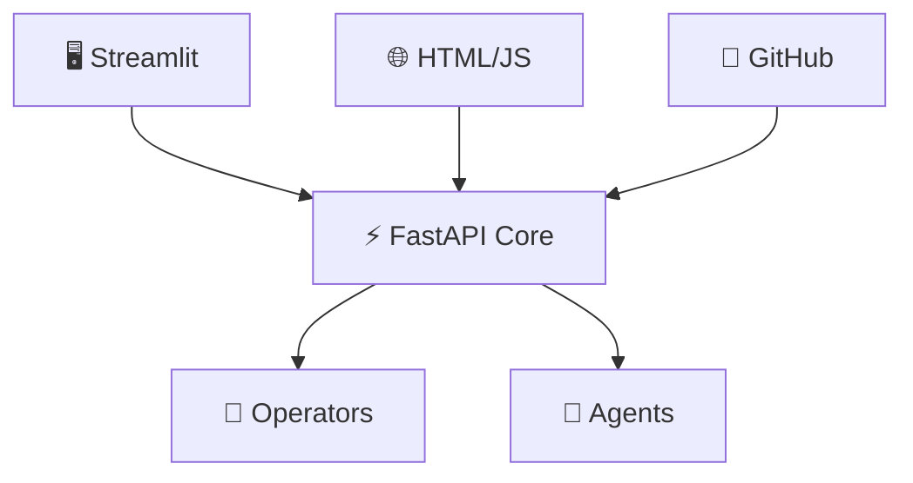

### 🌐 Surface outline
- 🖥️ **Streamlit**
  - issue queue
  - run detail
  - knowledge graph explorer
  - spec editor
  - provider bench
  - domain and SSL page
  - policy and release dashboards
- 🌐 **HTML/JS**
  - embeddable widgets inside Streamlit
  - standalone previews
  - Mermaid viewers and graph explorers
  - lightweight custom interactivity
- ⚡ **FastAPI**
  - stable orchestration and service contract
  - entry point for webhooks, runs, model calls, trace retrieval, and deploy actions
- 🐙 **GitHub**
  - Issues
  - PRs
  - Discussions
  - Actions
  - Releases

---

## 8️⃣ 🐙 GitHub Issues Card

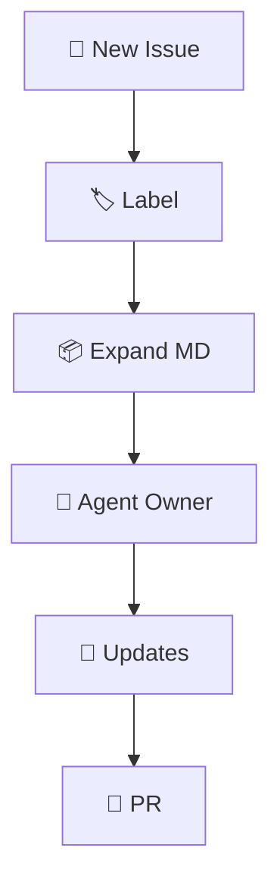

### 🐙 Issues outline
- 📝 **Issue template fields**
  - intent
  - target app or service
  - priority
  - acceptance criteria
  - security class
  - deploy target
  - provider preference
  - expected files to change
- 🏷️ **Issue states**
  - `intake`
  - `triaged`
  - `designing`
  - `building`
  - `verifying`
  - `pr_open`
  - `deployed`
  - `blocked`
- 🤖 **Automations**
  - auto-label by type
  - expand into `issues/expanded/{issue_number}.md`
  - assign owning agent
  - comment the plan back to issue
  - attach test and deploy evidence
  - link the PR

---

## 9️⃣ 🤖 GitHub Actions Card

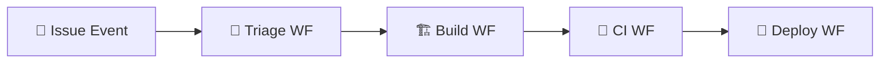

### 🤖 Actions outline
- 🧪 **`ci.yml`**
  - install dependencies
  - lint
  - type check
  - unit tests
  - Markdown and spec validation
- 🎯 **`issue-triage.yml`**
  - trigger on new issue
  - create structured task packet
  - save expanded issue Markdown
  - comment summary back to issue
- 🏗️ **`pr-agent.yml`**
  - run design/build/verify loop
  - open PR with checklist
- 🚀 **`deploy-dev.yml`**
  - build app or container
  - deploy to dev
  - smoke test
  - update issue and PR
- 🔐 **`deploy-prod.yml`**
  - manual approval or gated label
  - deploy production
  - SSL and domain verification
  - health verification

---

## 🔟 🌍 Domain + SSL Card

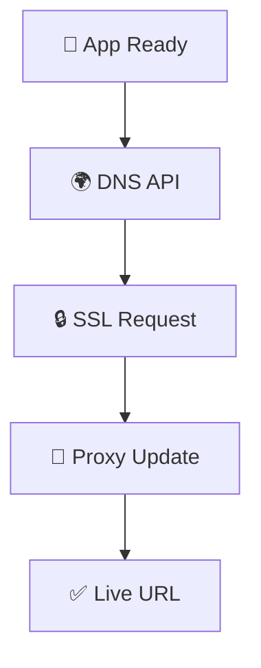

### 🌍 Domain + SSL outline
- 🌐 **Purpose**
  - automate the path from built app to reachable secure URL
- ⚙️ **Automation service responsibilities**
  - create subdomain
  - create or update DNS record
  - update reverse proxy config
  - request and renew certificate
  - write deployment metadata
- 🧰 **Implementation choices**
  - DNS via Cloudflare, Route53, or Azure DNS
  - SSL via Let's Encrypt
  - proxy via Caddy, Traefik, or Nginx
- 📦 **Outputs**
  - deployment metadata files per environment

---

## 1️⃣1️⃣ ⚡ FastAPI Card

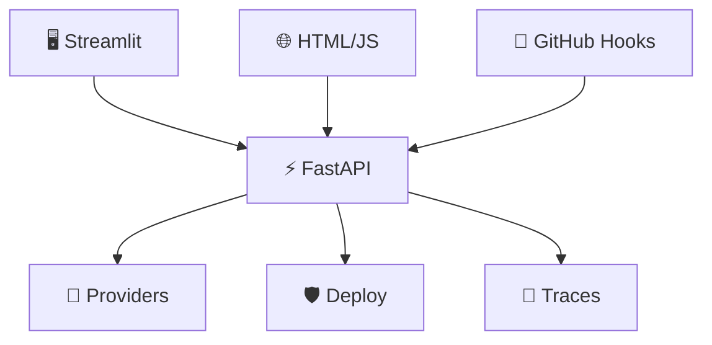

### ⚡ FastAPI outline
- 🎯 **Role**
  - stable contract between UI, automation, providers, and deploy services
- 🛣️ **Core routes**
  - `POST /run/issue/{id}`
  - `POST /run/spec`
  - `POST /models/generate`
  - `POST /deploy/domain`
  - `GET /trace/{run_id}`
  - `GET /health`
  - `POST /github/webhook`
- 🧠 **Why it matters**
  - isolates orchestration from presentation
  - makes testing and scaling easier
  - gives AI pair programmers a durable API surface

---

## 1️⃣2️⃣ 🖥️ Streamlit Cockpit Card

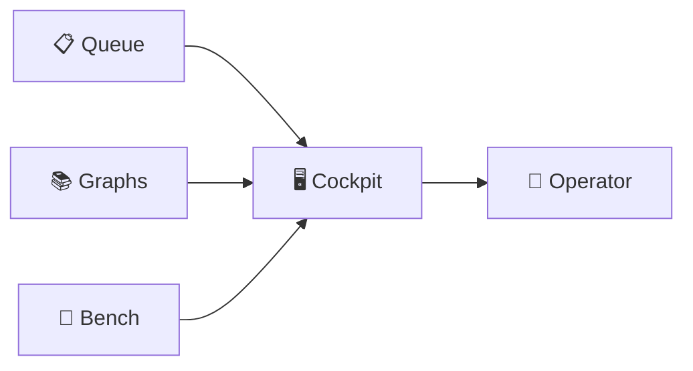

### 🖥️ Streamlit outline
- 🎛️ **Pages**
  - Queue
  - Run Detail
  - Knowledge Graph
  - Spec Editor
  - Provider Bench
  - Domain / SSL
  - Enclave Policy
  - Releases
- 🧩 **Embedded widgets**
  - Mermaid graph viewer
  - diff preview
  - issue graph
  - trace timeline
  - latency and cost charts
- 💼 **Purpose**
  - visible command center for sponsors, operators, and engineers

---

## 1️⃣3️⃣ 📝 Markdown Knowledge Graph Card

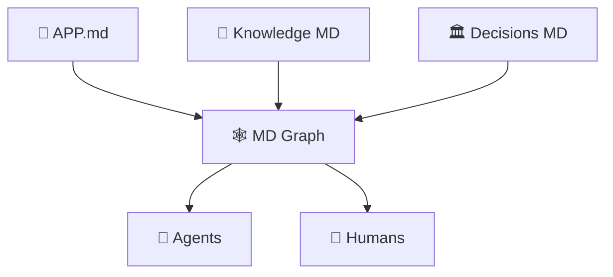

### 📝 Knowledge graph outline
- 🧠 **Pattern**
  - Markdown files link by IDs and references
  - Mermaid, code fences, YAML frontmatter, and notes stay together
- 📦 **Supported assets**
  - Mermaid
  - Python
  - HTML
  - JS
  - YAML
  - TXT
  - issue references
  - ADR references
- 📏 **Rule for each generated app**
  - one `APP.md`
  - one Mermaid topology
  - one acceptance section
  - one dependency map
  - one deployment note

---

## 1️⃣4️⃣ 🔌 Multi-Model Adapter Card

```mermaid
flowchart LR
    A[🧠 Prompt] --> B[🔌 Router]
    B --> C[🟦 Azure]
    B --> D[🟣 Claude]
    B --> E[⚫ Grok]
    B --> F[🟢 Gemini]
    C --> G[📄 Unified Reply]
    D --> G
    E --> G
    F --> G
```

### 🔌 Adapter outline
- 🎯 **Goal**
  - connect to Azure OpenAI, Claude, Grok, and Gemini through one common contract
- 📦 **Shared contract**
  - same request envelope
  - same response envelope
  - same trace structure
  - same retry behavior
  - same redaction rules
  - same cost and latency metrics
- 🧠 **Engineering value**
  - provider swap without architecture rewrite
  - provider benchmarking for quality, speed, and cost
  - business workflows stay stable while models evolve

---

## 1️⃣5️⃣ 🗂️ Repository Layout Card

```mermaid
flowchart TD
    A[🐙 Repo] --> B[📱 apps]
    A --> C[⚡ services]
    A --> D[🔌 providers]
    A --> E[🤖 agents]
    A --> F[📚 knowledge]
    A --> G[🏰 enclave]
    A --> H[🤖 .github]
```

### 🗂️ Layout outline
- 🐙 **Root structure**
  - `.github/` for workflows
  - `apps/` for Streamlit and UI deliverables
  - `services/` for FastAPI and ops services
  - `providers/` for model adapters
  - `agents/` for skill contracts
  - `knowledge/` for Markdown graph content
  - `issues/` for expanded work packets
  - `enclave/` for policy and network posture
  - `data/` for traces and runs
  - `tests/` for verification
  - root docs and factory config
- 🧠 **Design principle**
  - folder structure mirrors the mental model of the factory

---

## 1️⃣6️⃣ 🧩 Comparative Positioning Card

```mermaid
flowchart LR
    A[🟣 Anthropic\nPatterns] --> E[🏭 Factory]
    B[🟢 OpenAI\nOrchestration] --> E
    C[🟠 OpenClaw\nLocal Control] --> E
    D[🐙 GitHub\nWorkflow] --> E
```

### 🧩 Comparative outline
- 🟣 **Anthropic-style influence**
  - explicit workflows
  - tool discipline
  - steering files
  - safety and evaluation emphasis
- 🟢 **OpenAI-style influence**
  - orchestration contracts
  - auditable actions
  - hosted-style task abstraction
  - multi-step lifecycle thinking
- 🟠 **OpenClaw-style influence**
  - self-hosted control
  - Markdown-native runtime memory
  - local extensibility and agent autonomy
- 🐙 **GitHub-native influence**
  - issues as work units
  - PRs as review surfaces
  - Actions as automation backbone

---

## 1️⃣7️⃣ 🚀 Minimal Runtime Card

```mermaid
flowchart TD
    A[📝 Issue] --> B[📦 Expand]
    B --> C[📝 Update Spec]
    C --> D[🏗️ Edit Code]
    D --> E[🧪 Verify]
    E --> F[🔀 PR]
    F --> G[🌍 SSL + Domain]
    G --> H[✅ Live]
```

### 🚀 Runtime outline
- 📝 request starts as an issue
- 📦 issue becomes expanded Markdown task packet
- 📝 specs are updated first
- 🏗️ code and tests are updated second
- 🧪 verification runs before release
- 🔀 PR is the review and approval boundary
- 🌍 domain and SSL automation completes delivery
- ✅ deployment artifacts and traces close the loop

---

## 1️⃣8️⃣ 📜 Sponsor Script Card

```mermaid
flowchart LR
    A[💼 Ask] --> B[📝 Issue]
    B --> C[🤖 Factory]
    C --> D[🔍 Review]
    D --> E[🚀 Secure Release]
```

### 📜 Sponsor talk-track
- 💼 a sponsor asks for a capability
- 📝 the request becomes a GitHub Issue with acceptance criteria
- 🤖 the factory turns it into specs, code, tests, and release artifacts
- 🔍 humans review the PR and evidence trail
- 🚀 approved work deploys through secure domain and SSL automation
- 🧾 the process stays visible, reusable, and auditable

---

## 1️⃣9️⃣ 👩‍💻 Engineer Script Card

```mermaid
flowchart LR
    A[📚 Specs] --> B[🤖 Agents]
    B --> C[🐍 Code]
    C --> D[🧪 Tests]
    D --> E[🐙 PR]
    E --> F[🚀 Deploy]
```

### 👩‍💻 Engineer talk-track
- 📚 specs live in Markdown, Mermaid, YAML, and app folders
- 🤖 agents read the same files humans maintain
- 🐍 Python, FastAPI, Streamlit, and HTML/JS are the minimal implementation stack
- 🧪 GitHub Actions verifies quality and policy
- 🐙 PRs preserve review discipline
- 🚀 deploy services handle URL, SSL, and environment gating

---

## 2️⃣0️⃣ 🧾 Final Thesis Card

```mermaid
flowchart LR
    A[📝 Issues] --> B[🧠 Specs]
    B --> C[🤖 Agents]
    C --> D[🐍 Apps + APIs]
    D --> E[🛡️ Enclave]
    E --> F[🌍 Live Systems]
```

### 🧾 Final thesis outline
- 🏭 **AI DLC Agentic Software Factory** is:
  - issue-driven
  - Markdown-native
  - Python-centered
  - FastAPI-backed
  - Streamlit-operated
  - HTML/JS-extendable
  - GitHub-automated
  - multi-model
  - enclave-gated
- 🎯 **One-line thesis**
  - GitHub Issues + Markdown Specs + FastAPI Core + Streamlit Cockpit + HTML/JS Widgets + Multi-Model Adapters + GitHub Actions + Enclave-Gated Delivery

---

## 🗃️ Minimal Repository Layout

```text
ai-dlc-factory/
├─ .github/
│  ├─ workflows/
│  │  ├─ ci.yml
│  │  ├─ issue-triage.yml
│  │  ├─ pr-agent.yml
│  │  ├─ deploy-dev.yml
│  │  └─ deploy-prod.yml
│  ├─ ISSUE_TEMPLATE/
│  └─ PULL_REQUEST_TEMPLATE.md
├─ apps/
│  ├─ cockpit/
│  │  ├─ APP.md
│  │  ├─ app.py
│  │  ├─ widgets/
│  │  │  ├─ graph.html
│  │  │  └─ graph.js
│  └─ demo_app/
│     ├─ APP.md
│     ├─ app.py
│     └─ ui/
├─ services/
│  ├─ router_api/
│  │  ├─ main.py
│  │  ├─ routes/
│  │  └─ schemas.py
│  ├─ domain_ssl/
│  │  ├─ main.py
│  │  └─ providers/
│  └─ github_ops/
│     ├─ main.py
│     └─ issues.py
├─ providers/
│  ├─ azure_openai.py
│  ├─ claude.py
│  ├─ grok.py
│  ├─ gemini.py
│  └─ base.py
├─ agents/
│  ├─ triage/
│  │  └─ SKILL.md
│  ├─ design/
│  │  └─ SKILL.md
│  ├─ build/
│  │  └─ SKILL.md
│  ├─ verify/
│  │  └─ SKILL.md
│  └─ release/
│     └─ SKILL.md
├─ knowledge/
│  ├─ domains/
│  ├─ graphs/
│  ├─ patterns/
│  └─ providers/
├─ issues/
│  └─ expanded/
├─ enclave/
│  ├─ POLICY.md
│  ├─ egress_allowlist.yaml
│  └─ network.md
├─ data/
│  ├─ traces/
│  ├─ runs/
│  └─ tasks/
├─ tests/
├─ factory.yaml
├─ AGENTS.md
├─ ARCHITECTURE.md
├─ DECISIONS.md
├─ ROADMAP.md
├─ README.md
└─ pyproject.toml
```

---

## ⚙️ Minimal `factory.yaml`

```yaml
factory:
  name: ai-dlc-factory
  mode: issue_driven
  default_provider: azure_openai

  providers:
    azure_openai:
      enabled: true
    claude:
      enabled: true
    grok:
      enabled: true
    gemini:
      enabled: true

  surfaces:
    streamlit: true
    fastapi: true
    html_js: true
    github: true

  safety:
    require_pr_for_prod: true
    redact_secrets: true
    egress_allowlist: enclave/egress_allowlist.yaml

  memory:
    decisions: DECISIONS.md
    traces: data/traces
    issues: issues/expanded

  deployment:
    domain_service: services/domain_ssl/main.py
    ssl: lets_encrypt
    environment:
      dev: enabled
      prod: gated
```

---

## 📐 Example `APP.md`

```md
---
id: customer-navigator
kind: streamlit_app
entrypoint: app.py
api: ../../services/router_api/main.py
models:
  - azure_openai
  - claude
  - grok
  - gemini
permissions:
  fs: scoped
  network: whitelisted
  github: issues,prs,contents
outputs:
  - ui
  - tests
  - docs
  - issue_updates
---

# Purpose
Customer or patient navigation workflow with embedded agent assists.

## UI
- Streamlit shell
- embedded HTML/JS widgets
- Mermaid diagrams for reasoning traces

## Behaviors
- read issue context
- load knowledge Markdown
- select provider adapter
- call API
- summarize result
- persist trace

## Acceptance
- app runs locally
- app runs in container
- tests pass
- issue updated automatically
```

---

## 🔌 Example Provider Contract

```python
class ModelAdapter:
    def generate(
        self,
        prompt: str,
        system: str | None = None,
        tools: list | None = None
    ) -> dict:
        ...
```

### Shared adapter rules
- same request envelope
- same response envelope
- same trace format
- same retry policy
- same redaction rules
- same cost and latency metrics

---

## ✅ Copy/Paste Notes
- Paste this entire file into `ARCHITECTURE.md` or `README.md`
- Keep Mermaid fences exactly as ` ```mermaid `
- GitHub renders Mermaid from fenced blocks
- Keep node labels short for cleaner rendering
- If one section gets too dense, split that section into its own `.md` file


# 🤖✨ Claude Opus 4.6 — Anthropic ✨🤖

# 🏗️ Agentic AI Architectures — The 6-Part Pattern

> **Four companies, six shared pillars.** A generalized framework for understanding modern agentic AI systems — with DLC Factory synthesis.
>
> 🟣 **Anthropic** · 🟢 **OpenAI** · 🔵 **SmartDM** · 🟠 **OpenClaw** · 🔴 **DLC Factory**

---

## ⚡ The Shared Pattern

```mermaid
flowchart LR
  R["🧠 Reasoning"] --> T["🔌 Tools"]
  T --> M["💾 Memory"]
  M --> O["🔄 Orchestration"]
  O --> I["💬 Interface"]
  I --> G["🛡️ Governance"]
  G -.->|feedback| R
```

| Pillar | Anthropic | OpenAI | SmartDM | OpenClaw | DLC Factory |
|--------|-----------|--------|---------|----------|-------------|
| 🧠 Reasoning | Tight model-product | RL-specialized Codex | Intent multi-bot | Model-agnostic | Multi-model router |
| 🔌 Tools | Terminal + MCP | Sandbox + CLI + App | Social ecosystem | Gateway + chat | FastAPI + HTML/JS |
| 💾 Memory | Massive context | Stateless + RAG | Custom CRM KB | Persistent local | Markdown KG files |
| 🔄 Orchestration | Subagents + SDK | Worktrees + Skills | Triggers + branches | Skill composition | GitHub Actions CI |
| 💬 Interface | Async IDE/chat | Canvas + SDK | Unified inbox | Conversational OS | Streamlit + HTML |
| 🛡️ Governance | Hooks + evals | Sandbox + audit | Brand protection | Community vetting | Issues + enclave |

### One-Line Characterizations

- 🟣 **Anthropic** → *"The model IS the agent"* — deep vertical integration, universal reasoning
- 🟢 **OpenAI** → *"The platform IS the agent"* — cloud-first, multi-surface orchestration
- 🔵 **SmartDM** → *"The business IS the agent"* — vertical automation for customer operations
- 🟠 **OpenClaw** → *"The user IS the agent"* — open-source, maximum autonomy, model-agnostic

---

## 🧠 Part 1 — Core Reasoning Engine

> *The LLM backbone for perception, reasoning, generation, and decision-making.*

```mermaid
flowchart TD
  Q["❓ Task Input"] --> ROUTER["🔀 Model Router"]
  ROUTER --> A1["🟣 Claude — Universal Agent"]
  ROUTER --> A2["🟢 GPT-Codex — RL-Specialized"]
  ROUTER --> A3["🔵 Intent Bot — Sales + Support"]
  ROUTER --> A4["🟠 Any LLM — Model-Agnostic"]
  A1 --> PLAN["📋 Plan + Reason"]
  A2 --> PLAN
  A3 --> PLAN
  A4 --> PLAN
  PLAN --> ACT["⚡ Execute"]
```

### 🟣 Anthropic — Universal Agent (Claude)

- Claude Opus/Sonnet — model IS the product, tightly coupled
- Extended thinking with interleaved reasoning
- Low hallucination, dynamic tool learning
- Handles diverse domains without narrow specialization
- Advanced code generation and logical deduction as primary capabilities

### 🟢 OpenAI — Multi-Agent Orchestration

- GPT-5.x-Codex family with RL fine-tuning on real-world coding tasks
- Dynamic reasoning effort — scales thinking time to task complexity
- Triage agent routes and delegates to specialized sub-agents
- Strong function-calling heritage
- Agents defined through platform stack of models + tools + logic

### 🔵 SmartDM — Intent-Based Multi-Bot

- Specialized for sales and support personas
- Autonomously decides: reply, route to human, or stay silent
- RAG-grounded for brand-aligned, contextually accurate responses
- Conversational context drives all cognitive decisions
- Business-task-first — more vertical than general-purpose

### 🟠 OpenClaw — Autonomous Plan-and-Execute Loop

- Model-agnostic — Claude, GPT, Gemini, DeepSeek via proxy
- Cognitive harness, not a model — orchestration IS the product
- Breaks high-level goals into atomic tasks for background execution
- Reasoning layer fully swappable
- Developer- and power-user-oriented control model

### 🔴 DLC Factory — Multi-Model Router

- **FastAPI** endpoint routes each agent to optimal model per task
- Markdown spec files define model routing rules
- Supports **Azure OpenAI**, **Claude API**, **Grok API**, **Gemini API** as swappable backends
- Cross-model synthesis for consensus outputs
- `Tools:` `FastAPI` · `Python` · `Azure OpenAI` · `Claude API` · `Grok API` · `Gemini API`

---

## 🔌 Part 2 — Tool Integration & Action

> *How the agent reaches out and manipulates the digital world beyond text generation.*

```mermaid
flowchart LR
  AGENT["🧠 Agent"] --> FS["📁 Filesystem"]
  AGENT --> TERM["💻 Terminal"]
  AGENT --> API["🌐 APIs + MCP"]
  AGENT --> GUI["🖥️ GUI + Browser"]
  AGENT --> SOCIAL["📱 Social + Chat"]
  FS --> OUT["⚡ Action Output"]
  TERM --> OUT
  API --> OUT
  GUI --> OUT
  SOCIAL --> OUT
```

### 🟣 Anthropic — Computer Use (Native GUI/Terminal)

- Terminal-native: bash, filesystem read/write, git operations
- Pioneers visual screen perception — cursor, click, type
- MCP open standard for secure, scalable tool integration
- VS Code / JetBrains IDE extensions
- Unix-philosophy composability — pipe logs in, chain with CLI tools

### 🟢 OpenAI — Structured APIs & Cloud Sandbox

- Cloud sandbox containers with internet disabled during execution
- GitHub-first workflow with Codex App as desktop command center
- Native function-calling, web search, code interpreter
- IDE extensions for VS Code, Cursor, Windsurf
- Skills system extending agent capabilities beyond code

### 🔵 SmartDM — Social Ecosystem Automation

- Wired into WhatsApp, Instagram, TikTok messaging platforms
- Auto-reply, CRM database sync, comment moderation in real time
- Specialized webhooks for messaging platform actions
- Real-time escalation and follow-up triggers
- Chrome extension injecting agentic capabilities into web apps

### 🟠 OpenClaw — Extensible Skills Directory

- Local Gateway brokering between chat interfaces, AI, and skills
- Shell commands, browser automation, file I/O, hardware control
- Calendar, email, API access — agent can write its own scripts
- `SKILL.md` config per extension — community-contributed ecosystem
- 800+ extensions available, user-installable globally or per-workspace

### 🔴 DLC Factory — FastAPI + HTML/JS + GitHub Actions

- **FastAPI** serves agent tools as REST endpoints
- **HTML/JS** artifacts render client-side previews (no server needed)
- **Python** scripts execute document processing and transforms
- **GitHub Actions** automate CI/CD pipelines and deployments
- **SSL/Domain automation** for secure deployment
- **Internal enclave posturing** for sandboxed execution
- `Tools:` `FastAPI` · `HTML/JS` · `Python` · `GitHub Actions` · `SSL Auto` · `Enclave`

---

## 💾 Part 3 — Memory & State Persistence

> *Retaining context, decisions, and learned preferences across sessions and tasks.*

```mermaid
flowchart TD
  SESSION["💬 Current Session"] --> SHORT["⚡ Short-Term Context"]
  SHORT --> DECIDE{"Persist?"}
  DECIDE -->|yes| LONG["🗄️ Long-Term — RAG / Files / DB"]
  DECIDE -->|no| DISCARD["🗑️ Discard"]
  LONG --> RETRIEVE["🔍 Retrieve"]
  RETRIEVE --> SHORT
  LONG --> SPEC["📋 Spec Files — Markdown KG"]
  SPEC --> SHORT
```

### 🟣 Anthropic — Massive In-Flight Context

- Enormous context windows pass full system state and visual feedback continuously
- Checkpoints save code state before each change — instant rewind
- `CLAUDE.md` files encode architectural decisions (project → user → session hierarchy)
- Rigorous evaluation of intermediate results
- Conversation history portable across terminal/IDE/desktop/browser

### 🟢 OpenAI — Stateless + External RAG

- Minimalist default — avoids complex internal state for speed
- Conversation state API for durable threads and replayable state
- Native context compaction in GPT-5.2+ (7+ hour sessions observed)
- External vector stores and file retrieval for memory when needed
- Session history syncs across CLI, IDE extension, Codex App, and cloud

### 🔵 SmartDM — Custom CRM Knowledge Base

- Structured around uploaded business data: PDFs, URLs, text
- Semantic RAG retrieval per customer conversation
- Unified inbox stores full interaction history
- Responses consistently grounded in company-specific facts
- Memory applied inside customer messaging flows

### 🟠 OpenClaw — Persistent 24/7 Local State

- Continuous local memory across sessions and different chat interfaces
- Adapts to individual user patterns over time
- Stores credentials, context, preferences persistently
- Explicitly stateful by design — acts as second brain
- Remembers conversations indefinitely on user hardware

### 🔴 DLC Factory — Markdown Knowledge Graphs

- **Markdown files ARE the knowledge graph** — each agent owns a spec file
- Encapsulated files contain: Mermaid, MD, Python, HTML, JS, YAML, TXT
- Core loop: **Spec + Context → New Spec** (instructions for next agent OR final product)
- **GitHub repository** provides version-controlled long-term memory
- **GitHub Issues** track decisions, state transitions, and handoff metadata
- `Tools:` `Markdown KG` · `Mermaid` · `YAML` · `GitHub Repo` · `GitHub Issues`

---

## 🔄 Part 4 — Multi-Agent Orchestration

> *Spawning, coordinating, and managing parallel sub-agents for complex tasks.*

```mermaid
flowchart TD
  ORCH["🎯 Orchestrator"] --> A1["🏢 Organization"]
  ORCH --> A2["📊 Market"]
  ORCH --> A3["👁️ Vision"]
  A1 -->|spec| A2
  A2 -->|context| A3
  A3 --> A4["📝 Summary"]
  A4 --> A5["📦 Publication"]
  A5 --> A6["📈 Performance"]
  A6 -.->|feedback loop| ORCH
```

### 🟣 Anthropic — Subagents + Agent SDK

- Parallel development: backend API + frontend simultaneously
- Claude Agent SDK for building custom multi-agent architectures
- Multi-agent Code Review dispatching parallel reviewers per PR
- Hierarchical team patterns with orchestrator-worker models
- Reusable patterns: routing, chaining, evaluator loops — clearest pattern language

### 🟢 OpenAI — Worktrees + Skills + Autofix

- Parallel cloud tasks with isolated worktrees per agent
- Agents SDK + AgentKit for custom orchestration
- Codex Autofix in CI for automated pipelines
- Native agent-to-agent handoffs evolved from Swarm architecture
- Visual drag-and-drop Agent Builder for non-technical users

### 🔵 SmartDM — Business Automation Graph

- Triggers, branches, delays, follow-ups, operational sequences
- Multi-bot personalities: sales vs support personas
- Seamless human-handover orchestration
- Confidence-scored response loops with rule-based + AI decisioning
- Scheduled campaigns and follow-up sequences — more automation graph than reasoning loop

### 🟠 OpenClaw — Skill Composition + Autonomy

- Skills invoke other skills — recursive composition
- Autonomous task decomposition across connected services
- Concurrent instances with shared-memory agent "armies"
- Proactive autonomous loops via heartbeats/cron
- Self-directed skill creation, task planning, and error recovery

### 🔴 DLC Factory — GitHub Actions as Orchestrator

- **GitHub Actions** workflows trigger agent chains on schedule (0600/1200/1800/2400) or on push/PR
- Each agent is a **Python** process with a **FastAPI** endpoint
- Spec chain: Organization → Market → Vision → Summary → Publication → Performance → feedback loop
- **GitHub Issues** track handoffs, failures, and inter-agent state
- 25%/50%/75%/100% daily evaluation cycles with cumulative XLSX normalization
- `Tools:` `GitHub Actions` · `FastAPI` · `Python` · `GitHub Issues` · `YAML`

---

## 💬 Part 5 — User Interface & Interaction

> *Where humans meet the system: UI, channels, dashboards, APIs, and runtime surfaces.*

```mermaid
flowchart LR
  HUMAN["👤 Human"] --> UI1["🖥️ Dashboard"]
  HUMAN --> UI2["💻 IDE"]
  HUMAN --> UI3["📱 Chat"]
  HUMAN --> UI4["🌐 Web Preview"]
  UI1 --> AGENT["🤖 Agent Core"]
  UI2 --> AGENT
  UI3 --> AGENT
  UI4 --> AGENT
```

### 🟣 Anthropic — Asynchronous Partnerships

- Native IDE integration: VS Code, JetBrains extensions
- Claude Code Channels via Discord, Telegram — agent pings when done
- Agent works in background, surfaces results asynchronously
- More architectural playbook than single opinionated app surface
- Developer-built surfaces around models and patterns

### 🟢 OpenAI — Dual-Pathway (Canvas + SDK)

- Visual drag-and-drop canvas for non-technical users to build workflows
- Code-first SDK for engineers with deep programmatic control
- Codex App as desktop command center with worktrees
- Managed hosted environment across APIs, SDKs, and dashboards
- Most integrated product environment of the four

### 🔵 SmartDM — Unified Inbox Dashboard

- Chrome extension + cloud workspace — injects into web apps
- Centralized dashboard: analytics, sentiment, AI moderation coverage
- Invisible to end-consumer, visible to business operator
- WhatsApp Web as primary channel surface
- Very channel-native and operator-friendly

### 🟠 OpenClaw — The Conversational OS

- Chat apps (WhatsApp, Signal, Telegram, Discord, iMessage) as universal command line
- Self-hosted gateway + dashboard + connected messaging channels
- Text the agent like a coworker — it manages your digital life
- Agents live across real delivery surfaces
- Strong fit for users who want ownership of runtime and deployment

### 🔴 DLC Factory — Three Surfaces Per Agent

- **Streamlit** for human operator dashboards — each agent gets a UI page
- **HTML/JS** artifacts for canvas-preview outputs (self-contained, no server needed)
- **FastAPI** provides machine-to-machine API surface
- **GitHub** web UI for specs, issues, PRs as the collaboration layer
- Two audiences: business sponsors see Streamlit dashboards; engineers see markdown + code
- `Tools:` `Streamlit` · `HTML/JS` · `FastAPI` · `GitHub UI`

---

## 🛡️ Part 6 — Governance, Security & Evaluation

> *Guardrails, audit trails, sandboxing, and human-in-the-loop controls.*

```mermaid
flowchart TD
  ACTION["⚡ Agent Action"] --> SANDBOX["🔒 Sandbox Isolation"]
  SANDBOX --> EVAL["📊 Eval + Score"]
  EVAL --> AUDIT["📜 Audit Trail"]
  AUDIT --> HUMAN{"👤 Human Approval?"}
  HUMAN -->|approved| DEPLOY["🚀 Deploy"]
  HUMAN -->|rejected| REVISE["🔁 Revise"]
  REVISE --> ACTION
```

### 🟣 Anthropic — Empirical Guardrails & Evals

- Hooks: pre-commit, post-change triggers
- Configurable tool access permissions framework
- Multi-agent Code Review catching logic errors across codebases
- Code Security scanning entire repositories
- Enterprise admin controls with monthly cost caps
- Tests rigorously against both over-triggering and under-triggering

### 🟢 OpenAI — Sandboxed + Auditable

- Isolated cloud containers with internet disabled during task execution
- Configurable approval modes: suggest / auto-edit / full-auto
- `AGENTS.md`-scoped permissions per project
- Citations + terminal logs for full auditability
- Governance policies deployed as versioned, installable packages
- Tracing, monitoring, and evaluation tooling built into platform

### 🔵 SmartDM — Brand Protection Rules

- Smart filters and keyword detection for content moderation
- Auto-hide spam, scams, harmful content before reaching audience
- Safety modes: AUTO / SAFE / OFF
- Message handling discipline for customer communications
- Privacy-oriented operational guardrails focused on reputation

### 🟠 OpenClaw — Community Vetting + Local Sandbox

- ⚠️ Broad permissions by design — agent IS a privileged identity
- Access to email, calendar, messaging, filesystem, and credentials
- Security is user-configured, NOT platform-enforced
- 800+ malicious submissions identified in skill marketplace
- Runtime policies, tool restrictions, session controls available
- Susceptible to prompt injection via unvetted skills — governance falls on user

### 🔴 DLC Factory — Issues + Enclave + PR Gates

- **GitHub Issues** as audit trail — every agent decision logged as issue comment
- **GitHub Actions** enforce CI gates: tests, linting, security scans
- **Internal enclave posturing** — sandboxed execution with network isolation
- **SSL/Domain automation** for secure deployment
- **Markdown spec files** define permission boundaries per agent
- Human approval via PR review gates — no agent deploys without sign-off
- `Tools:` `GitHub Issues` · `GitHub Actions` · `Internal Enclave` · `SSL Auto` · `Domain Auto` · `Markdown Specs`

---

## 🏭 DLC Agentic Software Factory — Full Architecture

> *Open-source, spec-driven, multi-model, fully automatable — minimal tools, maximum leverage.*

```mermaid
flowchart TD
  subgraph INTERFACE["💬 Interface Layer"]
    ST["🖥️ Streamlit"]
    HTML["🌐 HTML/JS"]
    FAPI["⚡ FastAPI"]
  end

  subgraph ORCHESTRATION["🔄 Orchestration"]
    GA["🔁 GitHub Actions"]
    GI["📋 GitHub Issues"]
  end

  subgraph AGENTS["🧠 Six-Agent Pipeline"]
    A1["🏢 Organization"]
    A2["📊 Market"]
    A3["👁️ Vision"]
    A4["📝 Summary"]
    A5["📦 Publication"]
    A6["📈 Performance"]
  end

  subgraph MEMORY["💾 Memory"]
    MD["📄 Markdown KG"]
    GH["🗄️ GitHub Repo"]
  end

  subgraph REASONING["🧠 Multi-Model Router"]
    CLAUDE["🟣 Claude API"]
    GPT["🟢 Azure OpenAI"]
    GROK["🔴 Grok API"]
    GEM["🔵 Gemini API"]
  end

  subgraph GOVERNANCE["🛡️ Governance"]
    ENC["🔒 Internal Enclave"]
    SSL["🔐 SSL + Domain Auto"]
  end

  ST --> GA
  HTML --> GA
  FAPI --> GA
  GA --> A1
  A1 -->|spec| A2
  A2 -->|context| A3
  A3 --> A4
  A4 --> A5
  A5 --> A6
  A6 -.->|feedback| GI
  GI -.-> A1
  A1 <--> MD
  A3 <--> MD
  A4 <--> MD
  MD <--> GH
  A1 <--> CLAUDE
  A2 <--> GPT
  A3 <--> GEM
  A4 <--> GROK
  GA --> ENC
  ENC --> SSL
```

### Core Design Principles

1. **📄 File-Based Specification** — Markdown files ARE the knowledge graph. Each can contain Mermaid, Python, HTML, JS, YAML, TXT. Spec + Context → New Spec is the universal transform.
2. **🔧 Minimal Tool Stack** — Only: Streamlit, FastAPI, Python, HTML/JS, GitHub (Repo + Actions + Issues), Markdown. No heavy frameworks, no vendor lock-in.
3. **🔀 Multi-Model by Default** — Azure OpenAI, Claude, Grok, Gemini all accessible via API. Each agent picks the best model for its task. Cross-model consensus for critical outputs.
4. **🖥️ Three Surfaces Per Agent** — Streamlit (human UI), FastAPI (machine API), HTML/JS (canvas artifact). Business sponsors see dashboards; engineers see specs and code.
5. **🐙 GitHub as Operating System** — Repo = memory. Actions = orchestration. Issues = audit trail + state machine. PRs = human approval gates. Pages = deployment.
6. **🔒 Enclave Security** — Sandboxed execution, SSL/domain automation, network isolation. Agents cannot escape permission boundaries defined in markdown specs.

### Complete Tool Manifest

`Streamlit` · `FastAPI` · `Python` · `HTML/JS` · `GitHub Repository` · `GitHub Actions` · `GitHub Issues` · `GitHub Pages` · `Markdown` · `Mermaid` · `YAML` · `TXT` · `Azure OpenAI API` · `Claude API` · `Grok API` · `Gemini API` · `SSL Automation` · `Domain Automation` · `Internal Enclave`

---

> *Last updated: April 15, 2026*


```markdown
🤖✨ Grok 4 — xAI ✨🤖
🏗️ Agentic AI Architectures — The 6-Part Pattern
Four companies, six shared pillars. A generalized framework for understanding modern agentic AI systems — with DLC Factory synthesis.
🟣 Anthropic · 🟢 OpenAI · 🔵 SmartDM · 🟠 OpenClaw · 🔴 DLC Factory

⚡ The Shared Pattern

```mermaid
flowchart LR
  R["🧠 Reasoning"] --> T["🔌 Tools"]
  T --> M["💾 Memory"]
  M --> O["🔄 Orchestration"]
  O --> I["💬 Interface"]
  I --> G["🛡️ Governance"]
  G -.->|feedback| R
```

| Pillar          | Anthropic              | OpenAI                  | SmartDM                | OpenClaw                | DLC Factory              |
|-----------------|------------------------|-------------------------|------------------------|-------------------------|--------------------------|
| 🧠 Reasoning    | Tight model-product    | RL-specialized Codex    | Intent multi-bot       | Model-agnostic          | Multi-model router       |
| 🔌 Tools        | Terminal + MCP         | Sandbox + CLI + App     | Social ecosystem       | Gateway + chat          | FastAPI + HTML/JS        |
| 💾 Memory       | Massive context        | Stateless + RAG         | Custom CRM KB          | Persistent local        | Markdown KG files        |
| 🔄 Orchestration| Subagents + SDK        | Worktrees + Skills      | Triggers + branches    | Skill composition       | GitHub Actions CI        |
| 💬 Interface    | Async IDE/chat         | Canvas + SDK            | Unified inbox          | Conversational OS       | Streamlit + HTML         |
| 🛡️ Governance  | Hooks + evals          | Sandbox + audit         | Brand protection       | Community vetting       | Issues + enclave         |

**One-Line Characterizations**

* 🟣 Anthropic → "The model IS the agent" — deep vertical integration, universal reasoning  
* 🟢 OpenAI → "The platform IS the agent" — cloud-first, multi-surface orchestration  
* 🔵 SmartDM → "The business IS the agent" — vertical automation for customer operations  
* 🟠 OpenClaw → "The user IS the agent" — open-source, maximum autonomy, model-agnostic  
* 🔴 DLC Factory → "The spec IS the agent" — file-first, multi-model, GitHub-native software factory

---

🧠 Part 1 — Core Reasoning Engine  
The LLM backbone for perception, reasoning, generation, and decision-making.

```mermaid
flowchart TD
  Q["❓ Task Input"] --> ROUTER["🔀 Model Router"]
  ROUTER --> A1["🟣 Claude — Universal Agent"]
  ROUTER --> A2["🟢 GPT-Codex — RL-Specialized"]
  ROUTER --> A3["🔵 Intent Bot — Sales + Support"]
  ROUTER --> A4["🟠 Any LLM — Model-Agnostic"]
  ROUTER --> A5["🔴 DLC — Multi-Model Router"]
  A1 --> PLAN["📋 Plan + Reason"]
  A2 --> PLAN
  A3 --> PLAN
  A4 --> PLAN
  A5 --> PLAN
  PLAN --> ACT["⚡ Execute"]
```

**🟣 Anthropic** — Universal Agent (Claude)  
• Claude Opus/Sonnet — model IS the product, tightly coupled  
• Extended thinking with interleaved reasoning  
• Low hallucination, dynamic tool learning  

**🟢 OpenAI** — Multi-Agent Orchestration  
• GPT-5.x-Codex family with RL fine-tuning  
• Dynamic reasoning effort scales to task complexity  

**🔵 SmartDM** — Intent-Based Multi-Bot  
• Specialized for sales/support personas  
• Autonomously decides: reply / human / silent  

**🟠 OpenClaw** — Autonomous Plan-and-Execute Loop  
• Model-agnostic via proxy (Claude/GPT/Gemini)  

**🔴 DLC Factory** — Multi-Model Router  
• FastAPI endpoint routes each task to optimal model  
• Markdown spec files define routing rules  
• Supports Azure OpenAI, Claude, Grok, Gemini APIs  
• Cross-model synthesis for consensus outputs  

---

🔌 Part 2 — Tool Integration & Action  
How the agent reaches out and manipulates the digital world.

```mermaid
flowchart LR
  AGENT["🧠 Agent"] --> FS["📁 Filesystem"]
  AGENT --> TERM["💻 Terminal"]
  AGENT --> API["🌐 APIs + MCP"]
  AGENT --> GUI["🖥️ GUI + Browser"]
  AGENT --> SOCIAL["📱 Social + Chat"]
  FS --> OUT["⚡ Action Output"]
  TERM --> OUT
  API --> OUT
  GUI --> OUT
  SOCIAL --> OUT
```

**🟣 Anthropic** — Computer Use (Native GUI/Terminal)  
• Terminal-native + visual screen perception  

**🟢 OpenAI** — Structured APIs & Cloud Sandbox  
• GitHub-first workflow + code interpreter  

**🔵 SmartDM** — Social Ecosystem Automation  
• WhatsApp/Instagram/TikTok auto-reply & CRM sync  

**🟠 OpenClaw** — Extensible Skills Directory  
• Shell, browser, calendar, email, hardware control  

**🔴 DLC Factory** — FastAPI + HTML/JS + GitHub Actions  
• FastAPI REST endpoints  
• HTML/JS client-side previews  
• Python scripts + SSL/Domain automation + enclave  

---

💾 Part 3 — Memory & State Persistence  
Retaining context, decisions, and learned preferences.

```mermaid
flowchart TD
  SESSION["💬 Current Session"] --> SHORT["⚡ Short-Term Context"]
  SHORT --> DECIDE{"Persist?"}
  DECIDE -->|yes| LONG["🗄️ Long-Term — RAG / Files / DB"]
  DECIDE -->|no| DISCARD["🗑️ Discard"]
  LONG --> RETRIEVE["🔍 Retrieve"]
  RETRIEVE --> SHORT
  LONG --> SPEC["📋 Spec Files — Markdown KG"]
  SPEC --> SHORT
```

**🟣 Anthropic** — Massive In-Flight Context  
• Enormous windows + CLAUDE.md checkpoints  

**🟢 OpenAI** — Stateless + External RAG  
• Durable threads + context compaction  

**🔵 SmartDM** — Custom CRM Knowledge Base  
• PDFs/URLs + semantic RAG  

**🟠 OpenClaw** — Persistent 24/7 Local State  
• Adapts to user patterns indefinitely  

**🔴 DLC Factory** — Markdown Knowledge Graphs  
• Markdown files ARE the knowledge graph  
• Contain Mermaid, Python, HTML, JS, YAML, TXT  
• GitHub Repo = version-controlled brain  
• GitHub Issues = state transitions  

---

🔄 Part 4 — Multi-Agent Orchestration  
Spawning, coordinating, and managing parallel sub-agents.

```mermaid
flowchart TD
  ORCH["🎯 Orchestrator"] --> A1["🏢 Organization"]
  ORCH --> A2["📊 Market"]
  ORCH --> A3["👁️ Vision"]
  A1 -->|spec| A2
  A2 -->|context| A3
  A3 --> A4["📝 Summary"]
  A4 --> A5["📦 Publication"]
  A5 --> A6["📈 Performance"]
  A6 -.->|feedback loop| ORCH
```

**🟣 Anthropic** — Subagents + Agent SDK  
• Parallel development + hierarchical patterns  

**🟢 OpenAI** — Worktrees + Skills + Autofix  
• Isolated worktrees + agent handoffs  

**🔵 SmartDM** — Business Automation Graph  
• Triggers, branches, multi-bot personalities  

**🟠 OpenClaw** — Skill Composition + Autonomy  
• Recursive skill invocation + cron loops  

**🔴 DLC Factory** — GitHub Actions as Orchestrator  
• Scheduled or event-driven agent chains  
• Spec chain with GitHub Issues feedback  

---

💬 Part 5 — User Interface & Interaction  
Where humans meet the system.

```mermaid
flowchart LR
  HUMAN["👤 Human"] --> UI1["🖥️ Dashboard"]
  HUMAN --> UI2["💻 IDE"]
  HUMAN --> UI3["📱 Chat"]
  HUMAN --> UI4["🌐 Web Preview"]
  UI1 --> AGENT["🤖 Agent Core"]
  UI2 --> AGENT
  UI3 --> AGENT
  UI4 --> AGENT
```

**🟣 Anthropic** — Asynchronous Partnerships  
• IDE + Discord/Telegram channels  

**🟢 OpenAI** — Dual-Pathway (Canvas + SDK)  
• Visual canvas + code-first SDK  

**🔵 SmartDM** — Unified Inbox Dashboard  
• Chrome extension + business analytics  

**🟠 OpenClaw** — The Conversational OS  
• Chat apps as universal command line  

**🔴 DLC Factory** — Three Surfaces Per Agent  
• Streamlit dashboards (business sponsors)  
• HTML/JS canvas artifacts  
• FastAPI machine-to-machine + GitHub UI (engineers)  

---

🛡️ Part 6 — Governance, Security & Evaluation  
Guardrails, audit trails, sandboxing, and human-in-the-loop.

```mermaid
flowchart TD
  ACTION["⚡ Agent Action"] --> SANDBOX["🔒 Sandbox Isolation"]
  SANDBOX --> EVAL["📊 Eval + Score"]
  EVAL --> AUDIT["📜 Audit Trail"]
  AUDIT --> HUMAN{"👤 Human Approval?"}
  HUMAN -->|approved| DEPLOY["🚀 Deploy"]
  HUMAN -->|rejected| REVISE["🔁 Revise"]
  REVISE --> ACTION
```

**🟣 Anthropic** — Empirical Guardrails & Evals  
• Hooks + multi-agent code review  

**🟢 OpenAI** — Sandboxed + Auditable  
• Isolated containers + approval modes  

**🔵 SmartDM** — Brand Protection Rules  
• Keyword filters + safety modes  

**🟠 OpenClaw** — Community Vetting + Local Sandbox  
• User-configured security  

**🔴 DLC Factory** — Issues + Enclave + PR Gates  
• GitHub Issues = audit trail  
• GitHub Actions CI gates  
• Internal enclave + SSL/Domain automation  
• PR review = human approval  

---

🏭 DLC Agentic Software Factory — Full Architecture  
Open-source, spec-driven, multi-model, fully automatable — minimal tools, maximum leverage.

```mermaid
flowchart TD
  subgraph INTERFACE["💬 Interface Layer"]
    ST["🖥️ Streamlit"]
    HTML["🌐 HTML/JS"]
    FAPI["⚡ FastAPI"]
  end

  subgraph ORCHESTRATION["🔄 Orchestration"]
    GA["🔁 GitHub Actions"]
    GI["📋 GitHub Issues"]
  end

  subgraph AGENTS["🧠 Six-Agent Pipeline"]
    A1["🏢 Organization"]
    A2["📊 Market"]
    A3["👁️ Vision"]
    A4["📝 Summary"]
    A5["📦 Publication"]
    A6["📈 Performance"]
  end

  subgraph MEMORY["💾 Memory"]
    MD["📄 Markdown KG"]
    GH["🗄️ GitHub Repo"]
  end

  subgraph REASONING["🧠 Multi-Model Router"]
    CLAUDE["🟣 Claude API"]
    GPT["🟢 Azure OpenAI"]
    GROK["🔴 Grok API"]
    GEM["🔵 Gemini API"]
  end

  subgraph GOVERNANCE["🛡️ Governance"]
    ENC["🔒 Internal Enclave"]
    SSL["🔐 SSL + Domain Auto"]
  end

  ST --> GA
  HTML --> GA
  FAPI --> GA
  GA --> A1
  A1 -->|spec| A2
  A2 -->|context| A3
  A3 --> A4
  A4 --> A5
  A5 --> A6
  A6 -.->|feedback| GI
  GI -.-> A1
  A1 <--> MD
  A3 <--> MD
  A4 <--> MD
  MD <--> GH
  A1 <--> CLAUDE
  A2 <--> GPT
  A3 <--> GEM
  A4 <--> GROK
  GA --> ENC
  ENC --> SSL
```

**Core Design Principles**

1. 📄 **File-Based Specification** — Markdown files ARE the knowledge graph (Mermaid, Python, HTML, JS, YAML, TXT).  
2. 🔧 **Minimal Tool Stack** — Streamlit, FastAPI, Python, HTML/JS, GitHub (Repo + Actions + Issues), Markdown.  
3. 🔀 **Multi-Model by Default** — Azure OpenAI, Claude, Grok, Gemini — each task uses the best model.  
4. 🖥️ **Three Surfaces Per Agent** — Streamlit (human), FastAPI (machine), HTML/JS (canvas).  
5. 🐙 **GitHub as Operating System** — Repo = memory, Actions = orchestration, Issues = audit + state.  
6. 🔒 **Enclave Security** — Sandboxed execution, SSL/domain automation, PR gates.

**Complete Tool Manifest**  
Streamlit · FastAPI · Python · HTML/JS · GitHub Repository · GitHub Actions · GitHub Issues · GitHub Pages · Markdown · Mermaid · YAML · TXT · Azure OpenAI API · Claude API · Grok API · Gemini API · SSL Automation · Domain Automation · Internal Enclave

**Last updated:** April 15, 2026
```


---


# Agentic AI Architectures: The 6-Part Pattern

# 🟣 Anthropic: The Universal Agent Architecture
```mermaid
flowchart TD
    subgraph User Interaction
        UI["💬 5. UI: Asynchronous Partnerships & IDEs"]
    end

    subgraph Infrastructure
        Gov["🛡️ 6. Governance: Empirical Guardrails & Evals"]
        Exec["🖥️ 4. Execution: Cloud-Driven + Local Bridge"]
    end

    subgraph Agent Core
        Cog["🧠 1. Cognitive Engine: Universal Agent (Claude)"]
        Mem["💾 3. Memory: Massive In-flight Context"]
        Tool["🔌 2. Tools: Native Computer Use (GUI/Terminal)"]
    end

    UI --> Gov
    Gov --> Exec
    Exec <--> Cog
    Cog <--> Mem
    Cog <--> Tool
    
    style Cog fill:#f9e5ff,stroke:#d1a3ff,stroke-width:2px
```

# 🟢 OpenAI: The Multi-Agent Orchestration Architecture
```mermaid
flowchart TD
    subgraph User Interaction
        UI["💬 5. UI: Dual-Pathway (Canvas & SDK)"]
    end

    subgraph Infrastructure
        Gov["🛡️ 6. Governance: Codified Audit Trails"]
        Exec["🖥️ 4. Execution: Flexible Cloud/Client Deployment"]
    end

    subgraph Agent Core
        Cog["🧠 1. Cognitive Engine: Multi-Agent Orchestration"]
        Mem["💾 3. Memory: Stateless / External RAG Databases"]
        Tool["🔌 2. Tools: Structured APIs & Web Tools"]
    end

    UI --> Gov
    Gov --> Exec
    Exec <--> Cog
    Cog <--> Mem
    Cog <--> Tool
    
    style Cog fill:#e5ffe5,stroke:#a3ffa3,stroke-width:2px
```
      
# Gemini said
Here are the Mermaid.js flowcharts for each of the four architectures. I have mapped the six layers logically, showing how a user request flows from the interface, passes through governance and execution, and is processed by the cognitive engine utilizing memory and tools.

You can copy and paste these code blocks directly into your GitHub README.md file, and they will render automatically.

🟣 Anthropic: The Universal Agent Architecture
Code snippet
flowchart TD
    subgraph User Interaction
        UI["💬 5. UI: Asynchronous Partnerships & IDEs"]
    end

    subgraph Infrastructure
        Gov["🛡️ 6. Governance: Empirical Guardrails & Evals"]
        Exec["🖥️ 4. Execution: Cloud-Driven + Local Bridge"]
    end

    subgraph Agent Core
        Cog["🧠 1. Cognitive Engine: Universal Agent (Claude)"]
        Mem["💾 3. Memory: Massive In-flight Context"]
        Tool["🔌 2. Tools: Native Computer Use (GUI/Terminal)"]
    end

    UI --> Gov
    Gov --> Exec
    Exec <--> Cog
    Cog <--> Mem
    Cog <--> Tool
    
    style Cog fill:#f9e5ff,stroke:#d1a3ff,stroke-width:2px
🟢 OpenAI: The Multi-Agent Orchestration Architecture
Code snippet
flowchart TD
    subgraph User Interaction
        UI["💬 5. UI: Dual-Pathway (Canvas & SDK)"]
    end

    subgraph Infrastructure
        Gov["🛡️ 6. Governance: Codified Audit Trails"]
        Exec["🖥️ 4. Execution: Flexible Cloud/Client Deployment"]
    end

    subgraph Agent Core
        Cog["🧠 1. Cognitive Engine: Multi-Agent Orchestration"]
        Mem["💾 3. Memory: Stateless / External RAG Databases"]
        Tool["🔌 2. Tools: Structured APIs & Web Tools"]
    end

    UI --> Gov
    Gov --> Exec
    Exec <--> Cog
    Cog <--> Mem
    Cog <--> Tool
    
    style Cog fill:#e5ffe5,stroke:#a3ffa3,stroke-width:2px
# 🔵 SmartDM: The Intent-Based Automation Architecture
```mermaid
flowchart TD
    subgraph User Interaction
        UI["💬 5. UI: Unified Inbox & Dashboard"]
    end

    subgraph Infrastructure
        Gov["🛡️ 6. Governance: Brand Protection & Spam Filters"]
        Exec["🖥️ 4. Execution: Browser & Cloud-Native Workspace"]
    end

    subgraph Agent Core
        Cog["🧠 1. Cognitive Engine: Intent-based Multi-bot"]
        Mem["💾 3. Memory: Custom CRM & Uploaded Knowledge Base"]
        Tool["🔌 2. Tools: Social Ecosystem Automation"]
    end

    UI --> Gov
    Gov --> Exec
    Exec <--> Cog
    Cog <--> Mem
    Cog <--> Tool
    
    style Cog fill:#e5f0ff,stroke:#a3c2ff,stroke-width:2px
```

# 🟠 OpenClaw: The Autonomous Local Architecture
```markdown
flowchart TD
    subgraph User Interaction
        UI["💬 5. UI: The Conversational OS (Chat Apps)"]
    end

    subgraph Infrastructure
        Gov["🛡️ 6. Governance: Community Vetting & Local Sandbox"]
        Exec["🖥️ 4. Execution: Local-First / User Hardware"]
    end

    subgraph Agent Core
        Cog["🧠 1. Cognitive Engine: Autonomous Plan-and-Execute Loop"]
        Mem["💾 3. Memory: Persistent 24/7 Local State"]
        Tool["🔌 2. Tools: Extensible Skills Directory (Shell, OS)"]
    end

    UI --> Gov
    Gov --> Exec
    Exec <--> Cog
    Cog <--> Mem
    Cog <--> Tool
    
    style Cog fill:#ffebe5,stroke:#ffbca3,stroke-width:2px
```
      


# Claude
# 🏗️ Agentic AI Development Systems — Architectural Comparison

> **Four companies, six shared architectural pillars.**
> A generalized framework for understanding how modern agentic AI
> coding/assistant systems are structured.

---

## 🧠 1. Reasoning Engine
*The core LLM/model that powers planning, code generation, and decision-making.*

- **Anthropic (Claude Code)** — Claude Opus 4.6 / Sonnet 4.6; tightly coupled model-product integration where the model IS the product; extended thinking with interleaved reasoning
- **OpenAI (Codex)** — GPT-5.x-Codex family (5.2, 5.3, 5.4 mini); specialized RL fine-tuning on real-world coding tasks; dynamic reasoning effort that scales thinking time to task complexity
- **OpenClaw** — Model-agnostic by design; plugs into Claude, GPT, Gemini, DeepSeek, or any LLM via API; the reasoning layer is swappable, making the orchestration layer the true product
- **SmartDM** — *(TBD — awaiting clarification)*

---

## 🔧 2. Tool & Environment Interface
*How the agent interacts with the real world — filesystem, terminal, browser, APIs, external services.*

- **Anthropic (Claude Code)** — Terminal-native; direct filesystem read/write, bash execution, git operations; Unix-philosophy composability (pipe logs in, chain with CLI tools); VS Code/JetBrains IDE extensions; MCP server connections
- **OpenAI (Codex)** — Cloud sandbox containers (internet disabled during execution) OR local CLI; GitHub-first workflow; Codex App as desktop command center with worktrees; IDE extensions for VS Code/Cursor/Windsurf
- **OpenClaw** — Local Gateway service brokering between chat interfaces (WhatsApp, Telegram, Discord, Signal, iMessage), the AI model, and executable skills; browser automation, shell commands, file manipulation, calendar/email/API access
- **SmartDM** — *(TBD — awaiting clarification)*

---

## 📋 3. Instruction & Steering Files
*Markdown-based configuration that shapes agent behavior per-project or per-user.*

- **Anthropic (Claude Code)** — `CLAUDE.md` files in repository roots; encode architectural decisions, testing commands, code style preferences; hierarchical (project → user → session)
- **OpenAI (Codex)** — `AGENTS.md` files; inform Codex how to navigate the codebase, which commands to run for testing, and how to adhere to project standards; now an emerging open standard via the Agentic AI Foundation (AAIF)
- **OpenClaw** — `SKILL.md` files within skill directories; contain metadata, tool instructions, and execution configuration; skills can be bundled, installed globally, or workspace-scoped (workspace takes precedence)
- **SmartDM** — *(TBD — awaiting clarification)*

---

## 🔄 4. Multi-Agent Orchestration
*The ability to spawn, coordinate, and manage parallel sub-agents for complex tasks.*

- **Anthropic (Claude Code)** — Subagents for parallel development (e.g., backend API + frontend simultaneously); Claude Agent SDK for building custom agent architectures; multi-agent Code Review system dispatching parallel reviewers per PR
- **OpenAI (Codex)** — Parallel cloud tasks via Codex App with isolated worktrees per agent; Agents SDK + AgentKit for custom orchestration; Codex Autofix in CI for automated pipelines; Skills system for extending agent capabilities beyond code
- **OpenClaw** — Skill composition where skills invoke other skills; autonomous task decomposition ("organize my inbox" → plan → execute steps); agents can spawn sub-workflows across connected services; community-contributed skill ecosystem
- **SmartDM** — *(TBD — awaiting clarification)*

---

## 🧲 5. Memory & State Persistence
*Maintaining context, decisions, and learned preferences across sessions and tasks.*

- **Anthropic (Claude Code)** — Maintains state across sessions: architectural decisions, to-do lists, prior context; checkpoints that save code state before each change with instant rewind; conversation history portable across terminal/IDE/desktop/browser
- **OpenAI (Codex)** — Conversation state API for durable threads and replayable state; native context compaction in GPT-5.2+ for long-running sessions (7+ hours observed); session history syncs across CLI, IDE extension, Codex App, and cloud
- **OpenClaw** — Persistent local memory storing interaction history, user preferences, and configuration data; adapts to individual user patterns over time; explicitly stateful by design — remembers conversations, stores credentials, retains context
- **SmartDM** — *(TBD — awaiting clarification)*

---

## 🛡️ 6. Safety, Sandboxing & Trust Model
*The permissions framework, security boundaries, and human-in-the-loop controls.*

- **Anthropic (Claude Code)** — Hooks (pre-commit, post-change triggers); permission frameworks with configurable tool access; multi-agent Code Review catching logic errors; Code Security scanning entire codebases; enterprise admin controls with monthly cost caps
- **OpenAI (Codex)** — Secure isolated cloud containers with internet disabled during task execution; sandboxed local CLI with configurable approval modes (suggest/auto-edit/full-auto); AGENTS.md-scoped permissions; citations + terminal logs for full auditability
- **OpenClaw** — ⚠️ Broad permissions by design — the agent IS a privileged identity with access to email, calendar, messaging, filesystem, and credentials; security is user-configured, not platform-enforced; susceptible to prompt injection via unvetted skills; 800+ malicious submissions identified in skill marketplace
- **SmartDM** — *(TBD — awaiting clarification)*

---

## 📊 Summary Matrix

| Pillar | Anthropic | OpenAI | OpenClaw | SmartDM |
|--------|-----------|--------|----------|---------|
| 🧠 Reasoning | Tight model-product coupling | RL-specialized Codex variants | Model-agnostic (any LLM) | TBD |
| 🔧 Tools | Terminal-native + MCP | Cloud sandbox + CLI + App | Gateway + chat platforms | TBD |
| 📋 Steering | `CLAUDE.md` | `AGENTS.md` | `SKILL.md` | TBD |
| 🔄 Multi-Agent | Subagents + Agent SDK | Worktrees + Skills + Autofix | Skill composition + autonomy | TBD |
| 🧲 Memory | Checkpoints + cross-surface | Compaction + durable threads | Local persistent + adaptive | TBD |
| 🛡️ Safety | Hooks + permissions + review | Sandboxed + isolated + auditable | User-configured + open trust | TBD |

---

## 🔑 Key Insight

All four systems converge on the same **six-layer architecture** but diverge in philosophy:

- **Anthropic** → *"The model is the agent"* — deep vertical integration
- **OpenAI** → *"The platform is the agent"* — cloud-first, multi-surface
- **OpenClaw** → *"The user is the agent"* — open-source, maximum autonomy, model-agnostic
- **SmartDM** → *(TBD)*

The shared pattern:

> **Reasoning → Tools → Steering → Orchestration → Memory → Safety**

This is the emerging standard for agentic AI development systems.

> *Last updated: March 20, 2026*


---


# Gemini

### 🧠 1. Core Cognitive Engine & Orchestration
This is the "brain" and routing logic of the system, determining how tasks are planned, decomposed, and assigned to various models or sub-agents.

* **Anthropic:** Moving toward a **Universal Agent** model. Instead of relying on a fragmented swarm of highly narrow agents, Anthropic leverages a powerful, central reasoning engine (like Claude 3.5 Sonnet or Opus) capable of handling diverse domains dynamically through advanced code generation and logical deduction.
* **OpenAI:** Champions **Multi-Agent Orchestration**. Using tools like their Agentic Framework and Agents SDK, OpenAI focuses on a routing architecture (often featuring a "triage agent") that delegates tasks to specialized, collaborative sub-agents, balancing workloads efficiently.
* **SmartDM:** Utilizes an **Intent-based Multi-bot** system. The cognitive engine is highly specialized for sales and support personas, deciding autonomously whether to reply, route to a human, or stay silent based on the conversational context.
* **OpenClaw:** Employs an **Autonomous Plan-and-Execute Loop**. OpenClaw acts as an agnostic cognitive harness that connects to various LLMs (Claude, GPT, DeepSeek), breaking down high-level user goals into a sequence of atomic tasks and delegating them to background processes.

### 🔌 2. Tool Integration & Action Capabilities (Skills)
This layer dictates how the AI reaches out and manipulates the digital world, moving beyond text generation into actual task execution.

* **Anthropic:** Pioneers **Computer Use**. Their agents can visually perceive a screen, move the cursor, click buttons, and type, interacting natively with any graphical user interface (GUI) or terminal exactly as a human would.
* **OpenAI:** Emphasizes **Structured API and Web Tools**. Agents are heavily integrated with structured data retrieval, native web search, and custom function-calling, efficiently pulling context to execute deterministic digital tasks.
* **SmartDM:** Focuses on **Ecosystem Automation**. Its action layer is entirely wired into social media and messaging platforms (WhatsApp, Instagram, TikTok), giving it the ability to auto-reply, manage CRM databases, and moderate comments in real time.
* **OpenClaw:** Relies on an extensible **"Skills" Directory**. Using open-source extensions (often configured via a `SKILL.md` file), the agent can execute shell commands, manage calendars, browse the web, and even write its own scripts to control local applications.

### 💾 3. Memory & State Management
How the agent retains context, learns from past interactions, and maintains continuity across complex, multi-step workflows.

* **Anthropic:** Leverages **Massive In-flight Context**. Anthropic relies heavily on their enormous context windows to pass vast amounts of system state and visual feedback back to the model continuously, paired with rigorous evaluation of intermediate results.
* **OpenAI:** Adopts a **Stateless / Minimalist Default**. To maximize speed and lower resource usage, their lightweight agentic frameworks often avoid complex internal state storage, relying instead on external databases or Retrieval-Augmented Generation (RAG) for memory when needed.
* **SmartDM:** Built around a **Custom Knowledge Base**. Memory is highly structured around uploaded business data (PDFs, URLs) and a unified inbox dashboard, ensuring responses are consistently grounded in company-specific facts.
* **OpenClaw:** Features **Persistent 24/7 Memory**. The agent maintains a continuous local memory across sessions and different chat interfaces, giving it the feel of a deeply personalized, always-on assistant that remembers your preferences indefinitely.

### 🖥️ 4. Execution Environment & Hosting
Where the agent's logic actually runs and where the data is processed, balancing speed, privacy, and computational power.

* **Anthropic:** **Cloud-driven with Local Bridges**. While the heavy cognitive lifting is done on Anthropic's secure cloud infrastructure, tools like Claude Code act as a secure bridge, allowing the cloud intelligence to operate safely within your local desktop or developer environment.
* **OpenAI:** **Flexible Deployment**. They offer everything from fully managed cloud environments (Agent Builder) to fast, server-independent client-side execution frameworks designed to run efficiently wherever the developer needs them.
* **SmartDM:** **Browser and Cloud-native**. Operates primarily as a Chrome extension and cloud workspace, injecting agentic capabilities directly into web-based applications.
* **OpenClaw:** **Local-First & Open Source**. Designed to run on the user's own hardware (from MacBooks to Raspberry Pis). It keeps interaction history and configuration data local, which is a massive draw for privacy-conscious users and developers.

### 💬 5. User Interface & Interaction Modality
The surface area where the human and the AI collaborate, issue commands, and review work.

* **Anthropic:** Shifting to **Asynchronous Partnerships**. With recent releases like Claude Code Channels, users interact with the agent natively through messaging apps (Discord, Telegram) or their IDE, allowing the AI to work in the background and ping the user when a task is done.
* **OpenAI:** **Dual-Pathway Interfaces**. They provide a visual, drag-and-drop canvas for non-technical users to build workflows, alongside a robust, code-first SDK for engineers who want deep programmatic control.
* **SmartDM:** **Unified Inbox Dashboard**. The UI is practically invisible to the end-consumer, while the business owner interacts with a centralized dashboard tracking analytics, sentiment, and AI moderation coverage.
* **OpenClaw:** **The Conversational OS**. It turns common chat apps (WhatsApp, Signal) into a universal command line. You simply text the agent your request as if it were a coworker, and it goes off to manage your digital life.

### 🛡️ 6. Governance, Security & Evaluation
The guardrails and audit trails necessary to ensure the agent acts safely, predictably, and within its designated authority.

* **Anthropic:** **Rigorous Empirical Evals**. Focuses heavily on testing against over-triggering (taking action when it shouldn't) and under-triggering, ensuring the agent operates predictably, which is vital for their enterprise and regulated industry pushes.
* **OpenAI:** **Codified Governance**. Treats compliance as infrastructure. Their approach allows teams to implement "bounded autonomy" by deploying governance policies as versioned, installable packages that generate full decision audit trails.
* **SmartDM:** **Brand Protection Rules**. Security is focused on outward reputation, utilizing smart filters and keyword detection to auto-hide spam, scams, and harmful content before it reaches a live audience.
* **OpenClaw:** **Community Vetting & Local Sandboxing**. Because it requires broad local permissions to be effective, it inherently carries higher security risks (like prompt injection or malicious skills). Governance largely falls on the user to sandbox the environment and carefully vet open-source extensions.

---

# Gemini

### 🧠 1. Core Cognitive Engine & Orchestration
This is the "brain" and routing logic of the system, determining how tasks are planned, decomposed, and assigned to various models or sub-agents.

* **Anthropic:** Moving toward a **Universal Agent** model. Instead of relying on a fragmented swarm of highly narrow agents, Anthropic leverages a powerful, central reasoning engine (like Claude 3.5 Sonnet or Opus) capable of handling diverse domains dynamically through advanced code generation and logical deduction.
* **OpenAI:** Champions **Multi-Agent Orchestration**. Using tools like their Agentic Framework and Agents SDK, OpenAI focuses on a routing architecture (often featuring a "triage agent") that delegates tasks to specialized, collaborative sub-agents, balancing workloads efficiently.
* **SmartDM:** Utilizes an **Intent-based Multi-bot** system. The cognitive engine is highly specialized for sales and support personas, deciding autonomously whether to reply, route to a human, or stay silent based on the conversational context.
* **OpenClaw:** Employs an **Autonomous Plan-and-Execute Loop**. OpenClaw acts as an agnostic cognitive harness that connects to various LLMs (Claude, GPT, DeepSeek), breaking down high-level user goals into a sequence of atomic tasks and delegating them to background processes.

### 🔌 2. Tool Integration & Action Capabilities (Skills)
This layer dictates how the AI reaches out and manipulates the digital world, moving beyond text generation into actual task execution.

* **Anthropic:** Pioneers **Computer Use**. Their agents can visually perceive a screen, move the cursor, click buttons, and type, interacting natively with any graphical user interface (GUI) or terminal exactly as a human would.
* **OpenAI:** Emphasizes **Structured API and Web Tools**. Agents are heavily integrated with structured data retrieval, native web search, and custom function-calling, efficiently pulling context to execute deterministic digital tasks.
* **SmartDM:** Focuses on **Ecosystem Automation**. Its action layer is entirely wired into social media and messaging platforms (WhatsApp, Instagram, TikTok), giving it the ability to auto-reply, manage CRM databases, and moderate comments in real time.
* **OpenClaw:** Relies on an extensible **"Skills" Directory**. Using open-source extensions (often configured via a `SKILL.md` file), the agent can execute shell commands, manage calendars, browse the web, and even write its own scripts to control local applications.

### 💾 3. Memory & State Management
How the agent retains context, learns from past interactions, and maintains continuity across complex, multi-step workflows.

* **Anthropic:** Leverages **Massive In-flight Context**. Anthropic relies heavily on their enormous context windows to pass vast amounts of system state and visual feedback back to the model continuously, paired with rigorous evaluation of intermediate results.
* **OpenAI:** Adopts a **Stateless / Minimalist Default**. To maximize speed and lower resource usage, their lightweight agentic frameworks often avoid complex internal state storage, relying instead on external databases or Retrieval-Augmented Generation (RAG) for memory when needed.
* **SmartDM:** Built around a **Custom Knowledge Base**. Memory is highly structured around uploaded business data (PDFs, URLs) and a unified inbox dashboard, ensuring responses are consistently grounded in company-specific facts.
* **OpenClaw:** Features **Persistent 24/7 Memory**. The agent maintains a continuous local memory across sessions and different chat interfaces, giving it the feel of a deeply personalized, always-on assistant that remembers your preferences indefinitely.

### 🖥️ 4. Execution Environment & Hosting
Where the agent's logic actually runs and where the data is processed, balancing speed, privacy, and computational power.

* **Anthropic:** **Cloud-driven with Local Bridges**. While the heavy cognitive lifting is done on Anthropic's secure cloud infrastructure, tools like Claude Code act as a secure bridge, allowing the cloud intelligence to operate safely within your local desktop or developer environment.
* **OpenAI:** **Flexible Deployment**. They offer everything from fully managed cloud environments (Agent Builder) to fast, server-independent client-side execution frameworks designed to run efficiently wherever the developer needs them.
* **SmartDM:** **Browser and Cloud-native**. Operates primarily as a Chrome extension and cloud workspace, injecting agentic capabilities directly into web-based applications.
* **OpenClaw:** **Local-First & Open Source**. Designed to run on the user's own hardware (from MacBooks to Raspberry Pis). It keeps interaction history and configuration data local, which is a massive draw for privacy-conscious users and developers.

### 💬 5. User Interface & Interaction Modality
The surface area where the human and the AI collaborate, issue commands, and review work.

* **Anthropic:** Shifting to **Asynchronous Partnerships**. With recent releases like Claude Code Channels, users interact with the agent natively through messaging apps (Discord, Telegram) or their IDE, allowing the AI to work in the background and ping the user when a task is done.
* **OpenAI:** **Dual-Pathway Interfaces**. They provide a visual, drag-and-drop canvas for non-technical users to build workflows, alongside a robust, code-first SDK for engineers who want deep programmatic control.
* **SmartDM:** **Unified Inbox Dashboard**. The UI is practically invisible to the end-consumer, while the business owner interacts with a centralized dashboard tracking analytics, sentiment, and AI moderation coverage.
* **OpenClaw:** **The Conversational OS**. It turns common chat apps (WhatsApp, Signal) into a universal command line. You simply text the agent your request as if it were a coworker, and it goes off to manage your digital life.

### 🛡️ 6. Governance, Security & Evaluation
The guardrails and audit trails necessary to ensure the agent acts safely, predictably, and within its designated authority.

* **Anthropic:** **Rigorous Empirical Evals**. Focuses heavily on testing against over-triggering (taking action when it shouldn't) and under-triggering, ensuring the agent operates predictably, which is vital for their enterprise and regulated industry pushes.
* **OpenAI:** **Codified Governance**. Treats compliance as infrastructure. Their approach allows teams to implement "bounded autonomy" by deploying governance policies as versioned, installable packages that generate full decision audit trails.
* **SmartDM:** **Brand Protection Rules**. Security is focused on outward reputation, utilizing smart filters and keyword detection to auto-hide spam, scams, and harmful content before it reaches a live audience.
* **OpenClaw:** **Community Vetting & Local Sandboxing**. Because it requires broad local permissions to be effective, it inherently carries higher security risks (like prompt injection or malicious skills). Governance largely falls on the user to sandbox the environment and carefully vet open-source extensions.


---

# ChatGPT

# 🧠 Agentive AI Architecture — 4 Systems, 6 Generalized Parts

> A normalized architectural outline comparing four agentic AI approaches:
> Anthropic, OpenAI, SmartDM, and OpenClaw.

---

## 1️⃣ 🧭 Intent Layer
Defines goals, task boundaries, user control, and how much autonomy the system should have.

### 🟠 Anthropic
- Distinguishes **structured workflows** from more autonomous **agents**
- Strong bias toward **simple patterns first**
- Expands autonomy only when the use case truly benefits

### 🔵 OpenAI
- Frames agents as systems that complete **simple to open-ended tasks**
- Defines agents through a platform stack of **models + tools + logic**
- Emphasizes a **hosted agent builder/runtime** mindset

### 🟢 SmartDM
- Intent is primarily **business-task-first**
- Focused on **sales, support, CRM, booking, and campaign automation**
- More vertical and operator-facing than general-purpose

### ⚫ OpenClaw
- Intent centers on a **self-hosted personal or organizational agent runtime**
- Designed for persistent assistants across channels
- Developer- and power-user-oriented control model

---

## 2️⃣ 🧠 Context Layer
Defines how memory, retrieval, instructions, identity, and knowledge are stored and injected.

### 🟠 Anthropic
- Built around the idea of an **augmented LLM**
- Context comes from retrieval, tools, and external memory
- Encourages clear, explicit context design

### 🔵 OpenAI
- Uses platform-native context through **files, vector stores, and agent state**
- Supports additional context during execution
- Leans toward a **unified hosted context model**

### 🟢 SmartDM
- Context is mostly **customer conversation history + business knowledge base**
- Uses PDFs, URLs, and text as retrieval sources
- Personalized memory is applied inside customer messaging flows

### ⚫ OpenClaw
- Context is heavily **Markdown-native**
- Identity, behavior, tools, and memory live in editable files
- Memory is treated as a persistent workspace asset

---

## 3️⃣ 🛠️ Tool Layer
Defines how the agent acts on the world through APIs, software, channels, and external systems.

### 🟠 Anthropic
- Tool use is central, but tool quality and documentation are critical
- Strong emphasis on well-designed interfaces
- MCP plays a major role in connecting external capabilities

### 🔵 OpenAI
- Provides built-in tools such as **web, files, and computer-style actions**
- Supports function calling and remote tool integration
- Presents tools as part of a managed developer platform

### 🟢 SmartDM
- Tools are mostly domain tools for **WhatsApp, CRM, campaigns, voice, translation, and automation**
- AI is embedded inside business operations
- Less a generic toolkit, more an applied workflow engine

### ⚫ OpenClaw
- Exposes first-class runtime tools such as **browser, canvas, nodes, cron, image, PDF, and messaging**
- Tool access is policy-aware
- Behaves like an extensible agent operating environment

---

## 4️⃣ 🔁 Flow Layer
Defines orchestration, chaining, routing, delegation, parallelism, and multi-agent behavior.

### 🟠 Anthropic
- Publicly emphasizes reusable agentic patterns
- Supports routing, chaining, evaluator loops, and orchestrator-worker models
- Offers the clearest conceptual pattern language

### 🔵 OpenAI
- Supports orchestration, multi-step tool use, and handoffs
- Agents can coordinate specialized sub-behaviors
- Flow is integrated into the runtime and SDK layer

### 🟢 SmartDM
- Flow is primarily **business automation**
- Includes triggers, branches, delays, follow-ups, and operational sequences
- More automation graph than open-ended reasoning loop

### ⚫ OpenClaw
- Supports sub-agents, sessions, queueing, and runtime routing
- Multi-agent behavior is part of the environment
- Strong fit for persistent routed execution

---

## 5️⃣ 🛡️ Control Layer
Defines safety, observability, governance, evaluation, limits, and operational reliability.

### 🟠 Anthropic
- Strong focus on checkpoints, testing, and environmental grounding
- Warns against needless complexity
- Treats control as essential to trustworthy autonomy

### 🔵 OpenAI
- Includes tracing, monitoring, and evaluation tooling
- Safety and optimization are part of the platform story
- Encourages measurable production visibility

### 🟢 SmartDM
- Control is more operational and privacy-oriented
- Emphasizes message handling discipline and business-safe automation
- Focuses on practical guardrails for customer communication

### ⚫ OpenClaw
- Includes runtime policies, tool restrictions, session controls, and persistent job handling
- Strong operational governance for self-hosted agents
- Feels closest to an agent runtime with explicit systems control

---

## 6️⃣ 🌐 Surface Layer
Defines where humans meet the system: UI, channels, dashboards, APIs, and runtime surfaces.

### 🟠 Anthropic
- More of an **architectural playbook** than a single opinionated app surface
- Surface is usually developer-built around the models and patterns
- Best understood as design guidance plus model/tool capabilities

### 🔵 OpenAI
- Strong hosted surface across APIs, SDKs, dashboards, and builder experiences
- Offers a more integrated product environment
- Best fit for teams wanting managed infrastructure

### 🟢 SmartDM
- Surface is centered around **WhatsApp Web + dashboard operations**
- Designed for business users running live customer workflows
- Very channel-native and operator-friendly

### ⚫ OpenClaw
- Surface is a **self-hosted gateway + dashboard + connected messaging channels**
- Designed to let agents live across real delivery surfaces
- Strong fit for users who want ownership of runtime and deployment shape

---

# 🧩 Distilled Generalization

## 1. 🧭 Intent
What the agent is trying to do and how autonomous it is.

## 2. 🧠 Context
What the agent knows, remembers, and retrieves.

## 3. 🛠️ Tools
What the agent can use to act.

## 4. 🔁 Flow
How the agent sequences, routes, and delegates work.

## 5. 🛡️ Control
How the agent is monitored, governed, and constrained.

## 6. 🌐 Surface
Where the human meets the agent.

---

# ⚡ One-Line Characterizations

- **Anthropic** → pattern-centric, tool-disciplined, context-aware agent design
- **OpenAI** → hosted full-stack agent platform with integrated tools and runtime
- **SmartDM** → vertical business automation agent layer for customer operations
- **OpenClaw** → self-hosted markdown-native agent runtime and gateway


---

# Grok 


# 6-Part Agentic AI Architecture Pattern
**Generalized Markdown Emoji Outline**  
*(Shared high-level structure across Anthropic, OpenAI, SmartDM, and OpenClaw)*

## 1. 🧠 Core Intelligence Layer
The LLM backbone for perception, reasoning, generation, and decision-making.

- **Anthropic**: Claude models optimized for low hallucination, extended thinking, reliable tool-use reasoning, and dynamic tool learning
- **OpenAI**: GPT-series models tuned specifically for tool calling and agentic behavior (strong function-calling heritage)
- **SmartDM**: Leverages Claude/GPT backends with RAG for brand-aligned, contextually accurate sales/support responses
- **OpenClaw**: Fully model-agnostic (routes to Claude, GPT, local models, or others via proxy) for flexible high-performance reasoning

## 2. 🔌 Tool Use & Action Execution
Interfaces for calling tools, APIs, executing code, or performing real-world actions.

- **Anthropic**: Model Context Protocol (MCP) open standard for secure, scalable integration (files, bash, web, code execution)
- **OpenAI**: Native robust tool/function calling + seamless code interpreter and enterprise API integrations
- **SmartDM**: Specialized webhooks and actions for messaging platforms (auto-reply, CRM sync, escalation, follow-up)
- **OpenClaw**: Unparalleled local control (shell, full browser/OS automation, file I/O, email/calendar, hardware, extensible plugins)

## 3. 🧠📦 Memory & Context Management
Mechanisms for maintaining state, long-term knowledge, and cross-session persistence.

- **Anthropic**: Project-specific context files (CLAUDE.md) + efficient MCP-managed state
- **OpenAI**: Built-in thread persistence with full decision tracing and observability
- **SmartDM**: User-uploaded knowledge bases (PDFs, URLs) with semantic RAG retrieval and per-customer learning
- **OpenClaw**: True 24/7 persistent local memory across sessions and apps (acts as a second brain)

## 4. 📍 Planning, Orchestration & Loops
Strategies for goal decomposition, iterative agent loops, reflection, and workflow management.

- **Anthropic**: SDK-driven structured loops with emphasis on hierarchical planning and “effective workflows”
- **OpenAI**: Lightweight, ergonomic handoff-centric loops (evolved from Swarm)
- **SmartDM**: Confidence-scored response loops with rule-based + AI decisioning, scheduled follow-ups, and routing
- **OpenClaw**: Proactive autonomous loops via heartbeats/cron; self-directed skill creation, task planning, and error recovery

## 5. 👥 Collaboration & Multi-Agent Systems
Support for agent specialization, handoffs, coordination in teams or swarms.

- **Anthropic**: Leads in hierarchical team patterns and multi-agent coordination (especially for coding/research)
- **OpenAI**: Native agent-to-agent handoffs and swarm-style networks in the Agents SDK
- **SmartDM**: Multi-bot personalities (sales vs. support) with seamless human-handover orchestration
- **OpenClaw**: Native concurrent instances, sub-agents, and shared-memory “armies” of specialized agents

## 6. 🏗️ Deployment, Interface & Governance
Runtime environment, user access points, extensibility, monitoring, safety, and scalability.

- **Anthropic**: Enterprise-grade SDKs with strong constitutional safety, open standards (MCP), and human-AI collaboration focus
- **OpenAI**: AgentKit visual builder + Frontier enterprise platform; full guardrails, monitoring, evals, and observability
- **SmartDM**: No-code SaaS/Chrome extension with analytics dashboard, safety modes (AUTO/SAFE/OFF), and CRM interface
- **OpenClaw**: Lightweight open-source Rust binary (runs locally on low-power hardware); chat-app interfaces (Telegram, WhatsApp, etc.) with user-controlled sandboxing and privacy-first governance


      


      
