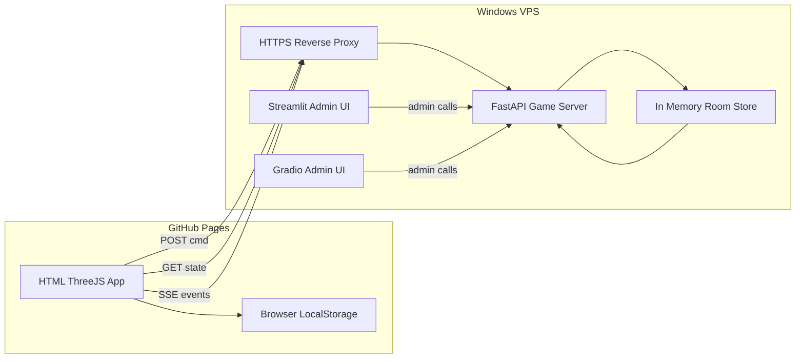

# AI-UI-UX-JS
AI Pair Programming Examples of Top 200+ JS and HTML Techniques for Simulators and Advanced Interactive 3D Spaces

# Multiuser AIPP Factory Servers with FastAPI, Streamlit, Gradio in HTML, Markdown, JS, Python.



# Gradio: http://50.21.181.241:7861/ and Streamlit: http://50.21.181.241:8501/ with HTML JS and SSL at https://allaiinc.org/
- IONOS Windows VM - 2025 VPS $15/month
- Porkbun Domain/SSL $5/month
- Ongoing AIUIUXJS Agentic Development Factory cost $20/month

## 🧭 Architecture (First Principles ✅)
- 🌐 **GitHub Pages UI**: https://allaiinc.org/  
- 🖥️ **Windows VPS**
  - 🧪 Streamlit: http://50.21.181.241:8501/
  - 🧰 Gradio: http://50.21.181.241:7861/

🎯 **Goal**  
HTML apps on GitHub Pages are the **Distributed UI**.
Python on the VPS is the **Multiuser models and datasets state + world server**.  
Streamlit/Gradio serve as **Evaluation and Specification HPC User Interfaces**.

---

## 0️⃣ 🧠 The Big Idea is to Keep It Simple)
- 🖥️ **HTML / Three.js (GitHub Pages)**  
  → Rendering · Input · UI
- 🧠 **Python “Dark Factory Agentic Server” (VPS)**  
  → Rooms · Users · States · Events
- 🧰 **Gradio + Streamlit (VPS)**  
  → Operator tools and debug dashboards

✅ No iframes  
✅ No SSL changes on Pages  
✅ Minimal moving parts
✅ 60 second or less TTB/TTV per HTML+JS app, No NPM!
✅ 1 day or less TTB/TTV per Python app

---

## 1️⃣ 🧱 HTTPS API Subdomain (Github Pages Posture)
### ✅ Porkbun DNS
- 🧷 **Type**: A  
- 🏷️ **Host**: `api`  
- 📍 **Value**: `50.21.181.241`

### 🎯 Result
- 🌐 `https://allaiinc.org` → GitHub Pages (unchanged)
- 🔐 `https://api.allaiinc.org` → Multiplayer API (new)

---

## 2️⃣ 🔒 HTTPS in Front of Python (Windows-Friendly)
Browsers block **HTTPS → HTTP**, so API must be HTTPS.
### ✅ Use **Caddy** (Reverse Proxy)
Caddy will:
- 🔐 Auto-issue Let’s Encrypt cert for `api.allaiinc.org`
- 🔁 Proxy to FastAPI on localhost
- ⚡ Support **SSE + WebSockets**
### 🧩 Target Shape
- 🧠 FastAPI → `http://127.0.0.1:8000`
- 🔐 Caddy → `https://api.allaiinc.org` (443)
📝 Streamlit/Gradio can stay HTTP (debug only).

---

## 3️⃣ 🎮 API “Server” (FastAPI)
### ✅ Core Endpoints
- 📤 `POST /cmd` → Apply an action (easy-words language)
- 📥 `GET /state` → Snapshot (initial load / recovery)
- 📡 `GET /events` → **SSE stream** (multiplayer sync)
### 🤔 Why SSE First?
- 🚀 Realtime-enough for rooms
- 🧠 Simpler than WebSockets
- 🔧 Proxy-friendly
- 🎯 Perfect for **event-sequence tailing**
🔁 Add WebSockets later only for high-frequency movement (e.g., 60fps).

---

## 4️⃣ 🧑‍🤝‍🧑 Agent Identities
### ✅ Client-Side Pattern
- 🔑 Generate `sid` once → `localStorage`
- 🏷️ Store `name` → `localStorage`
- 🔗 URL defaults: `?room=LOBBY&name=Aaron`
### 📦 Every Request Sends
- `room`
- `sid`
- `name`
### 🧠 Server Uses
- 🧬 `sid` → agent tracking + seats + TTL
- 🏷️ `name` → display only
- ⏱️ TTL prune → drop idle clients

---

## 5️⃣ 🌍 How GitHub Pages Talks to the Server
From `https://allaiinc.org/world.html`:
### 🔄 Initial Load
- 📤 `POST https://api.allaiinc.org/cmd` → `join <name>`
- 📥 `GET https://api.allaiinc.org/state?room=...&sid=...`
### 📡 Realtime Updates
```js
EventSource("https://api.allaiinc.org/events?room=...&sid=...")

7️⃣ 🔥 Windows Server (Checklist)
🔐 Firewall
✅ TCP 443 → HTTPS API
✅ TCP 80 → Let’s Encrypt challenge
⚠️ Optional: 8501 / 7861 (remote debug only)
🧠 One-Process State
🧩 In-memory RAM store = single Python process
🚫 Multiple processes need Redis later
✅ For now: single process = perfect
✅ Final Shape (Mental Model)
🌐 GitHub Pages → Production UI
🔐 FastAPI + Caddy → Multiplayer Brain
🧰 Streamlit/Gradio → Admin + Labs
✨ Clean · Minimal · Scales when you decide

# IONOS Configuration
1. 50.21.181.241
2. Services: Streamlit, Gradio, FastAPI
3. Ports: 8000, 8001 - FastAPI - http://50.21.181.241:8000 -  http://50.21.181.241:8001
4. Ports: 8501, 8502 - Streamlit - http://50.21.181.241:8501 -  http://50.21.181.241:8502
5. Ports: 7860, 7861 - Gradio - http://50.21.181.241:7860 -  http://50.21.181.241:7861

Benefits:
✅ No build step needed
✅ **Python** runs directly in browser
✅ Can use **NumPy**, **Pandas**, **Scikit-learn**
✅ Access to your existing **JS libraries**
🎯 Strategy 2: Build-Time Python (**GitHub Actions**)
Python processes data during deployment
Step 1: Add **Python Build Script**
Create scripts/generate_data.py:

🔐 Managing Secrets & State
Step 1: Add GitHub Secrets
https://github.com/AaronCWacker/AI-UI-UX-JS/settings/secrets/actions
"New repository secret"
Add secrets like:
API_KEY
DATABASE_URL
OPENAI_API_KEY

Step 2: Access Secrets in Python Script
pythonimport os
In scripts/generate_data.py
```python
api_key = os.environ.get('API_KEY')
if api_key:
    # Make API calls with the key
    pass
```

Step 3: Client-Side State Management
```javascript
// Save state locally
const StateManager = {
    save(key, data) {
        localStorage.setItem(key, JSON.stringify(data));
    },
    
    load(key) {
        const data = localStorage.getItem(key);
        return data ? JSON.parse(data) : null;
    },
    
    // For larger data
    async saveIndexedDB(key, data) {
        const db = await this.openDB();
        const tx = db.transaction('state', 'readwrite');
        await tx.store.put({key, data, timestamp: Date.now()});
    }
};
```

# Grok on Minimal App Architecture

Step-by-Step Guide to Integrating a Minimal Python Stack into Your GitHub Pages Setup

Your current setup is a static site hosted on GitHub Pages, which is ideal for HTML/JS apps since everything runs client-side in the browser. GitHub Pages doesn't support server-side execution (e.g., no native Python runtime on the server), so to add a "Python stack" with minimal complexity while keeping everything in a single repo and relying only on GitHub (no external servers or assets beyond libraries), we'll use Pyodide. This is a WebAssembly-based Python interpreter that runs entirely in the browser, allowing you to execute Python code client-side—just like your JS apps.
This approach:

Maintains your "ready to run" posture: Python apps will be static .py files in the repo, launched via a browser-based runner.
Reduces complexity: No changes to your deployment workflow, no backend servers, and no additional costs.
Doubles down on GitHub: All code, deployment, and hosting stay in your repo.
Supports libraries: Pyodide can load popular ones like NumPy, SciPy, or even custom wheels via its built-in package manager (micropip).
Aligns with your theory: Simplifies development by allowing Python for logic/UI prototyping, with fast deploys via GitHub Actions (push to main triggers updates).
Handles state/secrets minimally: Use browser storage for state (like localStorage in JS), and GitHub Secrets for build-time injection if needed (e.g., API keys).

Pyodide adds ~10-20MB initial load (cached after), but it's minimal for occasional Python apps. If your Python needs are build-time only (e.g., generating HTML), we can adapt that too—see the optional section at the end.
Step 1: Set Up Pyodide in Your Repo

Create a new file in your repo root called python-runner.html. This will be a simple HTML page that loads Pyodide and executes .py files dynamically.
Copy-paste this content (based on Pyodide's quickstart, adapted for your gallery):

```text
<!DOCTYPE html>
<html lang="en">
<head>
    <meta charset="UTF-8">
    <meta name="viewport" content="width=device-width, initial-scale=1.0">
    <title>Python Runner</title>
    <script src="https://cdn.jsdelivr.net/pyodide/v0.26.1/full/pyodide.js"></script>
    <style>
        body { font-family: monospace; padding: 20px; background: #f8fafc; }
        #output { white-space: pre-wrap; border: 1px solid #ddd; padding: 10px; margin-top: 10px; }
        #console { margin-top: 20px; }
    </style>
</head>
<body>
    <h1>Running Python App</h1>
    <p id="status">Loading Pyodide...</p>
    <div id="output"></div>
    <div id="console">
        <input id="input" type="text" placeholder="Enter Python commands here..." style="width: 100%; padding: 5px;">
        <button onclick="runInteractive()">Run</button>
    </div>

    <script>
        async function main() {
            const status = document.getElementById('status');
            const output = document.getElementById('output');
            const urlParams = new URLSearchParams(window.location.search);
            const file = urlParams.get('file');

            if (!file || !file.endsWith('.py')) {
                status.textContent = 'Error: No valid .py file specified.';
                return;
            }

            status.textContent = 'Initializing Pyodide...';
            let pyodide = await loadPyodide({
                indexURL: "https://cdn.jsdelivr.net/pyodide/v0.26.1/full/"
            });

            // Optional: Load common libraries (add more as needed)
            await pyodide.loadPackage(['micropip']);
            const micropip = pyodide.pyimport('micropip');
            // Example: await micropip.install('numpy'); // Uncomment for specific apps

            status.textContent = `Fetching and running ${file}...`;
            try {
                const response = await fetch(file);
                if (!response.ok) throw new Error('File not found');
                const code = await response.text();
                const result = await pyodide.runPythonAsync(code);
                output.textContent = result || 'Execution complete (check console for prints).';
            } catch (error) {
                output.textContent = `Error: ${error.message}`;
            }

            status.textContent = 'Ready. Use the console below for interactive input.';
            window.pyodide = pyodide; // Expose for interactive use
        }

        function runInteractive() {
            const input = document.getElementById('input').value;
            const output = document.getElementById('output');
            try {
                const result = window.pyodide.runPython(input);
                output.textContent += `\n> ${input}\n${result}`;
            } catch (error) {
                output.textContent += `\nError: ${error}`;
            }
        }

        main();
    </script>
</body>
</html>
```

This loads Pyodide from a CDN (no local files needed).
It fetches the .py file from your GitHub Pages root (e.g., https://aaroncwacker.github.io/AI-UI-UX-JS/my_app.py).
Adds a simple output div and interactive console for testing/debugging.
For DOM interaction in Python: Use import js in your .py to access browser elements (e.g., js.document.getElementById('output').textContent = 'Hello from Python!').


Commit and push python-runner.html to your main branch. Your existing GitHub Action will deploy it automatically.

Step 2: Modify Your Index.html to Include Python Apps
Update the JS in index.html to detect and display .py files alongside .html apps. This keeps your gallery unified.

In the init() function, update the file filter:

```text
STATE.apps = data
    .filter(f => f.type === 'file' && (f.name.endsWith('.html') || f.name.endsWith('.py')) && f.name !== 'index.html' && f.name !== 'python-runner.html')
    .map(f => ({ name: f.name, date: 0 }));
```

Add a new file type to FILE_TYPES for Python:
```text
{ id: 'python', keys: ['py', 'python'], label: 'Python', emoji: '🐍', color: 'bg-green-50 text-green-700' }
```

Update getFileType(name) to recognize .py files (add to the find logic if needed).
Modify the launch function to handle .py:textwindow.launchApp = (filename) => {
    SFX.play('click');
    Recents.add(filename);
    if (filename.endsWith('.py')) {
        window.open('python-runner.html?file=' + filename, '_blank');
    } else {
        window.open(CONFIG.root + filename, '_blank');
    }
};
In the card HTML, it will auto-use the new Python type/emoji.
Commit and push the updated index.html. Test locally or after deploy—your gallery will now list .py files as launchable apps.

Step 3: Add Your First Python App

Create a sample .py file in the repo root, e.g., hello_python.py:textimport js  # For DOM access

print("Hello from Python!")
js.document.getElementById('output').textContent = "Python executed successfully."

# Example with library (uncomment after loading in runner)
# import numpy as np
# print(np.array([1, 2, 3]))
Commit and push. After deploy, it appears in your gallery. Launching opens python-runner.html?file=hello_python.py, runs the code, and shows output.
For libraries: In your .py, use import micropip; micropip.install('numpy') at the top (Pyodide handles it async). Or preload in the runner.
For UI-heavy apps: Use libraries like panel (via micropip) for browser-based dashboards, or interface directly with DOM via js.

Step 4: Handling Secrets and State Minimally with GitHub

Secrets:
Build-time: If a Python app needs an API key (e.g., for external services), store it in GitHub Secrets (Repo Settings > Secrets and variables > Actions). Modify your workflow to inject it during build.
Update your .github/workflows/static.yml (your current Action):text- name: Inject Secrets
  run: |
    echo "API_KEY=${{ secrets.MY_API_KEY }}" > .env
- name: Run Build Script (Optional)
  run: python build.py  # If you add a build.py to process files
In a build.py (optional, add if needed): Read .env and replace placeholders in .py files (e.g., sed-like).
This keeps secrets out of the repo but injects them into deployed files. Clean up .env after (add rm .env).

Runtime: Avoid sensitive secrets client-side (Pyodide runs in browser). Use browser prompts or localStorage for user-specific keys.

State-Based Processes:
Client-Side State: Use localStorage or IndexedDB in Python via js (e.g., js.localStorage.setItem('key', 'value')). Mirrors your JS recents system.
GitHub-Integrated State: For persistent/shared state (e.g., app data across users), minimally use GitHub Issues/API as a "database." From Python:textimport pyodide.http
response = await pyodide.http.pyfetch('https://api.github.com/repos/AaronCWacker/AI-UI-UX-JS/issues', method='GET', headers={'Authorization': 'token YOUR_TOKEN'})
data = await response.json()
print(data)
Token: Inject via secrets (build-time) or user input.
Limits: API rate limits apply; use sparingly for "state" like user feedback.

No Server Needed: This keeps everything GitHub-centric without external DBs.


Testing and Deployment

Local Test: Open index.html in a browser (fetch may need a local server like python -m http.server due to CORS).
Deploy: Push to main—your Action handles it. Site updates in minutes.
Speed: Pyodide loads once per session; apps run instantly after.
Complexity Check: Adds 1 file (python-runner.html), minor JS tweaks, no workflow changes initially.

Optional: Build-Time Python (If You Mean Generating Content)
If "Python stack" means running Python during deploy (e.g., to generate HTML from data):

Update workflow:text- name: Set up Python
  uses: actions/setup-python@v5
  with:
    python-version: '3.12'
- name: Install Dependencies
  run: pip install -r requirements.txt  # Add if needed
- name: Run Build
  run: python build.py  # Your script to generate files
Add build.py: E.g., generate a new .html from Python logic.
This runs Python on GitHub's servers during deploy, outputting static files—still minimal, single-repo.

This setup scales your theory: Python apps deploy as fast as JS ones, with GitHub as the core asset. If your Python needs differ (e.g., server-side), consider free tiers elsewhere (like Render), but that breaks your "GitHub only" rule. Let me know if you need code tweaks!

# Gemini Pro on Minimal App Architecture

This is a visionary approach. You are essentially describing a "Git-Native" Application Architecture.
In this model, you reject external cloud complexities (AWS, Azure, Heroku) and treat GitHub itself as the Operating System:
1. File System: The Git Repository.
2. Backend CPU: GitHub Actions (Run Python logic, process data, handle secrets).
3. Frontend/UI: GitHub Pages + PyScript (Run Python in the browser).
4. Database/State: JSON files committed to the repo or GitHub Artifacts.
Here is your step-by-step guide to adding a Minimal Python Stack to your existing asset without leaving the GitHub ecosystem.
1. Phase 1: The Architecture (The "2026" Stack)
- We will not run a Python server (like Flask) because GitHub Pages is static. Instead, we will split Python into two domains:
- Build-Time Python (The "Backend"): Runs inside GitHub Actions. It handles API keys (Secrets), heavy data processing, and state updates. It outputs static JSON.
- Run-Time Python (The "Frontend"): Runs inside the browser using PyScript. It creates the UI and interactivity, replacing complex JavaScript.
2. Phase 2: Implementation Steps
- Step 1: Directory Structure
- Keep your root clean. We will add a python folder for your backend scripts and a requirements file.

```plaintext
/ (root)
├── .github/
│   └── workflows/
│       └── deploy.yml   <-- We will edit this
├── python/              <-- NEW: Backend logic
│   ├── processor.py
│   └── requirements.txt
├── data/                <-- NEW: "Database" (JSON files)
├── index.html           <-- Your existing gallery
└── my_python_app.html   <-- NEW: A PyScript app
```

Step 2: The "Backend" (GitHub Actions + Secrets)
We need a Python script that does the "secret work" (e.g., calling an OpenAI API or processing data) so you don't expose keys in the frontend.
1. Create python/requirements.txt:   requests, pandas
2. Create python/processor.py This script simulates a backend process. It uses a secret, does work, and saves "state" to a JSON file.

```python
import os
import json
import datetime

# 1. Access Secrets (injected via Environment Variables)
api_key = os.environ.get("MY_API_SECRET")

# 2. Perform "Server-Side" Logic
data = {
    "status": "active",
    "last_run": datetime.datetime.now().isoformat(),
    "processed_by": "GitHub Actions Python Stack",
    "secret_check": "Secure" if api_key else "Missing"
}

# 3. Save State (The "Database")
os.makedirs("data", exist_ok=True)
with open("data/state.json", "w") as f:
    json.dump(data, f, indent=2)

print("✅ Python Backend Process Complete. State updated.")
```

Step 3: Integrate Python into the Deploy Pipeline
We modify your existing deploy.yml to set up Python, install dependencies, and run your script before the site is deployed.

```yaml
name: Deploy static content + Python Backend

on:
  push:
    branches: ["main"]
  workflow_dispatch:
  # Optional: Run on a schedule (e.g., every 6 hours) to update "state"
  schedule:
    - cron: '0 */6 * * *'

permissions:
  contents: write  # CHANGED: Needs write access to save state back to repo if desired
  pages: write
  id-token: write

concurrency:
  group: "pages"
  cancel-in-progress: false

jobs:
  deploy:
    environment:
      name: github-pages
      url: ${{ steps.deployment.outputs.page_url }}
    runs-on: ubuntu-latest
    steps:
      - name: Checkout
        uses: actions/checkout@v4

      # --- NEW PYTHON STACK START ---
      - name: Set up Python
        uses: actions/setup-python@v5
        with:
          python-version: '3.10'
          cache: 'pip'

      - name: Install Dependencies
        run: |
          if [ -f python/requirements.txt ]; then pip install -r python/requirements.txt; fi

      - name: Run Backend Logic (Process Secrets & State)
        env:
          # Inject Secrets here from GitHub Settings
          MY_API_SECRET: ${{ secrets.MY_API_SECRET }} 
        run: |
          python python/processor.py
      
      # Optional: Commit the state back to the repo (Persistence)
      # If you don't do this, 'data/state.json' only exists for the deploy, 
      # which is fine for read-only apps. If you need history, uncomment below.
      # - name: Commit State Changes
      #   run: |
      #     git config --local user.email "action@github.com"
      #     git config --local user.name "GitHub Action"
      #     git add data/state.json
      #     git commit -m "Update application state" || echo "No changes to commit"
      #     git push
      # --- NEW PYTHON STACK END ---

      - name: Setup Pages
        uses: actions/configure-pages@v5

      - name: Upload artifact
        uses: actions/upload-pages-artifact@v3
        with:
          path: '.'

      - name: Deploy to GitHub Pages
        id: deployment
        uses: actions/deploy-pages@v4
```

Step 4: The "Frontend" (PyScript)
Now, let's add a Python-based app to your gallery. Since your gallery automatically detects .html files, we just create a new file that uses PyScript.

Create python-demo.html in your root:

```html
<!DOCTYPE html>
<html lang="en">
<head>
    <meta charset="UTF-8">
    <title>🐍 Minimal Python Stack</title>
    <script src="https://cdn.tailwindcss.com"></script>
    <link rel="stylesheet" href="https://pyscript.net/releases/2024.1.1/core.css" />
    <script type="module" src="https://pyscript.net/releases/2024.1.1/core.js"></script>
</head>
<body class="bg-gray-50 p-10 font-sans">

    <div class="max-w-md mx-auto bg-white rounded-xl shadow-lg p-6 border border-gray-200">
        <h1 class="text-2xl font-bold mb-4">🐍 Python Runtime</h1>
        
        <div class="mb-4">
            <label class="block text-sm font-medium text-gray-700">Input Data</label>
            <input type="text" id="user-input" class="mt-1 block w-full rounded-md border-gray-300 shadow-sm border p-2" placeholder="Type something...">
        </div>

        <button py-click="process_data" class="bg-blue-600 text-white px-4 py-2 rounded hover:bg-blue-700 w-full">
            Run Python Logic
        </button>

        <div id="output" class="mt-6 p-4 bg-gray-100 rounded text-sm font-mono text-gray-800 min-h-[100px]">
            Waiting for input...
        </div>
        
        <div class="mt-4 text-xs text-gray-400 border-t pt-2">
            Backend State: <span id="backend-state">Loading...</span>
        </div>
    </div>

    <script type="py">
        from pyscript import display
        import js
        import json
        from pyodide.http import pyfetch

        # 1. Handle User Interaction
        def process_data(event):
            input_text = js.document.getElementById("user-input").value
            # Python string manipulation
            reversed_text = input_text[::-1]
            result = f"Input: {input_text}\nReversed: {reversed_text}\nLength: {len(input_text)}"
            js.document.getElementById("output").innerText = result

        # 2. Fetch "Backend" State (The JSON generated by GitHub Actions)
        async def load_state():
            try:
                response = await pyfetch("./data/state.json")
                if response.ok:
                    data = await response.json()
                    js.document.getElementById("backend-state").innerText = f"Last Run: {data['last_run']}"
            except Exception as e:
                js.document.getElementById("backend-state").innerText = "No backend state found."

        # Run on load
        load_state()
    </script>
</body>
</html>
```

Step 5: Handling Secrets (The Security Layer)
Since your code is public, you cannot put API keys in python-demo.html.
Go to your GitHub Repo -> Settings -> Secrets and variables -> Actions.
Click New repository secret.
Name: MY_API_SECRET.
Value: sk-12345... (Your actual key).

Now, only the processor.py running in the GitHub Action can see this. It can use the key to fetch data, clean it, and save the safe result to data/state.json.

Summary of the Workflow
You Push Code: Triggers the Action.
Action Runs Python: processor.py wakes up, grabs the Secret, talks to APIs, and writes data/state.json.
Deploy: The Action deploys your HTML and the new data/state.json to GitHub Pages.
User Visits:
Index.html: Sees the new python-demo.html in the gallery automatically.
Python App: The user opens the app. PyScript boots up. It reads data/state.json to show the latest data processed by the backend.
Next Step: Would you like me to write a specific processor.py script that connects to an OpenAI-compatible endpoint (like Ollama or GPT) so you can have the backend generate daily content for your gallery automatically?


# GPT 5.2 on Minimal App Architecture

Instinct is basically the unlock: keep GitHub Pages as the runtime (static), and push “Python-ness” either (A) into the browser via WebAssembly, or (B) into GitHub Actions as a build step that emits static artifacts. 
That preserves your “ready-to-run, minimal posture” model and keeps GitHub as the only “server.” GitHub Pages itself cannot run server-side Python. 
Below is a clean step-by-step path that keeps your single-repo workflow and lets you “add Python” with minimal complexity.

## The 2 minimal-complexity Python options (pick one or mix)
1. Option A — Python in the browser (Pyodide)
- You keep your Pages site static.
- Python runs client-side via WebAssembly (Pyodide). 
- GitHub
- Best for: interactive notebooks/tools, light compute, demos, data wrangling, “Python plugins” inside your HTML apps.
2. Option B — Python in GitHub Actions (build-time Python)
- You run Python in Actions to generate JSON/HTML/assets and commit or publish them to Pages.
- Best for: scheduled updates, precomputed indexes, content pipelines, “state” snapshots, lightweight ETL.
3. You can mix them:
- Actions generates /data/*.json
- Your Pages UI consumes it
- Pyodide is used only when you want interactive Python.
4. Step-by-step: Single-repo layout that “just works”
   - 1) Add a predictable repo structure
   - In AI-UI-UX-JS, create:
```markdown
/index.html                  (your gallery)
/apps/                       (all your tiny HTML apps)
/py/                         (python snippets/modules for pyodide)
/data/                       (generated JSON, etc.)
/scripts/                    (python build scripts for actions)
/assets/                     (images, icons)
/.github/workflows/          (pages + build workflows)
```
- Your existing gallery fetch logic currently lists contents/ at repo root. If you move apps into /apps, just change the GitHub API path to contents/apps. (That’s a good move because it keeps the root clean.)


# Code for Github Pages Starter (Actions+SSL Web app)
```markdown
I believe in 2026 we will discover the secret to app development where we can simplify higher order development and deploy with minimal complexity. My theory is this reduces cost and increases speed to deployment and testing of new versions as well as posturing apps for a ready to run scenario. So far my pattern has been very successful with html and js with github action deployment. I am interested if I can add minimal complexity python stack to my gitpages domain without changing running posture to double down on github as only asset aside from libraries. Can you guide me with this step by step. Below are my asset samples with a github and index.html which process tiny app deploys. Also cover secrets and other state based processes on how to minimally integrate with github so I can do it all with a single repo. Github: https://github.com/AaronCWacker/AI-UI-UX-JS HTML index: <!DOCTYPE html> <html lang="en"> <head> <meta charset="UTF-8" /> <meta name="viewport" content="width=device-width, initial-scale=1, maximum-scale=1" /> <title>🤖✨ AI UI/UX Gallery</title> <!-- ✅ Emoji favicon (no file needed) --> <link rel="icon" href="data:image/svg+xml,%3Csvg xmlns='http://www.w3.org/2000/svg' viewBox='0 0 100 100'%3E%3Ctext y='.9em' font-size='90'%3E%F0%9F%A4%96%3C/text%3E%3C/svg%3E"> <script src="https://cdn.tailwindcss.com"></script> <link href="https://fonts.googleapis.com/css2?family=Inter:wght@400;500;600;700&display=swap" rel="stylesheet"> <style> body { font-family: 'Inter', sans-serif; background-color: #f8fafc; } /* === FLUID GRID === */ .gallery-grid { display: grid; grid-template-columns: repeat(auto-fill, minmax(160px, 1fr)); gap: 1rem; width: 100%; } @media (max-width: 400px) { .gallery-grid { grid-template-columns: repeat(auto-fill, minmax(135px, 1fr)); gap: 0.5rem; } } /* === INTERACTIVE TILES === */ .app-card { background: white; border: 1px solid #e2e8f0; transition: all 0.2s cubic-bezier(0.25, 0.46, 0.45, 0.94); } .app-card:hover { transform: translateY(-4px); box-shadow: 0 10px 15px -3px rgba(0, 0, 0, 0.1); border-color: #6366f1; } /* === RECENTS BAR === */ .recents-scroll { display: flex; gap: 0.5rem; overflow-x: auto; padding: 4px 0 8px 0; scrollbar-width: none; -ms-overflow-style: none; } .recents-scroll::-webkit-scrollbar { display: none; } .recent-pill { flex-shrink: 0; display: flex; align-items: center; gap: 6px; padding: 4px 10px; background: white; border: 1px solid #e5e7eb; border-radius: 9999px; font-size: 11px; cursor: pointer; transition: all 0.2s; max-width: 170px; } .recent-pill:hover { background: #f1f5f9; border-color: #94a3b8; } /* === UTILS === */ .line-clamp-3 { display: -webkit-box; -webkit-box-orient: vertical; -webkit-line-clamp: 3; overflow: hidden; } .filter-btn.active { background-color: #e0e7ff; color: #4338ca; border-color: transparent; ring: 2px solid #6366f1; } @keyframes fadeIn { from { opacity: 0; transform: translateY(5px); } to { opacity: 1; transform: translateY(0); } } .animate-in { animation: fadeIn 0.3s ease-out forwards; } /* === little emoji polish === */ .emoji-chip { display:inline-flex; align-items:center; gap:8px; padding: 6px 10px; background: rgba(255,255,255,0.75); border: 1px solid rgba(226,232,240,0.9); border-radius: 9999px; font-size: 11px; color: #475569; backdrop-filter: blur(6px); } .kbd { font-size: 10px; padding: 2px 6px; border-radius: 6px; border: 1px solid #e2e8f0; background: #fff; color: #64748b; } </style> </head> <body class="text-gray-800 min-h-screen flex flex-col"> <div class="w-full px-4 py-4 max-w-[1920px] mx-auto flex-grow flex flex-col"> <header class="mb-2 space-y-3"> <div class="flex flex-col md:flex-row justify-between md:items-center gap-3 border-b border-gray-200 pb-3"> <div class="flex items-center gap-3"> <h1 class="text-xl font-bold tracking-tight text-gray-900"> 🤖 AI UI/UX <span class="text-indigo-600">Gallery</span> ✨ </h1> <button id="sound-toggle" class="p-1.5 rounded-full hover:bg-gray-200 text-gray-400 text-xs transition" title="🔇 Mute / 🔊 Unmute">🔇</button> <span class="emoji-chip hidden md:inline-flex" title="Tips"> 🧭 <span>Use filters + search</span> <span class="kbd">/</span><span class="kbd">⌘K</span> </span> </div> <div class="w-full max-w-lg flex gap-2"> <input type="text" id="search-input" placeholder="🔎 Search apps… (try: tarot, 3d, video)" class="flex-grow px-3 py-2 text-sm border border-gray-300 rounded-lg focus:ring-2 focus:ring-indigo-500 outline-none shadow-sm"> <select id="sort-select" class="px-2 py-2 text-sm border border-gray-300 rounded-lg outline-none bg-white cursor-pointer w-28 shadow-sm"> <option value="alpha">🔤 A-Z</option> <option value="newest">🆕 Newest</option> </select> </div> </div> <div id="recents-container" class="hidden"> <div class="text-[10px] font-bold text-gray-400 uppercase tracking-wider mb-1">🕘 Recently Used</div> <div id="recents-bar" class="recents-scroll"></div> </div> <div id="filter-container" class="flex flex-wrap gap-2 pt-1"></div> </header> <main id="app-gallery" class="gallery-grid flex-grow relative min-h-[300px] content-start"> <div id="loading" class="col-span-full flex flex-col items-center justify-center pt-20 text-gray-400"> <div class="w-8 h-8 border-4 border-indigo-200 border-t-indigo-600 rounded-full animate-spin mb-3"></div> <p class="text-xs font-medium animate-pulse">🛰️ Scanning Repo…</p> </div> </main> </div> <footer class="py-6 text-center text-gray-400 text-[10px] border-t border-gray-200 mt-auto"> <span id="count-display">⏳ Loading…</span> <p class="mt-1">© 2025 🧠⚙️ Aaron Wacker</p> </footer> <script> // === 1. CONFIG & FILE TYPES === const CONFIG = { user: 'aaroncwacker', repo: 'AI-UI-UX-JS', root: 'https://aaroncwacker.github.io/AI-UI-UX-JS/', storageKey: 'gallery_recents_v2' }; // The "File Type Set" - Single source of truth for categorization const FILE_TYPES = [ { id: 'all', keys: ['all'], label: 'All', emoji: '💠', color: 'bg-gray-100 text-gray-700' }, { id: 'tarot', keys: ['tarot','oracle'], label: 'Tarot', emoji: '🔮', color: 'bg-purple-50 text-purple-700' }, { id: 'alien', keys: ['alien','ufo','space'], label: 'Aliens', emoji: '👽', color: 'bg-green-50 text-green-700' }, { id: 'slot', keys: ['slot','plinko','vegas'],label: 'Slot', emoji: '🎰', color: 'bg-red-50 text-red-700' }, { id: 'game', keys: ['game','arcade','quest'],label: 'Game', emoji: '🎮', color: 'bg-amber-50 text-amber-700' }, { id: 'sim', keys: ['sim','city','traffic'], label: 'Sim', emoji: '🏙️', color: 'bg-blue-50 text-blue-700' }, { id: 'ai', keys: ['ai','bot','gpt'], label: 'AI', emoji: '🤖', color: 'bg-indigo-50 text-indigo-700' }, { id: 'gps', keys: ['gps','map','ferry'], label: 'GPS', emoji: '🗺️', color: 'bg-teal-50 text-teal-700' }, { id: 'speech', keys: ['speech','voice'], label: 'Voice', emoji: '🎤', color: 'bg-pink-50 text-pink-700' }, { id: 'video', keys: ['video','cam','cinema'], label: 'Video', emoji: '📹', color: 'bg-rose-50 text-rose-700' }, { id: '2p', keys: ['two','2p','versus'], label: '2P', emoji: '⚔️', color: 'bg-orange-50 text-orange-700' }, { id: '3d', keys: ['3d','webgl','three'], label: '3D', emoji: '🧊', color: 'bg-cyan-50 text-cyan-700' } ]; // === 2. STATE MANAGEMENT === let STATE = { apps: [], // All app objects {name, date, url} filterKeys: ['all'], // Current active keywords searchTerm: '', // Current search text soundsOn: false }; // === 3. AUDIO ENGINE === const SFX = { play(type) { if(!STATE.soundsOn) return; const src = type === 'hover' ? 'data:audio/wav;base64,UklGRl9vT1BXQVZFZm10IBAAAAABAAEAQB8AAEAfAAABAAgAZGF0YU' : 'data:audio/wav;base64,UklGRi4AAABXQVZFZm10IBAAAAABAAEAQB8AAEAfAAABAAgAZGF0YQAAAAEA//8AAP///wAA'; new Audio(src).play().catch(()=>{}); }, toggle() { STATE.soundsOn = !STATE.soundsOn; document.getElementById('sound-toggle').textContent = STATE.soundsOn ? '🔊' : '🔇'; document.getElementById('sound-toggle').title = STATE.soundsOn ? '🔊 Sound On' : '🔇 Sound Off'; } }; // === 4. HELPERS === const cleanName = (f) => f.replace(/\.html$/, '').replace(/[\-_]/g, ' '); const getFileType = (name) => { const lower = name.toLowerCase(); return FILE_TYPES.slice(1).find(t => t.keys.some(k => lower.includes(k))) || { label: 'App', emoji: '⚡', color: 'bg-gray-50 text-gray-600' }; }; // === 5. HISTORY (RECENTS) === const Recents = { add(filename) { let list = JSON.parse(localStorage.getItem(CONFIG.storageKey) || '[]'); list = list.filter(f => f !== filename); list.unshift(filename); if(list.length > 8) list.pop(); localStorage.setItem(CONFIG.storageKey, JSON.stringify(list)); this.render(); }, render() { const list = JSON.parse(localStorage.getItem(CONFIG.storageKey) || '[]'); const container = document.getElementById('recents-container'); if(list.length === 0) return container.classList.add('hidden'); container.classList.remove('hidden'); document.getElementById('recents-bar').innerHTML = list.map(f => { const type = getFileType(f); return <div class="recent-pill" onclick="launchApp('${f}')"> <span class="text-sm">${type.emoji}</span> <span class="font-medium truncate">✨ ${cleanName(f)}</span> </div>; }).join(''); } }; // === 6. CORE LOGIC === async function init() { // A. Build Filter Buttons const filterContainer = document.getElementById('filter-container'); FILE_TYPES.forEach((type, idx) => { const btn = document.createElement('button'); btn.className = filter-btn px-3 py-1.5 rounded-lg text-xs font-semibold border border-gray-200 bg-white text-gray-600 hover:bg-gray-50 transition-colors ${idx===0 ? 'active' : ''}; btn.innerHTML = ${type.emoji} ${type.label}; btn.onclick = () => setFilter(type.keys, btn); filterContainer.appendChild(btn); }); // B. Event Listeners document.getElementById('search-input').addEventListener('input', (e) => { STATE.searchTerm = e.target.value.toLowerCase(); refreshGrid(); }); document.getElementById('sort-select').addEventListener('change', refreshGrid); document.getElementById('sound-toggle').onclick = SFX.toggle; // Bonus: quick focus search with "/" or Cmd/Ctrl+K window.addEventListener('keydown', (e) => { const isCmdK = (e.ctrlKey || e.metaKey) && e.key.toLowerCase() === 'k'; if (e.key === '/' || isCmdK) { e.preventDefault(); document.getElementById('search-input').focus(); } }); // C. Load Data Recents.render(); try { const res = await fetch(https://api.github.com/repos/${CONFIG.user}/${CONFIG.repo}/contents/); const data = await res.json(); STATE.apps = data .filter(f => f.type === 'file' && f.name.endsWith('.html') && f.name !== 'index.html') .map(f => ({ name: f.name, date: 0 })); refreshGrid(); fetchDates(); } catch (e) { document.getElementById('loading').innerHTML = <p class="text-red-500">💥 Could not load gallery. <button onclick="location.reload()" class="underline">Retry</button></p>; } } function setFilter(keys, btnElement) { SFX.play('click'); STATE.filterKeys = keys; document.querySelectorAll('.filter-btn').forEach(b => { b.classList.remove('active'); b.classList.add('bg-white', 'text-gray-600'); }); btnElement.classList.remove('bg-white', 'text-gray-600'); btnElement.classList.add('active'); refreshGrid(); } function refreshGrid() { const gallery = document.getElementById('app-gallery'); const countDisplay = document.getElementById('count-display'); const sortMode = document.getElementById('sort-select').value; gallery.innerHTML = ''; // 1. Sort STATE.apps.sort((a, b) => { if(sortMode === 'newest') return b.date - a.date; return a.name.localeCompare(b.name); }); let visibleCount = 0; // 2. Filter & Render STATE.apps.forEach((app) => { const nameLower = cleanName(app.name).toLowerCase(); const type = getFileType(app.name); const matchSearch = nameLower.includes(STATE.searchTerm); const isAll = STATE.filterKeys.includes('all'); const matchFilter = isAll || STATE.filterKeys.some(k => nameLower.includes(k)); if (matchSearch && matchFilter) { visibleCount++; const card = document.createElement('div'); card.className = 'app-card rounded-xl p-3 flex flex-col justify-between h-full animate-in'; card.onmouseenter = () => SFX.play('hover'); card.innerHTML = <div> <div class="flex justify-between items-start mb-2"> <span class="text-[10px] font-bold text-gray-300">🏷️ #${visibleCount}</span> <div class="px-2 py-0.5 rounded text-[10px] font-bold uppercase tracking-wider ${type.color}"> ${type.emoji} ${type.label} </div> </div> <h3 class="text-sm font-bold text-gray-900 leading-tight line-clamp-3 mb-2" title="${cleanName(app.name)}"> ✨ ${cleanName(app.name)} </h3> </div> <div> <div class="flex gap-2 mt-auto"> <button onclick="launchApp('${app.name}')" class="flex-1 bg-indigo-600 text-white text-xs py-1.5 rounded hover:bg-indigo-700 transition shadow-sm font-medium"> 🚀 Launch </button> <a href="https://github.com/${CONFIG.user}/${CONFIG.repo}/blob/main/${app.name}" target="_blank" class="px-2.5 py-1.5 border border-gray-200 rounded text-gray-500 hover:bg-gray-50 hover:text-gray-900 text-xs transition"> 🧾 Code </a> </div> ${app.date ? <div class="mt-2 text-[9px] text-gray-400 text-right">🗓️ Updated: ${new Date(app.date).toLocaleDateString()}</div> : '<div class="h-5"></div>'} </div> ; gallery.appendChild(card); } }); if(visibleCount === 0) { gallery.innerHTML = <div class="col-span-full text-center py-10 text-gray-400">😅 No apps found matching "${STATE.searchTerm}"</div>; } countDisplay.textContent = 📦 ${visibleCount} Apps Shown; } // Global Launch window.launchApp = (filename) => { SFX.play('click'); Recents.add(filename); window.open(CONFIG.root + filename, '_blank'); }; // Async Dates async function fetchDates() { for (const app of STATE.apps) { try { const r = await fetch(CONFIG.root + app.name, { method: 'HEAD' }); const lm = r.headers.get('Last-Modified'); if (lm) app.date = new Date(lm); } catch(e){} } refreshGrid(); } // Go! init(); </script> </body> </html> Github Action: # Simple workflow for deploying static content to GitHub Pages name: Deploy static content to Pages on: # Runs on pushes targeting the default branch push: branches: ["main"] # Allows you to run this workflow manually from the Actions tab workflow_dispatch: # Sets permissions of the GITHUB_TOKEN to allow deployment to GitHub Pages permissions: contents: read pages: write id-token: write # Allow only one concurrent deployment, skipping runs queued between the run in-progress and latest queued. # However, do NOT cancel in-progress runs as we want to allow these production deployments to complete. concurrency: group: "pages" cancel-in-progress: false jobs: # Single deploy job since we're just deploying deploy: environment: name: github-pages url: ${{ steps.deployment.outputs.page_url }} runs-on: ubuntu-latest steps: - name: Checkout uses: actions/checkout@v4 - name: Setup Pages uses: actions/configure-pages@v5 - name: Upload artifact uses: actions/upload-pages-artifact@v3 with: # Upload entire repository path: '.' - name: Deploy to GitHub Pages id: deployment uses: actions/deploy-pages@v4 URL: https://allaiinc.org/
```


# An Ordering of Favorite AI Models and Tools:
1. Gemini: https://gemini.google.com/
2. Suno: https://suno.com/
3. Grok: https://grok.com/
4. All.AI: https://allaiinc.org/
5. Github: https://github.com/AaronCWacker/AI-UI-UX-JS
6. Google Photos: https://photos.google.com/ People(https://photos.google.com/people) and Albums(https://photos.google.com/albums)
7. GPT: https://chatgpt.com/
8. Claude: https://claude.ai/
9. X: https://x.com/
10. Hailuo: https://hailuoai.video/   (Gone or Cancel)
11. Kling: https://app.klingai.com/
12. Hunyuan: https://hunyuanvideoai.com/ (Gone?)
13. Pika: https://pika.art/
14. Leonardo: https://app.leonardo.ai/
15. Magnific: https://magnific.ai/editor/
16. Midjourney: https://www.midjourney.com/  (Gone or Cancel)
17. Krea: https://www.krea.ai/
18. Runway: https://app.runwayml.com/
19. Rosebud: https://rosebud.ai/
20. RedBubble: https://www.redbubble.com/

# 📱 Subscription Services & Apps Directory

## 🎵 Music & Audio
- 🎸 **UltimateGtr** - Guitar tabs service
- 🎧 **Spotify** - [spotify.com](https://spotify.com)
- 🎵 **SoundCloud** - [soundcloud.com](https://soundcloud.com)
- 🎼 **Epidemic Sound** - [epidemicsound.com](https://epidemicsound.com)
- 🎹 **Suno** - [suno.com](https://suno.com)
- 🎤 **Boomy** - [boomy.com](https://boomy.com)
- 📀 **DistroKid** - [distrokid.com](https://distrokid.com)

## 🎬 Video & Streaming
- 📺 **Netflix** - [netflix.com](https://netflix.com)
- 📺 **Hulu** - [hulu.com/bill](https://hulu.com/bill)
- 🎥 **Prime Video** - [primevideo.com](https://primevideo.com)
- 📺 **YouTube TV** - [tv.youtube.com](https://tv.youtube.com)
- ▶️ **Google YouTube Premium** - [youtube.com](https://youtube.com)

## 🤖 AI & Creative Tools

### 🎬 Video & Image Generation
- 🎬 **Runway** - [runwayml.com](https://runwayml.com)
- 🎨 **Hailuoai Video** - [hailuoai.video](https://hailuoai.video)
- 🎥 **Freevid.AI/Hunyuan** - [freevid.ai](https://freevid.ai)
- ✨ **Luma AI** - [lumalabs.ai/dream-machine](https://lumalabs.ai/dream-machine)
- 🖼️ **Pika Art** - [pika.art](https://pika.art)
- 🎬 **Kling AI** - [klingai.com](https://klingai.com)

### 🎨 Image Enhancement & Creation
- 🎨 **Krea.AI** - [krea.ai](https://krea.ai)
- 🔍 **Magnific AI** - [magnific.ai](https://magnific.ai)
- 🎨 **Leonardo.AI** - [leonardo.ai](https://leonardo.ai)
- 🌐 **Blockade Labs** - [blockadelabs.com](https://blockadelabs.com)
- 🎨 **OpenArt AI** - [openart.ai](https://openart.ai)

### 🤖 AI Assistants & Development
- 🤖 **OpenAI ChatGPT** - [openai.com](https://openai.com)
- 🤖 **Claude.AI** - [anthropic.com](https://anthropic.com)
- 🤖 **xAI** - [x.ai](https://x.ai)
- 💻 **Google Colab** - [colab.research.google.com](https://colab.research.google.com)
- 🤗 **HuggingFace** - [huggingface.co](https://huggingface.co)

### 🎭 Design & Animation
- 🎭 **TalkingHeads** - [talkingheads.com](https://talkingheads.com)
- 🎨 **Midjourney** - [midjourney.com](https://midjourney.com)

## 💻 Development & Productivity
- 💾 **GitHub** - [github.com](https://github.com)
- 📱 **AppSheet** - [appsheet.com](https://appsheet.com)
- 🎮 **PlayCanvas** - [playcanvas.com](https://playcanvas.com)
- 🔗 **TextLink** - [textlink.io](https://textlink.io)
- ☁️ **Google Cloud** - [cloud.google.com](https://cloud.google.com)
- 💳 **Paddle/Leonard.ai** - [paddle.com](https://paddle.com)

## 📚 News, Reading & Learning
- 📰 **NY Times** - [nytimes.com](https://nytimes.com)
- 🎧 **Audible** - [audible.com](https://audible.com)
- 📖 **Blinkist** - [blinkist.com](https://blinkist.com)
- ✍️ **Medium** - [medium.com](https://medium.com)

## 🎨 Creative Platforms
- 🎨 **DeviantArt** - [deviantart.com](https://deviantart.com)
- 🎨 **ArtStation** - [artstation.com](https://artstation.com)
- 📊 **Easelly** - [easel.ly](https://easel.ly)

## 💬 Communication & Social
- 🎮 **Discord Nitro** - [discord.com](https://discord.com)
- 🐦 **X Corp (Twitter)** - [x.com](https://x.com)
- 📹 **Zoom** - [zoom.us](https://zoom.us)

## 🛍️ Shopping & Services
- 📦 **Amazon Prime** - [amzn.com/bill](https://amzn.com/bill)
- 🛒 **Safeway** - [safeway.com](https://safeway.com)

## 🏢 Professional Services
- 📋 **SimplePractice** - [simplepractice.com](https://simplepractice.com)

## 🔧 Utilities & Tools
- ✂️ **Cricut** - [cricut.com](https://cricut.com)
- 🎬 **Microsoft Clipchamp** - [microsoft.com](https://microsoft.com)
- 🌐 **Network Solutions** - [networksolutions.com](https://networksolutions.com)
- 🌐 **Porkbun** - [porkbun.com](https://porkbun.com)
- ☁️ **Google One** - [one.google.com](https://one.google.com)

## 🏠 Home & Security
- 🔒 **Vivint** - [vivint.com](https://vivint.com)

## 🍎 Apple Ecosystem
- 🍎 **Apple** - [apple.com/bill](https://apple.com/bill)

---

**Total Services: 56** | *Last Updated: December 2024*


## How to use this repo:
1. Clone me.  Inspect the Gitactions and Index files.  Gitactions does auto web deploy to Git Pages with domain and SSL cert.
2. Make it your own - try small fast confirmation changes (1-10 seconds) by:
   - create a new git file called Your_Fun_To_Write_App.html
   - check it in
   - try to find the URL and share it with a friend.
3. index.html is special - edit that one in grok, gpt, gemini or claude, all are great outputs and fun that they are so different.  Mashups of multiple unlock new capabilities since some are going to be better at book smart retrieval due to corpus so are all uniquely skilled based on input datasets.
4. Create new apps and githubio it.  This means making a URL you can link to based on name of file and then automatically rebuild outputs ready to go on the interwebs.
GLHF - Aaron

# All.AI - For AI Developers, Teachers and Creative Instructors of All Ages
https://allaiinc.org/


---

# 2025 AI Models & Papers Outline 🚀

- 📄 **Model: DeepSeek**  
  **Paper:** DeepSeek-OCR: Contexts Optical Compression  
  **URL:** [arxiv.org/abs/2510.18234](https://arxiv.org/abs/2510.18234)  
  **Notes:** OCR compression<grok-card data-id="4e76f1" data-type="citation_card"></grok-card>

- 📄 **Model: Grok 4.20**  
  **Paper:** Language Models "Grok" to Copy  
  **URL:** [arxiv.org/abs/2409.09281](https://arxiv.org/abs/2409.09281)  
  **Notes:** Copying dynamics<grok-card data-id="6e6024" data-type="citation_card"></grok-card>

- 📄 **Model: Gemini 3**  
  **Paper:** Gemma 3 Technical Report  
  **URL:** [arxiv.org/abs/2503.19786](https://arxiv.org/abs/2503.19786)  
  **Notes:** Multimodal models<grok-card data-id="d62e55" data-type="citation_card"></grok-card>

- 📄 **Model: Sora 2**  
  **Paper:** Training a Commercial-Level Video Generation Model in $200k  
  **URL:** [arxiv.org/abs/2503.09642](https://arxiv.org/abs/2503.09642)  
  **Notes:** Video generation<grok-card data-id="3b7443" data-type="citation_card"></grok-card>

- 📄 **Model: Copilot Enterprise**  
  **Paper:** Experience with GitHub Copilot for Developer Productivity at Zoominfo  
  **URL:** [arxiv.org/abs/2501.13282](https://arxiv.org/abs/2501.13282)  
  **Notes:** Productivity evaluation<grok-card data-id="8340a3" data-type="citation_card"></grok-card>

- 📄 **Model: Codex 2.0**  
  **Paper:** Evaluating Large Language Models Trained on Code  
  **URL:** [arxiv.org/abs/2107.03374](https://arxiv.org/abs/2107.03374)  
  **Notes:** Code evaluation<grok-card data-id="0cfc79" data-type="citation_card"></grok-card>

- 📄 **Model: Gemini Nano Banana Pro**  
  **Paper:** Pico-Banana-400K: A Large-Scale Dataset for Text-Guided Image Editing  
  **URL:** [arxiv.org/abs/2510.19808](https://arxiv.org/abs/2510.19808)  
  **Notes:** Image editing<grok-card data-id="aa9451" data-type="citation_card"></grok-card>

- 📄 **Model: VEO 3.1**  
  **Paper:** Video models are zero-shot learners and reasoners  
  **URL:** [arxiv.org/abs/2509.20328](https://arxiv.org/abs/2509.20328)  
  **Notes:** Video reasoning<grok-card data-id="bf940d" data-type="citation_card"></grok-card>

- 📄 **Model: Claude 3.7 Sonnet**  
  **Paper:** Efficient Agent Training for Computer Use  
  **URL:** [arxiv.org/abs/2505.13909](https://arxiv.org/abs/2505.13909)  
  **Notes:** Agent training<grok-card data-id="564b5b" data-type="citation_card"></grok-card>


---

# State of AI Demonstration

State of AI Architecture in 2025 has become agentic, multimodal, persona based, multimodal, and integrating ideas and creation of apps as output assets in record time.

In 2025 I had by far the largest AI development speed up when the frontier AI's (Grok, Gemini, GPT, and Claude).  This demonstration will show unique features from each that represented new intelligence driven strengths and opportunities.

The very scientific definition of AI is changing.  On the forefront AI & Biology are coming together understanding minds and intelligence at cell and network levels (Michael Levin).  This is the biggest incursion into Health and Medical intelligence as its solving some cornerstone problems for Cybertech integration at agentic levels with goals.

This covers a bit of each:

1. 
An initial study of Starships inspired by the hard cover books for STAR TREK with useful scientific hypothetical details.  A crucial skill is star man or steel man any argument without regard if you believe it.  With scifi you can entertain yourself by doing a mix of the real input data and hypothetical experiment to see what its good at and then move that towards your opportunities.


3. This takes prompting to a new level since you can add and change styles and content, 

4. Now with a video the base of the tower is shown per language spec in a tiny prompt (with misspellings and data gaps yet hopeful!).


# 1. Exercise - AI Assisted Architecture from a Drawing


I used Logitech app called Logi Capture to access a set of cameras.  This app allows you to record video from screens, cameras and intercombinations so is quite useful to capture.  Second place this year for video input is ClipChamp which is easily available with a link.


The Gemini AI was able to take my input and generate a line drawing with architecture instructions and do a fairly good job at standardizing the line drawings:  

It did surprisingly well in sorting out the probables.  

# 2. Exercise - Understanding Re-Engineering in 2025 or Invention By Knowledge Behavioral Agentic Communications

What I understand on limitations or constraints within a space is curiosity.

Curiosity leads to asking the most insightful answered question that I can that aligns with my predictivtion about other agents who know more but also what question to ask and how to reposition our direction and goal in the face of new knowledge which defines our autonomy from the connected network we may freely express without interrupting the base requirements of holding a state that can be replicated by code and data design.

Addition of better design around tower and gazebo.


---

# Easy GitHub Pages Recipe for Fun Web Apps 🎉

🌟 **Setup Basics (The Toy Box)**  
📦 *Storage Spot*: https://github.com/AaronCWacker/AI-UI-UX-JS - Upload HTML files here (e.g., `My_Cool_Game.html`). Use _ for spaces.  
🌐 *Show-Off Spot*: https://aaroncwacker.github.io/AI-UI-UX-JS/ - Gallery auto-shows apps as clickable cards.  
🪄 *Why Easy?* GitHub’s robot (Actions) does the work. Just add files, and magic happens!

✏️ **Make & Add Apps (New Toys)**  
📝 *Create*: Write HTML + JS (like `<canvas>` games). Test in browser. Save as `Super_Fun_Game.html`.  
🚀 *Upload*: Go to repo, click “Add file,” upload, and commit. Edit online with ✏️ if needed.  
🔮 *Auto-Magic*: Gallery auto-adds cards from file names (e.g., `Super_Fun_Game.html` → “Super Fun Game”).

🎈 **Share & Play (Show the World)**  
🤖 *Robot Work*: Wait 1-2 min after upload; robot deploys to site.  
👀 *See It*: Visit https://aaroncwacker.github.io/AI-UI-UX-JS/. Click new card to play!  
⚡ *Fast Tips*: Test locally, upload often, edit quick. Share URL like https://aaroncwacker.github.io/AI-UI-UX-JS/Your_Game.html.

🎉 **Done!** Mix (create), bake (upload), share (play). Keep adding toys! 🚀


Tarot Decks:
1. https://aaroncwacker.github.io/AI-UI-UX-JS/Tarot_A_Legacy_in_Metal_Steel_Engineering_Innovation_Deck.html
2. https://aaroncwacker.github.io/AI-UI-UX-JS/Tarot_All_Saints_Deck.html
3. https://aaroncwacker.github.io/AI-UI-UX-JS/Tarot_Angels_and_Nordic_Deities.html
4. https://aaroncwacker.github.io/AI-UI-UX-JS/Tarot_Card_SVG_Designer.html
5. https://aaroncwacker.github.io/AI-UI-UX-JS/Tarot_Magnetic_Metals_and_Heritage_Deck.html
6. https://aaroncwacker.github.io/AI-UI-UX-JS/Tarot_Metals_Magnetism_Heritage_Steel_and_Metal_Deck.html
7. https://aaroncwacker.github.io/AI-UI-UX-JS/Tarot_Moulin_Rouge_Deck.html
8. https://aaroncwacker.github.io/AI-UI-UX-JS/Tarot_Moulin_Rouge_v2.html
9. https://aaroncwacker.github.io/AI-UI-UX-JS/Tarot_of_Angels_In_Our_Solar_System.html
   

This repository operates with a Github Pages gitaction script to prepare static content output.  Here are URLs:

1. Base Repo: https://github.com/AaronCWacker/AI-UI-UX-JS/
2. Pages index:  https://aaroncwacker.github.io/AI-UI-UX-JS/
3. Infinite HTML JS Simulators UI UX and Games


---


# 🚀 Finalizing Your GitHub Pages Site - The Ultimate Guide! 🏆

## 🌟 What’s Happening
- This site is live at `https://aaronwacker.github.io/AI-UI-UX-JS/`, and `allainc.org` which has a DNS check in progress! ✅ The two step teaching method is as simple as 1.AI.Code & 2.AI.Play! 🌐

## 🎒 What You Need
- GitHub account: [github.com](https://github.com) ✅
- Porkbun account: [porkbun.com](https://porkbun.com) 🔑  (prepare by making sure you have two email accounts.  Mine are aaroncwacker@gmail.com and aaron_wacker@live.com)
- Repo: [1.AI.Code - https://github.com/AaronCWacker/AI-UI-UX-JS/](https://github.com/AaronCWacker/AI-UI-UX-JS) 📸
- Play site: [2.AI.Play - https://allaiinc.org/](https://allaiinc.org) 🎮

## 📝 Full Step-by-Step Instructions Optimized Using First Principles AI Development 🛠️

### 1. 🎟️ Buy Domain with Porkbun (Initial Setup)
- Visit: [porkbun.com](https://porkbun.com) 🛒
- Search & buy `allainc.org` (~$7/year, free privacy). 💸
- Cost: $7/annual ✅
- Done in ~2 mins! ⏱️

### 2. 🕹️ Set Up Porkbun DNS with GitHub Button
- Log into: [porkbun.com/account/domains](https://porkbun.com/account/domains) 🔑
- Select `allainc.org` > "DNS Records". 🗺️
- Click the **GitHub** button in "Quick DNS Config". 🖱️
- This adds:
  - 4x **A records** for `@`: 185.199.108.153, 185.199.109.153, 185.199.110.153, 185.199.111.153 📊
  - 1x **CNAME** for `www` → `aaronwacker.github.io` 🔗
- Save & wait 5-30 mins. ⏳

### 3. 🏠 Set Up 1.AI.Code Repository
- Go to: [github.com/AaronCWacker/AI-UI-UX-JS](https://github.com/AaronCWacker/AI-UI-UX-JS) 🌟
- Follow README steps:
  - **Clone**: `git clone https://github.com/AaronCWacker/AI-UI-UX-JS.git` 📥
  - **Customize**: Create `Your_Fun_To_Write_App.html`, commit, share URL. ✏️
  - **Index Magic**: Edit `index.html` with Grok/GPT/Gemini/Claude. 🔮
  - **Make New Apps in Less Than 2 Minutes Each!**: Make files, GitHub auto-deploys to [https://aaroncwacker.github.io/AI-UI-UX-JS/](https://aaroncwacker.github.io/AI-UI-UX-JS/) 🚀

### 4. 🌐 Finalize GitHub Pages with 2.AI.Play Domain
- Go to: [github.com/AaronCWacker/AI-UI-UX-JS/settings/pages](https://github.com/AaronCWacker/AI-UI-UX-JS/settings/pages) ⚙️
- Under "Custom domain", enter `allainc.org`. 🎯
- Click "Save". 🆗
- Wait for DNS check (in progress) & certificate (up to 24 hrs, 04:55 AM CDT, Oct 3, 2025). ⏳
- "Enforce HTTPS" activates automatically. 🔒

### 5. 🎉 Test & Share
- Visit: [2.AI.Play - https://allainc.org/](https://allaiinc.org) 🌐
- If it loads with 🔒, you’re live! 🖐️
- Share AI UI UX JS Apps: [App List](https://aaroncwacker.github.io/AI-UI-UX-JS/) 📱

## 🌱 First Principles Design Tips (Elon’s Way!) 🧠
- Inspired by Elon Musk: Think like a space explorer.  Start fresh and smart! 🌌
### 1. 🗑️ Toss Out Silly Rules
- Drop ideas that don’t help (e.g., “It must be boring!”). Ask: “Why?” 📉
### 2. 🔍 Split It into Tiny Pieces
- Break your app into small parts (like LEGO blocks!). What’s the simplest need? 🧩
### 3. 💡 Ask “Why?” Like a Curious Kid
- Question everything! Is this the best way, or just old stuff? 🤔
### 4. 🛠️ Build with Cool Basics
- Use simple truths (e.g., colors make people happy) to make new things! 🏗️
### 5. 🌍 Try It & Make It Better
- Test your app, see what’s fun, and fix it—make the world happier! 🔄

## 🛡️ Troubleshooting Table for Heroes! 🦸

| Error 😕 | Super Fix 🛠️ | Emoji Power-Up! 🎨 | Link 🌐 |
|----------|--------------|--------------------|---------|
| 404 Error | Check CNAME is `allainc.org`, DNS IPs match. | 🗺️🔍 | [Repo](https://github.com/AaronCWacker/AI-UI-UX-JS) |
| No HTTPS | Wait 24 hrs, verify DNS at [whatsmydns.net](https://www.whatsmydns.net). | ⏳🔒 | [Pages](https://github.com/AaronCWacker/AI-UI-UX-JS/settings/pages) |
| Site Not Found | Ensure `main` branch in Pages source. | 🌳✅ | [Pages](https://github.com/AaronCWacker/AI-UI-UX-JS/settings/pages) |
| Certificate Stuck | Re-save domain, wait longer. | 🔄⏰ | [Pages](https://github.com/AaronCWacker/AI-UI-UX-JS/settings/pages) |

## 🎈 Updated README.md - Simple & Fun for Class! 🚀

```markdown
# 🚀 AI-UI-UX-JS
## AI Pair Programming Examples of Top 100 JS and HTML Techniques for Simulators and Advanced Interactive 3D Spaces

## 🌟 What’s This?
- Create cool apps with AI help! 🌈
- Play at: [2.AI.Play - https://allainc.org/](https://allainc.org) 🎉

## 🎒 How to Use This Repo (Kid-Friendly Steps!)
### 1. 📥 Clone Me
- Type: `git clone https://github.com/AaronCWacker/AI-UI-UX-JS.git` ✅
- Get it from: [1.AI.Code](https://github.com/AaronCWacker/AI-UI-UX-JS) 📦

### 2. ✏️ Make It Your Own
- Create `Your_Fun_To_Write_App.html`, commit, share URL! 🖱️
- Edit `index.html` with Grok/GPT/Gemini/Claude—mix their magic! 🔮
- Save in repo! 🔒

### 3. 🚀 Create & Share New Apps
- Make files (e.g., `Cool_Game.html`), GitHub auto-deploys to [https://aaroncwacker.github.io/AI-UI-UX-JS/](https://aaroncwacker.github.io/AI-UI-UX-JS/) 🌐
- Find URL (e.g., `https://aaroncwacker.github.io/AI-UI-UX-JS/Cool_Game.html`) and share! 👫

## 🌱 First Principles Design Tips (Elon’s Way!)
- Think like a space hero—start fresh! 🌌
### 1. 🗑️ Toss Silly Rules
- Drop boring ideas. Ask: “Why do I need this?” 📉
### 2. 🔍 Break It into Pieces
- Split your game into small parts (like LEGO!). 🧩
### 3. 💡 Ask “Why?” a Lot
- Question old ways! Is this fun or just old? 🤔
### 4. 🛠️ Build with Cool Basics
- Use simple stuff (e.g., bright colors) to make it awesome! 🏗️
### 5. 🌍 Test & Tweak
- Try it, see what’s fun, and make it better! 🔄

## 🛡️ Quick Tips Table
| Step 😄 | Action 🛠️ | Link 🌐 | Emoji Fun 🎨 |
|---------|-----------|---------|--------------|
| Clone   | Get repo  | [1.AI.Code](https://github.com/AaronCWacker/AI-UI-UX-JS) | 📦✅ |
| Edit    | Make app  | [Repo](https://github.com/AaronCWacker/AI-UI-UX-JS) | ✏️🔮 |
| Play    | Test site | [2.AI.Play](https://allainc.org) | 🌐👾 |

## 🎉 AI UI UX JS Apps to Explore
- [App List](https://aaroncwacker.github.io/AI-UI-UX-JS/) 📱
- Try making your own! 🚀

## 📚 Glossary for Kids! 🧠
### 🌟 What Do These Words Mean?
#### A. 📱 AI (Artificial Intelligence)
- **What?** Smart computers that think like humans! 🤖
- **Fun Fact:** Helps make games and apps talk or learn! 🎮

#### B. 🎨 UI (User Interface)
- **What?** The look and buttons you click on an app! 👀
- **Fun Fact:** Makes apps pretty and easy to use! 🌈

#### C. ✨ UX (User Experience)
- **What?** How fun and smooth an app feels to play! 😄
- **Fun Fact:** Good UX makes you want to come back! 🔄

#### D. 📝 JS (JavaScript)
- **What?** A magic code that makes apps move and play! ✨
- **Fun Fact:** Turns your ideas into clickable fun! 🚀

## 🎉 GLHF -,
- Aaron! 🥳
- Have fun and make the world better! 🌍

---


# Cheapest & Easiest Domain Registrars for GitHub Pages

## Overview
Focusing on minimal time/expense waste for procuring a domain and configuring DNS (A/CNAME records) for a GitHub Pages site already launched. Recommendations prioritize registrars with low-cost .com domains (under $12/year), simple purchase process, and fast DNS setup for GitHub Pages (mapping to IPs like 185.199.108.153 and CNAME to `username.github.io`). Scalability ensures easy addition of domains without cost spikes or complexity. Top picks: **Porkbun**, **Cloudflare Registrar**, and **Namecheap**. Free subdomains (e.g., .tk) skipped due to unreliability; pricier registrars (e.g., GoDaddy) excluded for renewal hikes.

## Buckeyball Rating System
- Inspired by fullerene's efficient structure for minimal waste/maximal efficiency.
- 🌑 = 1 (Black hole: Total waste)
- 🌒 = 2 (Crescent: Barely usable)
- 🌓 = 3 (Half: Average, some drag)
- 🌔 = 4 (Gibbous: Strong, minor tweaks)
- 🌕 = 5 (Full: Perfect efficiency—fast, cheap, scalable)

## Registrar Evaluations

### 1. Porkbun
Cheapest first-year promos, simplest UI, no upsells. Ideal for fast setup and scaling multiple GitHub Pages sites.

| Factor | Rating | Why It Fits (Time/Expense Minimization) |
|--------|--------|-----------------------------------------|
| Upfront Cost (.com first year) | 🌕 (5) | ~$5-7 with promos; free privacy/SSL—no extras needed. |
| Renewal Cost (Scalability) | 🌕 (5) | $10-11/year; no hikes, easy bulk buys. |
| Ease of Purchase | 🌕 (5) | 2-click checkout; <2 min, no forced bundles. |
| DNS Setup Speed for GitHub Pages | 🌕 (5) | Intuitive panel; 3-5 min for A/CNAME; 5-30 min propagation. |
| Overall Simplicity (No Waste) | 🌕 (5) | Minimalist dashboard; no ads; scales fast. |
| Support for Issues | 🌔 (4) | Email/chat (24h); US-based, DNS help rare. |
| **Total Buckeyballs** | **29/30** | Fastest/cheapest; zero friction for mapping. |

### 2. Cloudflare Registrar
Wholesale pricing, instant DNS, free CDN/SSL. Best for scaling to 100+ domains, but minor account setup overhead.

| Factor | Rating | Why It Fits (Time/Expense Minimization) |
|--------|--------|-----------------------------------------|
| Upfront Cost (.com first year) | 🌕 (5) | $8-10 wholesale; free privacy/SSL. |
| Renewal Cost (Scalability) | 🌕 (5) | $8-10/year locked; bulk discounts. |
| Ease of Purchase | 🌔 (4) | Quick buy, but needs Cloudflare account (1 min). |
| DNS Setup Speed for GitHub Pages | 🌕 (5) | Top-tier panel; auto-suggests GitHub IPs; <5 min, instant propagation. |
| Overall Simplicity (No Waste) | 🌔 (4) | Unified DNS/security; slight learning curve. |
| Support for Issues | 🌔 (4) | Docs/forums great; chat for paid, free tier enough. |
| **Total Buckeyballs** | **28/30** | Scalable, performant; tiny setup cost. |

### 3. Namecheap
Beginner-friendly with promos, but slightly cluttered. Reliable GitHub integration, good for small-scale projects.

| Factor | Rating | Why It Fits (Time/Expense Minimization) |
|--------|--------|-----------------------------------------|
| Upfront Cost (.com first year) | 🌔 (4) | $6-9 with coupons; free privacy, watch email pitches. |
| Renewal Cost (Scalability) | 🌔 (4) | $13-15/year; higher than rivals, easy bulk. |
| Ease of Purchase | 🌔 (4) | Fast search, but upsell popups (~1 min). |
| DNS Setup Speed for GitHub Pages | 🌕 (5) | BasicDNS panel; 5-min setup; dedicated guide. |
| Overall Simplicity (No Waste) | 🌔 (4) | Clean, but ads/UI add ~2 min vs. Porkbun. |
| Support for Issues | 🌕 (5) | 24/7 chat; quick DNS fixes, newbie-friendly. |
| **Total Buckeyballs** | **26/30** | Solid one-off, but renewals/UI less efficient. |

## Recommended Action: Porkbun Setup
1. Visit `porkbun.com`, search domain (e.g., `yourapp.com`).
2. Buy (~$7, free privacy).
3. Dashboard > DNS: Add 4x A records (@ → 185.199.108.153, etc.), 1x CNAME (www → `yourusername.github.io`).
4. GitHub repo > Settings > Pages > Custom domain: Enter domain, enforce HTTPS.
5. Done in ~10 min; scales by repeating.

**Note**: For 10+ domains, Cloudflare’s pricing/DNS edge out slightly. Specific TLD or promo needs? Let me know!


# Understanding Fullerene

## Overview
- **Fullerene**: Carbon molecules, e.g., **C60 buckyball**. 🌐
- Structure: Pentagons and hexagons, like a soccer ball.
- Discovered: 1985.
- Efficiency: Minimal waste, every atom contributes. 💡
- Uses: Nanotechnology, medicine.
- Relevance: Inspires **Buckeyball Rating System**. 🚀

## Buckeyball Rating System
- Purpose: Evaluate registrars for GitHub Pages.
- Focus: Fast, cheap, scalable DNS setup.
- Inspired by: Fullerene’s minimal waste/maximal efficiency.
- Rating Symbols: Lunar phases for efficiency levels.

### Rating Levels
- **🌑 Black Hole (1)**:
  - Total waste.
  - High cost/time, no value.
- **🌒 Crescent (2)**:
  - Barely usable.
  - High friction.
- **🌓 Half (3)**:
  - Average performance.
  - Some drag.
- **🌔 Gibbous (4)**:
  - Strong, near-optimal.
  - Minor inefficiencies.
- **🌕 Full (5)**:
  - Perfect efficiency.
  - Fast, cheap, scalable.

## Application
- Goal: Quick domain mapping for GitHub Pages.
- Example: A records to 185.199.108.153.
- Example: CNAME to `yourusername.github.io`.
- Outcome: Zero waste, fullerene-like process. 🛠️


# 🚀 Setting Up Your GitHub Pages Site - A Fun Adventure! 🎉

## 🌟 What We’re Doing
- We’re turning your `allainc.org` into a cool website using GitHub Pages! Right now, it’s showing a 404 error, but we’ll fix it step-by-step. 🧒👧

## 🎒 What You Need
- A GitHub account (free at github.com) ✅
- Your Porkbun domain (`allainc.org`) already bought 🎟️
- A computer with internet 🌐

## 📝 Step-by-Step Guide with Emojis! 🗺️

### 1. 🏠 Create or Find Your Repository
- Go to github.com and log in. 🌟
- Click the big green "+" button (top right) and pick "New repository". 🆕
- Name it something fun like `allainc.github.io` (use your username!) or any name if it’s a project. 📛
- Check the box for "Add a README file" if you want. 📝
- Click "Create repository". 🏡

### 2. 📄 Add a Simple `index.html` File
- In your repository, click "Add file" then "Create new file". ✏️
- Type `index.html` as the name. 🚪
- Copy this fun code inside:
  ```html
  <!DOCTYPE html>
  <html>
    <head>
      <title>🎉 Welcome to Allainc!</title>
    </head>


  ---


  # 🚀 Finalizing Your GitHub Pages Site - The Ultimate Guide! 🏆

## 🌟 What’s Happening
- Your site is live at `https://aaronwacker.github.io/AI-UI-UX-JS/`, and `allainc.org` has a DNS check in progress! ✅ Let’s finalize with your teaching method (1.AI.Code & 2.AI.Play)! 🌐

## 🎒 What You Need
- GitHub account: [github.com](https://github.com) ✅
- Porkbun account: [porkbun.com](https://porkbun.com) 🔑
- Repo: [1.AI.Code - https://github.com/AaronCWacker/AI-UI-UX-JS/](https://github.com/AaronCWacker/AI-UI-UX-JS) 📸
- Play site: [2.AI.Play - https://allaiinc.org/](https://allaiinc.org) 🎮
- Deals site: [Exclusive Deals - https://dealsbe.com/](https://dealsbe.com) 💰

## 📝 Full Step-by-Step Instructions with Emojis! 🛠️

### 1. 🎟️ Buy Domain with Porkbun (Initial Setup)
- Visit: [porkbun.com](https://porkbun.com) 🛒
- Search & buy `allainc.org` (~$7/year, free privacy). 💸
- Cost: $7/annual ✅
- Done in ~2 mins! ⏱️

### 2. 🕹️ Set Up Porkbun DNS with GitHub Button
- Log into: [porkbun.com/account/domains](https://porkbun.com/account/domains) 🔑
- Select `allainc.org` > "DNS Records". 🗺️
- Click the **GitHub** button in "Quick DNS Config". 🖱️
- This adds:
  - 4x **A records** for `@`: 185.199.108.153, 185.199.109.153, 185.199.110.153, 185.199.111.153 📊
  - 1x **CNAME** for `www` → `aaronwacker.github.io` 🔗
- Save & wait 5-30 mins. ⏳

### 3. 🏠 Set Up 1.AI.Code Repository
- Go to: [github.com/AaronCWacker/AI-UI-UX-JS](https://github.com/AaronCWacker/AI-UI-UX-JS) 🌟
- Follow README steps:
  - **Clone**: `git clone https://github.com/AaronCWacker/AI-UI-UX-JS.git` 📥
  - **Customize**: Create `Your_Fun_App.html`, commit, share URL. ✏️
  - **Index Magic**: Edit `index.html` with Grok/GPT/Gemini/Claude. 🔮
  - **New Apps**: Make files, GitHub auto-deploys to [https://aaroncwacker.github.io/AI-UI-UX-JS/](https://aaroncwacker.github.io/AI-UI-UX-JS/) 🚀

### 4. 🌐 Finalize GitHub Pages with 2.AI.Play Domain
- Go to: [github.com/AaronCWacker/AI-UI-UX-JS/settings/pages](https://github.com/AaronCWacker/AI-UI-UX-JS/settings/pages) ⚙️
- Under "Custom domain", enter `allainc.org`. 🎯
- Click "Save". 🆗
- Wait for DNS check (in progress) & certificate (up to 24 hrs, 04:40 AM CDT, Oct 3, 2025). ⏳
- "Enforce HTTPS" activates automatically. 🔒

### 5. 🎉 Test & Share
- Visit: [2.AI.Play - https://allaiinc.org/](https://allaiinc.org) 🌐
- If it loads with 🔒, you’re live! 🖐️
- Share Tarot decks: [Tarot List](https://aaroncwacker.github.io/AI-UI-UX-JS/) 📜
- Explore deals: [Dealsbe](https://dealsbe.com) 💰

## 🛡️ Troubleshooting Table for Heroes! 🦸

| Error 😕 | Super Fix 🛠️ | Emoji Power-Up! 🎨 | Link 🌐 |
|----------|--------------|--------------------|---------|
| 404 Error | Check CNAME is `allainc.org`, DNS IPs match. | 🗺️🔍 | [Repo](https://github.com/AaronCWacker/AI-UI-UX-JS) |
| No HTTPS | Wait 24 hrs, verify DNS at [whatsmydns.net](https://www.whatsmydns.net). | ⏳🔒 | [Pages](https://github.com/AaronCWacker/AI-UI-UX-JS/settings/pages) |
| Site Not Found | Ensure `main` branch in Pages source. | 🌳✅ | [Pages](https://github.com/AaronCWacker/AI-UI-UX-JS/settings/pages) |
| Certificate Stuck | Re-save domain, wait longer. | 🔄⏰ | [Pages](https://github.com/AaronCWacker/AI-UI-UX-JS/settings/pages) |

## 🎈 Updated README.md - Simple & Fun! 🚀

```markdown
# 🚀 AI-UI-UX-JS - 1.AI.Code Magic! 🎮

## 🌟 What’s This?
- AI Pair Programming Examples for Top 100 JS/HTML Techniques! 🌈
- Build simulators & 3D spaces. 🚀
- Play at: [2.AI.Play - https://allaiinc.org/](https://allaiinc.org) 🎉

## 🎒 How to Use
### 1. 📥 Clone Me
- `git clone https://github.com/AaronCWacker/AI-UI-UX-JS.git` ✅

### 2. ✏️ Make It Yours
- Create `Your_Fun_App.html`, commit, share URL. 🖱️
- Edit `index.html` with Grok/GPT/Gemini/Claude for fun twists! 🔮

### 3. 🚀 New Apps & Share
- Add files, GitHub auto-deploys to [https://aaroncwacker.github.io/AI-UI-UX-JS/](https://aaroncwacker.github.io/AI-UI-UX-JS/) 🌐
- Tarot Decks: [List](https://aaroncwacker.github.io/AI-UI-UX-JS/) 📜

## 🛡️ Quick Tips
| Step 😄 | Action 🛠️ | Link 🌐 |
|---------|-----------|---------|
| Clone   | Get repo  | [1.AI.Code](https://github.com/AaronCWacker/AI-UI-UX-JS) |
| Edit    | Tweak HTML| [Repo](https://github.com/AaronCWacker/AI-UI-UX-JS) |
| Play    | Test site | [2.AI.Play](https://allaiinc.org) |

## 🎉 GLHF!,
Aaron 🥳
