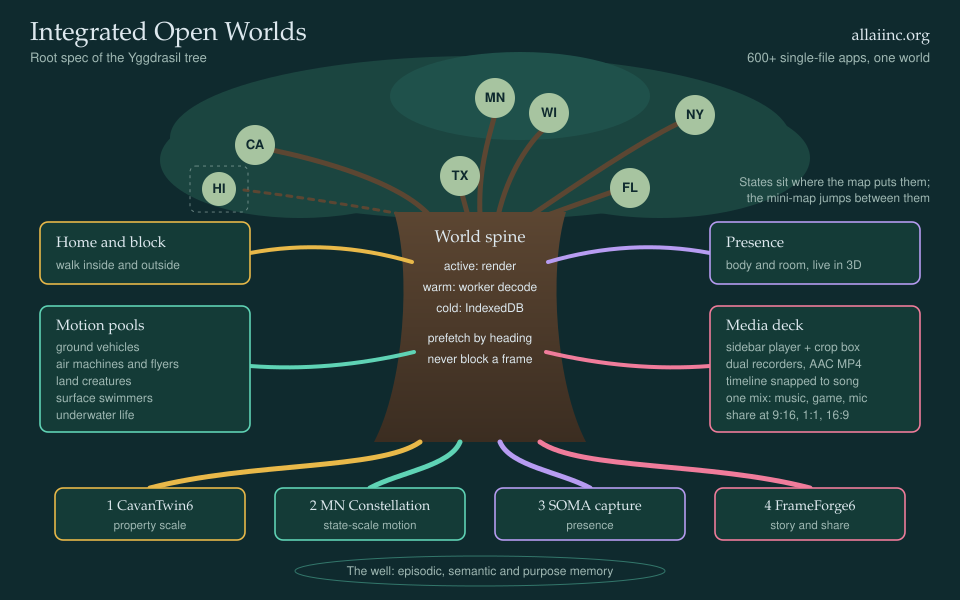
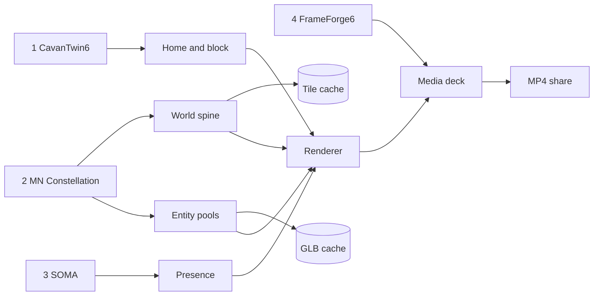

# 🌳 Integrated Open Worlds
**Root spec of the Yggdrasil tree for [AI-UI-UX-JS](https://github.com/AaronCWacker/AI-UI-UX-JS) → [allaiinc.org](https://allaiinc.org)**

> Walk your home, drive the state, fly the coast, swim the reef, and film yourself inside it, cut to your own song.

# Comparison between Open World and Map:

## 0 · First principles
1. **Never block the player.** Everything past the horizon loads, decodes and caches in the background.
2. **Everything is data.** Terrain is tiles, entities are GLBs, media is clips: keyed, pooled, cached.
3. **The user is in the world; the world is on the timeline.** Capture → scene → composition → share.
4. **One file, zero build.** Single HTML/JS, CDN libraries only, no npm, served from GitHub Pages.
5. **Cache once, travel instantly.** A visited place becomes a local place.

## 1 · Four roots (integration priority)
| # | Root | Gives the world | Live |
|---|------|-----------------|------|
| 1 | [CavanTwin6](https://github.com/aaroncwacker/AI-UI-UX-JS/blob/main/CavanTwin6.html) | Property scale: walk inside and outside a home on its block | [▶](https://allaiinc.org/CavanTwin6.html) |
| 2 | [⭐ MN Constellation](https://github.com/aaroncwacker/AI-UI-UX-JS/blob/main/%E2%AD%90MinnesotaConstellation.html) | State scale: low-latency drive, fly, swim | [▶](https://allaiinc.org/%E2%AD%90MinnesotaConstellation.html) |
| 3 | [SOMA Body & Room](https://github.com/aaroncwacker/AI-UI-UX-JS/blob/main/SOMA-Body-and-Room-Real-to-3D.html) | Presence: user body and room as connected 3D space | [▶](https://allaiinc.org/SOMA-Body-and-Room-Real-to-3D.html) |
| 4 | [FrameForge6](https://github.com/aaroncwacker/AI-UI-UX-JS/blob/main/FrameForge6.html) | Story: image, mp3, mp4 timeline → shareable MP4 | [▶](https://allaiinc.org/FrameForge6.html) |

## 2 · World spine: streaming universe
**Scale ladder:** State → City → Block → Property → Room, each handing off to the next with no load screen.
- **Topography:** city maps drape roads, water and buildings over DEM heightmap tiles.
- **Rings:** *active* (render + physics) · *warm* (worker decode, GPU upload queued) · *cold* (IndexedDB / Cache API).
- **Prefetch:** rank tiles by time-to-arrival along heading × speed; horizon and off-screen first.
- **Budget:** fixed ms per frame for GPU uploads, idle time for the rest; LOD cross-fades, never pops.
- **States:** MN · WI · NY · FL · TX · CA · HI on a tiny US mini-map; ◐ loading, ● cached and jumpable.

## 3 · Entity pools: bulk GLB loader
Drop many `.glb` files; keywords in the filename, node names and glTF `extras` assign each to a pool.

| Pool | Keywords (seed list) | Behavior |
|------|----------------------|----------|
| 🚗 Ground | car, truck, bus, bike, tractor | road-following, drivable |
| ✈️ Air | plane, heli, drone, jet, bird, dragon | flight model, flyable |
| 🐾 Land creatures | dog, deer, horse, bear, moose | wander, herd |
| 🚤 Surface | boat, ship, kayak, duck, swan | buoyancy, drivable |
| 🐙 Underwater | fish, whale, shark, sub, octopus | swim volumes, schooling |
| 📦 Props | no match | static, instanced |

Pools are instanced, LOD'd and recycled; any pool member can become the player's vehicle.

## 4 · Presence: SOMA
- MediaPipe pose, hands and face drive a live 3D avatar while playing.
- Room capture becomes a textured backdrop mesh, portal-linked from the CavanTwin home.
- Body and room are recordable layers for the Media deck.

## 5 · Media deck: FrameForge
- **Player:** mp3/mp4 queue; music and lyric video in a resizable right sidebar.
- **Crop box:** drag a bounding box on the sidebar video; that region fills the main capture view.
- **Dual recorders:** canvas `captureStream(60)` + screen `getDisplayMedia`; AAC-first MP4 via `pickMime`, WebM fallback.
- **Mixer:** one `AudioContext` bus (music + game + mic) feeds the recorder while another mp4 keeps playing.
- **Timeline:** images, mp3, mp4 and captures snap to song length (loop, ping-pong, shuffle-cut, speed-ramp).
- **Output:** 9:16 · 1:1 · 16:9 exports into an IndexedDB gallery (play, download, delete).

## 6 · Runtime map

## 7 · Milestones
- [ ] **M1 Spine:** MN tiles stream with topography at 60 fps, zero hitches
- [ ] **M2 Home:** a CavanTwin property drops into an MN block; walk in and out seamlessly
- [ ] **M3 Pools:** bulk GLB import → keyword pools → drive, fly, swim
- [ ] **M4 States:** all seven cached, mini-map jumps are instant
- [ ] **M5 Presence:** SOMA avatar and room portal in-world
- [ ] **M6 Media:** sidebar crop, dual recording, song-snapped MP4 export
- [ ] **Always:** telemetry panel (adapter limits, fps, tiles/min, cache MB)

## 8 · Outer branches: asset constellations
- **Mine:** [GitHub](https://github.com/AaronCWacker/AI-UI-UX-JS) · [allaiinc.org](https://allaiinc.org/) · [Hugging Face](https://huggingface.co/awacke1)
- **Frontier AI:** [Claude](https://claude.ai/recents) · [ChatGPT](https://chatgpt.com/library) · [Grok](https://grok.com/imagine) · [Gemini](https://gemini.google.com/library)
- **Media:** [YouTube](https://www.youtube.com/feed/history) · [YouTube TV](https://tv.youtube.com/library) · [Krea](https://www.krea.ai/assets) · [Magnific](https://www.magnific.com/app/projects/all-assets) · [Magnific Editor](https://magnific.ai/editor/) · [Runway](https://app.runwayml.com/video-tools/teams/aaroncwacker/ai-tools/assets) · [Suno](https://suno.com/me) · [Luma](https://dream-machine.lumalabs.ai/ideas) · [Leonardo](https://app.leonardo.ai/library) · [Hailuo](https://hailuoai.video/mine) · [Kling](https://kling.ai/app/user-assets/materials)
- **People:** [Facebook](https://www.facebook.com/) · [Google Photos](https://photos.google.com/people) · [X Pro](https://pro.x.com/i/decks/) · [Messages](https://messages.google.com/web/conversations) · [Gmail](https://mail.google.com/mail/u/0/#inbox) · [Outlook](https://outlook.live.com/mail/)
- **Store · Games · Playlists:** [HiBid](https://hibid.com/account/pastbids) · [Wizards](https://company.wizards.com/en) · [Steam](https://store.steampowered.com/) · [YouTube playlists](https://www.youtube.com/feed/playlists) · [Repos](https://github.com/AaronCWacker?tab=repositories)

## 9 · The well: why this exists
- **Episodic memory:** the felt sense of having been somewhere. *The world.*
- **Semantic memory:** knowledge of the world and of one's own history. *The data.*
- **Purpose of memory:** coherence that links events into a continuous self. *The story.*

## 10 · Growing the tree
- This file stays at or under 100 lines: it is the table of contents, not the book.
- Each branch grows its own `docs/<branch>.md` and earns one line here.
- Every revision updates the diagram, the runtime map and the milestones together.

# Integrated Open Worlds

I want to expand my sim for making an open world where city to city I can have a prgressive loaded full detail universe where the city map has topography built in as 3d using my code below.  Integrate the runtime loading in background so user can play while areas on the horizon or off screen can continue to load and cache while player drives and then doesnt freeze or delay when entering a new area.  for the simulation we want to experience all vehicles and ability to bulk load GLB files then assigned to pools based on keywords in glb  which allows us to manage cars, flying machines and creatures, swimming and underwater creatures.  Use the patterns in my code together and support the all around best player for mp3 and mp4 which allows us to mix a second screen to the right sidebar with our music video and lyrics mp4 playing and user to resize that to set bounding box of part of video shown to user in larger screen capture recorded menu of mp4 playing while another mp4 is recording to include both sound and video tracks.  

I want to do these states in detail: 1. MN, 2. WI, 3. NY, 4. FL, 5. TX, 6. CA, and 7. HI - these are selectable in a tiny US Mini-map to jump between states once loaded and cached in browser..  

2. I want to integrate my media pipe ability to record the user in 3d while playing using media pipe (SOMA example) and record the context of room and use video mixing and recording timeline from FrameForge.  SOMA example is here:  These four should be an integrated single app with all the world richness, the room and person capture in SOMA, Video recording and timeline of images mp3 mp4 together on timeline (Frameforge), And 3D topographic interactive world (Constellation and Cavan Twin for Home and driving map from topography.

4. For ordering of Priorities as we integrate all four my high level guidance is 1. CavanTwin6 provides the single property walk inside outside experience when on a block.  2. MN Constellation provides the driving, flying, swimming experiences, 3. SOMA Body and Room Capture allows the person capture experience for user and user's room background which becomes 3d Connected space.  and then 4. FrameForge for being able to compose videos of optimal size snapped to songs for sharing with world as mp4 video screen capture experience.

Below is an account of the original code bases for my four vectors of development along with playable core assets so we can iterate with source and integrated body of work creation.

1. Cavan Twin - Provides a Home World model, an Open World driveable/flyable/swimmable model:  https://github.com/aaroncwacker/AI-UI-UX-JS/blob/main/CavanTwin6.html
2. MN Constellation - Provides high performance low latency world sim a state at a time:  https://github.com/aaroncwacker/AI-UI-UX-JS/blob/main/%E2%AD%90MinnesotaConstellation.html
3. SOMA Body Capture - Provides biometric 3d body capture and room capture for user presence: https://github.com/aaroncwacker/AI-UI-UX-JS/blob/main/SOMA-Body-and-Room-Real-to-3D.html
4. FrameForge - Provides Video, Audio, and Image timeline IO which allows to produce communication videos as output processed for replayable experiences for Social Sharing:  https://github.com/aaroncwacker/AI-UI-UX-JS/blob/main/FrameForge6.html

These can be tested individually:
- https://allaiinc.org/ with apps below:
- CavanTwin6.html
- %E2%AD%90MinnesotaConstellation.html
- SOMA-Body-and-Room-Real-to-3D.html
- FrameForge6.html

# Organization of Assets

# My AI Assets
- https://github.com/AaronCWacker/AI-UI-UX-JS/new/main
- https://allaiinc.org/
- https://huggingface.co/awacke1

# Frontier AI Assets
- https://claude.ai/recents
- https://chatgpt.com/library
- https://grok.com/imagine
- https://gemini.google.com/library

# Media Assets
- https://www.youtube.com/feed/history
- https://tv.youtube.com/library
- https://www.krea.ai/assets
- https://www.magnific.com/app/projects/all-assets
- https://magnific.ai/editor/
- https://app.runwayml.com/video-tools/teams/aaroncwacker/ai-tools/assets
- https://www.krea.ai/assets
- https://www.magnific.com/app/projects/all-assets
- https://app.runwayml.com/video-tools/teams/aaroncwacker/ai-tools/assets
- https://suno.com/me
- https://dream-machine.lumalabs.ai/ideas
- https://app.leonardo.ai/library
- https://hailuoai.video/mine
- https://kling.ai/app/user-assets/materials

# People Assets
- https://www.facebook.com/
- https://photos.google.com/people
- https://pro.x.com/i/decks/
- https://messages.google.com/web/conversations
- https://mail.google.com/mail/u/0/#inbox
- https://outlook.live.com/mail/

# Store Assets
- https://hibid.com/account/pastbids

# Playlists - Asset Sets
- https://www.youtube.com/feed/playlists
- https://github.com/AaronCWacker?tab=repositories

# Game Assets
- https://company.wizards.com/en
- https://store.steampowered.com/

# Brain and Memory Glossary
- _episodic memory_ - recollective feelings of being somewhere
- _semantic memory_ - concrete knowledge of world and personal history
- _purpose of memory_ - coherence connecting events to for continuity with self belief and feelings
