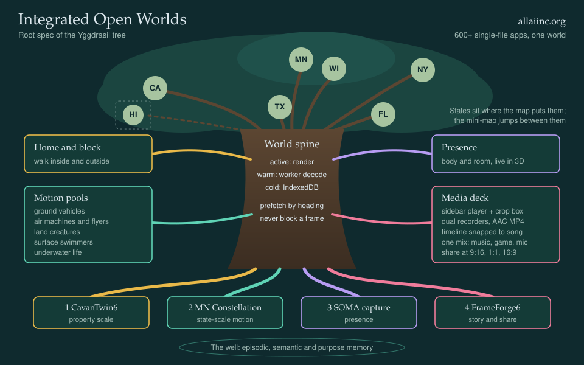
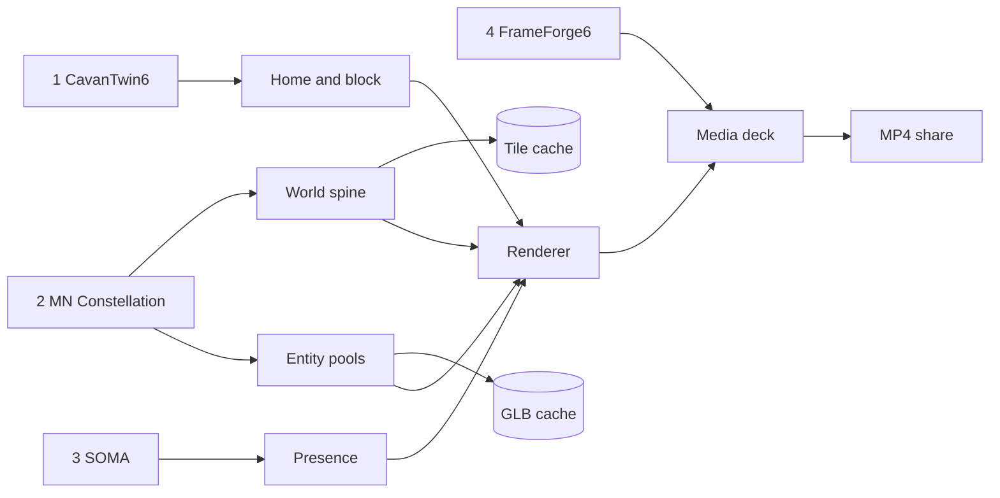

# Games that are educational and fun about Health and Wellness

# 1. GPT:

# 🧠 Playful Care: 10 Game Inspirations

> Medical, behavioral and social-learning inspirations—not validated treatments.
> Sources [1–9] below; AI concepts are proposed additions.

| # | 🎮 Game / format | ✨ Original appeal | 🐝 New hive-mind design: three sentences |
|---|---|---|---|
| 1 | 🏥 Two Point Hospital · video [1,2] | Comedy illnesses + hospital building | Build a delightfully chaotic clinic. AI teammates explain bottlenecks through animated patient journeys. Unlock upgrades by teaching another player your solution. |
| 2 | 🩺 Project Hospital · simulation [1] | Diagnostic puzzles + hospital operations | Solve fictional cases with incomplete clues. Independent AI specialists debate evidence on a shared board. Earn detective combos for revising assumptions and explaining uncertainty. |
| 3 | 🥼 Surgeon Simulator · video [3] | Clumsy controls + spectacular mishaps | Run a slapstick robot operating room. Human and AI partners coordinate tools through short callouts. Replay hilarious mistakes as slow-motion teamwork puzzles. |
| 4 | 🌍 Plague Inc: The Cure · app/sim [4] | Outbreak response + public trust | Coordinate a planet-wide rescue team. AI advisers reveal competing health, resource and trust consequences. Replay branching futures to discover surprising cooperation bonuses. |
| 5 | 🦠 Pandemic · board [5] | Shared crisis + complementary roles | Give every teammate different outbreak clues. AI remembers discoveries while humans negotiate priorities. Unlock rescue chains through coordinated handoffs instead of one dominant commander. |
| 6 | 🧠 Psychonauts 2 · adventure [6] | Surreal mental worlds + visual metaphor | Explore imaginative worlds shaped by fictional characters’ perspectives. AI companions offer alternative interpretations without diagnosing players. Compassionate choices transform obstacles into surprising allies. |
| 7 | 👁️ Hellblade: Senua’s Sacrifice · adventure [6] | Subjective perception + immersive storytelling | Explore puzzles where context changes what you notice. A companion helps compare observations without declaring one perspective universal. Unlock paths through curiosity, trust and careful listening. |
| 8 | ⚡ Operation · tabletop [7] | Dexterity + instant buzzer suspense | Repair a whimsical mechanical patient. An AI partner demonstrates movements with adjustable ghost trails. Progress from assisted practice to satisfying solo precision challenges. |
| 9 | 🌈 Wavelength · board/app [8] | Perspective guessing + funny debate | Place clues along surprising meaning spectrums. AI reveals several plausible interpretations after everyone commits. Score shared understanding while celebrating unexpected viewpoints. |
| 10 | 🃏 The Mind · cards [9] | Silent timing + collective suspense | Cooperatively sequence cards without speaking. An AI partner adapts its timing using only permitted public cues. Reveal the group’s rhythm afterward, then attempt harder synchronized rounds. |

## 🐝 Hive-Mind AI Pair Programming

1. 🧑‍💻 **Builder:** An experienced developer combines AI engineering, learning psychology and perception-aware interface design.
2. 🤝 **Method:** Human + builder AI + independent critic share memory; predict → build → play → explain → revise.
3. 🚀 **Ambition:** Pursue collective intelligence through tool use, simulation and critique; measure progress by what people can explain, transfer and accomplish independently.


# 2. Claude

🐝 HIVE MIND AI PAIR PROGRAMMING — THE LENS
├─ 👤 Pilot      → human sets intent, taste, ethics; commits FIRST
├─ 🤖 Navigator  → AI proposes, critiques, explains (one scarce hint/turn)
├─ 🐝 Swarm      → crowd + agents vote, debate, ensemble
├─ 📚 Learning   → retrieval, spacing, desirable difficulty, dual coding
├─ 👁️ Perception → Gestalt, predictive processing, attention budget
└─ 🚀 Loop       → generate → critique → verify → teach-back (player gets smarter)

| #  | 🎮 Hit Title            | Type        | 🐝 Hive-Mind Redesign (3 sentences)                                                                                                                                          |
|----|-------------------------|-------------|------------------------------------------------------------------------------------------------------------------------------------------------------------------------------|
| 1  | 🦠 Pandemic Legacy      | Board (co-op)| Each player pairs with an AI Navigator that offers one outbreak forecast per turn. The campaign learns your team's blind spots and mutates diseases to hit them. Debrief cards show the hive out-predicting any solo player. |
| 2  | 🩺 Operation            | Board (dexterity)| A phone camera tracks tremor while an AI coach trains steady micro-motion. Each extracted gag ailment flips into a real anatomy card. Family mode has the hive vote on triage order. |
| 3  | ☣️ Plague Inc.          | Mobile/PC sim| You and your AI agents defend against an adversarial pathogen trained on millions of runs. Policy cards carry real trade-off curves for vaccines, travel and messaging. Misinformation fog blurs the map until players verify sources. |
| 4  | 🏥 Two Point Hospital   | Mgmt sim    | Wacky diseases map to real quality measures, and patient happiness becomes a Star rating. Describe a care pathway in plain words and the AI builds it, then you watch bottlenecks emerge. Leaderboards reward closed care gaps, not just profit. |
| 5  | 🫀 Surgeon Simulator    | Physics chaos| Each limb belongs to a different player, with an AI stabilizer that learns their intent. Fail-forward replays narrate what a pro would have done. Streamer mode turns Twitch/YouTube chat into the hive. |
| 6  | 🧬 Foldit               | Citizen science| Players accept, reject or remix AI-proposed folds using spatial intuition. A contribution ledger credits human versus AI insight. Weekly puzzles target real drug-target proteins. |
| 7  | 🌊 Sea Hero Quest       | Cognitive research| Navigation quests build each player's spatial-memory baseline. AI personalizes routes to detect drift over months. Grandparent and grandkid co-captain one boat. |
| 8  | 🎯 EndeavorRx           | FDA digital Rx| An adaptive multitask engine holds difficulty at the edge of ability, keeping kids in flow. The caregiver app frames progress as celebration rather than surveillance. Squad mode lets kids "lend focus" to teammates. |
| 9  | 🧠 Hellblade            | Narrative/psych| Co-designed with lived-experience advisors, AI voices model shifts in perception. Puzzles teach predictive processing by revealing the patterns the brain guesses into noise. Grounding techniques become power-ups. |
| 10 | 🔬 Project Hospital     | Realistic dx sim| You and the AI each commit a differential diagnosis before any test is ordered. A Bayesian scoreboard rewards calibration, meaning confidence that matches accuracy. Anonymized crowd differentials appear after the case closes. |

🎲 UNIVERSAL DESIGN RULES (all 10)
1️⃣ Human commits before AI reveals  → protects thinking, builds judgment
2️⃣ Scarce hints                     → desirable difficulty > spoon-feeding
3️⃣ Debrief = growth graph           → the player sees themselves get smarter
4️⃣ Swarm reveal last                → collective intelligence as reward, not crutch

📚 SOURCES
├─ 🦠 Pandemic Legacy
│  ├─ Wikipedia: Pandemic (board game) — BGG #2 of ~22k games
│  │  └─ https://www.wikipedia.com/wiki/Pandemie
│  ├─ Opinionated Gamers — became BGG #1 (2016)
│  │  └─ https://opinionatedgamers.com/2016/01/01/congratulations-to-pandemic-legacy-bggs-new-1-game/
│  ├─ Wargamer — overtook Gloomhaven in BGG rank
│  │  └─ https://www.wargamer.com/gloomhaven/ranking-third
│  └─ 📺 Dice Tower (YouTube) — Pandemic character ranking
│     └─ https://dicetower.com/video/pandemic-ranking-characters-zee-garcia
├─ 🩺 Operation
│  ├─ Wikipedia — 1965 Milton Bradley → Hasbro, ~$40M franchise
│  │  └─ https://en.wikipedia.org/wiki/Operation_(game)
│  ├─ God's World News — 2014 National Toy Hall of Fame finalist
│  │  └─ https://kids.gwnews.com/articles/hall-of-fame-finalist-2
│  └─ IEEE Spectrum — origin story
│     └─ https://spectrum.ieee.org/amp/hasbros-classic-game-operation-was-sparked-by-a-grad-students-electric-idea-2650279332
├─ ☣️ Plague Inc.
│  ├─ Ndemic 10th anniversary — 180M+ players, top-5 paid mobile
│  │  └─ https://gamespress.westeu-v2.propressroom.com/de/Plague-Inc-is-10-years-old
│  └─ Wikipedia — The Cure mode, board game spin-off
│     └─ https://en.wikipedia.org/wiki/Plague_Inc.
├─ 🏥 Two Point Hospital  +  🫀 Surgeon Simulator
│  ├─ TheXboxHub — World Health Day must-plays
│  │  └─ https://www.thexboxhub.com/if-you-do-anything-on-world-health-day-play-these-4-games/
│  ├─ VGTimes — Top 20 doctor/hospital games
│  │  └─ https://es.vgtimes.com/top-and-the-best/156400-mejores-juegos-de-doctor-y-hospital-top-20-en-pc-y-consolas.html
│  └─ PlayStation Store — Two Point Hospital
│     └─ https://www.playstation.com/en-ca/games/two-point-hospital/
├─ 🧬 Foldit
│  ├─ Baker Lab / Nat. Struct. Mol. Biol. (2011) — M-PMV protease solved
│  │  └─ https://www.bakerlab.org/?p=269
│  ├─ Nature — gamers solve protein structures
│  │  └─ https://www.nature.com/articles/477373e
│  └─ Science News — 57k players, beat Rosetta on puzzles
│     └─ https://www.sciencenews.org/article/world-proteincraft
├─ 🌊 Sea Hero Quest
│  ├─ Deutsche Telekom — 4.3M players, 117 yrs play
│  │  └─ https://www.telekom.com/en/corporate-responsibility/corporate-responsibility/sea-hero-quest-game-forgood-587134
│  ├─ NIHR Dementia Researcher — now a research platform
│  │  └─ https://www.dementiaresearcher.nihr.ac.uk/worlds-largest-study-of-spatial-navigation-offers-free-study-platform-to-researchers
│  └─ Games for Change — profile
│     └─ https://www.gamesforchange.org/games/sea-hero-quest/
├─ 🎯 EndeavorRx
│  ├─ CNN via KSL — first FDA-authorized game therapy
│  │  └─ https://www.ksl.com/article/news/features/family/children-with-adhd-can-now-be-prescribed-a-video-game-fda-says/46765394
│  └─ Built In Boston — de novo pathway, insurer coverage
│     └─ https://www.builtinboston.com/articles/endeavorrx-adhd-video-game-fda-approved-akili-interactive-labs
├─ 🧠 Hellblade
│  ├─ BBC Science Focus — psychosis portrayal, Prof. Paul Fletcher
│  │  └─ https://www.sciencefocus.com/the-human-body/how-hellblade-senuas-sacrifice-deals-with-psychosis
│  ├─ GamesBeat — Wellcome Trust grant
│  │  └─ https://gamesbeat.com/game-boss-interview-tameem-antoniades-journey-into-madness-with-hellblade/
│  └─ Royal College of Psychiatrists — blog review
│     └─ https://www.rcpsych.ac.uk/discoverpsychiatry/blogs/gamingthemind/afantasybasedinreality.aspx
└─ 🔬 Project Hospital
   └─ Gamepressure — medical games encyclopedia
      └─ https://www.gamepressure.com/games/medical

# 3. Grok

# 🧠 Hive-Mind Med Games — Top 10 Zeitgeist

Lens: human (AI + learning psych + perception) × AI swarm. Fun = desirable difficulty + shared mental model + a punchline.

| # | Hit | 3-sentence hive design |
|---|-----|------------------------|
| 1 | 🔌 **Operation** — Hasbro Christmas classic; surgeons-play videos in the millions | Tweezers stay, but the buzzer is a perception tutor: the swarm lights the safe gestalt path for one beat, then withdraws it. Misses become micro-lessons in tremor, not shame. A hive partner whispers one motor cue (“wrist, not fingers”) so adults replay for skill, kids for the buzz. |
| 2 | 🦠 **Pandemic** / Legacy — BGG staple, holiday coop gift | Four roles share one infection map; the swarm only speaks when the group’s model diverges (“you are treating the symptom city”). Legacy stickers unlock only after a debrief card the AI drafts from your actual mistakes. Fun is the argument that ends in a correct shared picture. |
| 3 | 🧤 **Surgeon Simulator** — viral on purpose; ~2.3M YouTube videos historically | Physics stays cursed, but a perception overlay ghosts the correct grip for 400 ms, then vanishes (dual coding, then retrieval). The hive logs which tool you always drop and spawns that tool in the next absurd op. Comedy is the teacher; competence is the joke’s punchline. |
| 4 | 🏥 **Two Point Hospital** — Theme Hospital heir; builder let’s-plays in the multi-millions | Illnesses stay silly; diagnosis is a real differential the swarm hides inside the cartoon. Staff training is spaced: a nurse forgets a step unless you reteach it three sessions later. Building the ward is fun because the AI names the bottleneck you refuse to see. |
| 5 | 🧫 **Plague Inc.** — Doctor Mike / strategy staple | You play the pathogen, then the swarm flips you to WHO mid-run with your own evolved traits as the enemy. Perception trick: the map desaturates where your mental model of spread is wrong. Winning both sides once is the only “cure” ending. |
| 6 | 🫀 **Bio Inc. Redemption** — House-style systems puzzle | Cause and cure are the same graph; the hive forces a commit before the lab returns, then shows the path you skipped. Redemption mode only opens if you can explain the miss in one sentence the AI scores for causal clarity. Fun is being wrong in public and fixing the model. |
| 7 | ✂️ **Trauma Center** / Team — rhythm surgery cult | The Healing Touch is a perception reset: slow time only after you name the anatomy. The swarm raises tempo on procedures you have already automated and slows novel ones (desirable difficulty). Team mode passes the tool only if your callout matches the other’s model. |
| 8 | 🧬 **Cytosis** + 💉 **Virus!** — BGG cell-bio euro + party card hit | Cytosis keeps worker placement; Virus! keeps the take-that organ steal. Hive glue: a 60-second “why this card” stamp both tables must answer or the steal fizzles. The AI deals a misconception card from last round so the party game quietly reteaches. |
| 9 | 📱 **Level Ex** / **Full Code** — clinician case games, demoed on med-ed YouTube | Real differentials, no cartoon. The swarm is a silent attending: it never gives the answer, it asks the one question that breaks your premature close. A perception strip shows which vital you did not look at. Fun is the status hit of a clean commit under a ticking board. |
| 10 | 🧩 **EndeavorRx** + **Friday Night at the ER** — FDA-cleared ADHD game + classic hospital table sim | EndeavorRx keeps adaptive attention thresholds; Friday Night keeps the 24-hour board. Hive bridge: table talk is transcribed into the next digital level’s distractors, so the team’s real failure becomes tomorrow’s stimulus. Fun is the group hearing its own bottleneck played back as a solvable level. |

## Outline — hive pair, one pass
- 👁️ Perception: show the gestalt once, then make them retrieve it
- 🧩 Learning psych: desirable difficulty, spaced reteach, one causal sentence
- 🧠 Superintelligence trick: swarm holds the group model, human holds the judgment
- 🎲 Fun rule: every miss mints the next toy, never a lecture

# 4. Gemini

# 🧠🐝 HIVE-MIND AI PAIR-PROGRAMMING × TOP 10 MEDICAL/CLINICAL GAMES ZEITGEIST

## 🌳 1. Hive-Mind AI Pair-Programming Architecture (Markdown Tree)
🧠 Superintelligent Clinical Game Design Engine
├── 👨‍💻 Human Developer / Player (Clinical Intuition & Creative Intent)
│   ├── 🎯 Sets high-level triage goals, ethical priorities & narrative stakes
│   └── 🔄 Co-evolves strategies in real time alongside synthetic AI agents
├── 👁️ Perception Theory Engine (Gibsonian Affordances & Predictive Processing)
│   ├── 🔥 Spatial Heatmaps: Turns invisible queue/bottleneck math into visual flow
│   ├── 🎧 3D Binaural Sonification: Maps uncertainty, tremors & psychosis priors to audio
│   └── 🕸️ Causal Organ Graphs: Visualizes multi-system pathophysiological cascades
├── 🪜 Psychology of Learning Layer (Vygotsky & Dual-Process Theory)
│   ├── 🛠️ Adaptive Scaffolding: Fades AI hints as player stays in the Zone of Proximal Development
│   ├── ⚡ System 1 -> System 2 Shift: Challenges confirmation bias with "zebra" anomalies
│   └── 🧘 Embodied Stress Inoculation: Uses bio-feedback to train motor/emotional regulation
└── 🌐 Collective Superintelligence Loop (The Hive Mind)
    ├── ⚔️ Adversarial Red-Teaming: Evolves pathogens/complications against player code
    ├── 🤝 Transactive Memory Sync: Prevents "alpha-player" bottlenecks in co-op teams
    └── 🧬 Global Heuristic Synthesis: Mutates layouts/protocols from top 1% of global runs

---

## 📊 2. Top 10 Healthcare, Clinical & Behavioral Games Master Matrix

| # | Game / Sim & Medium | Clinical Core & Hit-List Status | Perceptual & Learning Lever | 3-Sentence Hive-Mind AI Pair-Programming Design (Fun & Innovation) |
| :--- | :--- | :--- | :--- | :--- |
| **1** | 🦠 **Plague Inc: Evolved**<br>*(Digital Sim / App)* | Global pathogen mutation vs. public health defense; viral YouTube staple. | **Mental Model Inversion:** Learning epidemiological defense by simulating offense. | **1.** An AI red-team pair programmer co-evolves synthetic pathogen trees alongside your containment code, projecting R0 cascades onto a holographic globe. **2.** It applies cognitive contrast theory by flagging perceptual blind spots in supply-chain latency before exponential outbreaks occur. **3.** The thrill comes from a fast-paced "blitz chess" tug-of-war where outsmarting the collective hive mind unlocks superintelligent epidemiological foresight. |
| **2** | 🌍 **Pandemic / Legacy S1**<br>*(Co-op Board & Card)* | Multi-role outbreak eradication; Top-3 BGG all-time & holiday wishlist icon. | **Distributed Cognition:** Synchronizing asymmetric team roles under time pressure. | **1.** A tabletop AR/AI mediator tracks card probabilities and team communication patterns to prevent "alpha-player" cognitive bottlenecks. **2.** Using transactive memory theory, the AI whispers role-specific micro-insights to each player, turning the group into a synchronized hive mind. **3.** Nail-biting deck-escalation tension turns collaborative probability crunching into a cinematic, high-fiving triage victory. |
| **3** | 🏥 **Two Point Hospital**<br>*(Management Sim)* | Satirical hospital layout, queue flow, and staff behavioral quirks. | **Spatial Affordances:** Using humor and visual chunking to master queuing theory. | **1.** Your AI pair-architect uses eye-tracking and spatial perception heuristics to paint live heatmap desire-lines across your hospital floorplan. **2.** When GP queues snowball, the AI suggests one-click genetic layout mutations drawn from thousands of top-performing player hospitals. **3.** Watching slapstick illnesses get cured at hyper-speed delivers instant visual dopamine while stealthily teaching operations research. |
| **4** | 🩺 **Project Hospital**<br>*(Hardcore Clinical Sim)* | Authentic differential diagnosis, lab workflows, and ICU engineering. | **Dual-Process Theory:** Moving novices from slow checklists to rapid pattern recognition. | **1.** An AI diagnostic partner visualizes Bayesian probability trees in real time as you order labs, fading its scaffolding as your accuracy climbs. **2.** It challenges confirmation bias by injecting subtle "zebra" symptom anomalies that force you to interrogate your own perceptual assumptions. **3.** Cracking a life-threatening mystery diagnosis alongside your AI co-pilot feels like co-starring in an interactive episode of *House M.D.* |
| **5** | 🫀 **Surgeon Simulator 1 & 2**<br>*(Physics Co-op Sim)* | High-chaos, tactile physics surgery; massive YouTube creator phenomenon. | **Embodied Cognition:** Stress inoculation and motor adaptation under chaotic feedback. | **1.** A neuro-adaptive AI pair controller dynamically stabilizes or perturbs tool physics based on your live heart-rate variability and cursor tremor. **2.** In co-op hive-mind mode, the AI translates four players' chaotic inputs into a shared predictive ghost-hand, teaching non-verbal motor sync. **3.** Hilarious physics mishaps blend with clutch last-second saves to create an unforgettable party-game adrenaline rush. |
| **6** | ⚡ **Operation**<br>*(Dexterity Board Game)* | Fine-motor extraction under buzzer-shock pressure; perennial Christmas classic. | **Visuomotor Inhibition:** Immediate multimodal sensory feedback shaping motor precision. | **1.** An upgraded smart-board AI pair coach uses computer vision to map hand micro-tremors before the tweezers ever touch the cavity edge. **2.** It applies perceptual learning theory via rhythmic binaural audio cues that guide the player's motor cortex into a calm flow state. **3.** Turning steady-hand nerve control into a musical, rhythm-synced duel makes precision dexterity intensely replayable. |
| **7** | 🧠 **Hellblade: Senua's Sacrifice**<br>*(Behavioral / Neuro Sim)* | Visceral psychosis, trauma, and perceptual distortion built with neuroscientists. | **Predictive Processing:** Experiencing how altered sensory priors reshape reality. | **1.** Rather than a single assistant, your AI pair programmer manifests as a chorus of specialized cognitive voices—Critic, Intuition, and Strategist. **2.** The AI modulates visual pareidolia and spatial audio cues to train players in metacognitive emotional regulation under stress. **3.** Solving environmental puzzles by harmonizing competing inner voices transforms deep behavioral psychology into breathtaking mythic gameplay. |
| **8** | 🚑 **Medical Mysteries: NYC ER**<br>*(Co-op Clinical Card/Board)* | Timed ER triage, medication dosing, and narrative clinical deduction. | **Case-Based Reasoning:** Narrative time-boxing that cements clinical memory retention. | **1.** A voice-driven AI triage scribe listens to table debate and surfaces pharmacology interactions only when players ask the right Socratic questions. **2.** It adapts patient vital-sign deterioration curves to keep the team inside Vygotsky's Zone of Proximal Development. **3.** Racing the sunrise clock to stabilize a crashing patient delivers the pure cooperative rush of an ER trauma bay. |
| **9** | 🧬 **Bio Inc. Redemption**<br>*(Biomedical Strategy Sim)* | Dual Life/Death campaigns across 600+ real diseases and organ systems. | **Causal Network Perception:** Visualizing multi-organ feedback loops and cascades. | **1.** Your AI co-pilot renders the human body as a live neural-graph where every treatment ripples across cardiovascular, renal, and immune nodes. **2.** Players pair-program custom treatment protocols with the AI to counter adversarial disease mutations in real time. **3.** Switching between ruthless pathogen architect and miracle diagnostician offers endless strategic replayability. |
| **10** | 🏗️ **Clinic / Critical Care**<br>*(Strategy & ICU Board)* | Deep hospital spatial logistics (*Clinic*) & physician-built ICU deck management. | **Cognitive Offloading:** Mastering multi-variable constraints without memory overload. | **1.** An AI simulation companion crunches heavy bookkeeping in the background while projecting clean visual trade-off vectors onto the tabletop. **2.** It aggregates global hive-mind play data to pose dynamic "ethical triage dilemmas" that test both efficiency and bedside compassion. **3.** Deep euro-style engine building meets authentic ICU drama, rewarding smart resource orchestration with high-stakes clinical saves. |

---

## 🗂️ 3. Game Design Taxonomy by Clinical & Cognitive Domain (Markdown Tree)
🎮 Healthcare & Behavioral Game Zeitgeist
├── 🌐 Macro-Epidemiology & Distributed Team Cognition
│   ├── 🦠 Plague Inc: Evolved ──> [Red-Team Pathogen Co-Evolution + Holographic R0 Projections]
│   └── 🌍 Pandemic Legacy S1 ──> [AR Probability Mediator + Asymmetric Transactive Memory]
├── 🩺 Differential Diagnosis & Pathophysiological Networks
│   ├── 🩺 Project Hospital ──> [Bayesian Tree Scaffolding + Anti-Confirmation-Bias "Zebras"]
│   ├── 🚑 Medical Mysteries: NYC ER ──> [Socratic Voice Triage Scribe + Dynamic Vitals Decay]
│   └── 🧬 Bio Inc. Redemption ──> [600-Disease Causal Organ Graph + Adversarial Protocol Coding]
├── 🏗️ Operations Research, Queuing & ICU Resource Logistics
│   ├── 🏥 Two Point Hospital ──> [Eye-Tracked Desire-Line Heatmaps + Genetic Layout Mutations]
│   └── 🏗️ Clinic Deluxe / Critical Care ──> [Bookkeeping Offload + Hive-Mind Ethical Triage Dilemmas]
├── 🤲 Embodied Sensorimotor Dexterity & Stress Inoculation
│   ├── 🫀 Surgeon Simulator 1 & 2 ──> [HRV Tremor Stabilization + 4-Player Shared Ghost-Hand]
│   └── ⚡ Operation (Smart Edition) ──> [CV Micro-Tremor Mapping + Binaural Flow-State Audio]
└── 🧠 Neuro-Behavioral Perception & Metacognitive Regulation
    └── 🧠 Hellblade: Senua's Sacrifice ──> [Multi-Voice IFS Chorus + Pareidolia/Binaural Priors]

---

## 📚 4. Quoted Sources, YouTube Creators & Hit-List Pedigree (Markdown Tree)
🔍 Primary Verification & Cultural Hit Lists
├── 📺 YouTube Clinical & Gaming Phenomenon Channels
│   ├── 👨‍⚕️ Doctor Mike (Board-Certified Physician Playthroughs)
│   │   ├── "Doctor Plays Plague Inc." (15M+ views — epidemiological realism breakdown)
│   │   ├── "Doctor Plays Bio Inc." (5.1M+ views — organ cascade & diagnostic critique)
│   │   └── "Doctors Play Emergency Room Video Games" (1.3M+ views — Surgeon Simulator & ER sims)
│   ├── 🎮 Gaming & Simulation Hit-List Roundups
│   │   ├── CyberRaccoon & Gameranx ("Top 10 Medical Games That Will Cure Your Boredom")
│   │   └── Plastic Swans (Deep-dive clinical simulation guides on Project Hospital)
│   └── 🎲 Tabletop & MedTube Playthrough Channels
│       ├── CO-OP FOR TWO & Med Student Vlogs (Medical Mysteries: NYC Emergency Room)
│       ├── Heavy Cardboard (Full 3-player strategic teach & playthrough of Clinic: Deluxe Edition)
│       └── Before You Play (Teach & review of physician-designed Critical Care: The Game)
└── 🏆 BoardGameGeek (BGG), Steam & Holiday Wishlist Pedigree
    ├── 🥇 BoardGameGeek All-Time Rankings (100,000+ Tracked Games)
    │   ├── Pandemic Legacy: Season 1 (Ranked Top 3 Overall All-Time; Zatu Games Top 10)
    │   └── Pandemic (Base Game — Perennial gateway cooperative bestseller by Matt Leacock)
    ├── 🎄 Retail & Christmas Wishlist Staples
    │   ├── Operation (Hasbro — Multi-decade Top-10 holiday family dexterity gift list staple)
    │   └── Medical Mysteries: NYC ER (Identity Games / Buffalo Games — Breakout retail hit)
    └── 💻 Digital Storefront Chart-Toppers (Steam / PlayStation / Xbox / Mobile)
        ├── Two Point Hospital & Plague Inc: Evolved (Multi-million unit simulation chart leaders)
        └── Hellblade: Senua's Sacrifice (BAFTA-winning neuroscience/psychosis collaboration)


# 5. Meta
| # | 🎮 Game | 🧩 Type | 🔥 Why It's A Hit | 🤖👥 Hive-Mind AI Remix - 3 Sentence Fun Design |
|---|---------|---------|-------------------|------------------------------------------------|
| 1 | 🦠 Plague Inc: Evolved | Mobile/PC Sim | Strategy + realistic sim【3702962670271729041†L34-L38】, 160M+ players, Markiplier staple | Co-pilot mutates with you, learning from 10k live hive pathogens. Perception hack: you hide symptoms in humanity's attentional blind spots. Losing is fun - your fails train a shared epi-model that makes all players smarter. |
| 2 | 🔪 Surgeon Simulator | PC/VR Physics | 2.3M YouTube videos / 200M views【3702962670271729041†L61-L65】 | AI is your clumsy intern hand that learns your tremor like 【entity-Copilot¦canonical_name=Copilot】. Embodied cognition: you learn via hilarious failure loops. Your cleanest save becomes a ghost-surgeon coaching the next player. |
| 3 | 🏥 Two Point Hospital | PC/Switch Mgmt | Most famous medical management game【2891456206083992980†L18-L21】 | You build wards, AI pair-programs staffing by predicting burnout from hive data. Comedy diseases = anxiety reappraisal, flow state. Optimal layouts auto-merge into hive hospital template library. |
| 4 | 🩺 Project Hospital | PC Realistic Sim | The "real" Two Point, top sim lists | You architect like code, AI is the debugger for patient flow + EHR. Real differential diagnosis trees with explainable second opinions. Fun because realism matters - your triage patterns upgrade collective model. |
| 5 | 🌍 Pandemic | Board Co-op | Ranked 162 overall BGG, 130k+ ratings【6555172978812612044†L40-L42】, co-op classic【6555172978812612044†L36-L38】 | Physical board + digital AI outbreak engine trained on BGG hive plays. Each role literally sees different perception layer. Chat logs teach negotiation under uncertainty to future teams. |
| 6 | ⚡ Operation | Board Dexterity | Perennial Top 10 Christmas wish list | AR tweezers + AI buzz measuring hand tension. Scaffolds difficulty when it senses frustration (psych of learning). Fine motor data builds hive dexterity profile for kids. |
| 7 | 🧬 Cytosis | Board Worker Placement | Cell board【6555172978812612044†L23-L26】, inside a human cell【6555172978812612044†L71-L74】 | You place workers as enzymes, AI is mRNA mentor pair-programming ribosomes. Resource = mRNA/ATP from nucleus/mitochondria. Combo chains teach real AP Bio while hive discovers optimal cell builds. |
| 8 | ❤️ OrganAttack / Virus! | Card Party | TikTok/Xmas viral anatomy take-that | AI dealer = immunology tutor that roasts you. Memory palace learning for organs + 2-min rounds. Hive meta tracks which organ steals dominate. |
| 9 | 🧩 Foldit | PC Citizen Science | Solved real HIV enzyme via gamers | You fold proteins like coding, AI co-folds impossible shapes. Spatial perception theory: humans see energy landscapes AI misses. Your folds publish real science, making hive smarter. |
| 10 | 🧠 EndeavorRx / SuperBetter | App / FDA Rx | FDA first game for ADHD 8-12【1903004419420876843†L32-L35】, peer-reviewed ↓ depression/anxiety【1903004419420876843†L5-L7】 | AI adapts focus window in 25-min loops, pair-programs attention. Boss = your anxiety/depression, quests = CBT powers. Fun because progress is measurable and hive learns which quests actually lift mood. |

| 📊 Source Proof | Game | Hit Evidence |
|---|---|---|
| YouTube | Surgeon Simulator | 2.3M videos, 200M views【3702962670271729041†L61-L65】 |
| YouTube/Game Sites | Two Point Hospital | Most famous medical management【2891456206083992980†L18-L21】 |
| YouTube/Steam | Plague Inc | High strategy + terrifyingly realistic sim【3702962670271729041†L34-L38】 |
| BGG | Pandemic | Rank 162 overall, 130k+ ratings【6555172978812612044†L40-L42】 + Top Co-op【6555172978812612044†L36-L38】 |
| BGG/Kickstarter | Cytosis | Cell-shaped board, worker placement in human cell【6555172978812612044†L23-L26】【6555172978812612044†L71-L74】 |
| FDA / Clinical | EndeavorRx | First FDA-approved video game for ADHD【1903004419420876843†L32-L35】 |
| Clinical | SuperBetter | Peer-reviewed ↓ depression/anxiety【1903004419420876843†L5-L7】 |
| Xmas Lists | Operation, OrganAttack, Virus! | Hasbro / Spanish card game - perennial Amazon Top 10 Family Games Dec |

# 🧠👥 Hive-Mind AI Pair Programming Pattern - distilled
principles:
    - perception: predictive coding - AI shows you what you *expect* vs what *is*
    - learning: failure-based + flow + scaffolding, not lecturing
    - superintelligence: every play -> distilled model -> ghost coach for next player
loop: |
    1. You act -> 2. AI pair explains why it would do different
    3. Hive votes on best move -> 4. Shared model levels up everyone
fun_hooks: [ dark humor, dexterity buzz, take-that steals, co-op panic, real-world impact ]


---


---


# Libraries to use with top AI models:

## 🧰 My AI Development Libraries

Libraries powering my AI apps, interactive simulations, multiplayer worlds, and creative tools.

> 📌 Provisional counts from a partial chat-history review—not verified lifetime totals. Each library is counted once per retrieved chat group. Shortlists are sorted by descending count.

### 🟨 JavaScript Libraries

| Library | 💬 Chats found | 🔗 Source code |
|---|---:|---|
| 🧊 **Three.js** | **29** | [mrdoob/three.js](https://github.com/mrdoob/three.js) |
| 🤝 **PeerJS** | **19** | [peers/peerjs](https://github.com/peers/peerjs) |
| 🗺️ **Leaflet** | **3** | [Leaflet/Leaflet](https://github.com/Leaflet/Leaflet) |
| 🖐️ **MediaPipe** | **3** | [google-ai-edge/mediapipe](https://github.com/google-ai-edge/mediapipe) |
| 🧠 **TensorFlow.js** | **3** | [tensorflow/tfjs](https://github.com/tensorflow/tfjs) |
| 🥽 **A-Frame** | **2** | [aframevr/aframe](https://github.com/aframevr/aframe) |
| 🔊 **Howler.js** | **2** | [goldfire/howler.js](https://github.com/goldfire/howler.js) |
| 🎵 **Tone.js** | **2** | [Tonejs/Tone.js](https://github.com/Tonejs/Tone.js) |
| 🤗 **Transformers.js** | **2** | [huggingface/transformers.js](https://github.com/huggingface/transformers.js) |

### 🐍 Python Libraries

| Library | 💬 Chats found | 🔗 Source code / package |
|---|---:|---|
| 🎈 **Streamlit** | **20** | [streamlit/streamlit](https://github.com/streamlit/streamlit) |
| 🐼 **pandas** | **11** | [pandas-dev/pandas](https://github.com/pandas-dev/pandas) |
| 🔢 **NumPy** | **10** | [numpy/numpy](https://github.com/numpy/numpy) |
| 🧠 **OpenAI SDK** | **8** | [openai/openai-python](https://github.com/openai/openai-python) |
| 🖼️ **Pillow** | **8** | [python-pillow/Pillow](https://github.com/python-pillow/Pillow) |
| 🔥 **PyTorch** | **8** | [pytorch/pytorch](https://github.com/pytorch/pytorch) |
| 🌐 **Requests** | **8** | [psf/requests](https://github.com/psf/requests) |
| 📊 **Plotly** | **7** | [plotly/plotly.py](https://github.com/plotly/plotly.py) |
| 🤗 **Transformers** | **7** | [huggingface/transformers](https://github.com/huggingface/transformers) |
| 🎛️ **Gradio** | **6** | [gradio-app/gradio](https://github.com/gradio-app/gradio) |
| 🥣 **Beautiful Soup** | **5** | [Official source / downloads](https://www.crummy.com/software/BeautifulSoup/) |
| 🎨 **Diffusers** | **4** | [huggingface/diffusers](https://github.com/huggingface/diffusers) |
| 📦 **Hugging Face Hub** | **4** | [huggingface/huggingface_hub](https://github.com/huggingface/huggingface_hub) |
| 👁️ **OpenCV** | **4** | [opencv/opencv-python](https://github.com/opencv/opencv-python) |
| 🕒 **pytz** | **4** | [PyPI package / source links](https://pypi.org/project/pytz/) |

**🔎 Counting notes:** Aliases are consolidated: `PIL` → Pillow, `cv2` → OpenCV, and `torch` → PyTorch. Three.js addons and TSL are grouped under Three.js. Browser APIs and Python standard-library modules are excluded.

# How to Multi-Context with external facing or git referenced inclusion autorag context of code to produce consistent software.

worldmakers codex with the additon of capability to copy when clicked.  Copy highest resolution png of current window and paste to a base64 mime type download - add link for it if needed which dynamically updates and force dowloads with appropriate naming of the png with the selected area.  The text in X sized post links should also be touch clickable to copy which allows easy transfer of picture and copy at quick click sets using clipboard and easy download with strong ai naming - [https://allaiinc.org/Worldmakers-Codex.html](https://allaiinc.org/Worldmakers-Codex.html) and mix with [https://allaiinc.org/Block-Quest-5-v5.4.0.html](https://allaiinc.org/Block-Quest-5-v5.4.0.html) to gain multiplayer, waves model build skills and geometry which is expanded with this.  Then have it all set in landscape and road generation with [https://allaiinc.org/Chrome-Havoc-8-Source.html](https://allaiinc.org/Chrome-Havoc-8-Source.html) and exact topography and places to fight in from [https://allaiinc.org/Constellation-Atlas-Forge.html](https://allaiinc.org/Constellation-Atlas-Forge.html)


# 🗂️ Ordinal Folder System for Memory Augmentation
## 📜 Methodology
> 💬 "order rank from largest to smallest is a natural way to foster short & long term memories."
**Sort key:** aggregate size, strictly descending. 01 through 08 fall in exact size order.✅

---

## 🏠 Track 1: Life Memories (scanned 10/7/2026)
### Emoji Outline
- 🎬 **01-MP4** · Motion Memories · 354.5 GB · 8,954 files
- 🖼️ **02-PNG** · Still Frames · 52.6 GB · 14,918 files
- 🎵 **03-MP3** · Sound & Song · 9.2 GB · 2,115 files
- 📦 **04-ZIP** · Bundles & Archives · 5.5 GB · 38 files
- 📄 **05-PDF** · Fixed Records · 3.0 GB · 184 files
- 🧊 **06-GLB** · 3D Worlds · 0.68 GB · 126 files
- 🌐 **07-HTML** · Living Builds · 0.49 GB · 3,782 files
- 📝 **08-MD** · Plain Thought · 0.0008 GB · 26 files

### Table of Folders and Titles
| # | Folder | Emoji | Short Title | Size (GB) | Files | Subdirs | Avg File | % of Set |
|---|--------|-------|-------------|----------:|------:|--------:|---------:|---------:|
| 01 | 01-MP4 | 🎬 | Motion Memories | 354.50 | 8,954 | 476 | 39.6 MB | 83.22% |
| 02 | 02-PNG | 🖼️ | Still Frames | 52.60 | 14,918 | 28 | 3.5 MB | 12.35% |
| 03 | 03-MP3 | 🎵 | Sound & Song | 9.20 | 2,115 | 8 | 4.3 MB | 2.16% |
| 04 | 04-ZIP | 📦 | Bundles & Archives | 5.50 | 38 | 0 | 144.7 MB | 1.29% |
| 05 | 05-PDF | 📄 | Fixed Records | 3.00 | 184 | 3 | 16.3 MB | 0.70% |
| 06 | 06-GLB | 🧊 | 3D Worlds | 0.68 | 126 | 0 | 5.4 MB | 0.16% |
| 07 | 07-HTML | 🌐 | Living Builds | 0.49 | 3,782 | 331 | 128 KB | 0.11% |
| 08 | 08-MD | 📝 | Plain Thought | 0.0008 | 26 | 1 | 32 KB | <0.01% |
| **Σ** | **01–08** | 🗂️ | **Total** | **425.97** | **30,143** | **847** | **14.1 MB** | **100%** |
📊 **Drive context:** the eight folders hold about **27%** of the 1.5 TB C: drive (22.7 + 3.4 + 0.6 + 0.3 + 0.2 by WinDirStat's percentages).

---

## ⚽ Size Distribution (descending)
### Linear scale · ⚽ = 20 GB · ▫️ = less than one ball
```
01 🎬 MP4   ⚽⚽⚽⚽⚽⚽⚽⚽⚽⚽⚽⚽⚽⚽⚽⚽⚽⚽  354.5 GB
02 🖼️ PNG   ⚽⚽⚽                                  52.6 GB
03 🎵 MP3   ▫️                                       9.2 GB
04 📦 ZIP   ▫️                                       5.5 GB
05 📄 PDF   ▫️                                       3.0 GB
06 🧊 GLB   ▫️                                      0.68 GB
07 🌐 HTML  ▫️                                      0.49 GB
08 📝 MD    ▫️                                    0.0008 GB
```

### Magnitude scale · each ⚽ = 10× size (in KB)
```
01 🎬 MP4   ⚽⚽⚽⚽⚽⚽⚽⚽⚽   ~10⁸·⁶ KB
02 🖼️ PNG   ⚽⚽⚽⚽⚽⚽⚽⚽     ~10⁷·⁷ KB
03 🎵 MP3   ⚽⚽⚽⚽⚽⚽⚽       ~10⁷·⁰ KB
04 📦 ZIP   ⚽⚽⚽⚽⚽⚽⚽       ~10⁶·⁸ KB
05 📄 PDF   ⚽⚽⚽⚽⚽⚽⚽       ~10⁶·⁵ KB
06 🧊 GLB   ⚽⚽⚽⚽⚽⚽         ~10⁵·⁸ KB
07 🌐 HTML  ⚽⚽⚽⚽⚽⚽         ~10⁵·⁷ KB
08 📝 MD    ⚽⚽⚽               ~10²·⁹ KB
```
The linear graph shows how video dominates storage, while the magnitude graph keeps all eight visible so the small-but-dense folders still register.

### 🔍 Quick reads
- 🎬 **MP4 is the long-term anchor:** 83% of the set by size.
- 🖼️ **PNG is the busiest by count:** 14,918 files, about half of everything.
- 🌐 **HTML is the densest builds layer:** 3,782 files at roughly 128 KB each, spread across 331 subfolders.
- 📝 **MD is the lightest but most distilled:** 26 files in under 1 MB.

---

## 💼 Track 2: Work (separate 01–08)
| # | Folder | Emoji | Short Title | Size (GB) | Files |
|---|--------|-------|-------------|----------:|------:|
| 01–08 | | | *work list* | | |

## 🧠 Track 3: AI Experiences Log
| Date | Track 🏠/💼 | Folder | Direction ⬆️ In / ⬇️ Out | AI Tool | Notes |
|------|------------|--------|--------------------------|---------|-------|
| | | | | | |

---

# 🗂️ Ordinal Folder System: Readout v4
## 🧭 Master Outline
- 📜 Methodology
- 🏠 List 1: Life Memories (01–08 file types)
- ⚽ Size Distribution
- 🗺️ List 2: Geo Grouping (01–08 regions)
- 🩺 Health & Care Simulation List (ranked 01–12)
- 📁 Secondary Folder Tree (07-HTML\GEO)
- 🧬 List 3: Clinical Care AI (01–08 topics)
- 📁 Secondary Folder Tree (08-MD\CARE)
- 💼 Track: Work (separate 01–08)
- 🧠 Track: AI Experiences Log

## 📜 Methodology
> 💬 "order is to rank from largest to smallest. This is a natural way to keep items in knowledge of short and long term memory associations."
> 💬 "order descending on simulations likely to help learners of my AI Pair Programming teachings regarding Hive Minds or organizational intelligence the ASI we all contribute to"
> 💬 "This includes clinical care AI techniques related to Health Care topics."
> 💬 "This is about perfection of the art of clinical care plus AI."
- 🗂️ **List 1 · File-type folders:** aggregate size, strictly descending
- 🗺️ **List 2 · Geo folders:** stated order of personal and professional connection
- 🩺 **Simulations:** value for teaching hive minds and organizational intelligence, descending
- 🧬 **List 3 · Clinical care topics:** breadth of reach, descending

### Table of Locations
| # | Folder | Emoji | Region | In your words | Sims |
|---|--------|-------|--------|---------------|-----:|
| 01 | 01-MN | ❄️ | Minnesota | "where I live" | 2 |
| 02 | 02-WI | 🧀 | Wisconsin | "where I'm from" | 1 |
| 03 | 03-TX | 🤠 | Texas | "where I go frequently visiting friends" | 1 |
| 04 | 04-FL | 🌴 | Florida | "where I love going with family" | 1 |
| 05 | 05-NY | 🗽 | New York | "which I love due to its magnitude and places to visit" | 1 |
| 06 | 06-HI-CA | 🌺 | Hawaii · California | "which I love due to sun, plants, animals and the ocean" | 3 |
| 07 | 07-ND-SD-MT-WY | ⛰️ | High Plains & Rockies | "ND/SD/MT/WY which I hike and bike" | 1 |
| 08 | 08-GREAT-LAKES | 🌊 | Great Lakes | "which I am fascinated with geology, and exploration" | 2 |
| **Σ** | **01–08** | 🗺️ | **All regions** | | **12** |

## 🩺 Health & Care Design for Teaching Simulations (teaching value)
- 🐝 **01** · Care Swarm Command · Phaser · ❄️ MN
- 🌊 **02** · Great Lakes Health Constellation · Three.js · 🌊 Great Lakes
- 🩺 **03** · Clinical AI Oversight Clinic · Babylon.js · 🤠 TX
- ⭐ **04** · Star Measures Swarm Board · PixiJS · 🌴 FL
- 🔥 **05** · Wildfire Surge Ops · PlayCanvas · 🌺 HI-CA
- 🔁 **06** · Transitions of Care Relay · Excalibur.js · 🗽 NY
- 🌺 **07** · Island Huddle VR · A-Frame · 🌺 HI-CA
- 🌲 **08** · Northwoods Knowledge Rounds · melonJS · 🧀 WI
- 🚐 **09** · Big Sky Rural Reach · Kaplay · ⛰️ ND-SD-MT-WY
- 💧 **10** · Watershed Health Flow · Matter.js · 🌊 Great Lakes
- 🧓 **11** · Fall Risk Lab · Cannon.js, Mediapipe.js · ❄️ MN
- 🦾 **12** · Rehab Motion Lab · Ammo.js, Mediapipe.js · 🌺 HI-CA

| # | Simulation | Emoji | Library | Geo | Care Focus | Hive Mind Lesson | Hive Value |
|---|------------|-------|---------|-----|------------|------------------|------------|
| 01 | Care Swarm Command | 🐝 | Phaser | 01-MN | Care management queue: gap closure, outreach, follow-up | AI agents and coordinators self-assign from one shared queue | 🐝🐝🐝🐝🐝 |
| 02 | Great Lakes Health Constellation | 🌊 | Three.js | 08-GREAT-LAKES | Regional clinic network and population health | Every node's contribution lights up a shared knowledge graph | 🐝🐝🐝🐝🐝 |
| 03 | Clinical AI Oversight Clinic | 🩺 | Babylon.js | 03-TX | Human-in-the-loop review of AI clinical recommendations | Oversight as the hive's immune system | 🐝🐝🐝🐝🐝 |
| 04 | Star Measures Swarm Board | ⭐ | PixiJS | 04-FL | Quality measures and Star ratings for a health care market | Many small agent actions roll up into one emergent score | 🐝🐝🐝🐝 |
| 05 | Wildfire Surge Ops | 🔥 | PlayCanvas | 06-HI-CA | Hospital surge capacity during smoke and evacuation events | Crisis coordination across teams under time pressure | 🐝🐝🐝🐝 |
| 06 | Transitions of Care Relay | 🔁 | Excalibur.js | 05-NY | Discharge-to-home handoffs in a dense metro | Knowledge loss at each handoff, and how shared memory prevents it | 🐝🐝🐝🐝 |
| 07 | Island Huddle VR | 🌺 | A-Frame | 06-HI-CA | Telehealth care-team huddles across islands | Distributed consensus when the team is never in one room | 🐝🐝🐝 |
| 08 | Northwoods Knowledge Rounds | 🌲 | melonJS | 02-WI | Shift-to-shift nursing rounds in a rural hospital | Pooling tacit knowledge so the next shift starts smarter | 🐝🐝🐝 |
| 09 | Big Sky Rural Reach | 🚐 | Kaplay | 07-ND-SD-MT-WY | Mobile clinic and telehealth routing across long distances | Edge agents acting alone, then syncing when connected | 🐝🐝🐝 |
| 10 | Watershed Health Flow | 💧 | Matter.js | 08-GREAT-LAKES | Water quality as a community health signal | Many small sensors forming one public health picture | 🐝🐝 |
| 11 | Fall Risk Lab | 🧓 | Cannon.js | 01-MN | Fall and frailty risk in senior living | Fusing many weak signals into one strong alert | 🐝🐝 |
| 12 | Rehab Motion Lab | 🦾 | Ammo.js | 06-HI-CA | Physical therapy and mobility recovery | Specialist agents contributing narrow expertise | 🐝 |

### 🐝 Hive Value Distribution (descending)

```
01 🐝 Care Swarm Command             🐝🐝🐝🐝🐝
02 🌊 Great Lakes Constellation       🐝🐝🐝🐝🐝
03 🩺 Clinical AI Oversight Clinic    🐝🐝🐝🐝🐝
04 ⭐ Star Measures Swarm Board       🐝🐝🐝🐝
05 🔥 Wildfire Surge Ops              🐝🐝🐝🐝
06 🔁 Transitions of Care Relay       🐝🐝🐝🐝
07 🌺 Island Huddle VR                🐝🐝🐝
08 🌲 Northwoods Knowledge Rounds     🐝🐝🐝
09 🚐 Big Sky Rural Reach             🐝🐝🐝
10 💧 Watershed Health Flow           🐝🐝
11 🧓 Fall Risk Lab                   🐝🐝
12 🦾 Rehab Motion Lab                🐝
```

### 🎓 Course arc for learners
- 🐝 **01–03 · The Hive Core:** shared queues, shared knowledge, and human oversight.
- 🤝 **04–06 · The Hive at Work:** emergent metrics, crisis coordination, and handoffs.
- 📡 **07–09 · The Distributed Hive:** remote teams, shift memory, and edge agents.
- 🔬 **10–12 · The Sensing Hive:** signals, fusion, and specialist contributors.

---


## 📁 Secondary Folder Tree (07-HTML\GEO)
**Naming rule:** the folder prefix is the geo ordinal (where), and the file prefix is the course rank (teaching value), so every region sorts its best sim first.
```
C:\07-HTML\GEO\
├── 01-MN\
│   ├── 01-care-swarm-command.html
│   └── 11-fall-risk-lab.html
├── 02-WI\
│   └── 08-northwoods-knowledge-rounds.html
├── 03-TX\
│   └── 03-clinical-ai-oversight-clinic.html
├── 04-FL\
│   └── 04-star-measures-swarm-board.html
├── 05-NY\
│   └── 06-transitions-of-care-relay.html
├── 06-HI-CA\
│   ├── 05-wildfire-surge-ops.html
│   ├── 07-island-huddle-vr.html
│   └── 12-rehab-motion-lab.html
├── 07-ND-SD-MT-WY\
│   └── 09-big-sky-rural-reach.html
└── 08-GREAT-LAKES\
    ├── 02-great-lakes-health-constellation.html
    └── 10-watershed-health-flow.html
```

---

## 🧬 List 3: Clinical Care AI (01–08 topics)
- 📊 **01-HEDIS** · Quality Measures
- 🧾 **02-CLAIMS** · Claims Assistance & Quality at Scale
- 📚 **03-SUMMARIZATION** · Progressive Longitudinal Summarization
- ♾️ **04-LONG-REASONING** · Long Reasoning ASI Agents
- 👁️ **05-VISION** · Vision Agents
- 🏥 **06-CHRONIC-CARE** · Chronic & Neuro Care
  - ❤️ Heart
  - 🎗️ Cancer
  - 🫁 COPD · Asthma · Emphysema
  - 🧠 Alzheimer's & Early-Onset Adult Dementia
  - 🩸 Pre-Diabetes
  - 🫀 Atherosclerosis
- 🦽 **07-DME-FRAILTY** · Durable Medical Equipment & Frailty
- 🤸 **08-SPORTS-MED** · Sports Medicine & Performance
  - 🤸 Gymnastics
  - 🏊 Long-Distance Swimming
  - 💃 Dance

### AI Techniques with Assistive Direction

| # | Folder | Emoji | Short Title | General Scope | AI Technique Taught | Linked Sims | Reach |
|---|--------|-------|-------------|---------------|---------------------|-------------|-------|
| 01 | 01-HEDIS | 📊 | Quality Measures | Population-wide preventive and chronic care measures | Gap detection and measure logic agents | 🐝 01 · ⭐ 04 | 🌍🌍🌍🌍🌍 |
| 02 | 02-CLAIMS | 🧾 | Claims Assistance | Helping people submit and correct claims with quality control at scale | Guided form agents over aggregated health data, apps in Python and HTML/JS | 🐝 01 | 🌍🌍🌍🌍🌍 |
| 03 | 03-SUMMARIZATION | 📚 | Longitudinal Summaries | A patient's history distilled progressively over time | Progressive longitudinal summarization | 🔁 06 · 🌲 08 | 🌍🌍🌍🌍 |
| 04 | 04-LONG-REASONING | ♾️ | Long Reasoning Agents | Multi-step clinical reasoning with human review | Long reasoning ASI agents | 🩺 03 | 🌍🌍🌍🌍 |
| 05 | 05-VISION | 👁️ | Vision Agents | Reading images, documents, and forms | Multimodal vision agents | 🩺 03 | 🌍🌍🌍 |
| 06 | 06-CHRONIC-CARE | 🏥 | Chronic & Neuro Care | Heart, cancer, lung, brain, and metabolic conditions | Condition-specific care pathway agents | 🌊 02 | 🌍🌍🌍 |
| 07 | 07-DME-FRAILTY | 🦽 | DME & Frailty | Equipment needs and frailty in older adults | Signal fusion for frailty and equipment needs | 🧓 11 | 🌍🌍 |
| 08 | 08-SPORTS-MED | 🤸 | Sports Medicine | Training, recovery, and injury prevention | Motion and performance coaching agents | 🦾 12 | 🌍 |

### 🌍 Reach Distribution (descending)
```
01 📊 HEDIS              🌍🌍🌍🌍🌍
02 🧾 Claims             🌍🌍🌍🌍🌍
03 📚 Summarization      🌍🌍🌍🌍
04 ♾️ Long Reasoning     🌍🌍🌍🌍
05 👁️ Vision Agents      🌍🌍🌍
06 🏥 Chronic Care       🌍🌍🌍
07 🦽 DME & Frailty      🌍🌍
08 🤸 Sports Medicine    🌍
```

### 🏅 Inventor Arc
- 🌍 **01–03 · Population Scale:** measure, pay, and remember.
- 🤖 **04–05 · Agent Engines:** reason and see.
- 🫶 **06–08 · Human Care:** treat, support, and perform.

---

## 📁 Secondary Folder Tree (08-MD\CARE)
**Naming rule:** the folder prefix is the reach rank, and each folder holds teaching notes for that topic.
```
C:\08-MD\CARE\
├── 01-HEDIS\
├── 02-CLAIMS\
├── 03-SUMMARIZATION\
├── 04-LONG-REASONING\
├── 05-VISION\
├── 06-CHRONIC-CARE\
├── 07-DME-ADVANCEDILLNESS-FRAILTY\
└── 08-SPORTS-MED\
```
---

# The Worldmaker's Codex 
## Exercise to build thinking regarding platonic representational networks.
### Starts with a photo of a stack of books: 

# On Repeatable Process & Method:
1. Compose a games list of hit ideas based on real hits today.  Markdown, emojis, short description one liners, do 50.
2. Compose prompt specification for one shot win:

```markdown
Easy as 1-2-3 Process and Method Steps:

1.
To demonstrate power and speed of astra lets develop these one liner super fast arcade action and multiplayer games with threeJS, my previous code as examples, and creativity to produce html js apps in record time.  Include peerjs, mp3 player, and 60 second mp4 recorder so we can share our app.  Multiplayer URL for WAKE autojoin.  Automate two X posts too - top level for video and bottom reply level w Multiplay URL and Code URL.

Examples for comparison and improvement:

2. (New post line)
🔫 Strike Twice - 🕹️Multiplayer Game Release -  @threejs #indiegame

3. (Reply to 1st post)
🔫 Strike Twice - ▶ Play Multiplayer Join URL: 
https://allaiinc.org/Strike-Twice.html?room=WAKE💻 
Code https://github.com/aaroncwacker/AI-UI-UX-JS/blob/main/Strike-Twice.html
#threejs #indiegame #gamedev

Challenge #3 for you to do next!   3. Animo Amigos 🐾 - Cozy creature capture quest
---

Full list of intended app set with 100 app ideas:
1. Woof War 🐕‍🦺 - K9 tactical shooters topping charts
2. Strike Twice 🔫 - 5v5 legend still ruling competitive
3. Animo Amigos 🐾 - Cozy creature capture quest
4. Control Soul 🌀 - Spooky physics-bending sequel
5. Sky Chase 8 ✈️ - Supersonic dogfights in cloud clashes
6. Kick Kings 27 ⚽ - Ultra-real footy sim with final flicks
7. Dress Dreams 👗 - Sew chic, sell sleek boutique bliss
8. Frame Raiders 🤖 - Ninja looters dash in space blaze
9. Cape Clash 🦸 - Super 6v6 powers collide in chaos
10. Mythic War III ⚔️ - Daemons clash in fantasy war
11. Summit Showdown 🏆 - Hero royale with slick shot shocks
12. Block Quest II ⛏️ - Cubey crawls with co-op calls
13. Bug Blasters 2 🪖 - Dive, blast bugs for liberty love
14. Virtual Chatter 🥽 - Worlds collide in avatar parades
15. Glyph Wilds 🐉 - Survival wilds with dragon trials
16. Aether Ascent 2 🪽 - Winged wars reborn sky-high
17. Siege League 🚔 - Breach, defend in tense 5v5
18. Fated Orbit 2 🌌 - Space looter with raid parades
19. Matter Shatter 🔬 - Physics freaks in horror hollows
20. Waste Frontier 76 ☢️ - Wasteland life rebuilt in hills
21. Hero Watch 2 🛡️ - Fast fights with hero might
22. Ancient Codex Online 🐲 - Huge realm tales at MMO scale
23. Heart Haven 💖 - Cozy island living so giving
24. Race Face 🏁 - Hardcore laps for pro collapse
25. Fungi Doom II 🍄 - Brutal love and loss upgraded
26. Fungi Fun I 🍄 - Iconic survival remade with light
27. City Crime Prime 🚗 - Crime saga enhanced for rage
28. Haul Stars 🚛 - Zen trucking across vast lands
29. Arena Drama 2 🧙 - Chess-like MOBA mastery craze
30. Dunk Dynasty 27 🏀 - Courtside grind and shine
31. Star Saga 🌠 - Galaxy empires in endless play
32. Deathlight 🔪 - Killer seeks, survivors sneak
33. Soul Fire Triad 🔥 - Dark pilgrimage pain parade
34. Gridiron Glory 27 🏈 - Gridiron glory, strategy story
35. Grave Wave 2 ⚰️ - Morbid keeper with humor flavor
36. Lock Hearts Remix 🔑 - Magic meets cartoon dream
37. Play Vault Parade 🎮 - Vault of hits on subscription fit
38. Fish Wish Bliss 🎣 - Chill casting with addictive twist
39. Viking Vibes 🪓 - Craft, raid, boss parade in shade
40. Mana Mania Arena 🃏 - Iconic card duels and spell fuels
41. Masked Minds 3 🎭 - School by day, shadow fights by night
42. Thunder Yonder 💥 - Land, air, sea war buffet
43. Match Clash ⚽ - Arcade footy with flashy goals
44. Void Trader: Star Raider 🚀 - Grim profit in void riot
45. Gear Grind: Emergence ⛓️ - Locust origins, cover shivers
46. Once Mutant 🧟 - Mutant survival with weird flavor
47. Dream Valley Dazzle ✨ - Cozy pals in cozy quests
48. Blood Dawn 🧛 - Vampire gothic from northern kin
49. Sand Dream 🏜️ - Worm ride, spice thrive in dunes
50. Transit Fever 3 🚂 - Logistics tycoon on rail run
51. Hush Hill Fall 🌫️ - Foggy fear returns to town
52. Hallow Hunt 🎃 - Masked stalker in silent fright night
53. Ring Thing 💍 - Soulslike world so wide to explore
54. Lens Tense 📹 - Found-footage FPS fear so real
55. Wind & Grin 🍃 - Wuxia leaps in martial feast
56. Epic Fable XIV Online 🌙 - Story MMO beloved for lore
57. Rust Trust Bust 🔧 - Survive, betray in brutal play
58. Wave Crave 🌊 - Anime action with flashy flare
59. Dark Dunes 🏜️ - Flashy fighter MMO delight
60. Campus Clash 27 🏈 - Rivalry runs in campus fun
61. Life Tycoon 4 🏠 - Sandbox stories of daily glory
62. Exile Isle 2 💀 - Dark loot grind so fine
63. Gate Fate 3 🎲 - Choices, romance, dice dance
64. Long Walk Talk 🚶 - Goofy stroll with co-op soul
65. Come Deliverance Too 👑 - Bohemia realism, second bloom
66. Beast Tracker Complete 🐺 - Monster hunter legend never ends
67. Masked Heist Royal 🃏 - Thieves rebel with stylish flair
68. Souls Prime ⚔️ - Brutal first flame rekindled
69. Iron Mind IV 🎖️ - World war chess for world quest
70. Star Zero Corps ⭐ - Tactical squad in clone wars roars
71. Scholar Souls II 🕯️ - Cursed realm seeks the meek
72. Oni Edge 🗡️ - Samurai slashes demon hordes
73. Happy Havoc 🛞 - Gory ragdoll racer laughter
74. Team Fort Fun 2 🎩 - Hat wars with class farce
75. Ancient Republic Odyssey 🌌 - Space knights lore galore
76. Fantasy Canvas 🪶 - Dream team's new realm gleam
77. Sin Loop Inc 🏢 - Dark turn gacha with sinner design
78. Banana Bonanza! 🍌 - Slapstick bomb blast jamboree
79. Demon Doom IV 😈 - Hell loot in gothic gloom
80. Automata Karma 🤖 - Android tears in future fears
81. Syrup Story 🍁 - 2D grind with cute shine
82. Crown Con III 👑 - Dynasty plots and scheming lots
83. Factory Fantasy 🏭 - Build big, feel the rig
84. Spire Fire 2 🗡️ - Clever deckbuilder, never sever
85. Stack Black 📋 - Empire build from herb to curb
86. Sector Siege 2 🧢 - Ruined city looter with tactics
87. Revenant Rifles 🔫 - Nightmare guns with soul stuns
88. Festival Drive 6 🏎️ - Festival race in paradise place
89. Pal Power 🐾 - Guns and pals, odd yet set
90. Underworld Higher II 🔱 - Underworld run with witchy fun
91. Border Bother 4 💣 - Bazillion guns, chaotic fun
92. Darkov Escape 🎒 - High stakes extraction tension
93. Duty Drop Zone 🪂 - Free royale with bullet flair
94. Waifu Wonders 💖 - Life partner and harem management sim
95. Dakota Haul 🌾 - Plains trucking, wide horizons
96. Crimson Mirage 🏜️ - Merc saga in desert drama
97. Breakout Bound 🎯 - Tactical loot with shoot to boot
98. Beast Hunt Wilds 🦖 - Hunt giants in lands so wide
99. Neon Noir 77 🌃 - Neon punk redemption compunction
100. Rebirth Road ☄️ - Long road trip with friendship grip
```


# 🌳 Integrated Open Worlds
**Root spec of the Yggdrasil tree for [AI-UI-UX-JS](https://github.com/AaronCWacker/AI-UI-UX-JS) → [allaiinc.org](https://allaiinc.org)**

> Walk your home, drive the state, fly the coast, swim the reef, and film yourself inside it, cut to your own song.



# Comparison between Open World and Map:


## 0 · First principles
1. **Never block the player.** Everything past the horizon loads, decodes and caches in the background.
2. **Everything is data.** Terrain is tiles, entities are GLBs, media is clips: keyed, pooled, cached.
3. **The user is in the world; the world is on the timeline.** Capture → scene → composition → share.
4. **One file, zero build.** Single HTML/JS, CDN libraries only, no npm, served from GitHub Pages.
5. **Cache once, travel instantly.** A visited place becomes a local place.

## 1 · Four roots (integration priority)
| # | Root | Gives the world | Live |
|---|------|-----------------|------|
| 1 | [CavanTwin6](https://github.com/aaroncwacker/AI-UI-UX-JS/blob/main/CavanTwin6.html) | Property scale: walk inside and outside a home on its block | [▶](https://allaiinc.org/CavanTwin6.html) |
| 2 | [⭐ MN Constellation](https://github.com/aaroncwacker/AI-UI-UX-JS/blob/main/%E2%AD%90MinnesotaConstellation.html) | State scale: low-latency drive, fly, swim | [▶](https://allaiinc.org/%E2%AD%90MinnesotaConstellation.html) |
| 3 | [SOMA Body & Room](https://github.com/aaroncwacker/AI-UI-UX-JS/blob/main/SOMA-Body-and-Room-Real-to-3D.html) | Presence: user body and room as connected 3D space | [▶](https://allaiinc.org/SOMA-Body-and-Room-Real-to-3D.html) |
| 4 | [FrameForge6](https://github.com/aaroncwacker/AI-UI-UX-JS/blob/main/FrameForge6.html) | Story: image, mp3, mp4 timeline → shareable MP4 | [▶](https://allaiinc.org/FrameForge6.html) |

## 2 · World spine: streaming universe
**Scale ladder:** State → City → Block → Property → Room, each handing off to the next with no load screen.
- **Topography:** city maps drape roads, water and buildings over DEM heightmap tiles.
- **Rings:** *active* (render + physics) · *warm* (worker decode, GPU upload queued) · *cold* (IndexedDB / Cache API).
- **Prefetch:** rank tiles by time-to-arrival along heading × speed; horizon and off-screen first.
- **Budget:** fixed ms per frame for GPU uploads, idle time for the rest; LOD cross-fades, never pops.
- **States:** MN · WI · NY · FL · TX · CA · HI on a tiny US mini-map; ◐ loading, ● cached and jumpable.

## 3 · Entity pools: bulk GLB loader
Drop many `.glb` files; keywords in the filename, node names and glTF `extras` assign each to a pool.

| Pool | Keywords (seed list) | Behavior |
|------|----------------------|----------|
| 🚗 Ground | car, truck, bus, bike, tractor | road-following, drivable |
| ✈️ Air | plane, heli, drone, jet, bird, dragon | flight model, flyable |
| 🐾 Land creatures | dog, deer, horse, bear, moose | wander, herd |
| 🚤 Surface | boat, ship, kayak, duck, swan | buoyancy, drivable |
| 🐙 Underwater | fish, whale, shark, sub, octopus | swim volumes, schooling |
| 📦 Props | no match | static, instanced |

Pools are instanced, LOD'd and recycled; any pool member can become the player's vehicle.

## 4 · Presence: SOMA
- MediaPipe pose, hands and face drive a live 3D avatar while playing.
- Room capture becomes a textured backdrop mesh, portal-linked from the CavanTwin home.
- Body and room are recordable layers for the Media deck.

## 5 · Media deck: FrameForge
- **Player:** mp3/mp4 queue; music and lyric video in a resizable right sidebar.
- **Crop box:** drag a bounding box on the sidebar video; that region fills the main capture view.
- **Dual recorders:** canvas `captureStream(60)` + screen `getDisplayMedia`; AAC-first MP4 via `pickMime`, WebM fallback.
- **Mixer:** one `AudioContext` bus (music + game + mic) feeds the recorder while another mp4 keeps playing.
- **Timeline:** images, mp3, mp4 and captures snap to song length (loop, ping-pong, shuffle-cut, speed-ramp).
- **Output:** 9:16 · 1:1 · 16:9 exports into an IndexedDB gallery (play, download, delete).

## 6 · Runtime map

```mermaid
flowchart LR
  C[1 CavanTwin6] --> H[Home and block]
  M[2 MN Constellation] --> W[World spine] & P[Entity pools]
  S[3 SOMA] --> A[Presence]
  F[4 FrameForge6] --> D[Media deck]
  W --> T[(Tile cache)]
  P --> G[(GLB cache)]
  H & W & P & A --> R[Renderer]
  R --> D --> O[MP4 share]
```

## 7 · Milestones
- [ ] **M1 Spine:** MN tiles stream with topography at 60 fps, zero hitches
- [ ] **M2 Home:** a CavanTwin property drops into an MN block; walk in and out seamlessly
- [ ] **M3 Pools:** bulk GLB import → keyword pools → drive, fly, swim
- [ ] **M4 States:** all seven cached, mini-map jumps are instant
- [ ] **M5 Presence:** SOMA avatar and room portal in-world
- [ ] **M6 Media:** sidebar crop, dual recording, song-snapped MP4 export
- [ ] **Always:** telemetry panel (adapter limits, fps, tiles/min, cache MB)

## 8 · Outer branches: asset constellations
- **Mine:** [GitHub](https://github.com/AaronCWacker/AI-UI-UX-JS) · [allaiinc.org](https://allaiinc.org/) · [Hugging Face](https://huggingface.co/awacke1)
- **Frontier AI:** [Claude](https://claude.ai/recents) · [ChatGPT](https://chatgpt.com/library) · [Grok](https://grok.com/imagine) · [Gemini](https://gemini.google.com/library)
- **Media:** [YouTube](https://www.youtube.com/feed/history) · [YouTube TV](https://tv.youtube.com/library) · [Krea](https://www.krea.ai/assets) · [Magnific](https://www.magnific.com/app/projects/all-assets) · [Magnific Editor](https://magnific.ai/editor/) · [Runway](https://app.runwayml.com/video-tools/teams/aaroncwacker/ai-tools/assets) · [Suno](https://suno.com/me) · [Luma](https://dream-machine.lumalabs.ai/ideas) · [Leonardo](https://app.leonardo.ai/library) · [Hailuo](https://hailuoai.video/mine) · [Kling](https://kling.ai/app/user-assets/materials)
- **People:** [Facebook](https://www.facebook.com/) · [Google Photos](https://photos.google.com/people) · [X Pro](https://pro.x.com/i/decks/) · [Messages](https://messages.google.com/web/conversations) · [Gmail](https://mail.google.com/mail/u/0/#inbox) · [Outlook](https://outlook.live.com/mail/)
- **Store · Games · Playlists:** [HiBid](https://hibid.com/account/pastbids) · [Wizards](https://company.wizards.com/en) · [Steam](https://store.steampowered.com/) · [YouTube playlists](https://www.youtube.com/feed/playlists) · [Repos](https://github.com/AaronCWacker?tab=repositories)

## 9 · The well: why this exists
- **Episodic memory:** the felt sense of having been somewhere. *The world.*
- **Semantic memory:** knowledge of the world and of one's own history. *The data.*
- **Purpose of memory:** coherence that links events into a continuous self. *The story.*

## 10 · Growing the tree
- This file stays at or under 100 lines: it is the table of contents, not the book.
- Each branch grows its own `docs/<branch>.md` and earns one line here.
- Every revision updates the diagram, the runtime map and the milestones together.


# Integrated Open Worlds

I want to expand my sim for making an open world where city to city I can have a prgressive loaded full detail universe where the city map has topography built in as 3d using my code below.  Integrate the runtime loading in background so user can play while areas on the horizon or off screen can continue to load and cache while player drives and then doesnt freeze or delay when entering a new area.  for the simulation we want to experience all vehicles and ability to bulk load GLB files then assigned to pools based on keywords in glb  which allows us to manage cars, flying machines and creatures, swimming and underwater creatures.  Use the patterns in my code together and support the all around best player for mp3 and mp4 which allows us to mix a second screen to the right sidebar with our music video and lyrics mp4 playing and user to resize that to set bounding box of part of video shown to user in larger screen capture recorded menu of mp4 playing while another mp4 is recording to include both sound and video tracks.  

I want to do these states in detail: 1. MN, 2. WI, 3. NY, 4. FL, 5. TX, 6. CA, and 7. HI - these are selectable in a tiny US Mini-map to jump between states once loaded and cached in browser..  

2. I want to integrate my media pipe ability to record the user in 3d while playing using media pipe (SOMA example) and record the context of room and use video mixing and recording timeline from FrameForge.  SOMA example is here:  These four should be an integrated single app with all the world richness, the room and person capture in SOMA, Video recording and timeline of images mp3 mp4 together on timeline (Frameforge), And 3D topographic interactive world (Constellation and Cavan Twin for Home and driving map from topography.

4. For ordering of Priorities as we integrate all four my high level guidance is 1. CavanTwin6 provides the single property walk inside outside experience when on a block.  2. MN Constellation provides the driving, flying, swimming experiences, 3. SOMA Body and Room Capture allows the person capture experience for user and user's room background which becomes 3d Connected space.  and then 4. FrameForge for being able to compose videos of optimal size snapped to songs for sharing with world as mp4 video screen capture experience.

Below is an account of the original code bases for my four vectors of development along with playable core assets so we can iterate with source and integrated body of work creation.

1. Cavan Twin - Provides a Home World model, an Open World driveable/flyable/swimmable model:  https://github.com/aaroncwacker/AI-UI-UX-JS/blob/main/CavanTwin6.html
2. MN Constellation - Provides high performance low latency world sim a state at a time:  https://github.com/aaroncwacker/AI-UI-UX-JS/blob/main/%E2%AD%90MinnesotaConstellation.html
3. SOMA Body Capture - Provides biometric 3d body capture and room capture for user presence: https://github.com/aaroncwacker/AI-UI-UX-JS/blob/main/SOMA-Body-and-Room-Real-to-3D.html
4. FrameForge - Provides Video, Audio, and Image timeline IO which allows to produce communication videos as output processed for replayable experiences for Social Sharing:  https://github.com/aaroncwacker/AI-UI-UX-JS/blob/main/FrameForge6.html

These can be tested individually:
- https://allaiinc.org/ with apps below:
- CavanTwin6.html
- %E2%AD%90MinnesotaConstellation.html
- SOMA-Body-and-Room-Real-to-3D.html
- FrameForge6.html


# Organization of Assets

# My AI Assets
- https://github.com/AaronCWacker/AI-UI-UX-JS/new/main
- https://allaiinc.org/
- https://huggingface.co/awacke1

# Frontier AI Assets
- https://claude.ai/recents
- https://chatgpt.com/library
- https://grok.com/imagine
- https://gemini.google.com/library

# Media Assets
- https://www.youtube.com/feed/history
- https://tv.youtube.com/library
- https://www.krea.ai/assets
- https://www.magnific.com/app/projects/all-assets
- https://magnific.ai/editor/
- https://app.runwayml.com/video-tools/teams/aaroncwacker/ai-tools/assets
- https://www.krea.ai/assets
- https://www.magnific.com/app/projects/all-assets
- https://app.runwayml.com/video-tools/teams/aaroncwacker/ai-tools/assets
- https://suno.com/me
- https://dream-machine.lumalabs.ai/ideas
- https://app.leonardo.ai/library
- https://hailuoai.video/mine
- https://kling.ai/app/user-assets/materials

# People Assets
- https://www.facebook.com/
- https://photos.google.com/people
- https://pro.x.com/i/decks/
- https://messages.google.com/web/conversations
- https://mail.google.com/mail/u/0/#inbox
- https://outlook.live.com/mail/

# Store Assets
- https://hibid.com/account/pastbids

# Playlists - Asset Sets
- https://www.youtube.com/feed/playlists
- https://github.com/AaronCWacker?tab=repositories

# Game Assets
- https://company.wizards.com/en
- https://store.steampowered.com/

# Brain and Memory Glossary
- _episodic memory_ - recollective feelings of being somewhere
- _semantic memory_ - concrete knowledge of world and personal history
- _purpose of memory_ - coherence connecting events to for continuity with self belief and feelings
