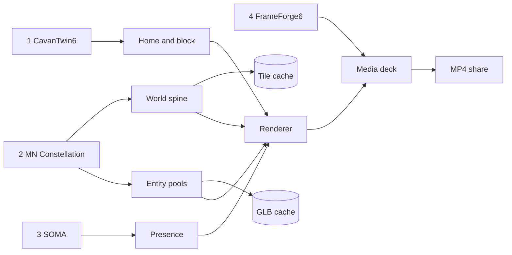

# 🗂️ Ordinal Folder System for Memory Augmentation
## 📜 Methodology
> 💬 "order rank from largest to smallest is a natural way to foster short & long term memories."
**Sort key:** aggregate size, strictly descending. 01 through 08 fall in exact size order.✅

---

## 🏠 Track 1: Life Memories (scanned 10/7/2026)
### Emoji Outline
- 🎬 **01-MP4** · Motion Memories · 354.5 GB · 8,954 files
- 🖼️ **02-PNG** · Still Frames · 52.6 GB · 14,918 files
- 🎵 **03-MP3** · Sound & Song · 9.2 GB · 2,115 files
- 📦 **04-ZIP** · Bundles & Archives · 5.5 GB · 38 files
- 📄 **05-PDF** · Fixed Records · 3.0 GB · 184 files
- 🧊 **06-GLB** · 3D Worlds · 0.68 GB · 126 files
- 🌐 **07-HTML** · Living Builds · 0.49 GB · 3,782 files
- 📝 **08-MD** · Plain Thought · 0.0008 GB · 26 files

### Table of Folders and Titles
| # | Folder | Emoji | Short Title | Size (GB) | Files | Subdirs | Avg File | % of Set |
|---|--------|-------|-------------|----------:|------:|--------:|---------:|---------:|
| 01 | 01-MP4 | 🎬 | Motion Memories | 354.50 | 8,954 | 476 | 39.6 MB | 83.22% |
| 02 | 02-PNG | 🖼️ | Still Frames | 52.60 | 14,918 | 28 | 3.5 MB | 12.35% |
| 03 | 03-MP3 | 🎵 | Sound & Song | 9.20 | 2,115 | 8 | 4.3 MB | 2.16% |
| 04 | 04-ZIP | 📦 | Bundles & Archives | 5.50 | 38 | 0 | 144.7 MB | 1.29% |
| 05 | 05-PDF | 📄 | Fixed Records | 3.00 | 184 | 3 | 16.3 MB | 0.70% |
| 06 | 06-GLB | 🧊 | 3D Worlds | 0.68 | 126 | 0 | 5.4 MB | 0.16% |
| 07 | 07-HTML | 🌐 | Living Builds | 0.49 | 3,782 | 331 | 128 KB | 0.11% |
| 08 | 08-MD | 📝 | Plain Thought | 0.0008 | 26 | 1 | 32 KB | <0.01% |
| **Σ** | **01–08** | 🗂️ | **Total** | **425.97** | **30,143** | **847** | **14.1 MB** | **100%** |
📊 **Drive context:** the eight folders hold about **27%** of the 1.5 TB C: drive (22.7 + 3.4 + 0.6 + 0.3 + 0.2 by WinDirStat's percentages).

---

## ⚽ Size Distribution (descending)
### Linear scale · ⚽ = 20 GB · ▫️ = less than one ball
```
01 🎬 MP4   ⚽⚽⚽⚽⚽⚽⚽⚽⚽⚽⚽⚽⚽⚽⚽⚽⚽⚽  354.5 GB
02 🖼️ PNG   ⚽⚽⚽                                  52.6 GB
03 🎵 MP3   ▫️                                       9.2 GB
04 📦 ZIP   ▫️                                       5.5 GB
05 📄 PDF   ▫️                                       3.0 GB
06 🧊 GLB   ▫️                                      0.68 GB
07 🌐 HTML  ▫️                                      0.49 GB
08 📝 MD    ▫️                                    0.0008 GB
```

### Magnitude scale · each ⚽ = 10× size (in KB)
```
01 🎬 MP4   ⚽⚽⚽⚽⚽⚽⚽⚽⚽   ~10⁸·⁶ KB
02 🖼️ PNG   ⚽⚽⚽⚽⚽⚽⚽⚽     ~10⁷·⁷ KB
03 🎵 MP3   ⚽⚽⚽⚽⚽⚽⚽       ~10⁷·⁰ KB
04 📦 ZIP   ⚽⚽⚽⚽⚽⚽⚽       ~10⁶·⁸ KB
05 📄 PDF   ⚽⚽⚽⚽⚽⚽⚽       ~10⁶·⁵ KB
06 🧊 GLB   ⚽⚽⚽⚽⚽⚽         ~10⁵·⁸ KB
07 🌐 HTML  ⚽⚽⚽⚽⚽⚽         ~10⁵·⁷ KB
08 📝 MD    ⚽⚽⚽               ~10²·⁹ KB
```
The linear graph shows how video dominates storage, while the magnitude graph keeps all eight visible so the small-but-dense folders still register.

### 🔍 Quick reads
- 🎬 **MP4 is the long-term anchor:** 83% of the set by size.
- 🖼️ **PNG is the busiest by count:** 14,918 files, about half of everything.
- 🌐 **HTML is the densest builds layer:** 3,782 files at roughly 128 KB each, spread across 331 subfolders.
- 📝 **MD is the lightest but most distilled:** 26 files in under 1 MB.

---

## 💼 Track 2: Work (separate 01–08)
| # | Folder | Emoji | Short Title | Size (GB) | Files |
|---|--------|-------|-------------|----------:|------:|
| 01–08 | | | *work list* | | |

## 🧠 Track 3: AI Experiences Log
| Date | Track 🏠/💼 | Folder | Direction ⬆️ In / ⬇️ Out | AI Tool | Notes |
|------|------------|--------|--------------------------|---------|-------|
| | | | | | |

---

# 🗂️ Ordinal Folder System: Readout v4
## 🧭 Master Outline
- 📜 Methodology
- 🏠 List 1: Life Memories (01–08 file types)
- ⚽ Size Distribution
- 🗺️ List 2: Geo Grouping (01–08 regions)
- 🩺 Health & Care Simulation List (ranked 01–12)
- 📁 Secondary Folder Tree (07-HTML\GEO)
- 🧬 List 3: Clinical Care AI (01–08 topics)
- 📁 Secondary Folder Tree (08-MD\CARE)
- 💼 Track: Work (separate 01–08)
- 🧠 Track: AI Experiences Log

## 📜 Methodology
> 💬 "order is to rank from largest to smallest. This is a natural way to keep items in knowledge of short and long term memory associations."
> 💬 "order descending on simulations likely to help learners of my AI Pair Programming teachings regarding Hive Minds or organizational intelligence the ASI we all contribute to"
> 💬 "This includes clinical care AI techniques related to Health Care topics."
> 💬 "This is about perfection of the art of clinical care plus AI."
- 🗂️ **List 1 · File-type folders:** aggregate size, strictly descending
- 🗺️ **List 2 · Geo folders:** stated order of personal and professional connection
- 🩺 **Simulations:** value for teaching hive minds and organizational intelligence, descending
- 🧬 **List 3 · Clinical care topics:** breadth of reach, descending

### Table of Locations
| # | Folder | Emoji | Region | In your words | Sims |
|---|--------|-------|--------|---------------|-----:|
| 01 | 01-MN | ❄️ | Minnesota | "where I live" | 2 |
| 02 | 02-WI | 🧀 | Wisconsin | "where I'm from" | 1 |
| 03 | 03-TX | 🤠 | Texas | "where I go frequently visiting friends" | 1 |
| 04 | 04-FL | 🌴 | Florida | "where I love going with family" | 1 |
| 05 | 05-NY | 🗽 | New York | "which I love due to its magnitude and places to visit" | 1 |
| 06 | 06-HI-CA | 🌺 | Hawaii · California | "which I love due to sun, plants, animals and the ocean" | 3 |
| 07 | 07-ND-SD-MT-WY | ⛰️ | High Plains & Rockies | "ND/SD/MT/WY which I hike and bike" | 1 |
| 08 | 08-GREAT-LAKES | 🌊 | Great Lakes | "which I am fascinated with geology, and exploration" | 2 |
| **Σ** | **01–08** | 🗺️ | **All regions** | | **12** |

## 🩺 Health & Care Design for Teaching Simulations (teaching value)
- 🐝 **01** · Care Swarm Command · Phaser · ❄️ MN
- 🌊 **02** · Great Lakes Health Constellation · Three.js · 🌊 Great Lakes
- 🩺 **03** · Clinical AI Oversight Clinic · Babylon.js · 🤠 TX
- ⭐ **04** · Star Measures Swarm Board · PixiJS · 🌴 FL
- 🔥 **05** · Wildfire Surge Ops · PlayCanvas · 🌺 HI-CA
- 🔁 **06** · Transitions of Care Relay · Excalibur.js · 🗽 NY
- 🌺 **07** · Island Huddle VR · A-Frame · 🌺 HI-CA
- 🌲 **08** · Northwoods Knowledge Rounds · melonJS · 🧀 WI
- 🚐 **09** · Big Sky Rural Reach · Kaplay · ⛰️ ND-SD-MT-WY
- 💧 **10** · Watershed Health Flow · Matter.js · 🌊 Great Lakes
- 🧓 **11** · Fall Risk Lab · Cannon.js, Mediapipe.js · ❄️ MN
- 🦾 **12** · Rehab Motion Lab · Ammo.js, Mediapipe.js · 🌺 HI-CA

| # | Simulation | Emoji | Library | Geo | Care Focus | Hive Mind Lesson | Hive Value |
|---|------------|-------|---------|-----|------------|------------------|------------|
| 01 | Care Swarm Command | 🐝 | Phaser | 01-MN | Care management queue: gap closure, outreach, follow-up | AI agents and coordinators self-assign from one shared queue | 🐝🐝🐝🐝🐝 |
| 02 | Great Lakes Health Constellation | 🌊 | Three.js | 08-GREAT-LAKES | Regional clinic network and population health | Every node's contribution lights up a shared knowledge graph | 🐝🐝🐝🐝🐝 |
| 03 | Clinical AI Oversight Clinic | 🩺 | Babylon.js | 03-TX | Human-in-the-loop review of AI clinical recommendations | Oversight as the hive's immune system | 🐝🐝🐝🐝🐝 |
| 04 | Star Measures Swarm Board | ⭐ | PixiJS | 04-FL | Quality measures and Star ratings for a health care market | Many small agent actions roll up into one emergent score | 🐝🐝🐝🐝 |
| 05 | Wildfire Surge Ops | 🔥 | PlayCanvas | 06-HI-CA | Hospital surge capacity during smoke and evacuation events | Crisis coordination across teams under time pressure | 🐝🐝🐝🐝 |
| 06 | Transitions of Care Relay | 🔁 | Excalibur.js | 05-NY | Discharge-to-home handoffs in a dense metro | Knowledge loss at each handoff, and how shared memory prevents it | 🐝🐝🐝🐝 |
| 07 | Island Huddle VR | 🌺 | A-Frame | 06-HI-CA | Telehealth care-team huddles across islands | Distributed consensus when the team is never in one room | 🐝🐝🐝 |
| 08 | Northwoods Knowledge Rounds | 🌲 | melonJS | 02-WI | Shift-to-shift nursing rounds in a rural hospital | Pooling tacit knowledge so the next shift starts smarter | 🐝🐝🐝 |
| 09 | Big Sky Rural Reach | 🚐 | Kaplay | 07-ND-SD-MT-WY | Mobile clinic and telehealth routing across long distances | Edge agents acting alone, then syncing when connected | 🐝🐝🐝 |
| 10 | Watershed Health Flow | 💧 | Matter.js | 08-GREAT-LAKES | Water quality as a community health signal | Many small sensors forming one public health picture | 🐝🐝 |
| 11 | Fall Risk Lab | 🧓 | Cannon.js | 01-MN | Fall and frailty risk in senior living | Fusing many weak signals into one strong alert | 🐝🐝 |
| 12 | Rehab Motion Lab | 🦾 | Ammo.js | 06-HI-CA | Physical therapy and mobility recovery | Specialist agents contributing narrow expertise | 🐝 |

### 🐝 Hive Value Distribution (descending)

```
01 🐝 Care Swarm Command             🐝🐝🐝🐝🐝
02 🌊 Great Lakes Constellation       🐝🐝🐝🐝🐝
03 🩺 Clinical AI Oversight Clinic    🐝🐝🐝🐝🐝
04 ⭐ Star Measures Swarm Board       🐝🐝🐝🐝
05 🔥 Wildfire Surge Ops              🐝🐝🐝🐝
06 🔁 Transitions of Care Relay       🐝🐝🐝🐝
07 🌺 Island Huddle VR                🐝🐝🐝
08 🌲 Northwoods Knowledge Rounds     🐝🐝🐝
09 🚐 Big Sky Rural Reach             🐝🐝🐝
10 💧 Watershed Health Flow           🐝🐝
11 🧓 Fall Risk Lab                   🐝🐝
12 🦾 Rehab Motion Lab                🐝
```

### 🎓 Course arc for learners
- 🐝 **01–03 · The Hive Core:** shared queues, shared knowledge, and human oversight.
- 🤝 **04–06 · The Hive at Work:** emergent metrics, crisis coordination, and handoffs.
- 📡 **07–09 · The Distributed Hive:** remote teams, shift memory, and edge agents.
- 🔬 **10–12 · The Sensing Hive:** signals, fusion, and specialist contributors.

---


## 📁 Secondary Folder Tree (07-HTML\GEO)
**Naming rule:** the folder prefix is the geo ordinal (where), and the file prefix is the course rank (teaching value), so every region sorts its best sim first.
```
C:\07-HTML\GEO\
├── 01-MN\
│   ├── 01-care-swarm-command.html
│   └── 11-fall-risk-lab.html
├── 02-WI\
│   └── 08-northwoods-knowledge-rounds.html
├── 03-TX\
│   └── 03-clinical-ai-oversight-clinic.html
├── 04-FL\
│   └── 04-star-measures-swarm-board.html
├── 05-NY\
│   └── 06-transitions-of-care-relay.html
├── 06-HI-CA\
│   ├── 05-wildfire-surge-ops.html
│   ├── 07-island-huddle-vr.html
│   └── 12-rehab-motion-lab.html
├── 07-ND-SD-MT-WY\
│   └── 09-big-sky-rural-reach.html
└── 08-GREAT-LAKES\
    ├── 02-great-lakes-health-constellation.html
    └── 10-watershed-health-flow.html
```

---

## 🧬 List 3: Clinical Care AI (01–08 topics)
- 📊 **01-HEDIS** · Quality Measures
- 🧾 **02-CLAIMS** · Claims Assistance & Quality at Scale
- 📚 **03-SUMMARIZATION** · Progressive Longitudinal Summarization
- ♾️ **04-LONG-REASONING** · Long Reasoning ASI Agents
- 👁️ **05-VISION** · Vision Agents
- 🏥 **06-CHRONIC-CARE** · Chronic & Neuro Care
  - ❤️ Heart
  - 🎗️ Cancer
  - 🫁 COPD · Asthma · Emphysema
  - 🧠 Alzheimer's & Early-Onset Adult Dementia
  - 🩸 Pre-Diabetes
  - 🫀 Atherosclerosis
- 🦽 **07-DME-FRAILTY** · Durable Medical Equipment & Frailty
- 🤸 **08-SPORTS-MED** · Sports Medicine & Performance
  - 🤸 Gymnastics
  - 🏊 Long-Distance Swimming
  - 💃 Dance

### AI Techniques with Assistive Direction

| # | Folder | Emoji | Short Title | General Scope | AI Technique Taught | Linked Sims | Reach |
|---|--------|-------|-------------|---------------|---------------------|-------------|-------|
| 01 | 01-HEDIS | 📊 | Quality Measures | Population-wide preventive and chronic care measures | Gap detection and measure logic agents | 🐝 01 · ⭐ 04 | 🌍🌍🌍🌍🌍 |
| 02 | 02-CLAIMS | 🧾 | Claims Assistance | Helping people submit and correct claims with quality control at scale | Guided form agents over aggregated health data, apps in Python and HTML/JS | 🐝 01 | 🌍🌍🌍🌍🌍 |
| 03 | 03-SUMMARIZATION | 📚 | Longitudinal Summaries | A patient's history distilled progressively over time | Progressive longitudinal summarization | 🔁 06 · 🌲 08 | 🌍🌍🌍🌍 |
| 04 | 04-LONG-REASONING | ♾️ | Long Reasoning Agents | Multi-step clinical reasoning with human review | Long reasoning ASI agents | 🩺 03 | 🌍🌍🌍🌍 |
| 05 | 05-VISION | 👁️ | Vision Agents | Reading images, documents, and forms | Multimodal vision agents | 🩺 03 | 🌍🌍🌍 |
| 06 | 06-CHRONIC-CARE | 🏥 | Chronic & Neuro Care | Heart, cancer, lung, brain, and metabolic conditions | Condition-specific care pathway agents | 🌊 02 | 🌍🌍🌍 |
| 07 | 07-DME-FRAILTY | 🦽 | DME & Frailty | Equipment needs and frailty in older adults | Signal fusion for frailty and equipment needs | 🧓 11 | 🌍🌍 |
| 08 | 08-SPORTS-MED | 🤸 | Sports Medicine | Training, recovery, and injury prevention | Motion and performance coaching agents | 🦾 12 | 🌍 |

### 🌍 Reach Distribution (descending)
```
01 📊 HEDIS              🌍🌍🌍🌍🌍
02 🧾 Claims             🌍🌍🌍🌍🌍
03 📚 Summarization      🌍🌍🌍🌍
04 ♾️ Long Reasoning     🌍🌍🌍🌍
05 👁️ Vision Agents      🌍🌍🌍
06 🏥 Chronic Care       🌍🌍🌍
07 🦽 DME & Frailty      🌍🌍
08 🤸 Sports Medicine    🌍
```

### 🏅 Inventor Arc
- 🌍 **01–03 · Population Scale:** measure, pay, and remember.
- 🤖 **04–05 · Agent Engines:** reason and see.
- 🫶 **06–08 · Human Care:** treat, support, and perform.

---

## 📁 Secondary Folder Tree (08-MD\CARE)
**Naming rule:** the folder prefix is the reach rank, and each folder holds teaching notes for that topic.
```
C:\08-MD\CARE\
├── 01-HEDIS\
├── 02-CLAIMS\
├── 03-SUMMARIZATION\
├── 04-LONG-REASONING\
├── 05-VISION\
├── 06-CHRONIC-CARE\
├── 07-DME-ADVANCEDILLNESS-FRAILTY\
└── 08-SPORTS-MED\
```
---

# The Worldmaker's Codex 
## Exercise to build thinking regarding platonic representational networks.
### Starts with a photo of a stack of books: 

# On Repeatable Process & Method:
1. Compose a games list of hit ideas based on real hits today.  Markdown, emojis, short description one liners, do 50.
2. Compose prompt specification for one shot win:

```markdown
Easy as 1-2-3 Process and Method Steps:

1.
To demonstrate power and speed of astra lets develop these one liner super fast arcade action and multiplayer games with threeJS, my previous code as examples, and creativity to produce html js apps in record time.  Include peerjs, mp3 player, and 60 second mp4 recorder so we can share our app.  Multiplayer URL for WAKE autojoin.  Automate two X posts too - top level for video and bottom reply level w Multiplay URL and Code URL.

Examples for comparison and improvement:

2. (New post line)
🔫 Strike Twice - 🕹️Multiplayer Game Release -  @threejs #indiegame

3. (Reply to 1st post)
🔫 Strike Twice - ▶ Play Multiplayer Join URL: 
https://allaiinc.org/Strike-Twice.html?room=WAKE💻 
Code https://github.com/aaroncwacker/AI-UI-UX-JS/blob/main/Strike-Twice.html
#threejs #indiegame #gamedev

Challenge #3 for you to do next!   3. Animo Amigos 🐾 - Cozy creature capture quest
---

Full list of intended app set with 100 app ideas:
1. Woof War 🐕‍🦺 - K9 tactical shooters topping charts
2. Strike Twice 🔫 - 5v5 legend still ruling competitive
3. Animo Amigos 🐾 - Cozy creature capture quest
4. Control Soul 🌀 - Spooky physics-bending sequel
5. Sky Chase 8 ✈️ - Supersonic dogfights in cloud clashes
6. Kick Kings 27 ⚽ - Ultra-real footy sim with final flicks
7. Dress Dreams 👗 - Sew chic, sell sleek boutique bliss
8. Frame Raiders 🤖 - Ninja looters dash in space blaze
9. Cape Clash 🦸 - Super 6v6 powers collide in chaos
10. Mythic War III ⚔️ - Daemons clash in fantasy war
11. Summit Showdown 🏆 - Hero royale with slick shot shocks
12. Block Quest II ⛏️ - Cubey crawls with co-op calls
13. Bug Blasters 2 🪖 - Dive, blast bugs for liberty love
14. Virtual Chatter 🥽 - Worlds collide in avatar parades
15. Glyph Wilds 🐉 - Survival wilds with dragon trials
16. Aether Ascent 2 🪽 - Winged wars reborn sky-high
17. Siege League 🚔 - Breach, defend in tense 5v5
18. Fated Orbit 2 🌌 - Space looter with raid parades
19. Matter Shatter 🔬 - Physics freaks in horror hollows
20. Waste Frontier 76 ☢️ - Wasteland life rebuilt in hills
21. Hero Watch 2 🛡️ - Fast fights with hero might
22. Ancient Codex Online 🐲 - Huge realm tales at MMO scale
23. Heart Haven 💖 - Cozy island living so giving
24. Race Face 🏁 - Hardcore laps for pro collapse
25. Fungi Doom II 🍄 - Brutal love and loss upgraded
26. Fungi Fun I 🍄 - Iconic survival remade with light
27. City Crime Prime 🚗 - Crime saga enhanced for rage
28. Haul Stars 🚛 - Zen trucking across vast lands
29. Arena Drama 2 🧙 - Chess-like MOBA mastery craze
30. Dunk Dynasty 27 🏀 - Courtside grind and shine
31. Star Saga 🌠 - Galaxy empires in endless play
32. Deathlight 🔪 - Killer seeks, survivors sneak
33. Soul Fire Triad 🔥 - Dark pilgrimage pain parade
34. Gridiron Glory 27 🏈 - Gridiron glory, strategy story
35. Grave Wave 2 ⚰️ - Morbid keeper with humor flavor
36. Lock Hearts Remix 🔑 - Magic meets cartoon dream
37. Play Vault Parade 🎮 - Vault of hits on subscription fit
38. Fish Wish Bliss 🎣 - Chill casting with addictive twist
39. Viking Vibes 🪓 - Craft, raid, boss parade in shade
40. Mana Mania Arena 🃏 - Iconic card duels and spell fuels
41. Masked Minds 3 🎭 - School by day, shadow fights by night
42. Thunder Yonder 💥 - Land, air, sea war buffet
43. Match Clash ⚽ - Arcade footy with flashy goals
44. Void Trader: Star Raider 🚀 - Grim profit in void riot
45. Gear Grind: Emergence ⛓️ - Locust origins, cover shivers
46. Once Mutant 🧟 - Mutant survival with weird flavor
47. Dream Valley Dazzle ✨ - Cozy pals in cozy quests
48. Blood Dawn 🧛 - Vampire gothic from northern kin
49. Sand Dream 🏜️ - Worm ride, spice thrive in dunes
50. Transit Fever 3 🚂 - Logistics tycoon on rail run
51. Hush Hill Fall 🌫️ - Foggy fear returns to town
52. Hallow Hunt 🎃 - Masked stalker in silent fright night
53. Ring Thing 💍 - Soulslike world so wide to explore
54. Lens Tense 📹 - Found-footage FPS fear so real
55. Wind & Grin 🍃 - Wuxia leaps in martial feast
56. Epic Fable XIV Online 🌙 - Story MMO beloved for lore
57. Rust Trust Bust 🔧 - Survive, betray in brutal play
58. Wave Crave 🌊 - Anime action with flashy flare
59. Dark Dunes 🏜️ - Flashy fighter MMO delight
60. Campus Clash 27 🏈 - Rivalry runs in campus fun
61. Life Tycoon 4 🏠 - Sandbox stories of daily glory
62. Exile Isle 2 💀 - Dark loot grind so fine
63. Gate Fate 3 🎲 - Choices, romance, dice dance
64. Long Walk Talk 🚶 - Goofy stroll with co-op soul
65. Come Deliverance Too 👑 - Bohemia realism, second bloom
66. Beast Tracker Complete 🐺 - Monster hunter legend never ends
67. Masked Heist Royal 🃏 - Thieves rebel with stylish flair
68. Souls Prime ⚔️ - Brutal first flame rekindled
69. Iron Mind IV 🎖️ - World war chess for world quest
70. Star Zero Corps ⭐ - Tactical squad in clone wars roars
71. Scholar Souls II 🕯️ - Cursed realm seeks the meek
72. Oni Edge 🗡️ - Samurai slashes demon hordes
73. Happy Havoc 🛞 - Gory ragdoll racer laughter
74. Team Fort Fun 2 🎩 - Hat wars with class farce
75. Ancient Republic Odyssey 🌌 - Space knights lore galore
76. Fantasy Canvas 🪶 - Dream team's new realm gleam
77. Sin Loop Inc 🏢 - Dark turn gacha with sinner design
78. Banana Bonanza! 🍌 - Slapstick bomb blast jamboree
79. Demon Doom IV 😈 - Hell loot in gothic gloom
80. Automata Karma 🤖 - Android tears in future fears
81. Syrup Story 🍁 - 2D grind with cute shine
82. Crown Con III 👑 - Dynasty plots and scheming lots
83. Factory Fantasy 🏭 - Build big, feel the rig
84. Spire Fire 2 🗡️ - Clever deckbuilder, never sever
85. Stack Black 📋 - Empire build from herb to curb
86. Sector Siege 2 🧢 - Ruined city looter with tactics
87. Revenant Rifles 🔫 - Nightmare guns with soul stuns
88. Festival Drive 6 🏎️ - Festival race in paradise place
89. Pal Power 🐾 - Guns and pals, odd yet set
90. Underworld Higher II 🔱 - Underworld run with witchy fun
91. Border Bother 4 💣 - Bazillion guns, chaotic fun
92. Darkov Escape 🎒 - High stakes extraction tension
93. Duty Drop Zone 🪂 - Free royale with bullet flair
94. Waifu Wonders 💖 - Life partner and harem management sim
95. Dakota Haul 🌾 - Plains trucking, wide horizons
96. Crimson Mirage 🏜️ - Merc saga in desert drama
97. Breakout Bound 🎯 - Tactical loot with shoot to boot
98. Beast Hunt Wilds 🦖 - Hunt giants in lands so wide
99. Neon Noir 77 🌃 - Neon punk redemption compunction
100. Rebirth Road ☄️ - Long road trip with friendship grip
```


# 🌳 Integrated Open Worlds
**Root spec of the Yggdrasil tree for [AI-UI-UX-JS](https://github.com/AaronCWacker/AI-UI-UX-JS) → [allaiinc.org](https://allaiinc.org)**

> Walk your home, drive the state, fly the coast, swim the reef, and film yourself inside it, cut to your own song.


# Comparison between Open World and Map:


## 0 · First principles
1. **Never block the player.** Everything past the horizon loads, decodes and caches in the background.
2. **Everything is data.** Terrain is tiles, entities are GLBs, media is clips: keyed, pooled, cached.
3. **The user is in the world; the world is on the timeline.** Capture → scene → composition → share.
4. **One file, zero build.** Single HTML/JS, CDN libraries only, no npm, served from GitHub Pages.
5. **Cache once, travel instantly.** A visited place becomes a local place.

## 1 · Four roots (integration priority)
| # | Root | Gives the world | Live |
|---|------|-----------------|------|
| 1 | [CavanTwin6](https://github.com/aaroncwacker/AI-UI-UX-JS/blob/main/CavanTwin6.html) | Property scale: walk inside and outside a home on its block | [▶](https://allaiinc.org/CavanTwin6.html) |
| 2 | [⭐ MN Constellation](https://github.com/aaroncwacker/AI-UI-UX-JS/blob/main/%E2%AD%90MinnesotaConstellation.html) | State scale: low-latency drive, fly, swim | [▶](https://allaiinc.org/%E2%AD%90MinnesotaConstellation.html) |
| 3 | [SOMA Body & Room](https://github.com/aaroncwacker/AI-UI-UX-JS/blob/main/SOMA-Body-and-Room-Real-to-3D.html) | Presence: user body and room as connected 3D space | [▶](https://allaiinc.org/SOMA-Body-and-Room-Real-to-3D.html) |
| 4 | [FrameForge6](https://github.com/aaroncwacker/AI-UI-UX-JS/blob/main/FrameForge6.html) | Story: image, mp3, mp4 timeline → shareable MP4 | [▶](https://allaiinc.org/FrameForge6.html) |

## 2 · World spine: streaming universe
**Scale ladder:** State → City → Block → Property → Room, each handing off to the next with no load screen.
- **Topography:** city maps drape roads, water and buildings over DEM heightmap tiles.
- **Rings:** *active* (render + physics) · *warm* (worker decode, GPU upload queued) · *cold* (IndexedDB / Cache API).
- **Prefetch:** rank tiles by time-to-arrival along heading × speed; horizon and off-screen first.
- **Budget:** fixed ms per frame for GPU uploads, idle time for the rest; LOD cross-fades, never pops.
- **States:** MN · WI · NY · FL · TX · CA · HI on a tiny US mini-map; ◐ loading, ● cached and jumpable.

## 3 · Entity pools: bulk GLB loader
Drop many `.glb` files; keywords in the filename, node names and glTF `extras` assign each to a pool.

| Pool | Keywords (seed list) | Behavior |
|------|----------------------|----------|
| 🚗 Ground | car, truck, bus, bike, tractor | road-following, drivable |
| ✈️ Air | plane, heli, drone, jet, bird, dragon | flight model, flyable |
| 🐾 Land creatures | dog, deer, horse, bear, moose | wander, herd |
| 🚤 Surface | boat, ship, kayak, duck, swan | buoyancy, drivable |
| 🐙 Underwater | fish, whale, shark, sub, octopus | swim volumes, schooling |
| 📦 Props | no match | static, instanced |

Pools are instanced, LOD'd and recycled; any pool member can become the player's vehicle.

## 4 · Presence: SOMA
- MediaPipe pose, hands and face drive a live 3D avatar while playing.
- Room capture becomes a textured backdrop mesh, portal-linked from the CavanTwin home.
- Body and room are recordable layers for the Media deck.

## 5 · Media deck: FrameForge
- **Player:** mp3/mp4 queue; music and lyric video in a resizable right sidebar.
- **Crop box:** drag a bounding box on the sidebar video; that region fills the main capture view.
- **Dual recorders:** canvas `captureStream(60)` + screen `getDisplayMedia`; AAC-first MP4 via `pickMime`, WebM fallback.
- **Mixer:** one `AudioContext` bus (music + game + mic) feeds the recorder while another mp4 keeps playing.
- **Timeline:** images, mp3, mp4 and captures snap to song length (loop, ping-pong, shuffle-cut, speed-ramp).
- **Output:** 9:16 · 1:1 · 16:9 exports into an IndexedDB gallery (play, download, delete).

## 6 · Runtime map

```mermaid
flowchart LR
  C[1 CavanTwin6] --> H[Home and block]
  M[2 MN Constellation] --> W[World spine] & P[Entity pools]
  S[3 SOMA] --> A[Presence]
  F[4 FrameForge6] --> D[Media deck]
  W --> T[(Tile cache)]
  P --> G[(GLB cache)]
  H & W & P & A --> R[Renderer]
  R --> D --> O[MP4 share]
```

## 7 · Milestones
- [ ] **M1 Spine:** MN tiles stream with topography at 60 fps, zero hitches
- [ ] **M2 Home:** a CavanTwin property drops into an MN block; walk in and out seamlessly
- [ ] **M3 Pools:** bulk GLB import → keyword pools → drive, fly, swim
- [ ] **M4 States:** all seven cached, mini-map jumps are instant
- [ ] **M5 Presence:** SOMA avatar and room portal in-world
- [ ] **M6 Media:** sidebar crop, dual recording, song-snapped MP4 export
- [ ] **Always:** telemetry panel (adapter limits, fps, tiles/min, cache MB)

## 8 · Outer branches: asset constellations
- **Mine:** [GitHub](https://github.com/AaronCWacker/AI-UI-UX-JS) · [allaiinc.org](https://allaiinc.org/) · [Hugging Face](https://huggingface.co/awacke1)
- **Frontier AI:** [Claude](https://claude.ai/recents) · [ChatGPT](https://chatgpt.com/library) · [Grok](https://grok.com/imagine) · [Gemini](https://gemini.google.com/library)
- **Media:** [YouTube](https://www.youtube.com/feed/history) · [YouTube TV](https://tv.youtube.com/library) · [Krea](https://www.krea.ai/assets) · [Magnific](https://www.magnific.com/app/projects/all-assets) · [Magnific Editor](https://magnific.ai/editor/) · [Runway](https://app.runwayml.com/video-tools/teams/aaroncwacker/ai-tools/assets) · [Suno](https://suno.com/me) · [Luma](https://dream-machine.lumalabs.ai/ideas) · [Leonardo](https://app.leonardo.ai/library) · [Hailuo](https://hailuoai.video/mine) · [Kling](https://kling.ai/app/user-assets/materials)
- **People:** [Facebook](https://www.facebook.com/) · [Google Photos](https://photos.google.com/people) · [X Pro](https://pro.x.com/i/decks/) · [Messages](https://messages.google.com/web/conversations) · [Gmail](https://mail.google.com/mail/u/0/#inbox) · [Outlook](https://outlook.live.com/mail/)
- **Store · Games · Playlists:** [HiBid](https://hibid.com/account/pastbids) · [Wizards](https://company.wizards.com/en) · [Steam](https://store.steampowered.com/) · [YouTube playlists](https://www.youtube.com/feed/playlists) · [Repos](https://github.com/AaronCWacker?tab=repositories)

## 9 · The well: why this exists
- **Episodic memory:** the felt sense of having been somewhere. *The world.*
- **Semantic memory:** knowledge of the world and of one's own history. *The data.*
- **Purpose of memory:** coherence that links events into a continuous self. *The story.*

## 10 · Growing the tree
- This file stays at or under 100 lines: it is the table of contents, not the book.
- Each branch grows its own `docs/<branch>.md` and earns one line here.
- Every revision updates the diagram, the runtime map and the milestones together.


# Integrated Open Worlds

I want to expand my sim for making an open world where city to city I can have a prgressive loaded full detail universe where the city map has topography built in as 3d using my code below.  Integrate the runtime loading in background so user can play while areas on the horizon or off screen can continue to load and cache while player drives and then doesnt freeze or delay when entering a new area.  for the simulation we want to experience all vehicles and ability to bulk load GLB files then assigned to pools based on keywords in glb  which allows us to manage cars, flying machines and creatures, swimming and underwater creatures.  Use the patterns in my code together and support the all around best player for mp3 and mp4 which allows us to mix a second screen to the right sidebar with our music video and lyrics mp4 playing and user to resize that to set bounding box of part of video shown to user in larger screen capture recorded menu of mp4 playing while another mp4 is recording to include both sound and video tracks.  

I want to do these states in detail: 1. MN, 2. WI, 3. NY, 4. FL, 5. TX, 6. CA, and 7. HI - these are selectable in a tiny US Mini-map to jump between states once loaded and cached in browser..  

2. I want to integrate my media pipe ability to record the user in 3d while playing using media pipe (SOMA example) and record the context of room and use video mixing and recording timeline from FrameForge.  SOMA example is here:  These four should be an integrated single app with all the world richness, the room and person capture in SOMA, Video recording and timeline of images mp3 mp4 together on timeline (Frameforge), And 3D topographic interactive world (Constellation and Cavan Twin for Home and driving map from topography.

4. For ordering of Priorities as we integrate all four my high level guidance is 1. CavanTwin6 provides the single property walk inside outside experience when on a block.  2. MN Constellation provides the driving, flying, swimming experiences, 3. SOMA Body and Room Capture allows the person capture experience for user and user's room background which becomes 3d Connected space.  and then 4. FrameForge for being able to compose videos of optimal size snapped to songs for sharing with world as mp4 video screen capture experience.

Below is an account of the original code bases for my four vectors of development along with playable core assets so we can iterate with source and integrated body of work creation.

1. Cavan Twin - Provides a Home World model, an Open World driveable/flyable/swimmable model:  https://github.com/aaroncwacker/AI-UI-UX-JS/blob/main/CavanTwin6.html
2. MN Constellation - Provides high performance low latency world sim a state at a time:  https://github.com/aaroncwacker/AI-UI-UX-JS/blob/main/%E2%AD%90MinnesotaConstellation.html
3. SOMA Body Capture - Provides biometric 3d body capture and room capture for user presence: https://github.com/aaroncwacker/AI-UI-UX-JS/blob/main/SOMA-Body-and-Room-Real-to-3D.html
4. FrameForge - Provides Video, Audio, and Image timeline IO which allows to produce communication videos as output processed for replayable experiences for Social Sharing:  https://github.com/aaroncwacker/AI-UI-UX-JS/blob/main/FrameForge6.html

These can be tested individually:
- https://allaiinc.org/ with apps below:
- CavanTwin6.html
- %E2%AD%90MinnesotaConstellation.html
- SOMA-Body-and-Room-Real-to-3D.html
- FrameForge6.html


# Organization of Assets

# My AI Assets
- https://github.com/AaronCWacker/AI-UI-UX-JS/new/main
- https://allaiinc.org/
- https://huggingface.co/awacke1

# Frontier AI Assets
- https://claude.ai/recents
- https://chatgpt.com/library
- https://grok.com/imagine
- https://gemini.google.com/library

# Media Assets
- https://www.youtube.com/feed/history
- https://tv.youtube.com/library
- https://www.krea.ai/assets
- https://www.magnific.com/app/projects/all-assets
- https://magnific.ai/editor/
- https://app.runwayml.com/video-tools/teams/aaroncwacker/ai-tools/assets
- https://www.krea.ai/assets
- https://www.magnific.com/app/projects/all-assets
- https://app.runwayml.com/video-tools/teams/aaroncwacker/ai-tools/assets
- https://suno.com/me
- https://dream-machine.lumalabs.ai/ideas
- https://app.leonardo.ai/library
- https://hailuoai.video/mine
- https://kling.ai/app/user-assets/materials

# People Assets
- https://www.facebook.com/
- https://photos.google.com/people
- https://pro.x.com/i/decks/
- https://messages.google.com/web/conversations
- https://mail.google.com/mail/u/0/#inbox
- https://outlook.live.com/mail/

# Store Assets
- https://hibid.com/account/pastbids

# Playlists - Asset Sets
- https://www.youtube.com/feed/playlists
- https://github.com/AaronCWacker?tab=repositories

# Game Assets
- https://company.wizards.com/en
- https://store.steampowered.com/

# Brain and Memory Glossary
- _episodic memory_ - recollective feelings of being somewhere
- _semantic memory_ - concrete knowledge of world and personal history
- _purpose of memory_ - coherence connecting events to for continuity with self belief and feelings
